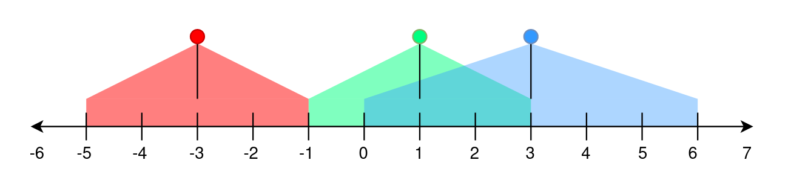

## Description

A perfectly straight street is represented by a number line. The street has street lamp(s) on it and is represented by a 2D integer array `lights`. Each $\text{lights}[i] = [\text{position}_{i}, \text{range}_{i}]$ indicates that there is a street lamp at position $\text{position}_{i}$ that lights up the area from $[\text{position}_{i} - \text{range}_{i}, \text{position}_{i} + \text{range}_{i}]$ (**inclusive**).

The **brightness** of a position `p` is defined as the number of street lamp that light up the position `p`.

Given `lights`, return *the **brightest** position on the** street. If there are multiple brightest positions, return the **smallest** one.*
### Function Contract

- Refer to method signature.

### Examples

#### Example 1

- **Input:** $lights = [[-3,2],[1,2],[3,3]]$
- **Output:** `-1`
- **Explanation:**
The first street lamp lights up the area from [(-3) - 2, (-3) + 2] = [-5, -1].
The second street lamp lights up the area from [1 - 2, 1 + 2] = [-1, 3].
The third street lamp lights up the area from [3 - 3, 3 + 3] = [0, 6].
Position -1 has a brightness of 2, illuminated by the first and second street light.
Positions 0, 1, 2, and 3 have a brightness of 2, illuminated by the second and third street light.
Out of all these positions, -1 is the smallest, so return it.
#### Example 2

- **Input:** $lights = [[1,0],[0,1]]$
- **Output:** `1`
- **Explanation:**
The first street lamp lights up the area from [1 - 0, 1 + 0] = [1, 1].
The second street lamp lights up the area from [0 - 1, 0 + 1] = [-1, 1].
Position 1 has a brightness of 2, illuminated by the first and second street light.
Return 1 because it is the brightest position on the street.
#### Example 3

- **Input:** $lights = [[1,2]]$
- **Output:** `-1`
- **Explanation:**
The first street lamp lights up the area from [1 - 2, 1 + 2] = [-1, 3].
Positions -1, 0, 1, 2, and 3 have a brightness of 1, illuminated by the first street light.
Out of all these positions, -1 is the smallest, so return it.
### Constraints

- $1 \le \text{lights.length} \le 10^{5}$

- $\text{lights}[i].length = 2$

- $-10^{8} \le \text{position}_{i} \le 10^{8}$

- $0 \le \text{range}_{i} \le 10^{8}$