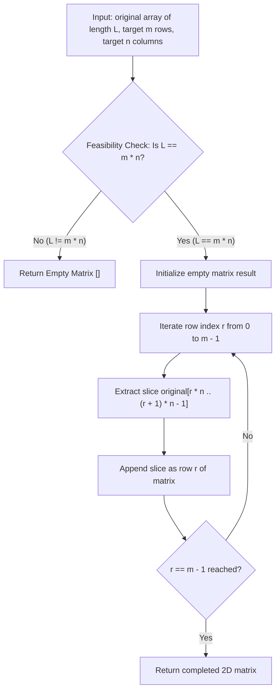

# Guided Example: Convert 1D Array Into 2D Array

## 1. Concrete Problem Restatement & Input Data

We are given a zero-indexed one-dimensional integer array $\text{original}$ of total length $L$, along with two positive integers $m$ and $n$ representing the target row count and column count, respectively.

Our task is to reconstruct an $m \times n$ two-dimensional matrix using every element from $\text{original}$ while preserving standard **row-major order**:
- Elements at linear indices $0$ through $n - 1$ populate row $0$.
- Elements at linear indices $n$ through $2n - 1$ populate row $1$.
- In general, elements at linear indices $r \cdot n$ through $(r + 1) \cdot n - 1$ populate row $r$, for all $r \in [0, m - 1]$.

If the total number of cells in the target matrix ($m \cdot n$) does not match the total number of provided elements ($L$), it is impossible to construct a complete, well-formed grid. In that event, the procedure must immediately return an empty matrix `[]`.

### Sample Input Dataset

Consider the representative configuration:
$$\text{original} = [1, 2, 3, 4], \quad m = 2, \quad n = 2$$

We contrast this with an asymmetric dimension request:
$$\text{original}_{\text{flat}} = [1, 2, 3], \quad m = 1, \quad n = 3$$
and an impossible configuration where elements cannot fit:
$$\text{original}_{\text{incompat}} = [1, 2], \quad m = 1, \quad n = 1$$

---

## 2. Conceptual Walkthrough & Visual Intuition

The transformation from a 1D sequence to a 2D matrix in row-major format is a canonical coordinate bijection between the discrete space of 1D linear indices and 2D grid coordinates.

### Dimension Compatibility Guard
A valid $m \times n$ matrix contains exactly $m \cdot n$ cells. Because every cell must receive exactly one element from $\text{original}$ with none left over:
$$L \equiv \text{length}(\text{original}) = m \cdot n$$
- If $L \neq m \cdot n$, we abort immediately and return an empty array `[]`.

### Bijective Index Mapping
When $L = m \cdot n$, every 1D linear index $k \in [0, L - 1]$ uniquely determines its 2D coordinates $(r, c)$:
$$r = \lfloor k / n \rfloor, \quad c = k \pmod n$$
Conversely, given matrix row $r \in [0, m - 1]$ and column $c \in [0, n - 1]$, the corresponding linear index in the source array is:
$$k = r \cdot n + c$$

Instead of computing coordinates individually for each element, we can partition the source array into $m$ consecutive non-overlapping chunks, each of uniform length $n$.

---

## 3. Step-by-Step State Progression Table

Let us trace $\text{original} = [1, 2, 3, 4]$ with $m = 2$ and $n = 2$.

### Stage 1: Feasibility Validation
- Source array length: $L = 4$.
- Target grid capacity: $m \cdot n = 2 \cdot 2 = 4$.
- Validation condition: $L == m \cdot n \implies 4 == 4$ (Condition satisfied).

### Stage 2: Row-by-Row Stride Extraction

| Row Index $r$ | Slice Formula $[r \cdot n, (r+1) \cdot n)$ | Source Index Span | Extracted Subarray | Target Matrix State |
|---|---|---|---|---|
| $0$ | $[0 \cdot 2, 1 \cdot 2) = [0, 2)$ | Indices $0, 1$ | `[1, 2]` | `[[1, 2]]` |
| $1$ | $[1 \cdot 2, 2 \cdot 2) = [2, 4)$ | Indices $2, 3$ | `[3, 4]` | `[[1, 2], [3, 4]]` |

Final constructed matrix:
$$\begin{bmatrix} 1 & 2 \\ 3 & 4 \end{bmatrix}$$

Now, let us examine the element-level coordinate correspondence:

| 1D Index $k$ | Source Value $\text{original}[k]$ | Row Calculation $\lfloor k / n \rfloor$ | Column Calculation $k \pmod n$ | 2D Position $(r, c)$ |
|---|---|---|---|---|
| $0$ | $1$ | $\lfloor 0 / 2 \rfloor = 0$ | $0 \pmod 2 = 0$ | $(0, 0)$ |
| $1$ | $2$ | $\lfloor 1 / 2 \rfloor = 0$ | $1 \pmod 2 = 1$ | $(0, 1)$ |
| $2$ | $3$ | $\lfloor 2 / 2 \rfloor = 1$ | $2 \pmod 2 = 0$ | $(1, 0)$ |
| $3$ | $4$ | $\lfloor 3 / 2 \rfloor = 1$ | $3 \pmod 2 = 1$ | $(1, 1)$ |

---

## 4. Key Transition Dynamics & Boundary Handling

The transition behavior across different dimension combinations illustrates the strict conservation of elements:

1. **Dimensional Mismatch Guard**:
   - In $\text{original}_{\text{incompat}} = [1, 2]$ with $m = 1, n = 1$, the capacity is $1 \cdot 1 = 1$, but $L = 2$. One element would be discarded, which violates completeness. The guard triggers immediately and returns `[]`.
   - Similarly, if $L = 5$ with $m = 2, n = 3$, $2 \cdot 3 = 6 > 5$, leaving one cell unpopulated. This also returns `[]`.
2. **Single Row Matrix ($m = 1$)**:
   - If $m = 1$ and $n = L$, the entire source array forms a single row: `[original]`.
3. **Single Column Matrix ($n = 1$)**:
   - If $n = 1$ and $m = L$, each element forms its own one-element row: `[[original[0]], [original[1]], ...]`.

| Array Example | $m$ | $n$ | Required Capacity $m \cdot n$ | Actual Length $L$ | Compatibility Check | Output Result |
|---|---|---|---|---|---|---|
| `[1, 2, 3, 4]` | $2$ | $2$ | $4$ | $4$ | $4 == 4$ (Valid) | `[[1, 2], [3, 4]]` |
| `[1, 2, 3]` | $1$ | $3$ | $3$ | $3$ | $3 == 3$ (Valid) | `[[1, 2, 3]]` |
| `[1, 2, 3, 4]` | $4$ | $1$ | $4$ | $4$ | $4 == 4$ (Valid) | `[[1], [2], [3], [4]]` |
| `[1, 2]` | $1$ | $1$ | $1$ | $2$ | $1 \neq 2$ (Invalid) | `[]` |
| `[1, 2, 3]` | $2$ | $2$ | $4$ | $3$ | $4 \neq 3$ (Invalid) | `[]` |

---

## 5. Algorithmic Correctness & Soundness

### Mathematical Bijectivity of Row-Major Indexing
The division algorithm guarantees that for any integer $k \ge 0$ and positive divisor $n$, there exist unique integers $q$ and $r$ such that:
$$k = q \cdot n + r \quad \text{with } 0 \le r < n$$
Identifying $q = \lfloor k / n \rfloor$ as the row index and $r = k \pmod n$ as the column index, the mapping $f: \{0, 1, \dots, L - 1\} \to \{0, \dots, m - 1\} \times \{0, \dots, n - 1\}$ is a bijection if and only if $L = m \cdot n$.

### Completeness and Ordering
Because the rows are formed by successive contiguous slices $[r \cdot n, (r + 1) \cdot n)$ for $r = 0, 1, \dots, m - 1$:
1. The union of all slices is precisely the entire interval $[0, L - 1]$.
2. The slices are pairwise disjoint.
3. The order of elements across rows and within each row precisely mirrors their original positions in $\text{original}$.
This rigorously guarantees that every element is placed in its exact canonical row-major position without distortion, duplication, or omission.

---

## 6. Edge Cases & Common Pitfalls

1. **Failure to Check Dimension Parity First**: Attempting to slice or index without checking $L == m \cdot n$ will lead to index out-of-range exceptions or partially filled matrices that fail contract requirements.
2. **Column-Major vs Row-Major Confusion**: In column-major ordering (used in Fortran or MATLAB), elements fill columns first. LeetCode and standard C/Python conventions use row-major ordering, filling rows first.
3. **Large Coordinate Products**: Values $m, n \le 4 \times 10^4$ can yield products $m \cdot n \le 1.6 \times 10^9$. If $L \le 5 \times 10^4$, evaluating $m \cdot n == L$ requires standard integer multiplication without 32-bit overflow concerns.

---

## 7. Complexity Analysis

### Time Complexity
- **Feasibility Verification**: Checking $m \cdot n == L$ takes $\mathcal{O}(1)$ time.
- **Matrix Assembly**: If feasible, slicing or copying $L$ elements into $m$ rows of length $n$ copies each element exactly once.
- **Total Time Complexity**: $\mathcal{O}(L)$ when $L = m \cdot n$, and $\mathcal{O}(1)$ when dimensions do not match. This is asymptotically optimal as every element must be written to the output.

### Space Complexity
- **Output Storage**: The resulting 2D list of lists contains $m \cdot n = L$ integers, occupying $\mathcal{O}(L)$ space.
- **Auxiliary Memory**: Storing row slice pointers requires $\mathcal{O}(1)$ extra space beyond the output container.
- **Total Auxiliary Space**: $\mathcal{O}(1)$ auxiliary space excluding the returned matrix.
