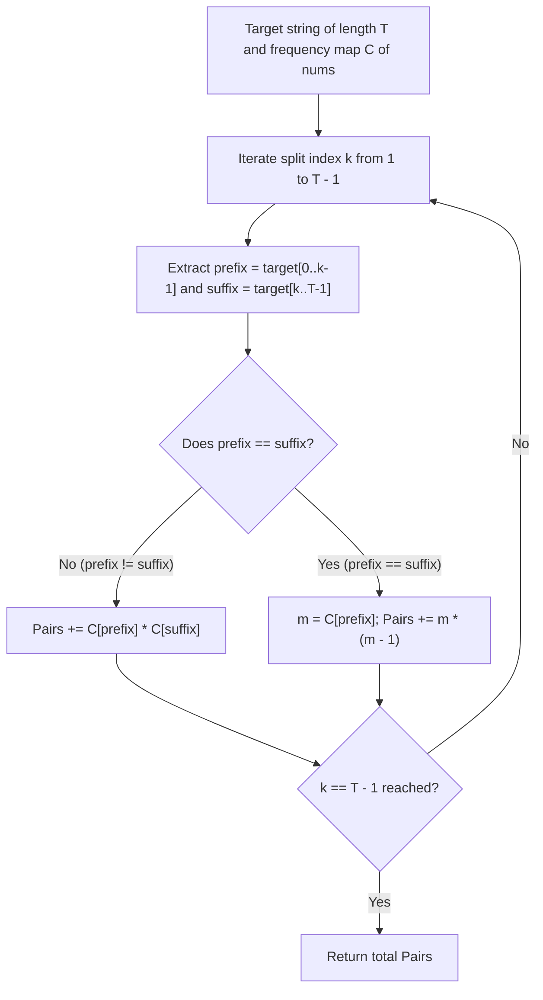

# Guided Example: Number of Pairs of Strings With Concatenation Equal to Target

## 1. Concrete Problem Restatement & Input Data

We are given a collection of $N$ numeric strings $\text{nums} = [s_0, s_1, \dots, s_{N-1}]$ and a target numeric string $\text{target}$ of length $T$. 

We must determine the total number of ordered index pairs $(i, j)$ that satisfy two conditions:
1. **Distinct Indices**: $i \neq j$ (the same array index cannot be paired with itself).
2. **Exact Concatenation**: Concatenating string $s_i$ followed immediately by string $s_j$ forms the exact string $\text{target}$:
   $$s_i \mathbin{\Vert} s_j = \text{target}$$

Crucially, index pairs are **ordered**: if $s_i \mathbin{\Vert} s_j = \text{target}$ and $s_j \mathbin{\Vert} s_i = \text{target}$, both $(i, j)$ and $(j, i)$ are counted as distinct solutions. Furthermore, if two different indices $i_1 \neq i_2$ hold identical string values ($s_{i_1} = s_{i_2}$), pairings with each index are distinguished and counted individually.

### Sample Input Dataset

Consider the representative configuration:
$$\text{nums} = [\text{"777"}, \text{"7"}, \text{"77"}, \text{"77"}], \quad \text{target} = \text{"7777"}$$

We also examine the mixed-digit instance:
$$\text{nums}_{\text{mix}} = [\text{"123"}, \text{"4"}, \text{"12"}, \text{"34"}], \quad \text{target} = \text{"1234"}$$
and the identical-element instance:
$$\text{nums}_{\text{rep}} = [\text{"1"}, \text{"1"}, \text{"1"}], \quad \text{target} = \text{"11"}$$

---

## 2. Conceptual Walkthrough & Visual Intuition

There are two primary paradigms to evaluate this problem: direct index-pair traversal and combinatorial frequency decomposition.

### Paradigm A: Direct Ordered Pair Enumeration
Given $N \le 100$, the total number of distinct ordered index pairs is:
$$N(N - 1) = 100 \times 99 = 9{,}900$$
Testing whether $s_i \mathbin{\Vert} s_j == \text{target}$ for each pair requires at most $T \le 100$ character comparisons. This brute-force scan completes in under $10^6$ operations, which is well within execution limits.

### Paradigm B: Combinatorial Prefix-Suffix Split
To understand the problem structurally and optimize for larger inputs, we observe that for any valid concatenation $s_i \mathbin{\Vert} s_j = \text{target}$, string $s_i$ must be a prefix of $\text{target}$ and string $s_j$ must be the exact complementary suffix.

If $s_i$ has length $k \in [1, T - 1]$:
$$\text{prefix}_k = \text{target}[0 \dots k - 1], \quad \text{suffix}_k = \text{target}[k \dots T - 1]$$
We aggregate the frequency of every string in $\text{nums}$ into a hash map $\mathcal{C}$. Then, for each split point $k \in [1, T - 1]$:
- **Case 1: Asymmetric Split ($\text{prefix}_k \neq \text{suffix}_k$)**:
  Any occurrence of $\text{prefix}_k$ can be paired with any occurrence of $\text{suffix}_k$. Because their string values are distinct, their chosen indices are automatically distinct ($i \neq j$). The number of valid pairs is:
  $$\Delta = \mathcal{C}[\text{prefix}_k] \times \mathcal{C}[\text{suffix}_k]$$

- **Case 2: Symmetric Split ($\text{prefix}_k = \text{suffix}_k$)**:
  Both halves require the identical string value. To satisfy $i \neq j$, we must select two distinct indices having that value. If the frequency is $m = \mathcal{C}[\text{prefix}_k]$, the number of ordered choices is:
  $$\Delta = m \times (m - 1)$$

Summing $\Delta$ over all split points $k \in [1, T - 1]$ yields the total count.

---

## 3. Step-by-Step State Progression Table

Let us trace $\text{nums} = [\text{"777"}, \text{"7"}, \text{"77"}, \text{"77"}]$ with $\text{target} = \text{"7777"}$ ($T = 4$).

First, compute frequency map $\mathcal{C}$ from $\text{nums}$:
- $\mathcal{C}[\text{"7"}] = 1$ (Index $1$)
- $\mathcal{C}[\text{"77"}] = 2$ (Indices $2, 3$)
- $\mathcal{C}[\text{"777"}] = 1$ (Index $0$)

Now, evaluate every candidate split point $k \in [1, 3]$:

| Split Point $k$ | Prefix Substring | Suffix Substring | Frequency $\mathcal{C}[\text{prefix}]$ | Frequency $\mathcal{C}[\text{suffix}]$ | Condition $\text{prefix} == \text{suffix}$? | Combinatorial Multiplier Formula | Pairs Added | Specific Index Pairs Formed |
|---|---|---|---|---|---|---|---|---|
| $k = 1$ | `"7"` | `"777"` | $1$ | $1$ | No | $\mathcal{C}[\text{prefix}] \times \mathcal{C}[\text{suffix}] = 1 \times 1$ | $1$ | $(1, 0)$ |
| $k = 2$ | `"77"` | `"77"` | $2$ | $2$ | **Yes** | $m(m - 1) = 2 \times 1$ | $2$ | $(2, 3), (3, 2)$ |
| $k = 3$ | `"777"` | `"7"` | $1$ | $1$ | No | $\mathcal{C}[\text{prefix}] \times \mathcal{C}[\text{suffix}] = 1 \times 1$ | $1$ | $(0, 1)$ |

Total accumulated valid pairs: $1 + 2 + 1 = 4$.

Now, let us contrast this with the exhaustive index-pair verification:

| Pair $(i, j)$ | $s_i$ | $s_j$ | Concatenation $s_i \mathbin{\Vert} s_j$ | Equals $\text{target} = \text{"7777"}$? | Valid Pair? | Cumulative Total |
|---|---|---|---|---|---|---|
| $(0, 1)$ | `"777"` | `"7"` | `"7777"` | Yes | **Counted** | $1$ |
| $(0, 2)$ | `"777"` | `"77"` | `"77777"` | No | Discarded | $1$ |
| $(0, 3)$ | `"777"` | `"77"` | `"77777"` | No | Discarded | $1$ |
| $(1, 0)$ | `"7"` | `"777"` | `"7777"` | Yes | **Counted** | $2$ |
| $(1, 2)$ | `"7"` | `"77"` | `"777"` | No | Discarded | $2$ |
| $(1, 3)$ | `"7"` | `"77"` | `"777"` | No | Discarded | $2$ |
| $(2, 0)$ | `"77"` | `"777"` | `"77777"` | No | Discarded | $2$ |
| $(2, 1)$ | `"77"` | `"7"` | `"777"` | No | Discarded | $2$ |
| $(2, 3)$ | `"77"` | `"77"` | `"7777"` | Yes | **Counted** | $3$ |
| $(3, 0)$ | `"77"` | `"777"` | `"77777"` | No | Discarded | $3$ |
| $(3, 1)$ | `"77"` | `"7"` | `"777"` | No | Discarded | $3$ |
| $(3, 2)$ | `"77"` | `"77"` | `"7777"` | Yes | **Counted** | $4$ |

---

## 4. Key Transition Dynamics & Boundary Handling

The transition analysis exposes how identical values and order sensitivity dictate counting:

1. **Ordering Distinction**: The pair $(0, 1)$ represents $s_0 \mathbin{\Vert} s_1 = \text{"777"} + \text{"7"} = \text{"7777"}$, while $(1, 0)$ represents $s_1 \mathbin{\Vert} s_0 = \text{"7"} + \text{"777"} = \text{"7777"}$. Because $(0, 1) \neq (1, 0)$, both are counted.
2. **Duplicate Value Multiplicity**: In $\text{nums}_{\text{rep}} = [\text{"1"}, \text{"1"}, \text{"1"}]$ with $\text{target} = \text{"11"}$, every string is identical. Choosing $i \in \{0, 1, 2\}$ leaves $2$ choices for $j$, producing $3 \times 2 = 6$ ordered pairs.
3. **Mismatched Total Length Pruning**: If $\text{length}(s_i) + \text{length}(s_j) \neq T$, concatenation cannot possibly match $\text{target}$. The prefix-suffix model inherently guarantees that only pairs whose combined lengths equal $T$ are evaluated.

| Dataset Scenario | Target | Distinct Splits Checked | Matching Multipliers | Total Pairs | Key Observation |
|---|---|---|---|---|---|
| `["123", "4", "12", "34"]` | `"1234"` | $k=1: \text{"1"}, \text{"234"}$ $k=2: \text{"12"}, \text{"34"}$ $k=3: \text{"123"}, \text{"4"}$ | $k=2: 1 \times 1 = 1$ $k=3: 1 \times 1 = 1$ | $2$ | $(2, 3)$ and $(0, 1)$ qualify |
| `["1", "1", "1"]` | `"11"` | $k=1: \text{"1"}, \text{"1"}$ | $k=1: 3 \times 2 = 6$ | $6$ | Symmetric split with $3$ identical items |
| `["12", "34"]` | `"99"` | $k=1: \text{"9"}, \text{"9"}$ | None match | $0$ | Zero occurrences in frequency map |

---

## 5. Algorithmic Correctness & Soundness

### Completeness of the Split Space
Any string equality $s_i \mathbin{\Vert} s_j = \text{target}$ implies that:
1. $s_i$ is identical to the prefix of $\text{target}$ of length $|s_i|$.
2. $s_j$ is identical to the suffix of $\text{target}$ of length $|s_j|$.
3. $|s_i| + |s_j| = |\text{target}| = T$.
Because $|s_i| \ge 1$ and $|s_j| \ge 1$, the length $|s_i|$ must be an integer $k \in [1, T - 1]$. Since we iterate through all $k \in [1, T - 1]$, every possible factorization of $\text{target}$ into two non-empty substrings is visited exactly once.

### Disjointness and Exact Multiplicity
Each split point $k$ defines unique prefix and suffix string lengths $(k, T - k)$. Because string lengths are uniquely specified by $k$, two different split points $k_1 \neq k_2$ evaluate disjoint sets of index pairs.
- When $\text{prefix}_k \neq \text{suffix}_k$, the index sets $\{i \mid s_i = \text{prefix}_k\}$ and $\{j \mid s_j = \text{suffix}_k\}$ are disjoint, so every chosen pair $(i, j)$ satisfies $i \neq j$ automatically.
- When $\text{prefix}_k = \text{suffix}_k$, choosing distinct indices from the same set of size $m$ gives the exact number of ordered permutations $P(m, 2) = m(m - 1)$.
Hence, every valid index pair is counted exactly once with no undercounting or double-counting.

---

## 6. Edge Cases & Common Pitfalls

1. **Self-Pairing Violation ($i = j$)**: Failing to enforce $i \neq j$ would allow a single occurrence of `"77"` to pair with itself to falsely claim `"7777"`. When $\text{prefix}_k = \text{suffix}_k$, using $m(m - 1)$ rather than $m^2$ strictly prohibits self-pairing.
2. **Reversed String Asymmetry**: If $s_i = \text{"12"}$ and $s_j = \text{"34"}$, $s_i \mathbin{\Vert} s_j = \text{"1234"}$, but $s_j \mathbin{\Vert} s_i = \text{"3412"} \neq \text{"1234"}$. Pairs cannot be treated as unordered combinations.
3. **Empty Substrings**: The problem statement restricts strings to non-empty inputs. Splitting at $k = 0$ or $k = T$ would produce empty strings, which cannot correspond to valid array elements. The split index $k$ must be bounded strictly to $1 \le k \le T - 1$.

---

## 7. Complexity Analysis

### Time Complexity
- **Frequency Map Construction**: Hashing all $N$ strings of length up to $L$ takes $\mathcal{O}(\sum |s_i|) = \mathcal{O}(N \cdot L)$ time.
- **Prefix-Suffix Traversal**: There are $T - 1$ possible split points. Slicing $\text{target}$ and querying the hash map takes $\mathcal{O}(T)$ operations per split point, totaling $\mathcal{O}(T^2)$ time.
- **Direct Pair Alternative**: Enumerating all $N(N - 1)$ index pairs and checking equality takes $\mathcal{O}(N^2 \cdot T)$ time.
- **Total Time Complexity**: $\mathcal{O}(N \cdot L + T^2)$ for the combinatorial method, or $\mathcal{O}(N^2 \cdot T)$ for direct pair checking. Both run in $< 5$ milliseconds for $N, T \le 100$.

### Space Complexity
- **Hash Table Storage**: The frequency map stores at most $N$ distinct strings, consuming $\mathcal{O}(N \cdot L)$ memory.
- **Substring Slices**: Temporary prefix/suffix strings require $\mathcal{O}(T)$ working memory.
- **Total Auxiliary Space**: $\mathcal{O}(N \cdot L + T)$ auxiliary space.
