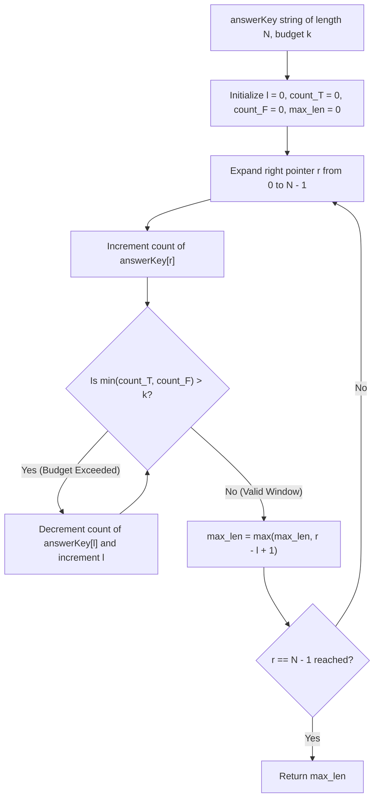

# Guided Example: Maximize the Confusion of an Exam

## 1. Concrete Problem Restatement & Input Data

We are given a string $\text{answerKey}$ of length $N$ where every character is either `'T'` (True) or `'F'` (False). We are also given a budget of at most $k$ modification operations. In each operation, we may choose any index in the string and flip its value (`'T'` becomes `'F'`, or `'F'` becomes `'T'`).

Our goal is to maximize the length of a contiguous block of identical answers (a substring containing solely `'T'`s or solely `'F'`s). Because changes outside the targeted consecutive run are irrelevant, the problem reduces to finding the longest contiguous substring that contains at most $k$ minority characters.

### Sample Input Dataset

Consider the representative configuration:
$$\text{answerKey} = \text{"TTFTTFTT"}, \quad k = 1$$

We also examine the fully saturated budget:
$$\text{answerKey}_{\text{all}} = \text{"TTFF"}, \quad k = 2$$
and the alternating sequence:
$$\text{answerKey}_{\text{alt}} = \text{"TFFT"}, \quad k = 1$$

---

## 2. Conceptual Walkthrough & Visual Intuition

To produce a homogeneous block of length $W$ consisting entirely of symbol $C \in \{\text{'T'}, \text{'F'}\}$, any character within that block that is not $C$ must be flipped. The number of flips required for a given window $[l, r]$ to become all $C$ is exactly:
$$\text{cost}_C(l, r) = (r - l + 1) - \text{count}_C(l, r)$$

To make the window homogeneous under *either* symbol, we flip the minority character. Thus, the minimum number of flips needed to convert the window into a uniform sequence is:
$$\text{flips}(l, r) = \min(\text{count}_T(l, r), \;\text{count}_F(l, r))$$

A window $[l, r]$ is valid if and only if $\text{flips}(l, r) \le k$.

Because the count of characters within any window is monotonically increasing with respect to the right boundary $r$ and monotonically decreasing with respect to the left boundary $l$, this satisfies the sliding window invariant:
1. Extend the right boundary $r$ one character at a time, incrementing the count of the incoming character.
2. While the minority count $\min(\text{count}_T, \text{count}_F) > k$, the window violates our budget. We contract the window from the left by incrementing $l$ and decrementing the departing character's count.
3. At every step where the condition $\min(\text{count}_T, \text{count}_F) \le k$ is satisfied, the valid window span $r - l + 1$ is recorded against our running maximum.

---

## 3. Step-by-Step State Progression Table

Let us trace $\text{answerKey} = \text{"TTFTTFTT"}$ with $k = 1$.
Length $N = 8$.

| Step $r$ | Incoming Character | Running $(\text{count}_T, \text{count}_F)$ | Minority Flips $\min(T, F)$ | Budget Exceeded ($> 1$)? | Left Contraction Actions | Active Window $[l, r]$ | Substring | Window Length $r - l + 1$ | Best Length So Far |
|---|---|---|---|---|---|---|---|---|---|
| $0$ | `'T'` | $(1, 0)$ | $0$ | No | None | $[0, 0]$ | `"T"` | $1$ | $1$ |
| $1$ | `'T'` | $(2, 0)$ | $0$ | No | None | $[0, 1]$ | `"TT"` | $2$ | $2$ |
| $2$ | `'F'` | $(2, 1)$ | $1$ | No | None | $[0, 2]$ | `"TTF"` | $3$ | $3$ |
| $3$ | `'T'` | $(3, 1)$ | $1$ | No | None | $[0, 3]$ | `"TTFT"` | $4$ | $4$ |
| $4$ | `'T'` | $(4, 1)$ | $1$ | No | None | $[0, 4]$ | `"TTFTT"` | $5$ | **$5$** |
| $5$ | `'F'` | $(4, 2)$ | $2$ | **Yes ($2 > 1$)** | Drop $l=0$ (`'T'`) $\to (3, 2)$ Drop $l=1$ (`'T'`) $\to (2, 2)$ Drop $l=2$ (`'F'`) $\to (2, 1)$, $l=3$ | $[3, 5]$ | `"TTF"` | $3$ | $5$ |
| $6$ | `'T'` | $(3, 1)$ | $1$ | No | None | $[3, 6]$ | `"TTFT"` | $4$ | $5$ |
| $7$ | `'T'` | $(4, 1)$ | $1$ | No | None | $[3, 7]$ | `"TTFTT"` | $5$ | **$5$** |

The maximum contiguous length achievable is $5$, attained by converting window $[0, 4]$ `"TTFTT"` to `"TTTTT"` or window $[3, 7]$ `"TTFTT"` to `"TTTTT"`.

---

## 4. Key Transition Dynamics & Boundary Handling

The transition behavior demonstrates how contraction restores budget equilibrium:

1. **Step 5 Contraction Nuance**:
   - At $r = 5$, incoming `'F'` raises the frequency tuple to $(4, 2)$. The minority is $\min(4, 2) = 2 > 1$.
   - Removing index $0$ (`'T'`) leaves $(3, 2)$; minority is still $\min(3, 2) = 2 > 1$.
   - Removing index $1$ (`'T'`) leaves $(2, 2)$; minority is still $\min(2, 2) = 2 > 1$.
   - Removing index $2$ (`'F'`) removes a minority symbol, yielding $(2, 1)$; minority is $\min(2, 1) = 1 \le 1$.
   - Contraction terminates with $l = 3$. The window successfully recalibrates around the single remaining `'F'` at index $5$.

2. **Full Budget Capacity ($k \ge \text{count}$)**:
   - In $\text{answerKey}_{\text{all}} = \text{"TTFF"}$ with $k = 2$, $\min(2, 2) = 2 \le 2$. The window encompasses the entire string without ever contracting, returning $4$.

| Input Pattern | $k$ | String Length $N$ | Maximum Window Achieved | Target Majority | Minority Flips Used |
|---|---|---|---|---|---|
| `"TTFF"` | $2$ | $4$ | $4$ | Either `'T'` or `'F'` | $2$ flips convert all characters |
| `"TFFT"` | $1$ | $4$ | $3$ | `'F'` (window `"FFT"` $\to$ `"FFF"`) | $1$ flip at index $3$ |
| `"FFFF"` | $1$ | $4$ | $4$ | `'F'` | $0$ flips needed |
| `"TFTFTF"` | $1$ | $6$ | $3$ | Either (e.g. `"TFT"` $\to$ `"TTT"`) | $1$ flip |

---

## 5. Algorithmic Correctness & Soundness

### Monotonicity of Substring Legality
Let $P(l, r)$ be the predicate that substring $\text{answerKey}[l \dots r]$ can be made homogeneous using at most $k$ flips:
$$P(l, r) \iff \min(\text{count}_T(l, r), \text{count}_F(l, r)) \le k$$
- If $P(l, r)$ is false, then for any $l' \le l$, the extended window $[l', r]$ contains all characters of $[l, r]$ plus additional characters. Because adding characters cannot decrease the count of either symbol, $\min(\text{count}_T(l', r), \text{count}_F(l', r)) \ge \min(\text{count}_T(l, r), \text{count}_F(l, r)) > k$.
- Thus, once a window $[l, r]$ violates the budget, no earlier left endpoint $l' \le l$ can possibly be valid for the current right endpoint $r$.

### Optimality of Sliding Window Search
Because invalid left endpoints can never become valid by expanding further left, the left pointer $l$ only ever needs to advance monotonically to the right. 
Every maximal valid window ending at each right endpoint $r \in [0, N-1]$ is inspected. Since the global maximum must end at some index $r \in [0, N-1]$, the algorithm is guaranteed to encounter and record the optimal window length.

---

## 6. Edge Cases & Common Pitfalls

1. **Monolithic Strings**: If the string consists entirely of `'T'`s or entirely of `'F'`s, $\min(\text{count}_T, \text{count}_F) = 0 \le k$. The window spans the entire string length $N$ without contracting.
2. **Budget Exceeding String Length ($k \ge N$)**: If $k \ge N$, every character can be flipped if desired, allowing the entire string of length $N$ to be unified into either symbol.
3. **Independent Per-Character Sweeps vs Single Dual Sweep**: While one can run two separate passes (one allowing at most $k$ `'F'`s, another allowing at most $k$ `'T'`s), the unified condition $\min(\text{count}_T, \text{count}_F) \le k$ achieves the exact same result in a single pass.
4. **Off-by-One in Length**: The length of interval $[l, r]$ is $r - l + 1$. Calculating $r - l$ would undercount the length by $1$.

---

## 7. Complexity Analysis

### Time Complexity
- **Right Pointer Expansion**: The right pointer $r$ advances from $0$ to $N - 1$ exactly once, performing $N$ iterations.
- **Left Pointer Contraction**: In each step, the left pointer $l$ advances at most until $l > r$. Over the entire algorithm execution, $l$ increments at most $N$ times.
- **Constant Time Checks**: Evaluating $\min(\text{count}_T, \text{count}_F) \le k$ and updating counters take $\mathcal{O}(1)$ time per step.
- **Total Time Complexity**: $\mathcal{O}(N)$, which is optimal as every character must be examined.

### Space Complexity
- **State Variables**: Only four integer scalar variables are tracked: $l, r, \text{count}_T$, and $\text{count}_F$.
- **No Auxiliary Data Structures**: Operates entirely in-place over the input string without memory allocation.
- **Total Auxiliary Space**: $\mathcal{O}(1)$, requiring strictly constant additional memory.
