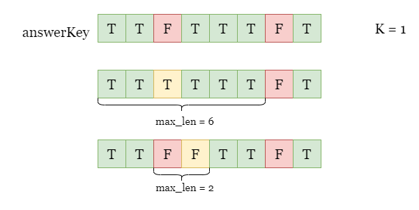
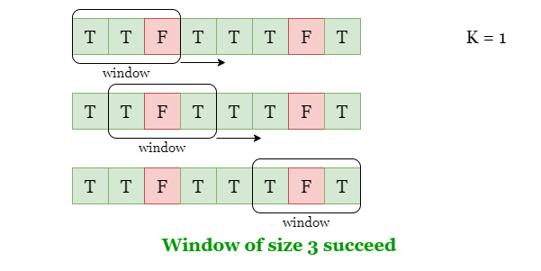
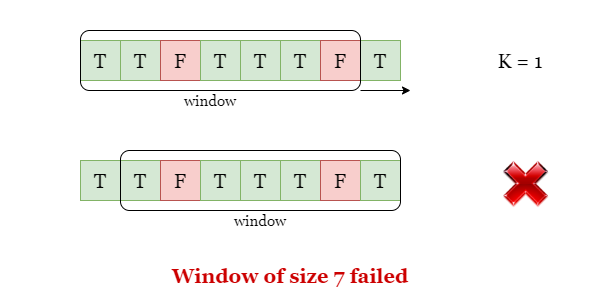
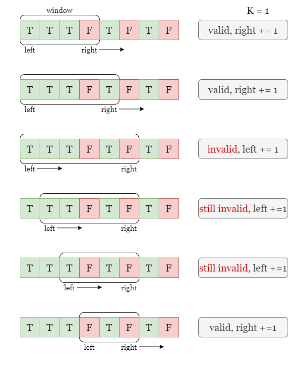
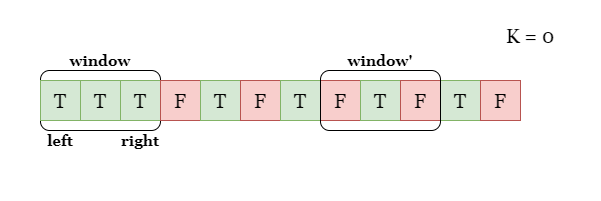
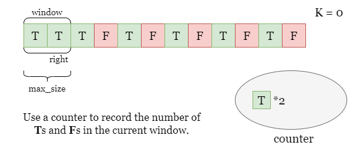
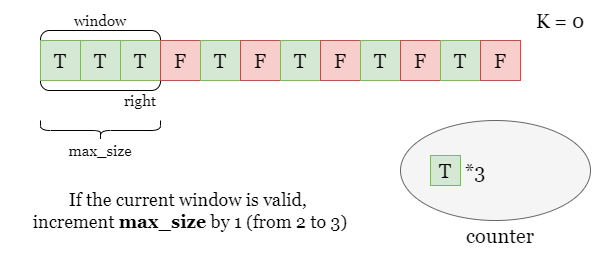
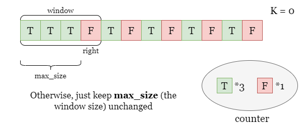
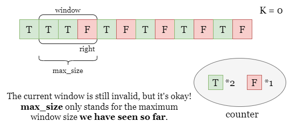

## Solution

---

### Overview

Take the following picture as an example, if we are allowed to make at most $k = 1$ change.



Flip the third answer and we have a confusion (let's call it $\text{max}_{size}$) of 6.

Flip the fourth answer and we have a confusion of 2.

---

### Approach 1: Binary Search + Fixed Size Sliding Window

#### Intuition

Since we are asked to find the longest sequence of identical answers. We could first set up a target length $\text{max}_{size}$, then we shall iterate over `answerKey` to look for each substring of length $\text{max}_{size}$. If we could flip at most `k` answers in a substring to make all answers identical, then this substring is valid and we can make a confusion of at least $\text{max}_{size}$.

In order to make a string valid, we can either:
- Flip every `T` to `F` in the string so that it is all `F`.
- Flip every `F` to `T` in the string so that it is all `T`.

However, if both `F` and `T` in the substring are more than `k`, we can never make it valid by `k` flips. Therefore, we can determine if a substring is valid by comparing `k` with the smaller value between the count of `F` and the count of `T` in it.

- If $min(count(T), count(F)) \le k$, this substring is valid.
- If `min(count(T), count(F)) > k`, this substring is invalid.

The method described in this solution is also known as the sliding window algorithm. During the process from left to right, we ensure that the length of the subsequence remains unchanged as $\text{max}_{size}$, just like moving a window of fixed length. As shown in the pictures below, if we set the window length to $m = 3$, we can find some valid windows.



However, if we set the length to $m = 7$, we will not find any valid windows, since the only two windows of size `7` contain more than one `T` and more than one `F`.



<br>

During the iteration, when we move the right boundary of the window from $right - 1$ to `right`, we don't need to recalculate the count of each answer over again, note that two adjacent windows only differ by two answers ($\text{answerKey}[right]$, $answerKey[right - m]$). We only need to increment the count of $\text{answerKey}[right]$ by 1 and decrement the count of $answerKey[right - m]$ by `1`, based on the result of the previous window.

<br>

To quickly find the maximum valid window length, we can use binary search. To begin, we need to define a search space that ensures the maximum window length we are looking for is within this range. We can set the left boundary of the search space to $left = 1$, which represents the smallest window length, and the right boundary to $right = n$, which is the maximum possible window length.

Next, we perform a binary search within the interval `[left, right]`. At each iteration, we find the midpoint of the interval, denoted as `mid`, and slide a window of length `mid` using the previous approach to check whether there exists at least one valid window. If such a window exists, we continue to search for a larger window length in `[mid, right]`, the right half of the interval. Otherwise, if `mid` is still too large, we continue our search in `[left, mid - 1]`, the left half of the search space.

<br>

#### Algorithm

1) Initialize the search space as $left = 1$, $right = n$.

2) Define a function `isValid` to help verify if a window of size `size` is valid:
- Count the number of `T` and `F` in `answerKey[:size]` in a counter `count`, return true if $min(\text{counter}[T], \text{counter}[F]) \le k$
- Iterate the index of the right boundary of the window from $size - 1$ to `n`. At each step `i`, increment $counter[\text{answerKey}[i]]$ by 1 and decrement $counter[answerKey[i - size]]$ by 1, return true if $min(\text{counter}[T], \text{counter}[F]) \le k$ at any point in this iteration

- Return false if we finish iterating without finding a valid window.

3) While `left < right`:
- Find the middle value as $mid = right - (right - left) / 2$.
- Check if the window of size `mid` is valid.
- If `isValid(mid)` is true, let $left = mid$ and repeat step 3.
- If `isValid(mid)` is false, let $right = mid - 1$ and repeat step 3.

4) Return `left` once the search ends.

#### Implementation

```python
class Solution:
    def maxConsecutiveAnswers(self, answerKey: str, k: int) -> int:
        n = len(answerKey)
        left, right = k, n

        def isValid(size):
            counter = collections.Counter(answerKey[:size])
            if min(counter['T'], counter['F']) <= k:
                return True
            for i in range(size, n):
                counter[answerKey[i]] += 1
                counter[answerKey[i - size]] -= 1
                if min(counter['T'], counter['F']) <= k:
                    return True
            return False

        while left < right:
            mid = (left + right + 1) // 2

            if isValid(mid):
                left = mid
            else:
                right = mid - 1

        return left
```

#### Complexity Analysis

Let $n$ be the length of the input string `answerKey`.

* Time complexity: $O(n\cdot\log n)$

- We set the search space to `[1, n]`, it takes at most $O(\log n)$ search steps.
- At each step, we iterate over `answerKey` which takes $O(n)$ time.

* Space complexity: $O(1)$

- We only need to update some parameters `left`, `right`. During the iteration, we need to count the number of `T` and `F`, which also takes $O(1)$ space.

<br/>

---

### Approach 2: Sliding Window

#### Intuition

We can also find the longest valid window with fewer traversals. Unlike the previous fixed-length sliding window solution, this time we can adjust the window length based on the situation. We will still use the counter `count` to record the count of each type of answer within the window.

Specifically, if the current window is valid, we can try to expand the window by moving the right boundary one position to the right, $right = right + 1$. On the other hand, if the current window is invalid, we keep moving the left boundary to the right (equivalent to removing the leftmost answer from the window) until the window becomes valid, that is $left = left + 1$. During this process, we constantly record the longest valid window seen so far.

As shown in the following figure, we keep adjusting the size of the window and recording the maximum size of the valid window.



<br>

#### Algorithm

1) Use a hash map `count` to record the count of `T` and `F` in the current window.
2) Set $left = 0$ and $\text{max}_{size} = 0$, iterate `right` from `0` to $n - 1$, at each step `right`, increment $\text{answerKey}[right]$ by 1:
- Increment $count[\text{answerKey}[right]]$ by 1.
- While `min(count['T'], count['F']) > k`, decrement $count[\text{answerKey}[left]]$ by 1 and increment `left` by 1.

- Now the window is valid, update the maximum size of valid window as $\text{max}_{size} = max(\text{max}_{size}, right - left + 1)$.
3) Return $\text{max}_{size}$ when the iteration ends.

#### Implementation

```python
class Solution:
    def maxConsecutiveAnswers(self, answerKey: str, k: int) -> int:
        max_size = k
        count = collections.Counter(answerKey[:k])

        left = 0
        for right in range(k, len(answerKey)):
            count[answerKey[right]] += 1

            while min(count['T'], count['F']) > k:
                count[answerKey[left]] -= 1
                left += 1

            max_size = max(max_size, right - left + 1)

        return max_size
```

#### Complexity Analysis

Let $n$ be the length of the input string `answerKey`.

* Time complexity: $O(n)$

- In the iteration of the right boundary `right`, we shift it from `0` to $n - 1$. Although we may move the left boundary `left` in each step, `left` always stays to the left of `right`, which means `left` moves at most $n - 1$ times.
- At each step, we update the value of an element in the hash map `count`, which takes constant time.
- To sum up, the overall time complexity is $O(n)$.

* Space complexity: $O(1)$

- We only need to update two indices `left` and `right`. During the iteration, we need to count the number of `T` and `F`, which also takes $O(1)$ space.

<br/>

---

### Approach 3: Advanced Sliding Window

#### Intuition

In the previous solution, we need to ensure that the current window is always valid. If the window contains more than `k` occurrences of `T` and `F`, we need to continuously remove the leftmost answer in the window. During this process, the size of the window may decrease, even smaller than the previous valid window. Taking the figure below as an example, the `window` on the left is valid, but the `window'` on the right is not valid, and we need to remove the left two answers from it to make it valid.



<br>

However, we don't need to decrease the size of the window.

If we have already found a window of length $\text{max}_{size}$, then what we need to do next is to search for a larger valid window, for example, a window with length $\text{max}_{size} + 1$. Therefore, in the following sliding window process, even if the current window with size $\text{max}_{size}$ is not valid, there is no problem, because we have already found a window of length $\text{max}_{size}$ before, so we may as well continue looking for a larger window.

<br>

Understanding this, we can simplify the solution in approach 2:

Again, we use a counter `count` to keep track of the number of `T` and `F` in the current window. When we increase the window length by 1, we need to increase count of the answer at the current right boundary $count[\text{answerKey}[right]]$ by 1.



If the expanded window is still valid, it means that we get a larger valid window with length $\text{max}_{size} + 1$ (from `2` to `3`). We can continue to move the boundary `right`.



However, if the expanded window is invalid, we only need to remove the leftmost answer in the window to keep the window length still at $\text{max}_{size}$ (from `4` to `3`), that is, decrease $count[answerKey[right - \text{max}_{size}]]$ by 1.



Since the expanded window of length `4` was invalid, we removed an answer from the leftmost side of the window to make its length `3` again. Although the current window is still invalid, we don't need to keep shrinking it because we have previously found a valid window of length `3`. We can continue to shift the boundary `right` to try the next window of size `4`.



Once this iteration is over, $\text{max}_{size}$ represents the maximum size of the valid window.

<br>

#### Algorithm

1) Use a hash map `count` to keep track of the number of `T` and `F` in the current window.
2) Set $\text{max}_{size} = 0$, iterate `right` from `0` to $n - 1$, at each step `right`, increment $\text{answerKey}[right]$ by 1, and increment $count[\text{answerKey}[right]]$ by 1.
- If `min(count['T'], count['F']) > k`, decrement $count[answerKey[right - \text{max}_{size}]]$ by 1.
- Otherwise, increment $\text{max}_{size}$ by 1.

3) Return $\text{max}_{size}$ when the iteration ends.

#### Implementation

```python
class Solution:
    def maxConsecutiveAnswers(self, answerKey: str, k: int) -> int:
        max_size = 0
        count = collections.Counter()

        for right in range(len(answerKey)):
            count[answerKey[right]] += 1
            minor = min(count['T'], count['F'])

            if minor <= k:
                max_size += 1
            else:
                count[answerKey[right - max_size]] -= 1

        return max_size
```

#### Complexity Analysis

Let $n$ be the length of the input string `answerKey`.

* Time complexity: $O(n)$

- In the iteration of the right boundary `right`, we shift it from `0` to $n - 1$.
- At each step, we update the number of $\text{answerKey}[right]$ and/or the number of $answerKey[right - \text{max}_{size}]$ in the hash map `count`, which takes constant time.
- To sum up, the overall time complexity is $O(n)$.

* Space complexity: $O(1)$

- We only need to update two parameters $\text{max}_{size}$ and `right`. During the iteration, we need to count the number of `T` and `F`, which also takes $O(1)$ space.

<br/>