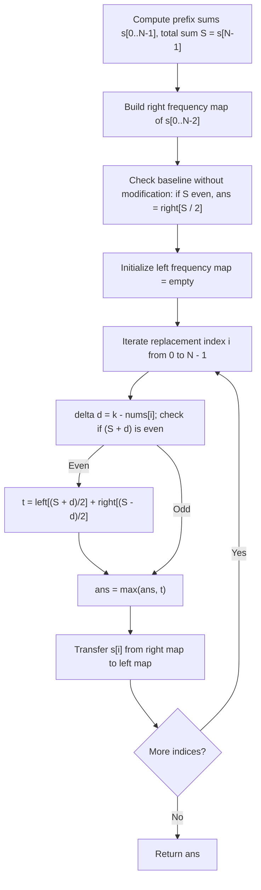

# Guided Example: Maximum Number of Ways to Partition an Array

## 1. Concrete Problem Restatement & Input Data

We are given a zero-indexed integer array $\text{nums}$ of length $N$, and an integer $k$. A pivot point is defined by an integer boundary $p \in [1, N - 1]$, which partitions the array into two non-empty segments:
- Left segment: $\text{nums}[0 \dots p - 1]$
- Right segment: $\text{nums}[p \dots N - 1]$

A pivot $p$ is called **valid** if the sum of all elements on its left equals the sum of all elements on its right:
$$\sum_{j=0}^{p-1} \text{nums}[j] = \sum_{j=p}^{N-1} \text{nums}[j]$$

We are permitted to perform at most one modification: we may choose any single index $i \in [0, N - 1]$ and overwrite $\text{nums}[i] \leftarrow k$, or we may choose to leave the array entirely unaltered.

Our objective is to find the maximum possible number of valid pivots achievable after this optional single replacement.

### Sample Input Dataset

Consider the representative configuration:
$$\text{nums} = [2, -1, 2], \quad k = 3$$

We also examine the zero-sum instance:
$$\text{nums}_{\text{zero}} = [0, 0, 0], \quad k = 1$$
and the mixed sign sequence:
$$\text{nums}_{\text{mixed}} = [22, 4, -25, -20, -15, 15, -16, 7, 19, -10, 0, -13, -14], \quad k = -33$$

---

## 2. Conceptual Walkthrough & Visual Intuition

Let $s[m] = \sum_{j=0}^m \text{nums}[j]$ represent the prefix sum up to index $m$, and let $S = s[N - 1]$ denote the total sum of the unmodified array.

For any pivot $p \in [1, N - 1]$, the left partition sum is $s[p - 1]$ and the right partition sum is $S - s[p - 1]$. The condition for equal partition is:
$$s[p - 1] = S - s[p - 1] \iff 2 \cdot s[p - 1] = S \iff s[p - 1] = \frac{S}{2}$$
Thus, in an unmodified array, a valid pivot exists if and only if $S$ is even, and its frequency equals the number of prefix sums $s[p - 1]$ equal to $S / 2$ for $p - 1 \in [0, N - 2]$.

### Dynamics Under a Single Replacement at Index $i$
Suppose we replace $\text{nums}[i]$ with $k$. The element change delta is:
$$d = k - \text{nums}[i]$$
The new total array sum becomes $S' = S + d$. For any pivot to be valid, $S'$ must be even, meaning the target half-sum is:
$$H = \frac{S + d}{2}$$

How does this delta affect the prefix sums $s[p - 1]$?
- **Case 1: Pivot occurs at or before index $i$ ($p \le i$, so $p - 1 < i$)**:
  The replaced element $\text{nums}[i]$ falls in the **right** partition. The left prefix sum $s[p - 1]$ is unchanged.
  The pivot is valid if:
  $$s[p - 1] = H = \frac{S + d}{2}$$
- **Case 2: Pivot occurs strictly after index $i$ ($p > i$, so $p - 1 \ge i$)**:
  The replaced element $\text{nums}[i]$ falls in the **left** partition. The left prefix sum increases by $d$, becoming $s[p - 1] + d$.
  The pivot is valid if:
  $$s[p - 1] + d = H \iff s[p - 1] = H - d = \frac{S + d}{2} - d = \frac{S - d}{2}$$

By maintaining two frequency tables—`left` for prefix sums with indices $< i$, and `right` for prefix sums with indices $\ge i$—we can evaluate each candidate replacement in $\mathcal{O}(1)$ time.

---

## 3. Step-by-Step State Progression Table

Let us trace $\text{nums} = [2, -1, 2]$ with $k = 3$.
Length $N = 3$.

### Step A: Baseline Prefix Sums & Unmodified Evaluation
- $s[0] = 2$
- $s[1] = 2 + (-1) = 1$
- $s[2] = 1 + 2 = 3$ (Total sum $S = 3$)

Candidate pivots are $p \in \{1, 2\}$, corresponding to prefix sum indices $0$ and $1$:
- Candidate values: $s[0] = 2, s[1] = 1$.
- Initial `right` frequency map: $\{2: 1, 1: 1\}$.
- `left` frequency map: $\emptyset$.
- Total sum $S = 3$ is odd, so without modifications, $\text{ans} = 0$.

### Step B: Iterating Replacement Index $i \in [0, 2]$

| Step $i$ | Current Value $\text{nums}[i]$ | Delta $d = k - \text{nums}[i]$ | New Sum $S + d$ | Parity Check | Target Left $H = \frac{S+d}{2}$ | Target Right $H - d = \frac{S-d}{2}$ | `left` Count for $H$ | `right` Count for $H - d$ | Total Valid Pivots $t$ | Best $\text{ans}$ | Transfer Step for Prefix Map |
|---|---|---|---|---|---|---|---|---|---|---|---|
| $0$ | $2$ | $3 - 2 = 1$ | $3 + 1 = 4$ | Even | $\frac{4}{2} = 2$ | $\frac{3 - 1}{2} = 1$ | $\text{left}[2] = 0$ | $\text{right}[1] = 1$ ($s[1]$) | $0 + 1 = 1$ | $\max(0, 1) = 1$ | Move $s[0] = 2$ to `left`: `left` $\{2: 1\}$, `right` $\{1: 1\}$ |
| $1$ | $-1$ | $3 - (-1) = 4$ | $3 + 4 = 7$ | Odd | N/A | N/A | N/A | N/A | $0$ | $1$ | Move $s[1] = 1$ to `left`: `left` $\{2: 1, 1: 1\}$, `right` $\emptyset$ |
| $2$ | $2$ | $3 - 2 = 1$ | $3 + 1 = 4$ | Even | $\frac{4}{2} = 2$ | $\frac{3 - 1}{2} = 1$ | $\text{left}[2] = 1$ ($s[0]$) | $\text{right}[1] = 0$ | $1 + 0 = 1$ | $\max(1, 1) = 1$ | End of array |

The maximum number of valid equal-sum pivots is $1$.

---

## 4. Key Transition Dynamics & Boundary Handling

The transition mechanics highlight why separating left and right prefix frequencies is essential:

1. **Physical Meaning of Target Values**:
   - For $i = 0$, replacing $2$ with $3$ gives modified array $[3, -1, 2]$.
   - Pivot $p = 1$: Left sum is $3$, right sum is $-1 + 2 = 1$ ($3 \neq 1$, invalid).
   - Pivot $p = 2$: Left sum is $3 + (-1) = 2$, right sum is $2$ ($2 == 2$, **valid**).
   - In our formula, pivot $p = 2$ corresponds to $p - 1 = 1 \ge i$. Its original prefix sum was $s[1] = 1$, which matched $\frac{S - d}{2} = 1$ in `right`!
2. **Transfer Ordering Between Left and Right**:
   - Before evaluating replacement at index $i$, prefix sum $s[i]$ resides in `right` because any pivot $p - 1 \ge i$ includes $s[i]$.
   - After testing index $i$, $s[i]$ is decremented from `right` and added to `left`, precisely reflecting that for subsequent replacement positions $i' > i$, the index $i$ falls strictly to the left.
3. **Last Element Exclusion**:
   - The prefix sum of the entire array $s[N - 1] = S$ is never added to `right` initially because a pivot must leave a non-empty right partition ($p \le N - 1$). Thus, only prefix sums $s[0 \dots N - 2]$ are candidate pivots.

| Array Configuration | $k$ | Total Sum $S$ | Baseline Pivots (No Change) | Best Replacement Index | Modified Array | Achievable Valid Pivots |
|---|---|---|---|---|---|---|
| `[2, -1, 2]` | $3$ | $3$ (odd) | $0$ | $i = 0$ | `[3, -1, 2]` | $1$ (at $p = 2$) |
| `[0, 0, 0]` | $1$ | $0$ (even) | $2$ (at $p=1, 2$) | None (keep original) | `[0, 0, 0]` | $2$ |
| `[1, -1, 1, -1]` | $1$ | $0$ (even) | $1$ (at $p = 2$) | $i = 1$ | `[1, 1, 1, -1]` | $2$ (at $p = 1, 3$) |

---

## 5. Algorithmic Correctness & Soundness

### Invariant: Exact Partition Invariant
At iteration $i \in [0, N - 1]$:
1. The table `left` contains the exact multiset of original prefix sums $\{s[j] \mid 0 \le j < i\}$.
2. The table `right` contains the exact multiset of original prefix sums $\{s[j] \mid i \le j \le N - 2\}$.

### Mathematical Equivalence of Replacement
If element $\text{nums}[i]$ is replaced with $k$, the difference is $d = k - \text{nums}[i]$.
- Any pivot $p \in [1, i]$ has left sum $\sum_{j=0}^{p-1} \text{nums}[j] = s[p - 1]$. The new total sum is $S + d$. Equality holds iff $s[p - 1] = (S + d) / 2$. Because $p - 1 < i$, these values correspond precisely to entries in `left`.
- Any pivot $p \in [i + 1, N - 1]$ has left sum $\sum_{j=0}^{p-1} \text{nums}[j] = s[p - 1] + d$. Equality holds iff $s[p - 1] + d = (S + d) / 2 \iff s[p - 1] = (S - d) / 2$. Because $p - 1 \ge i$, these values correspond precisely to entries in `right`.

Since every possible pivot index $p \in [1, N - 1]$ belongs either to $[1, i]$ or $[i + 1, N - 1]$, summing `left[(S + d) // 2]` and `right[(S - d) // 2]` computes the exact number of valid pivots for the chosen modification. Testing all $i \in [0, N - 1]$ alongside the unmodified baseline guarantees global optimality.

---

## 6. Edge Cases & Common Pitfalls

1. **Odd Target Sum Parity**: If $S + d$ is odd, dividing by $2$ would yield a non-integer half-sum. Because all array elements are integers, no partition sum can equal a fraction; hence, such configurations yield $0$ valid pivots and must be skipped.
2. **Including the Total Array Sum in Pivots**: Adding $s[N - 1]$ to `right` would falsely permit partitioning at index $N$, which leaves an empty right partition. A pivot must strictly partition the array into two non-empty segments ($1 \le p \le N - 1$).
3. **Large Integer Sums**: With $N = 10^5$ and values up to $10^5$, prefix sums can range between $-10^{10}$ and $10^{10}$. Calculations and hash keys must support 64-bit integer values without truncation.
4. **Unmodified Baseline Advantage**: In cases like $[0, 0, 0]$ with $k = 1$, modifying any element reduces the valid pivots from $2$ to $0$. The baseline unmodified state must be evaluated and preserved as a candidate answer.

---

## 7. Complexity Analysis

### Time Complexity
- **Prefix Sum Computation**: Computing $s[0 \dots N - 1]$ and populating the initial `right` frequency map takes $\mathcal{O}(N)$ time.
- **Single Forward Pass**: Iterating $i$ from $0$ to $N - 1$, performing $\mathcal{O}(1)$ average-time hash table lookups in `left` and `right`, and transferring $s[i]$ from `right` to `left` takes $\mathcal{O}(1)$ time per step.
- **Total Time Complexity**: $\mathcal{O}(N)$, which is strictly linear and optimal for processing $N \le 10^5$ elements.

### Space Complexity
- **Prefix Sum Array**: Storing prefix sums takes $\mathcal{O}(N)$ auxiliary space.
- **Frequency Tables**: The `left` and `right` hash tables store at most $N$ distinct prefix sums in total, requiring $\mathcal{O}(N)$ space.
- **Total Auxiliary Space**: $\mathcal{O}(N)$, scaling linearly with the size of the input array.
