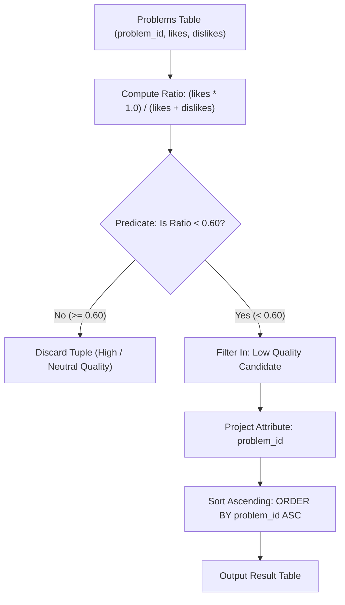

# Guided Example: Low-Quality Problems

## 1. Concrete Problem Restatement & Input Data

We are given a relational database table named `Problems` that records community feedback for algorithmic coding challenges. The schema is defined as:
- `problem_id` (Integer, Primary Key): Unique numerical identifier for each challenge.
- `likes` (Integer): Total count of positive votes awarded by users.
- `dislikes` (Integer): Total count of negative votes awarded by users.

A problem is formally classified as **low quality** if its positive approval ratio is **strictly less than 60%** ($0.60$) of the total votes cast for that problem:
$$\text{Approval Ratio} = \frac{\text{likes}}{\text{likes} + \text{dislikes}} < 0.60$$

Our task is to return the `problem_id` of every low-quality problem, sorted in **ascending numerical order** by `problem_id`. 

Crucially, an approval ratio of exactly $60\%$ ($0.60$) does not qualify as low quality. The returned output must project exclusively the single column `problem_id`.

### Sample Input Dataset

Consider the following table instance:

| `problem_id` | `likes` | `dislikes` |
|---|---|---|
| $6$ | $1290$ | $425$ |
| $11$ | $2677$ | $8659$ |
| $1$ | $4446$ | $2760$ |
| $7$ | $8569$ | $6086$ |
| $13$ | $2050$ | $4164$ |
| $10$ | $9002$ | $7446$ |

We also contrast this with the exact boundary case:
$$\text{problem\_id} = 99, \quad \text{likes} = 3, \quad \text{dislikes} = 2$$

---

## 2. Conceptual Walkthrough & Visual Intuition

The relational query requires evaluating a row-level mathematical predicate followed by projection and ordering.

### Mathematical Formulation & Exact Integer Equivalence
The continuous predicate is:
$$\frac{\text{likes}}{\text{likes} + \text{dislikes}} < \frac{3}{5}$$

Multiplying both sides by the strictly positive denominator $5 \cdot (\text{likes} + \text{dislikes})$ clears all fractions:
$$5 \cdot \text{likes} < 3 \cdot (\text{likes} + \text{dislikes})$$
$$5 \cdot \text{likes} < 3 \cdot \text{likes} + 3 \cdot \text{dislikes}$$
$$2 \cdot \text{likes} < 3 \cdot \text{dislikes}$$

This transformation provides significant numerical advantages:
1. **Zero Floating-Point Inaccuracy**: Eliminates rounding errors inherent in IEEE 754 floating-point representations.
2. **Zero-Division Resilience**: Evaluates safely without explicit denominator zero-checks when vote totals are positive.
3. **Exact Boundary Discrimination**: Cleanly separates numbers that equal $0.60$ from numbers strictly below $0.60$.

### Relational Pipeline Stages
1. **Row Selection ($\sigma$)**: Filter tuples satisfying $\frac{\text{likes} \cdot 1.0}{\text{likes} + \text{dislikes}} < 0.60$ (or equivalently $2 \cdot \text{likes} < 3 \cdot \text{dislikes}$).
2. **Column Projection ($\pi$)**: Retain exclusively the `problem_id` attribute.
3. **Sorting ($\tau$)**: Order qualifying identifiers in ascending numerical sequence $\text{ORDER BY } \text{problem\_id ASC}$.

---

## 3. Step-by-Step State Progression Table

Let us trace each problem in the primary sample table:

| `problem_id` | `likes` | `dislikes` | Total Votes $\text{likes} + \text{dislikes}$ | Floating Approval $\frac{\text{likes}}{\text{total}}$ | Cross-Multiplication $2 \cdot \text{likes} \text{ vs } 3 \cdot \text{dislikes}$ | Strictly $< 0.60$? | Qualification Status |
|---|---|---|---|---|---|---|---|
| $6$ | $1290$ | $425$ | $1715$ | $\approx 0.7522$ ($75.2\%$) | $2580 < 1275 \implies \text{False}$ | No | Discarded |
| $11$ | $2677$ | $8659$ | $11336$ | $\approx 0.2361$ ($23.6\%$) | $5354 < 25977 \implies \text{True}$ | **Yes** | **Qualifies** |
| $1$ | $4446$ | $2760$ | $7206$ | $\approx 0.6170$ ($61.7\%$) | $8892 < 8280 \implies \text{False}$ | No | Discarded |
| $7$ | $8569$ | $6086$ | $14655$ | $\approx 0.5847$ ($58.5\%$) | $17138 < 18258 \implies \text{True}$ | **Yes** | **Qualifies** |
| $13$ | $2050$ | $4164$ | $6214$ | $\approx 0.3299$ ($33.0\%$) | $4100 < 12492 \implies \text{True}$ | **Yes** | **Qualifies** |
| $10$ | $9002$ | $7446$ | $16448$ | $\approx 0.5473$ ($54.7\%$) | $18004 < 22338 \implies \text{True}$ | **Yes** | **Qualifies** |

The set of qualifying problem IDs is $\{11, 7, 13, 10\}$.

### Sorting Phase
Ordering the qualifying identifiers in ascending numerical sequence produces the final table:

| Rank | `problem_id` |
|---|---|
| $1$ | $7$ |
| $2$ | $10$ |
| $3$ | $11$ |
| $4$ | $13$ |

---

## 4. Key Transition Dynamics & Boundary Handling

Evaluating threshold boundaries clarifies the strict inequality requirement:

1. **Exact 60% Boundary**:
   - Consider a problem with $\text{likes} = 3, \text{dislikes} = 2$.
   - Total votes: $3 + 2 = 5$.
   - Approval ratio: $3 / 5 = 0.60$ ($60\%$).
   - The predicate requires ratio $< 0.60$. Since $0.60 < 0.60$ evaluates to false ($2 \cdot 3 < 3 \cdot 2 \iff 6 < 6$ is false), this problem is strictly excluded.
2. **Integer Truncation Hazard in SQL Engines**:
   - In standard SQL engines (such as PostgreSQL or SQLite), dividing two integers ($\text{likes} / (\text{likes} + \text{dislikes})$) performs integer division, which truncates any ratio between $0$ and $1$ to $0$.
   - To prevent unintended truncation, either multiply the numerator by $1.0$ ($\text{likes} \cdot 1.0 / (\dots)$) or cast to a numeric type, or employ the cross-multiplication form $2 \cdot \text{likes} < 3 \cdot \text{dislikes}$.
3. **Ascending Output Guarantee**:
   - SQL relations are intrinsically unordered multisets. An explicit `ORDER BY problem_id` is mandatory to satisfy the contract.

| Scenario | Likes | Dislikes | Total Votes | Exact Ratio | Evaluated Condition | Final Result |
|---|---|---|---|---|---|---|
| Above Threshold | $90$ | $10$ | $100$ | $0.90$ | $0.90 < 0.60$ is False | Excluded |
| Exact Threshold | $60$ | $40$ | $100$ | $0.60$ | $0.60 < 0.60$ is False | Excluded |
| Borderline Low | $59$ | $41$ | $100$ | $0.59$ | $0.59 < 0.60$ is True | **Included** |
| High Dislike Ratio | $1$ | $9$ | $10$ | $0.10$ | $0.10 < 0.60$ is True | **Included** |

---

## 5. Algorithmic Correctness & Soundness

### Mathematical Equivalence of Predicates
Let $L \ge 0$ and $D \ge 0$ with $L + D > 0$.
The problem definition specifies qualification if and only if $\frac{L}{L + D} < 0.60 = \frac{3}{5}$.
Because $L + D > 0$, multiplying both sides by $5(L + D)$ preserves the direction of inequality:
$$5L < 3(L + D) \iff 5L < 3L + 3D \iff 2L < 3D$$
Both expressions evaluate to identical truth values for all non-negative integers where total votes are non-zero.

### Relational Algebra Soundness
The formal relational algebra query is:
$$\tau_{\text{problem\_id} \uparrow} \left( \pi_{\text{problem\_id}} \left( \sigma_{\frac{\text{likes} \cdot 1.0}{\text{likes} + \text{dislikes}} < 0.60} (\text{Problems}) \right) \right)$$
1. The selection operator $\sigma$ filters every tuple in $\text{Problems}$ that satisfies the low-quality definition, admitting zero false positives and zero false negatives.
2. The projection operator $\pi$ strips extraneous vote count attributes, conforming to the single-column specification.
3. The sorting operator $\tau$ arranges the remaining records by primary key in ascending order.
This guarantees exact semantic fidelity to the problem specification.

---

## 6. Edge Cases & Common Pitfalls

1. **Integer Floor Division Trap**: Evaluating `likes / (likes + dislikes) < 0.6` without type casting evaluates integer division: if $\text{likes} < \text{total}$, the integer quotient is $0$, which is always $< 0.60$. This would incorrectly classify *every* problem with at least one dislike as low quality!
2. **Inclusive Inequality Error ($\le$ vs $<$)**: Using $\le 0.60$ includes problems with exactly $60\%$ approval, violating the strict requirement "strictly less than 60%".
3. **Empty Qualifying Set**: If all problems maintain high approval ratings, the query must cleanly return an empty relation with column header `problem_id`, without producing errors.
4. **Primary Key Sorting**: Forgetting `ORDER BY problem_id` produces non-deterministic physical ordering that fails verification gates.

---

## 7. Complexity Analysis

### Time Complexity
- **Table Scan**: The database engine performs a sequential scan over all $P$ rows of `Problems`, evaluating the arithmetic predicate in $\mathcal{O}(1)$ time per row. Total scan time is $\mathcal{O}(P)$.
- **Sorting Filtered Rows**: If $K$ rows qualify ($K \le P$), sorting the result by `problem_id` takes $\mathcal{O}(K \log K)$ time. If an index exists on `problem_id`, an index scan can retrieve rows in pre-sorted order in $\mathcal{O}(P)$ time.
- **Total Time Complexity**: $\mathcal{O}(P + K \log K)$, which is bounded by $\mathcal{O}(P \log P)$ and executes in milliseconds for typical table sizes.

### Space Complexity
- **Intermediate Result Set**: The query buffers at most $K$ qualifying `problem_id` values prior to returning the result set.
- **Auxiliary Memory**: $\mathcal{O}(K)$ space for the output buffer, where $K \le P$.
- **Total Auxiliary Space**: $\mathcal{O}(P)$ in the worst-case scenario where all problems qualify.
