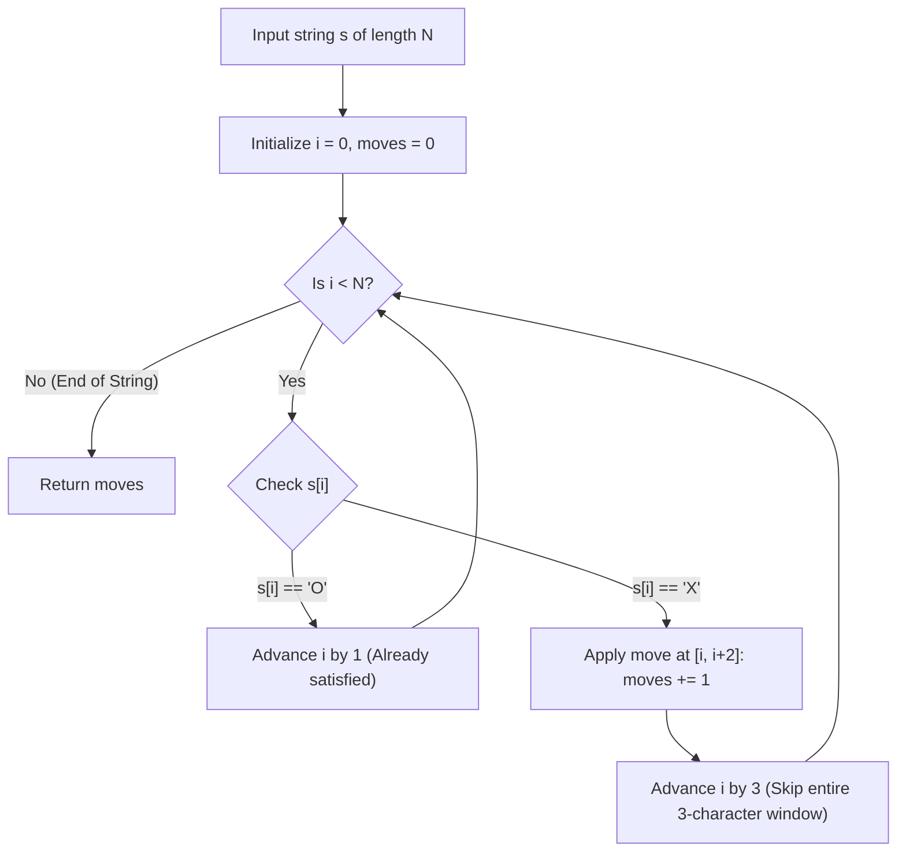

# Guided Example: Minimum Moves to Convert String

## 1. Concrete Problem Restatement & Input Data

We are given a string $s$ of length $N$ consisting exclusively of the characters `'X'` and `'O'`. In a single move, we can select any three consecutive characters and convert all of them into `'O'`. Any character within the selected window that is already `'O'` remains `'O'`.

Our goal is to determine the minimum number of length-three conversion moves required to eliminate every occurrence of `'X'` from the string, resulting in an all-`'O'` string.

Moves may overlap, and a move is permitted to extend over positions that are already `'O'` if doing so allows it to cover an unconverted `'X'`.

### Sample Input Dataset

Consider the representative configuration:
$$s = \text{"XXOX"}$$

We contrast this with a fully unconverted trio:
$$s_{\text{trio}} = \text{"XXX"}$$
and an already satisfied string:
$$s_{\text{clean}} = \text{"OOOO"}$$

---

## 2. Conceptual Walkthrough & Visual Intuition

Consider scanning the string from left to right using a pointer $i$.
- If $s[i] == \text{'O'}$, position $i$ is already in the target state. We simply increment $i \leftarrow i + 1$.
- If $s[i] == \text{'X'}$, position $i$ is the leftmost unconverted character remaining in the string. Because all positions prior to $i$ are already `'O'`, some conversion move **must** cover index $i$.

A valid length-three window covering index $i$ must be chosen from:
1. Window $[i - 2, i]$
2. Window $[i - 1, i + 1]$
3. Window $[i, i + 2]$

Notice that any characters before index $i$ are already `'O'`. Covering them provides zero new progress towards eliminating `'X'`s. By choosing window $[i, i + 2]$, we satisfy the obligation to eliminate $s[i]$ while extending coverage as far to the right as mathematically possible (up to index $i + 2$).

By the greedy-choice property, aligning the left boundary of the conversion window with the first unsatisfied `'X'` dominates all other window placements. Once window $[i, i + 2]$ is applied, all characters at indices $i, i + 1$, and $i + 2$ become `'O'`. We can therefore safely jump the pointer past the entire window to $i + 3$.

---

## 3. Step-by-Step State Progression Table

Let us trace the primary sample $s = \text{"XXOX"}$ ($N = 4$).
Initial state: $i = 0, \text{moves} = 0$.

| Step Pointer $i$ | Character $s[i]$ | Condition Check | Greedy Action Taken | Converted Window Span | Effective String Transformation | Updated Moves | Next Pointer $i$ | Rationale |
|---|---|---|---|---|---|---|---|---|
| $0$ | `'X'` | Leftmost `'X'` detected | Place 3-character window starting at $0$ | $[0, 2]$ | `"XXO..." \to "OOO..."` | $0 + 1 = 1$ | $0 + 3 = 3$ | Covers indices $0, 1, 2$ simultaneously |
| $3$ | `'X'` | Unconverted `'X'` detected | Place 3-character window starting at $3$ | $[3, 5]$ (clamped to $[3, 3]$) | `"...X" \to "...O"` | $1 + 1 = 2$ | $3 + 3 = 6$ | Covers final index $3$ |
| $6$ | Out of Bounds | $i \ge N$ ($6 \ge 4$) | Terminate traversal | N/A | Fully converted: `"OOOO"` | $2$ | Done | Entire string is `'O'` |

Total minimum moves required: $2$.

Now, let us contrast this with a longer alternating pattern $s = \text{"OXOXOX"}$ ($N = 6$):

| Pointer $i$ | Character $s[i]$ | Action | Moves | Next $i$ | Substring Addressed |
|---|---|---|---|---|---|
| $0$ | `'O'` | Skip `'O'` | $0$ | $1$ | Prefix `"O"` already valid |
| $1$ | `'X'` | Convert window $[1, 3]$ | $1$ | $4$ | Converts `"XOX"` to `"OOO"` |
| $4$ | `'O'` | Skip `'O'` | $1$ | $5$ | Index $4$ was already `'O'` |
| $5$ | `'X'` | Convert window $[5, 7]$ | $2$ | $8$ | Converts final `'X'` at index $5$ |

Total moves: $2$.

---

## 4. Key Transition Dynamics & Boundary Handling

The transition behavior underscores why greedy alignment guarantees optimal efficiency:

1. **Skipping Irrelevant Characters**: When a window $[i, i + 2]$ is placed, indices $i + 1$ and $i + 2$ are converted to `'O'` regardless of whether they were originally `'X'` or `'O'`. Advancing directly to $i + 3$ ensures we never redundantly evaluate positions already covered by the active window.
2. **String End Clamping**: When an `'X'` appears near the very end of the string (such as at index $N - 1$), placing a window of length $3$ conceptually extends beyond the string boundary. Because the problem allows selecting any $3$ consecutive indices within the board, or equivalently converting the remaining suffix of length $\le 3$, exactly $1$ move suffices to extinguish all remaining `'X'`s in that final segment.
3. **No Retroactive Effect**: Because moves only convert `'X' \to \text{'O'}` and never convert `'O' \to \text{'X'}`, prior decisions can never invalidate earlier converted regions.

| Input String Pattern | Length $N$ | Windows Chosen | Moves Used | Operational Insight |
|---|---|---|---|---|
| `"XXX"` | $3$ | $[0, 2]$ | $1$ | Single window extinguishes all three `'X'`s |
| `"XXOX"` | $4$ | $[0, 2]$ and $[3, 5]$ | $2$ | Internal `'O'` at index $2$ is subsumed harmlessly |
| `"OOOO"` | $4$ | None | $0$ | All characters skip without incrementing moves |
| `"XOOOOX"` | $6$ | $[0, 2]$ and $[5, 7]$ | $2$ | Intermediate `'O'`s cleanly bypassed via single increments |

---

## 5. Algorithmic Correctness & Soundness

### Greedy Choice Property
Let $i$ be the smallest index such that $s[i] == \text{'X'}$. Any valid set of operations must include at least one operation whose window covers index $i$.
Let $\mathcal{W} = [a, a + 2]$ be any window covering $i$, which implies $a \le i \le a + 2$.
If we shift $\mathcal{W}$ rightward to $\mathcal{W}^* = [i, i + 2]$:
- Index $i$ remains covered because $i$ is the left endpoint of $\mathcal{W}^*$.
- Any index $j < i$ was already `'O'`, so losing coverage on $j < i$ causes zero deficit.
- The right endpoint of $\mathcal{W}^*$ is $i + 2 \ge a + 2$, which covers at least as many future positions to the right as $\mathcal{W}$.
Thus, replacing $\mathcal{W}$ with $[i, i + 2]$ preserves feasibility without increasing the total move count. An optimal solution containing $[i, i + 2]$ always exists.

### Optimal Substructure
After applying the move at $[i, i + 2]$, the prefix $s[0 \dots i + 2]$ consists entirely of `'O'`s. The remaining problem is strictly equivalent to solving the identical subproblem on the suffix $s[i + 3 \dots N - 1]$. By mathematical induction on the string length, the greedy strategy achieves the global minimum number of moves.

---

## 6. Edge Cases & Common Pitfalls

1. **Zero Moves on Clean Strings**: If the string contains no `'X'`s, the pointer simply increments through all characters, cleanly returning $0$ moves without deploying unnecessary windows.
2. **Subsumed `'O'`s**: Some implementations mistakenly try to avoid placing windows over existing `'O'`s. The rules explicitly permit converting characters that are already `'O'`. If an `'X'` is followed by an `'O'` and then an `'X'` (e.g. `"XOX"`), covering the whole block in $1$ move is far superior to trying to treat them separately.
3. **Index Pointer Leaps**: Forgetting to advance $i$ by $3$ upon encountering `'X'` and only advancing by $1$ would result in overcounting moves, treating each `'X'` in a consecutive block as a separate move.

---

## 7. Complexity Analysis

### Time Complexity
- **Pointer Advancement**: In each iteration of the loop, the pointer $i$ advances by either $1$ (if $s[i] == \text{'O'}$) or $3$ (if $s[i] == \text{'X'}$).
- **Linear Pass**: The index $i$ increases strictly monotonically and exceeds $N$ in at most $N$ iterations.
- **Total Time Complexity**: $\mathcal{O}(N)$, which is optimal since every character must be inspected at least once.

### Space Complexity
- **Scalar State**: The algorithm requires only two integer variables: the loop index $i$ and the accumulator $\text{moves}$.
- **No Auxiliary Arrays**: The string is scanned directly in-place without memory allocation.
- **Total Auxiliary Space**: $\mathcal{O}(1)$, consuming minimal constant extra space.
