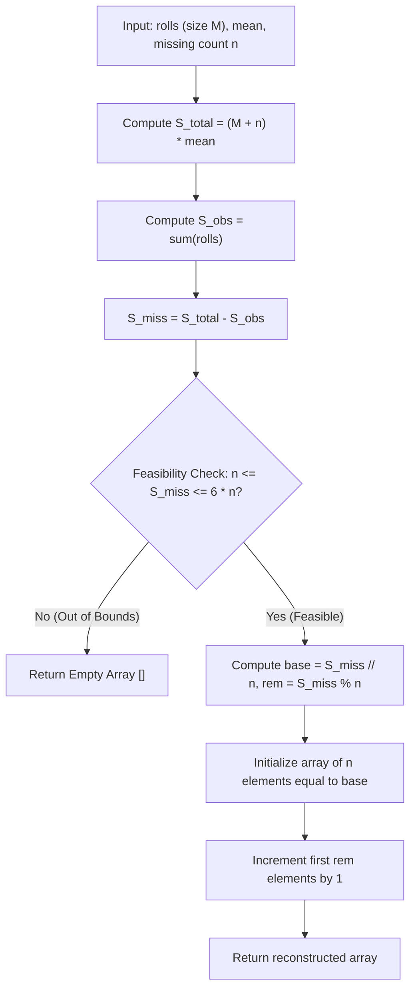

# Guided Example: Find Missing Observations

## 1. Concrete Problem Restatement & Input Data

We are given a record of $M$ observations from a sequence of $M + N$ rolls of a standard six-sided die, stored in an array $\text{rolls}$. Each roll outcome is an integer in the inclusive range $[1, 6]$. The remaining $N$ roll outcomes were unrecorded and are missing.

We are also provided an integer $\text{mean}$ representing the required arithmetic mean across all $M + N$ total rolls:
$$\frac{\sum_{i=1}^M \text{rolls}[i] + \sum_{j=1}^N x_j}{M + N} = \text{mean}$$
where each missing roll $x_j \in \{1, 2, 3, 4, 5, 6\}$.

Our objective is to reconstruct any valid sequence $[x_1, x_2, \dots, x_N]$ of length $N$ whose inclusion yields the exact target mean. If no valid combination of six-sided die values can produce the required sum, we must return an empty list `[]`.

### Sample Input Dataset

Consider the representative configuration:
$$\text{rolls} = [3, 2, 4, 3], \quad \text{mean} = 4, \quad n = 2$$

We also examine the uneven remainder distribution:
$$\text{rolls}_{\text{rem}} = [1, 5, 6], \quad \text{mean} = 3, \quad n = 4$$
and the mathematically impossible target:
$$\text{rolls}_{\text{imp}} = [1, 2, 3, 4], \quad \text{mean} = 6, \quad n = 4$$

---

## 2. Conceptual Walkthrough & Visual Intuition

The total sum required across all $M + N$ rolls is determined by multiplying the total roll count by the target mean:
$$S_{\text{total}} = (M + N) \times \text{mean}$$

Summing the observed rolls gives:
$$S_{\text{obs}} = \sum_{r \in \text{rolls}} r$$

The remaining sum that must be contributed exclusively by the $N$ missing observations is:
$$S_{\text{miss}} = S_{\text{total}} - S_{\text{obs}}$$

### Feasibility Interval Check
Because every missing roll $x_j$ must satisfy $1 \le x_j \le 6$:
- The minimum achievable sum of $N$ dice is $N \times 1 = N$.
- The maximum achievable sum of $N$ dice is $N \times 6 = 6N$.

Therefore, a valid reconstruction exists if and only if:
$$N \le S_{\text{miss}} \le 6N$$
If $S_{\text{miss}} < N$ or $S_{\text{miss}} > 6N$, we immediately conclude that reconstruction is impossible and return `[]`.

### Uniform Remainder Partitioning
When $S_{\text{miss}}$ falls within $[N, 6N]$, we distribute the sum as uniformly as possible among the $N$ dice:
1. Compute the base quotient $q = \lfloor S_{\text{miss}} / N \rfloor$.
2. Compute the residual remainder $r = S_{\text{miss}} \pmod N$.
3. Allocate $q + 1$ to the first $r$ dice, and allocate $q$ to the remaining $N - r$ dice.

Since $1 \le q \le 6$, every assigned value is guaranteed to remain a legal die face in $[1, 6]$.

---

## 3. Step-by-Step State Progression Table

Let us trace $\text{rolls} = [3, 2, 4, 3]$ with $\text{mean} = 4$ and $n = 2$.
Here $M = 4, N = 2$.

### Stage 1: Sum Derivation & Feasibility

| Parameter | Formula | Calculated Value | Interpretation |
|---|---|---|---|
| Total Rolls | $M + N$ | $4 + 2 = 6$ | Full experiment size |
| Total Sum Target | $(M + N) \times \text{mean}$ | $6 \times 4 = 24$ | Combined target sum |
| Observed Sum | $\sum \text{rolls}$ | $3 + 2 + 4 + 3 = 12$ | Points already recorded |
| Required Missing Sum | $S_{\text{total}} - S_{\text{obs}}$ | $24 - 12 = 12$ | Sum needed from $2$ missing rolls |
| Minimum Feasible Sum | $N \times 1$ | $2 \times 1 = 2$ | All ones |
| Maximum Feasible Sum | $N \times 6$ | $2 \times 6 = 12$ | All sixes |
| Feasibility Status | $2 \le 12 \le 12$ | **Valid** | Exactly matches theoretical upper bound |

### Stage 2: Distribution to $N = 2$ Dice
- Quotient: $q = \lfloor 12 / 2 \rfloor = 6$.
- Remainder: $r = 12 \pmod 2 = 0$.
- Reconstructed values: $[6, 6]$.

---

Now, let us trace the remainder case: $\text{rolls}_{\text{rem}} = [1, 5, 6]$ with $\text{mean} = 3$ and $n = 4$.
$M = 3, N = 4 \implies M + N = 7$.

| Stage | Operation | Value | Context |
|---|---|---|---|
| Target Total | $7 \times 3$ | $21$ | Total points |
| Observed Sum | $1 + 5 + 6$ | $12$ | Points in hand |
| Missing Sum $S_{\text{miss}}$ | $21 - 12$ | $9$ | Target for $4$ dice |
| Bounds Check | $4 \le 9 \le 24$ | **Valid** | In range $[4, 24]$ |
| Quotient $q$ | $\lfloor 9 / 4 \rfloor$ | $2$ | Base face value |
| Remainder $r$ | $9 \pmod 4$ | $1$ | Surplus to allocate |
| Distribution | $1$ die gets $2 + 1 = 3$ $3$ dice get $2$ | `[3, 2, 2, 2]` | Sum: $3 + 2 + 2 + 2 = 9$ |

Verification: Total rolls $= [1, 5, 6, 3, 2, 2, 2]$. Sum $= 21$. Mean $= 21 / 7 = 3$.

---

## 4. Key Transition Dynamics & Boundary Handling

The transition behavior clarifies how boundary constraints dictate outcomes:

1. **Extreme Capacity Saturation**:
   - In our primary sample, $S_{\text{miss}} = 12$ on $N = 2$. This requires the maximal face value on every single die: $[6, 6]$. Any smaller mean would be feasible, but an even higher mean would exceed capacity.
2. **Deficit Violations ($S_{\text{miss}} < N$)**:
   - If observed rolls have an unexpectedly high sum such that $S_{\text{total}} - S_{\text{obs}} < N$, the required missing sum would demand face values $< 1$, which do not exist on a die.
3. **Surplus Violations ($S_{\text{miss}} > 6N$)**:
   - In $\text{rolls}_{\text{imp}} = [1, 2, 3, 4]$ with $\text{mean} = 6$ and $n = 4$:
     $S_{\text{total}} = 8 \times 6 = 48$, while $S_{\text{obs}} = 10$.
     $S_{\text{miss}} = 48 - 10 = 38$.
     Four dice can yield at most $4 \times 6 = 24 < 38$. Reconstruction returns `[]`.

| Scenario | $M, N$ | Observed Rolls | Target Mean | Missing Sum $S_{\text{miss}}$ | Capacity Range $[N, 6N]$ | Reconstruction Result |
|---|---|---|---|---|---|---|
| Exact Upper Bound | $4, 2$ | `[3, 2, 4, 3]` | $4$ | $12$ | $[2, 12]$ | `[6, 6]` |
| Uneven Remainder | $3, 4$ | `[1, 5, 6]` | $3$ | $9$ | $[4, 24]$ | `[3, 2, 2, 2]` |
| Impossible High | $4, 4$ | `[1, 2, 3, 4]` | $6$ | $38$ | $[4, 24]$ | `[]` |
| Exact Lower Bound | $2, 3$ | `[6, 6]` | $3$ | $3$ | $[3, 18]$ | `[1, 1, 1]` |

---

## 5. Algorithmic Correctness & Soundness

### Necessary and Sufficient Condition for Existence
Let $x_1, \dots, x_N \in \{1, \dots, 6\}$ be the missing observations.
Summing the individual inequalities $1 \le x_j \le 6$ over all $j \in [1, N]$ yields:
$$\sum_{j=1}^N 1 \le \sum_{j=1}^N x_j \le \sum_{j=1}^N 6 \iff N \le S_{\text{miss}} \le 6N$$
Thus, $N \le S_{\text{miss}} \le 6N$ is a mathematically necessary condition.

### Constructive Proof of Sufficiency
If $N \le S_{\text{miss}} \le 6N$, we partition $S_{\text{miss}} = N \cdot q + r$ via the Euclidean division algorithm with $0 \le r < N$.
- Because $S_{\text{miss}} \ge N$, $q = \lfloor S_{\text{miss}} / N \rfloor \ge 1$.
- Because $S_{\text{miss}} \le 6N$, $q \le 6$. Furthermore, if $q = 6$, then $N \cdot 6 + r \le 6N \implies r = 0$.
Hence, when $r > 0$, we have $q \le 5$, which guarantees $q + 1 \le 6$.
Therefore, assigning $x_j = q + 1$ for $1 \le j \le r$ and $x_j = q$ for $r + 1 \le j \le N$ ensures:
$$1 \le x_j \le 6 \quad \text{for all } j \in [1, N]$$
and the sum satisfies:
$$\sum_{j=1}^N x_j = r \cdot (q + 1) + (N - r) \cdot q = N \cdot q + r = S_{\text{miss}}$$
This constructively proves that the uniform distribution always produces a valid combination.

---

## 6. Edge Cases & Common Pitfalls

1. **Floating-Point Imprecision**: Never compute means using floating-point division and then attempt to round. Operating entirely in exact integer multiplication ($S_{\text{total}} = (M + N) \times \text{mean}$) prevents roundoff error.
2. **Negative Missing Sum**: If observed rolls alone exceed $(M + N) \times \text{mean}$, $S_{\text{miss}}$ is negative, which trivially triggers $S_{\text{miss}} < N$ and returns `[]`.
3. **Remainder Allocation Overflow**: If one were to add the entire remainder $r$ to a single die rather than distributing $1$ to $r$ distinct dice, that single die could exceed $6$ (e.g. $q = 5, r = 3 \implies 5 + 3 = 8 > 6$). Distributing $+1$ to each of $r$ separate dice guarantees no value exceeds $q + 1 \le 6$.

---

## 7. Complexity Analysis

### Time Complexity
- **Observed Rolls Summation**: Summing the $M$ elements in $\text{rolls}$ takes $\mathcal{O}(M)$ time.
- **Feasibility Evaluation**: Basic arithmetic comparisons take $\mathcal{O}(1)$ time.
- **Array Generation**: Constructing and initializing the list of $N$ elements and incrementing $r$ positions takes $\mathcal{O}(N)$ time.
- **Total Time Complexity**: $\mathcal{O}(M + N)$, which is optimal because reading the input takes $\mathcal{O}(M)$ and generating the output requires $\mathcal{O}(N)$ writes.

### Space Complexity
- **Output Container**: The returned list contains $N$ integers, occupying $\mathcal{O}(N)$ space.
- **Auxiliary Variables**: Only a few scalar integers are retained ($M, S_{\text{total}}, S_{\text{obs}}, S_{\text{miss}}, q, r$).
- **Total Auxiliary Space**: $\mathcal{O}(1)$ auxiliary memory excluding the returned array.
