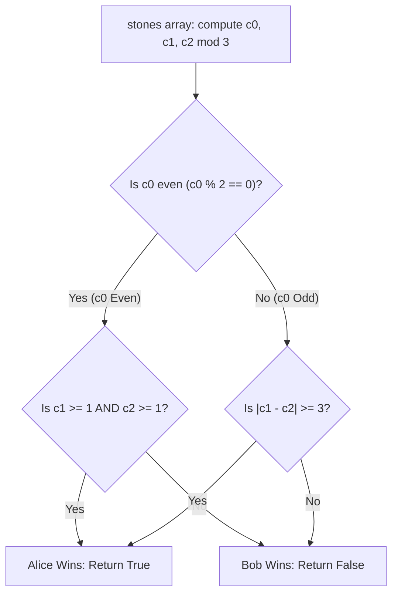

# Guided Example: Stone Game IX

## 1. Concrete Problem Restatement & Input Data

Alice and Bob play a sequential, turn-based game using a collection of $N$ stones, where each stone carries a positive integer value $\text{stones}[i]$. Alice always plays first.

The game is governed by the following rules:
1. **Turn Action**: On their turn, the active player removes exactly one stone from the pool and adds its value to the cumulative running sum.
2. **Immediate Loss Condition**: If, after a player's removal, the running cumulative sum is divisible by $3$ ($S \equiv 0 \pmod 3$), that player **immediately loses** the game, and the other player wins.
3. **Stone Exhaustion Rule**: If all stones are removed without either player ever triggering a sum divisible by $3$, the game terminates and **Bob is declared the winner** automatically (even if Alice would have moved next).

Assuming both players play with perfect game-theoretic rationality (each maximizing their own chance of winning), determine whether Alice has a forced winning strategy.

### Sample Input Dataset

Consider the two-stone configuration:
$$\text{stones} = [2, 1]$$

We contrast this with a single stone:
$$\text{stones}_{\text{single}} = [2]$$
and a balanced five-stone pool:
$$\text{stones}_{\text{mixed}} = [5, 1, 2, 4, 3]$$

---

## 2. Conceptual Walkthrough & Visual Intuition

Because the loss condition is governed entirely by divisibility by $3$, the exact magnitudes of the stones are irrelevant; only their residue modulo $3$ matters:
- Type $0$: $\text{value} \equiv 0 \pmod 3$ ($c_0$ stones)
- Type $1$: $\text{value} \equiv 1 \pmod 3$ ($c_1$ stones)
- Type $2$: $\text{value} \equiv 2 \pmod 3$ ($c_2$ stones)

### The First Move Restriction
The cumulative sum begins at $0$. If Alice chooses a Type $0$ stone on turn $1$, the sum becomes $0 \equiv 0 \pmod 3$, causing Alice to lose on the opening move. Therefore, Alice is strictly forced to open with either a **Type $1$** stone or a **Type $2$** stone.

### The Alternating Sequence of Non-Zero Stones
Suppose Alice opens with a Type $1$ stone (running sum $\equiv 1$):
1. Bob cannot pick a Type $2$ stone because $1 + 2 = 3 \equiv 0 \pmod 3$ (immediate loss). Bob must pick either a Type $0$ stone (keeping sum $\equiv 1$) or a Type $1$ stone (advancing sum to $1 + 1 = 2$).
2. Once the sum reaches $2$, the next player cannot pick a Type $1$ stone ($2 + 1 = 3 \equiv 0$). They must pick a Type $2$ stone (advancing sum to $2 + 2 = 4 \equiv 1$).

Ignoring Type $0$ stones, opening with $1$ forces the non-zero sequence to strictly alternate:
$$1 \to 1 \to 2 \to 1 \to 2 \to 1 \to 2 \dots$$
Symmetrically, opening with $2$ forces:
$$2 \to 2 \to 1 \to 2 \to 1 \to 2 \to 1 \dots$$

### The Role of Type 0 Stones as Parity Inverters
A Type $0$ stone does not change the sum modulo $3$. Instead, playing a Type $0$ stone acts as a "pass" that hands the turn to the opponent while keeping the exact same sum modulo $3$.
- **When $c_0$ is Even**: The effect of Type $0$ stones neutralizes. Alice wins if and only if she can initiate a game where non-zero stones force Bob into a corner:
  $$\text{Alice Wins} \iff c_1 \ge 1 \quad \text{and} \quad c_2 \ge 1$$
- **When $c_0$ is Odd**: The odd number of "passes" inverts turn parity. Alice wins if and only if the count of one non-zero type sufficiently dominates the other:
  $$\text{Alice Wins} \iff |c_1 - c_2| \ge 3$$

---

## 3. Step-by-Step State Progression Table

Let us trace each representative sample:

### Case A: $\text{stones} = [2, 1]$
Residue counts: $c_0 = 0$ (even), $c_1 = 1$, $c_2 = 1$.

| Turn | Player | Action | Running Sum $S$ | Residue $S \pmod 3$ | Remaining Pool $(c_0, c_1, c_2)$ | Consequence |
|---|---|---|---|---|---|---|
| $1$ | Alice | Picks $1$ (Type 1) | $1$ | $1$ | $(0, 0, 1)$ | Safe move ($1 \not\equiv 0$) |
| $2$ | Bob | Forced to pick remaining $2$ (Type 2) | $1 + 2 = 3$ | $0$ | $(0, 0, 0)$ | **$3 \equiv 0 \pmod 3$ triggered! Bob Loses!** |

Alice wins. Output: `True`.

---

### Case B: $\text{stones}_{\text{single}} = [2]$
Residue counts: $c_0 = 0$, $c_1 = 0$, $c_2 = 1$.

| Turn | Player | Action | Running Sum $S$ | Residue $S \pmod 3$ | Remaining Pool | Consequence |
|---|---|---|---|---|---|---|
| $1$ | Alice | Picks $2$ (Type 2) | $2$ | $2$ | $(0, 0, 0)$ | Safe move |
| End | Game Over | Pool Exhausted | $2$ | $2$ | $(0, 0, 0)$ | **Exhaustion rule: Bob wins!** |

Alice loses. Output: `False`.

---

### Case C: $\text{stones}_{\text{mixed}} = [5, 1, 2, 4, 3]$
Values mod $3$: $[2, 1, 2, 1, 0]$.
Residue counts: $c_0 = 1$ (odd), $c_1 = 2$, $c_2 = 2$.
Difference: $|c_1 - c_2| = |2 - 2| = 0 < 3$.

| Turn | Player | Candidate Move | Running Residue | Strategy Trajectory |
|---|---|---|---|---|
| $1$ | Alice | Picks $1$ (leaves $c_0=1, c_1=1, c_2=2$) | $1$ | Alice attempts Type 1 line |
| $2$ | Bob | Plays Type $0$ pass (leaves $c_0=0, c_1=1, c_2=2$) | $1$ | Bob inverts turn parity |
| $3$ | Alice | Must play Type $1$ (leaves $c_0=0, c_1=0, c_2=2$) | $2$ | Only legal non-zero choice |
| $4$ | Bob | Plays Type $2$ (leaves $c_0=0, c_1=0, c_2=1$) | $1$ | Safe move |
| $5$ | Alice | Has no legal stone (only Type $2$ remains: $1 + 2 = 3$) | $0$ | **Alice forced to lose!** |

Alice loses under optimal play. Output: `False`.

---

## 4. Key Transition Dynamics & Boundary Handling

The transition dynamics reveal the power of Type $0$ stones and non-zero imbalances:

1. **Parity Neutralization ($c_0$ Even)**:
   - When $c_0$ is even, every time Bob plays a Type $0$ stone, Alice can immediately respond by playing another Type $0$ stone. This completely cancels the turn-inversion effect, leaving the outcome determined strictly by the non-zero duel $c_1$ vs $c_2$.
2. **Parity Inversion ($c_0$ Odd)**:
   - When $c_0$ is odd, Bob holds the tempo advantage. He can use the solitary unmatched Type $0$ stone to force Alice to make the awkward move. Alice can overcome this disadvantage only if she has a surplus of at least $3$ stones ($|c_1 - c_2| \ge 3$).
3. **Symmetric Branching**:
   - If Alice cannot win by opening with $1$, she can explore opening with $2$. Because the game rules are completely symmetric under swapping $1 \leftrightarrow 2$, evaluating both branches is captured concisely by $|c_1 - c_2|$.

| Stone Multiplicities $(c_0, c_1, c_2)$ | $c_0$ Parity | Difference $\lvert c_1 - c_2 \rvert$ | Branch Tested | Winning Player | Game-Theoretic Reason |
|---|---|---|---|---|---|
| $(0, 1, 1)$ | Even | $0$ | Open with $1$ or $2$ | **Alice** | Both types exist; opponent trapped on move 2 |
| $(0, 3, 0)$ | Even | $3$ | Open with $1$ | **Bob** | $c_2 = 0$; Alice exhausts stones, Bob wins by rule 3 |
| $(1, 2, 2)$ | Odd | $0$ | Open with $1$ or $2$ | **Bob** | Odd pass reverses parity; Alice trapped |
| $(1, 4, 1)$ | Odd | $3$ | Open with $1$ | **Alice** | $\lvert 4 - 1 \rvert = 3 \ge 3$; surplus overcomes odd pass |
| $(2, 2, 1)$ | Even | $1$ | Open with $1$ | **Alice** | $c_1 \ge 1, c_2 \ge 1$ with even $c_0$ |

---

## 5. Algorithmic Correctness & Soundness

### Formal Classification Theorem
Under optimal play in Stone Game IX:
1. **If $c_0 \equiv 0 \pmod 2$**:
   Alice wins if and only if $c_1 \ge 1$ and $c_2 \ge 1$.
   *Proof*: Because $c_0$ is even, pairs of Type $0$ stones cancel.
   - If $c_1 = 0$, Alice must start with $2$. The required sequence is $2, 2, 1, 2 \dots$, which demands a Type $1$ stone on move 3. Since $c_1 = 0$, the sequence halts, stones exhaust, and Bob wins.
   - If $c_2 = 0$, symmetrically Alice cannot win.
   - If $c_1 \ge 1$ and $c_2 \ge 1$, Alice starts with the type having more stones (or either if tied). The sequence of required stones alternates. Bob runs out of the required type first, forcing Bob to play the forbidden type (triggering $S \equiv 0$) and lose.

2. **If $c_0 \equiv 1 \pmod 2$**:
   Alice wins if and only if $|c_1 - c_2| \ge 3$.
   *Proof*: The odd Type $0$ stone allows Bob to invert the parity of the non-zero alternating sequence.
   - If Alice opens with $1$, the non-zero sequence required is $1, 1, 2, 1, 2 \dots$.
   - With Bob's parity flip, Alice now occupies the even positions of the alternating run. For Alice to avoid being trapped, she must possess at least $3$ more stones of the majority type than the minority type ($c_1 - c_2 \ge 3$ or $c_2 - c_1 \ge 3$). If $|c_1 - c_2| \le 2$, Bob's parity flip forces Alice to make the illegal move or exhaust the pool.

The classification covers all state spaces and provides exact necessary and sufficient conditions.

---

## 6. Edge Cases & Common Pitfalls

1. **First Move Self-Elimination**: Believing Alice can open with a Type $0$ stone to "pass". The rule states that if the sum is divisible by $3$, the player loses. Since $0 \equiv 0 \pmod 3$, playing $0$ on turn $1$ immediately hands Bob the victory.
2. **Exhaustion Rule Asymmetry**: Forgetting that stone exhaustion awards the game to **Bob**, not Alice. Alice cannot win simply by playing valid moves until stones run out; she must actively force Bob to trigger a multiple of $3$.
3. **Mod 3 Equivalence**: Forgetting to reduce stone values modulo $3$. Values up to $10^4$ behave identically to their remainders in $\{0, 1, 2\}$.

---

## 7. Complexity Analysis

### Time Complexity
- **Residue Counting**: We perform a single linear pass over the $N$ stones in $\text{stones}$, calculating $x \pmod 3$ and populating the three counters $c_0, c_1, c_2$. This takes $\mathcal{O}(N)$ time.
- **Decision Logic**: Evaluating the parity of $c_0$ and the relationship between $c_1$ and $c_2$ takes $\mathcal{O}(1)$ time.
- **Total Time Complexity**: $\mathcal{O}(N)$, which is optimal since every stone must be inspected.

### Space Complexity
- **Residue Counters**: Only three integer counters are maintained ($c_0, c_1, c_2$).
- **No Auxiliary Arrays**: No recursion, memoization tables, or game trees are allocated.
- **Total Auxiliary Space**: $\mathcal{O}(1)$, requiring minimal constant extra memory.
