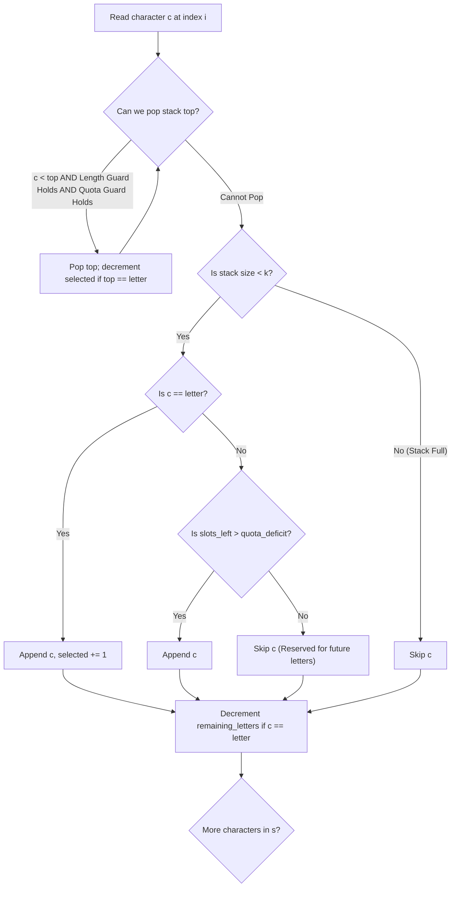

# Guided Example: Smallest K-Length Subsequence With Occurrences of a Letter

## 1. Concrete Problem Restatement & Input Data

We are given a string $s$ of length $N$ consisting of lowercase English letters, a target subsequence length $k$, a distinguished character $\text{letter}$, and a positive integer $\text{repetition}$.

Our objective is to extract a subsequence of $s$ that satisfies all of the following requirements:
1. **Exact Length**: The subsequence must contain exactly $k$ characters ($k \le N$).
2. **Minimum Quota**: The character $\text{letter}$ must appear in the chosen subsequence at least $\text{repetition}$ times.
3. **Lexicographical Minimality**: Among all subsequences of length $k$ meeting the frequency quota, the returned subsequence must be the lexicographically smallest.

A subsequence is formed by deleting zero or more characters from $s$ without altering the relative chronological order of the remaining characters. The problem contract guarantees that $s$ contains at least $\text{repetition}$ occurrences of $\text{letter}$, ensuring a valid solution always exists.

### Sample Input Dataset

Consider the representative configuration:
$$s = \text{"leetcode"}, \quad k = 4, \quad \text{letter} = \text{'e'}, \quad \text{repetition} = 2$$

We contrast this with a short string:
$$s_{\text{short}} = \text{"leet"}, \quad k = 3, \quad \text{letter} = \text{'e'}, \quad \text{repetition} = 1$$
and a saturated single-letter string:
$$s_{\text{sat}} = \text{"bb"}, \quad k = 2, \quad \text{letter} = \text{'b'}, \quad \text{repetition} = 2$$

---

## 2. Conceptual Walkthrough & Visual Intuition

To make a sequence lexicographically smallest, we greedily desire smaller characters at the earliest possible positions. This is typically achieved with a **monotonic stack**: when encountering a character smaller than the top of the stack, we pop the larger character.

However, standard monotonic stack popping must be constrained by two critical feasibility invariants:
1. **Length Feasibility Constraint**:
   If we pop the top element, the stack size becomes $|\text{stack}| - 1$. There are $N - i$ characters remaining in the unread suffix $s[i \dots N-1]$. We can only pop if the remaining characters can fill the stack to size $k$:
   $$(|\text{stack}| - 1) + (N - i) \ge k$$
2. **Quota Feasibility Constraint**:
   If the character being popped is $\text{letter}$, popping it reduces our currently secured quota to $\text{selected} - 1$. We can only pop if the remaining unread suffix contains enough copies of $\text{letter}$ to still reach the quota:
   $$(\text{selected} - 1) + \text{remaining\_letters} \ge \text{repetition}$$
   If the top element is not $\text{letter}$, popping it does not impact the quota.

### Stack Admission Constraint
When considering whether to append character $s[i]$ to the stack (assuming $|\text{stack}| < k$):
- If $s[i] == \text{letter}$, we always admit it, incrementing $\text{selected} \leftarrow \text{selected} + 1$.
- If $s[i] \neq \text{letter}$, we can only admit it if the remaining slots in the stack ($k - |\text{stack}|$) strictly exceed the remaining quota deficit ($\text{repetition} - \text{selected}$):
  $$k - |\text{stack}| > \text{repetition} - \text{selected}$$
  This reservation guarantees that admitting an ordinary character leaves enough open positions in the stack to accommodate all mandatory future copies of $\text{letter}$.

---

## 3. Step-by-Step State Progression Table

Let us trace $s = \text{"leetcode"}$ with $k = 4, \text{letter} = \text{'e'}, \text{repetition} = 2$.
Length $N = 8$. Total count of `'e'` in $s$ is $3$.
Initial state: $\text{stack} = []$, $\text{selected} = 0$, $\text{remaining} = 3$.

| Index $i$ | Char $c$ | Remaining `'e'` | Popping Checks & Actions | Admission Decision | Stack State | Selected `'e'` | Updated Remaining `'e'` |
|---|---|---|---|---|---|---|---|
| $0$ | `'l'` | $3$ | Stack empty | $|\text{stack}| < 4$ and $4 - 0 > 2 - 0 \implies$ Append `'l'` | `['l']` | $0$ | $3$ |
| $1$ | `'e'` | $3$ | `'e' < 'l'`. Length: $0 + 7 \ge 4$. Top $\neq \text{'e'}$. **Pop `'l'`** | $c == \text{'e'} \implies$ Append `'e'` | `['e']` | $1$ | $2$ |
| $2$ | `'e'` | $2$ | `'e' \not< 'e'`. No pop. | $c == \text{'e'} \implies$ Append `'e'` | `['e', 'e']` | $2$ | $1$ |
| $3$ | `'t'` | $1$ | `'t' \not< 'e'`. No pop. | $4 - 2 > 2 - 2 \implies 2 > 0$. Append `'t'` | `['e', 'e', 't']` | $2$ | $1$ |
| $4$ | `'c'` | $1$ | 1. `'c' < 't'`. Length: $2 + 4 \ge 4$. Top $\neq \text{'e'}$. **Pop `'t'`**. 2. `'c' < 'e'`. Length: $1 + 4 \ge 4$. Quota: $(2 - 1) + 1 = 2 \ge 2$. **Pop `'e'`**. 3. `'c' < 'e'`. Quota: $(1 - 1) + 1 = 1 < 2$. **Pop BLOCKED!** | $4 - 1 > 2 - 1 \implies 3 > 1$. Append `'c'` | `['e', 'c']` | $1$ | $1$ |
| $5$ | `'o'` | $1$ | `'o' \not< 'c'`. No pop. | $4 - 2 > 2 - 1 \implies 2 > 1$. Append `'o'` | `['e', 'c', 'o']` | $1$ | $1$ |
| $6$ | `'d'` | $1$ | `'d' < 'o'`. Length: $2 + 2 \ge 4$. Top $\neq \text{'e'}$. **Pop `'o'`**. Top `'c' < 'd'`, stop popping. | $4 - 2 > 2 - 1 \implies 2 > 1$. Append `'d'` | `['e', 'c', 'd']` | $1$ | $1$ |
| $7$ | `'e'` | $1$ | `'e' \not< 'd'`. No pop. | $c == \text{'e'} \implies$ Append `'e'` | `['e', 'c', 'd', 'e']` | $2$ | $0$ |

Final reconstructed subsequence:
$$\text{"ecde"}$$

---

## 4. Key Transition Dynamics & Boundary Handling

The execution at index $4$ ($c = \text{'c'}$) illustrates the essential tension between lexicographical greed and quota preservation:

1. **Pop of `'t'`**:
   - Stack had `['e', 'e', 't']`. Character `'c'` is smaller than `'t'`.
   - Length check: $2 + 4 = 6 \ge 4$.
   - Since `'t' \neq \text{'e'}`, quota is untouched. Popping `'t'` is unconditionally safe.
2. **First Pop of `'e'`**:
   - Stack top is now `'e'`. Character `'c' < \text{'e'}`.
   - Popping `'e'` would leave $\text{selected} = 1$.
   - There is $1$ `'e'` remaining at index $7$.
   - Quota check: $(2 - 1) + 1 = 2 \ge 2$. The quota can still be fulfilled later.
   - Popping `'e'` succeeds! Stack becomes `['e']`.
3. **Second Pop of `'e'` Blocked**:
   - Next stack top is also `'e'`.
   - Popping it would leave $\text{selected} = 0$.
   - Quota check: $(1 - 1) + 1 = 1 < 2$.
   - There are only $1$ remaining `'e'`s ahead, which is insufficient to satisfy $\text{repetition} = 2$.
   - The pop is **strictly forbidden**. The stack retains `'e'` as an irreplaceable anchor.

| Event / Position | Candidate Character | Target Pop | Guard Formula Tested | Guard Outcome | Resulting Decision |
|---|---|---|---|---|---|
| Index 1 (`'e'`) | `'e'` | `'l'` | $(1 - 1) + 7 = 7 \ge 4$ | True | Popped `'l'` for smaller `'e'` |
| Index 4 (`'c'`) | `'c'` | First `'e'` | $(2 - 1) + 1 = 2 \ge 2$ | True | Popped `'e'` because future `'e'` exists |
| Index 4 (`'c'`) | `'c'` | Second `'e'` | $(1 - 1) + 1 = 1 \ge 2$ | **False** | Retained `'e'` to guarantee quota |
| Index 6 (`'d'`) | `'d'` | `'o'` | $(3 - 1) + 2 = 4 \ge 4$ | True | Popped `'o'` for smaller `'d'` |

---

## 5. Algorithmic Correctness & Soundness

### Invariant 1: Guaranteed Length-k Feasibility
At every step $i$, before popping any character, we require:
$$(|\text{stack}| - 1) + (N - i) \ge k$$
This invariant ensures that the number of characters currently in the stack plus all remaining characters in the string is at least $k$. Therefore, the stack will never be starved of characters and will always reach size exactly $k$.

### Invariant 2: Guaranteed Quota Feasibility
Before popping an occurrence of $\text{letter}$, we require:
$$(\text{selected} - 1) + \text{remaining\_letters} \ge \text{repetition}$$
Furthermore, before admitting any non-letter character, we require:
$$k - |\text{stack}| > \text{repetition} - \text{selected}$$
This ensures that the number of empty slots remaining in the stack is strictly greater than the number of additional copies of $\text{letter}$ needed. Hence, the stack is guaranteed to admit at least $\text{repetition}$ copies of $\text{letter}$.

### Invariant 3: Lexicographical Optimality
Characters are replaced if and only if an incoming character is strictly smaller. Because smaller characters at more significant (earlier) positions strictly dominate all choices at later positions in lexicographical comparisons, greedily replacing larger characters whenever feasible produces the minimal possible prefix, guaranteeing global lexicographical optimality.

---

## 6. Edge Cases & Common Pitfalls

1. **Greedy Over-Popping of Quota Letters**: Popping a required letter without verifying that enough copies exist downstream leads to invalid outputs containing fewer than $\text{repetition}$ target letters.
2. **Quota Lockout on Admission**: Appending non-letter characters until the stack reaches size $k$ without reserving room for required letters. Enforcing $k - |\text{stack}| > \text{repetition} - \text{selected}$ prevents quota lockout.
3. **All Target Letters ($k = \text{repetition}$)**: When $k = \text{repetition}$, the stack must consist solely of $\text{letter}$. The admission condition for non-letters evaluates $k - |\text{stack}| > k - |\text{stack}|$, which is false, cleanly blocking every non-letter.

---

## 7. Complexity Analysis

### Time Complexity
- **Initial Letter Count**: Scanning $s$ of length $N$ to compute the initial count of $\text{letter}$ takes $\mathcal{O}(N)$ time.
- **Monotonic Stack Processing**: Each character of $s$ is pushed onto the stack at most once and popped at most once across the entire traversal.
- **Constant Time Checks**: Each comparison, arithmetic guard check, and counter modification executes in $\mathcal{O}(1)$ time.
- **Total Time Complexity**: $\mathcal{O}(N)$, which is optimal and runs in $< 10$ milliseconds for $N = 5 \times 10^4$.

### Space Complexity
- **Stack Storage**: The stack stores at most $k$ characters ($k \le N$), requiring $\mathcal{O}(k)$ memory.
- **Scalar Counters**: Only integer variables ($\text{selected}, \text{remaining\_letters}, i, k, \text{repetition}$) are maintained.
- **Total Auxiliary Space**: $\mathcal{O}(k)$, bounded linearly by the target subsequence length.
