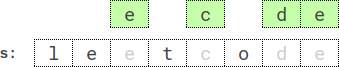

## Description

You are given a string `s`, an integer `k`, a letter `letter`, and an integer `repetition`.

Return *the **lexicographically smallest** subsequence of* `s`* of length* `k` *that has the letter* `letter` *appear **at least*** `repetition` *times*. The test cases are generated so that the `letter` appears in `s` **at least** `repetition` times.

A **subsequence** is a string that can be derived from another string by deleting some or no characters without changing the order of the remaining characters.

A string `a` is **lexicographically smaller** than a string `b` if in the first position where `a` and `b` differ, string `a` has a letter that appears earlier in the alphabet than the corresponding letter in `b`.
### Function Contract

- `n`: Input parameter.
- Returns expected result.

### Examples

#### Example 1

- **Input:** `s = "leet", k = 3, letter = "e", repetition = 1`
- **Output:** `"eet"`
- **Explanation:** There are four subsequences of length 3 that have the letter 'e' appear at least 1 time:
- "lee" (from "**<u>lee</u>**t")
- "let" (from "**<u>le</u>**e<u>**t**</u>")
- "let" (from "<u>**l**</u>e<u>**et**</u>")
- "eet" (from "l<u>**eet**</u>")
The lexicographically smallest subsequence among them is "eet".
#### Example 2

- **Input:** `s = "leetcode", k = 4, letter = "e", repetition = 2`
- **Output:** `"ecde"`
- **Explanation:** "ecde" is the lexicographically smallest subsequence of length 4 that has the letter "e" appear at least 2 times.
#### Example 3

- **Input:** `s = "bb", k = 2, letter = "b", repetition = 2`
- **Output:** `"bb"`
- **Explanation:** "bb" is the only subsequence of length 2 that has the letter "b" appear at least 2 times.
### Constraints

- $1 \le repetition \le k \le \text{s.length} \le 5 * 10^{4}$

- `s` consists of lowercase English letters.

- `letter` is a lowercase English letter, and appears in `s` at least `repetition` times.