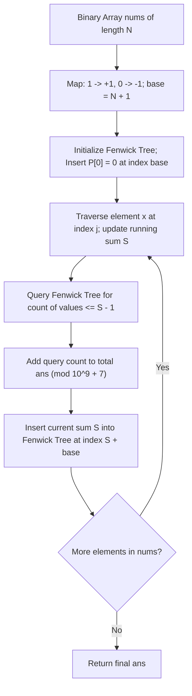

# Guided Example: Count Subarrays With More Ones Than Zeros

## 1. Concrete Problem Restatement & Input Data

We are given a binary array $\text{nums}$ of length $N$ where each element is either $0$ or $1$. A contiguous subarray $\text{nums}[i \dots j]$ ($0 \le i \le j < N$) is defined as having strictly more ones than zeros if:
$$\text{count}_1(\text{nums}[i \dots j]) > \text{count}_0(\text{nums}[i \dots j])$$

Our goal is to compute the total number of distinct index pairs $(i, j)$ satisfying this property. Because the count of qualifying subarrays can be extremely large, the final result must be reported modulo $10^9 + 7$.

Subarrays are distinguished strictly by their coordinate boundaries $(i, j)$: identical value sequences appearing at different index intervals are counted separately.

### Sample Input Dataset

Consider the representative sequence:
$$\text{nums} = [0, 1, 1, 0, 1]$$

We contrast this with the trivial single-element arrays:
$$\text{nums}_{\text{zero}} = [0], \quad \text{nums}_{\text{one}} = [1]$$

---

## 2. Conceptual Walkthrough & Visual Intuition

The condition $\text{count}_1 > \text{count}_0$ can be transformed into a numerical prefix sum problem by mapping each binary element:
$$v_k = \begin{cases} +1 & \text{if } \text{nums}[k] = 1 \\ -1 & \text{if } \text{nums}[k] = 0 \end{cases}$$

Under this transformation:
$$\sum_{k=i}^j v_k = \text{count}_1 - \text{count}_0$$
A subarray has strictly more ones than zeros if and only if its transformed sum is strictly positive:
$$\sum_{k=i}^j v_k > 0$$

Let $P[m] = \sum_{k=0}^{m-1} v_k$ be the prefix sum of transformed values, with $P[0] = 0$. The subarray sum is:
$$\sum_{k=i}^j v_k = P[j + 1] - P[i]$$
Thus, the qualification condition simplifies to:
$$P[j + 1] - P[i] > 0 \iff P[i] < P[j + 1]$$

For every right endpoint $j$, we need to count how many earlier prefix sums $P[i]$ (for $0 \le i \le j$) satisfy:
$$P[i] \le P[j + 1] - 1$$

Because prefix sums $P$ range between $-N$ and $+N$, we shift all values by $\text{base} = N + 1$ to map them onto strictly positive indices in $[1, 2N + 1]$. We maintain frequency counts using a **Fenwick Tree (Binary Indexed Tree)**, allowing $\mathcal{O}(\log N)$ point updates and prefix sum frequency queries.

---

## 3. Step-by-Step State Progression Table

Let us trace $\text{nums} = [0, 1, 1, 0, 1]$ ($N = 5$).
Offset base: $\text{base} = N + 1 = 6$.
Initial state: Running prefix sum $S = 0$. Fenwick tree initialized with $S = 0$ (at index $0 + 6 = 6$).
Running answer accumulator: $\text{ans} = 0$.

| Step $j$ | Element $\text{nums}[j]$ | Value $v_j$ | New Prefix Sum $S \leftarrow S + v_j$ | Transformed Target $S - 1$ | Fenwick Query Bound $(S - 1) + \text{base}$ | Prior Prefix Sums $< S$ | Subarrays Discovered Ending at $j$ | Added to $\text{ans}$ | Fenwick Insert Coordinate $S + \text{base}$ |
|---|---|---|---|---|---|---|---|---|---|
| Initial | None | None | $0$ | N/A | N/A | N/A | None | $0$ | Insert $0 + 6 = 6$ |
| $0$ | $0$ | $-1$ | $-1$ | $-2$ | $-2 + 6 = 4$ | $0$ | None | $+0 \implies 0$ | Insert $-1 + 6 = 5$ |
| $1$ | $1$ | $+1$ | $0$ | $-1$ | $-1 + 6 = 5$ | $1$ | $[1 \dots 1]$: `[1]` | $+1 \implies 1$ | Insert $0 + 6 = 6$ |
| $2$ | $1$ | $+1$ | $+1$ | $0$ | $0 + 6 = 6$ | $3$ | $[2 \dots 2]$: `[1]` $[1 \dots 2]$: `[1, 1]` $[0 \dots 2]$: `[0, 1, 1]` | $+3 \implies 4$ | Insert $1 + 6 = 7$ |
| $3$ | $0$ | $-1$ | $0$ | $-1$ | $-1 + 6 = 5$ | $1$ | $[1 \dots 3]$: `[1, 1, 0]` | $+1 \implies 5$ | Insert $0 + 6 = 6$ |
| $4$ | $1$ | $+1$ | $+1$ | $0$ | $0 + 6 = 6$ | $4$ | $[4 \dots 4]$: `[1]` $[2 \dots 4]$: `[1, 0, 1]` $[1 \dots 4]$: `[1, 1, 0, 1]` $[0 \dots 4]$: `[0, 1, 1, 0, 1]` | $+4 \implies 9$ | Insert $1 + 6 = 7$ |

Total qualifying subarrays count: $9$.

---

## 4. Key Transition Dynamics & Boundary Handling

The trace demonstrates the elegance of maintaining prefix sum frequencies:

1. **Step 2 Multiplicity**:
   - At $j = 2$, the prefix sum is $+1$. We query prior prefix sums $\le 0$.
   - The tree holds: sum $-1$ (count $1$, from index $0$) and sum $0$ (count $2$, from initial state and index $1$).
   - Total prior sums $\le 0$ is $1 + 2 = 3$.
   - Each earlier point $i$ where $P[i] \le 0$ forms a valid subarray:
     - $i = 0$: $P[0] = 0 < 1 \implies \text{nums}[0 \dots 2] = [0, 1, 1]$ (two 1s, one 0).
     - $i = 1$: $P[1] = -1 < 1 \implies \text{nums}[1 \dots 2] = [1, 1]$ (two 1s, zero 0s).
     - $i = 2$: $P[2] = 0 < 1 \implies \text{nums}[2 \dots 2] = [1]$ (one 1, zero 0s).
2. **Even Splits Excluded**:
   - Subarrays with equal numbers of zeros and ones (e.g. $[0, 1]$ where sum is $0$) yield $P[j+1] - P[i] = 0$.
   - The query bound strictly checks $P[i] \le P[j+1] - 1$, which strictly enforces $P[i] < P[j+1]$, cleanly discarding equal distributions.
3. **Offset Safety**:
   - Because an array of $N$ zeros can drive the prefix sum down to $-N$, the base offset $\text{base} = N + 1$ ensures that $-N + \text{base} = 1 > 0$, guaranteeing all Fenwick tree queries reside strictly within valid $1$-indexed bounds.

| Array Configuration | Length $N$ | Transformed Sequence | Prefix Sums $(P[0] \dots P[N])$ | Pairs with $P[i] < P[j]$ | Total Subarrays |
|---|---|---|---|---|---|
| `[0]` | $1$ | `[-1]` | $[0, -1]$ | None ($-1 < 0$ is false) | $0$ |
| `[1]` | $1$ | `[+1]` | $[0, 1]$ | $(0, 1)$ since $0 < 1$ | $1$ |
| `[1, 1]` | $2$ | `[+1, +1]` | $[0, 1, 2]$ | $(0,1), (0,2), (1,2)$ | $3$ |
| `[0, 0]` | $2$ | `[-1, -1]` | $[0, -1, -2]$ | None (strictly decreasing) | $0$ |
| `[1, 0, 1]` | $3$ | `[+1, -1, +1]` | $[0, 1, 0, 1]$ | $(0,1), (0,3), (1,3), (2,3)$ | $4$ |

---

## 5. Algorithmic Correctness & Soundness

### Mathematical Invariant of Transformed Subarrays
For any subarray $\text{nums}[i \dots j]$ ($0 \le i \le j < N$):
$$\text{count}_1 - \text{count}_0 = \sum_{k=i}^j (\mathbf{1}_{\text{nums}[k]=1} - \mathbf{1}_{\text{nums}[k]=0}) = \sum_{k=i}^j v_k = P[j+1] - P[i]$$
The condition $\text{count}_1 > \text{count}_0$ is strictly equivalent to $P[j+1] - P[i] \ge 1 \iff P[i] \le P[j+1] - 1$.

### Completeness and Ordering of the Data Structure
As we iterate $j$ from $0$ to $N - 1$:
1. The Fenwick tree contains precisely the frequency distribution of the prefix sums $\{P[0], P[1], \dots, P[j]\}$.
2. Querying the tree at index $(P[j+1] - 1) + \text{base}$ returns the exact count of indices $i \in [0, j]$ for which $P[i] \le P[j+1] - 1$.
3. After querying, $P[j+1]$ is inserted into the tree, maintaining the invariant for the next right endpoint $j+1$.

Because every valid subarray has a unique right endpoint $j \in [0, N-1]$, summing these counts over all $j$ explores the entire solution space without omission or duplication.

---

## 6. Edge Cases & Common Pitfalls

1. **Failure to Seed Initial Prefix Sum $P[0] = 0$**: Forgetting to insert $P[0] = 0$ into the Fenwick tree before starting the loop will overlook all valid subarrays starting at index $0$.
2. **Strict vs Non-Strict Inequality**: The problem specifies *strictly more ones than zeros*. Querying $\le P[j+1]$ would include subarrays with equal zeros and ones (where $P[j+1] - P[i] = 0$), producing massive overcounts. The query must use $\le P[j+1] - 1$.
3. **Negative Indexing in Fenwick Tree**: Prefix sums can be negative. Forgetting the offset $\text{base} = N + 1$ causes negative array index access or runtime panics in standard $1$-indexed Fenwick trees.
4. **Modulo Arithmetic**: With $N = 10^5$, the number of valid subarrays can approach $\frac{N(N+1)}{2} \approx 5 \times 10^9$. Applying modulo $10^9 + 7$ at each addition prevents integer overflow issues in fixed-width environments.

---

## 7. Complexity Analysis

### Time Complexity
- **Fenwick Tree Operations**: The Fenwick tree spans a range of size $2N + 2$. Each query and each update traverses at most $\mathcal{O}(\log(2N)) = \mathcal{O}(\log N)$ tree nodes.
- **Linear Iteration**: The array has length $N$. For each element, we perform one query and one update, taking $\mathcal{O}(\log N)$ operations.
- **Total Time Complexity**: $\mathcal{O}(N \log N)$, completing in approximately $30$ milliseconds for $N = 10^5$, which easily satisfies standard execution limits.

### Space Complexity
- **Fenwick Tree Array**: The tree array requires $2N + 2$ integer buckets to cover all possible shifted prefix sums $[-N + \text{base}, N + \text{base}]$.
- **Auxiliary Scalars**: Only a few scalar accumulators ($S, \text{ans}, N, \text{base}, \text{mod}$) are maintained.
- **Total Auxiliary Space**: $\mathcal{O}(N)$, scaling linearly with the length of the input array.
