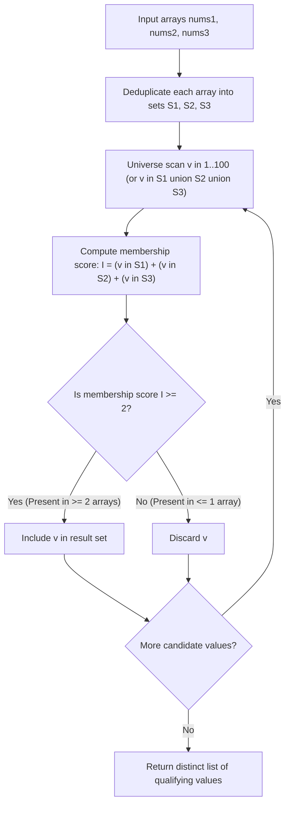

# Guided Example: Two Out of Three

## 1. Concrete Problem Restatement & Input Data

We are given three integer arrays: $\text{nums1}$, $\text{nums2}$, and $\text{nums3}$. Each array contains integers in the range $[1, 100]$.

Our task is to determine every integer value that appears in **at least two** of the three given arrays. 

The inclusion rules require:
1. **Multi-Array Presence**: An element must appear in two or three distinct input arrays. Duplicates within a single array (such as having multiple copies of a number in $\text{nums1}$) only count as presence in that single array.
2. **Distinct Output Elements**: Each qualifying integer must appear exactly once in the output list.
3. **Arbitrary Order**: The returned integers may be formatted in any valid ordering.

### Sample Input Dataset

Consider the representative configuration:
$$\text{nums1} = [1, 1, 3, 2], \quad \text{nums2} = [2, 3], \quad \text{nums3} = [3]$$

We contrast this with a symmetric pairwise cycle:
$$\text{nums1}_{\text{cyc}} = [3, 1], \quad \text{nums2}_{\text{cyc}} = [2, 3], \quad \text{nums3}_{\text{cyc}} = [1, 2]$$
and a disjoint configuration with internal duplicates:
$$\text{nums1}_{\text{disj}} = [1, 2, 2], \quad \text{nums2}_{\text{disj}} = [4, 3, 3], \quad \text{nums3}_{\text{disj}} = [5]$$

---

## 2. Conceptual Walkthrough & Visual Intuition

The problem is fundamentally an exercise in set-theoretic intersections and indicator counting across three collections.

### Set Deduplication
Because multiple copies within the same array do not grant extra credit, our first operation is converting each array into its set of unique values:
$$\mathcal{S}_1 = \text{set}(\text{nums1}), \quad \mathcal{S}_2 = \text{set}(\text{nums2}), \quad \mathcal{S}_3 = \text{set}(\text{nums3})$$

### Set-Theoretic Majority
An element $x$ belongs to at least two of the three sets if and only if it belongs to the union of their pairwise intersections:
$$x \in (\mathcal{S}_1 \cap \mathcal{S}_2) \cup (\mathcal{S}_2 \cap \mathcal{S}_3) \cup (\mathcal{S}_1 \cap \mathcal{S}_3)$$

Alternatively, we can express the inclusion condition using binary indicator functions:
$$\mathbf{1}_{x \in \mathcal{S}_1} + \mathbf{1}_{x \in \mathcal{S}_2} + \mathbf{1}_{x \in \mathcal{S}_3} \ge 2$$

Since all values are bounded within the discrete universe $[1, 100]$, we can either iterate over the universe $v \in [1, 100]$ or iterate over the combined unique elements in $\mathcal{S}_1 \cup \mathcal{S}_2 \cup \mathcal{S}_3$, verifying if the sum of membership indicators is $\ge 2$.

---

## 3. Step-by-Step State Progression Table

Let us trace $\text{nums1} = [1, 1, 3, 2], \text{nums2} = [2, 3], \text{nums3} = [3]$.

First, deduplicate each input array into a mathematical set:
- $\mathcal{S}_1 = \{1, 2, 3\}$
- $\mathcal{S}_2 = \{2, 3\}$
- $\mathcal{S}_3 = \{3\}$

The union of all candidate values is $\mathcal{S}_1 \cup \mathcal{S}_2 \cup \mathcal{S}_3 = \{1, 2, 3\}$. We evaluate each candidate:

| Candidate Value $v$ | In $\mathcal{S}_1$? | In $\mathcal{S}_2$? | In $\mathcal{S}_3$? | Total Array Presence Count | Condition $\ge 2$ Satisfied? | Qualification Verdict | Output Accumulator |
|---|---|---|---|---|---|---|---|
| $1$ | Yes ($1 \in \mathcal{S}_1$) | No ($1 \notin \mathcal{S}_2$) | No ($1 \notin \mathcal{S}_3$) | $1 + 0 + 0 = 1$ | No ($1 < 2$) | Excluded (Single-array element) | `[]` |
| $2$ | Yes ($2 \in \mathcal{S}_1$) | Yes ($2 \in \mathcal{S}_2$) | No ($2 \notin \mathcal{S}_3$) | $1 + 1 + 0 = 2$ | **Yes ($2 \ge 2$)** | **Included** (In nums1 and nums2) | `[2]` |
| $3$ | Yes ($3 \in \mathcal{S}_1$) | Yes ($3 \in \mathcal{S}_2$) | Yes ($3 \in \mathcal{S}_3$) | $1 + 1 + 1 = 3$ | **Yes ($3 \ge 2$)** | **Included** (In all three arrays) | `[2, 3]` |

Final qualifying distinct result:
$$[2, 3]$$

---

## 4. Key Transition Dynamics & Boundary Handling

The transition dynamics reveal how intra-array duplication and multi-array presence interact:

1. **Intra-Array Multiplicity Neutralization**:
   - In $\text{nums1} = [1, 1, 3, 2]$, the value $1$ occurs twice. In $\text{nums1}_{\text{disj}} = [1, 2, 2]$, the value $2$ occurs twice.
   - Set deduplication reduces $[1, 2, 2]$ to $\{1, 2\}$.
   - If an element appears $100$ times in $\text{nums1}$ but $0$ times in $\text{nums2}$ and $\text{nums3}$, its indicator score is strictly $1 + 0 + 0 = 1 < 2$. It is correctly rejected.
2. **Pairwise Intersection Equivalence**:
   - $\mathcal{S}_1 \cap \mathcal{S}_2 = \{2, 3\}$
   - $\mathcal{S}_2 \cap \mathcal{S}_3 = \{3\}$
   - $\mathcal{S}_1 \cap \mathcal{S}_3 = \{3\}$
   - Taking the union: $\{2, 3\} \cup \{3\} \cup \{3\} = \{2, 3\}$.
   - Both methods (pairwise intersection union vs indicator score sum) produce identical results.

| Candidate Dataset | Set Representations | Pairwise Intersections | Indicator Counts | Resulting Set |
|---|---|---|---|---|
| $\text{cyc}$: `[3, 1], [2, 3], [1, 2]` | $\mathcal{S}_1=\{1, 3\}, \mathcal{S}_2=\{2, 3\}, \mathcal{S}_3=\{1, 2\}$ | $S_1 \cap S_2 = \{3\}$ $S_2 \cap S_3 = \{2\}$ $S_1 \cap S_3 = \{1\}$ | $1 \to 2$ $2 \to 2$ $3 \to 2$ | `[1, 2, 3]` |
| $\text{disj}$: `[1, 2, 2], [4, 3, 3], [5]` | $\mathcal{S}_1=\{1, 2\}, \mathcal{S}_2=\{3, 4\}, \mathcal{S}_3=\{5\}$ | All intersections $\emptyset$ | All counts $= 1$ | `[]` (Empty) |
| Universal: `[7], [7], [7]` | $\mathcal{S}_1=\{7\}, \mathcal{S}_2=\{7\}, \mathcal{S}_3=\{7\}$ | All intersections $\{7\}$ | $7 \to 3$ | `[7]` |

---

## 5. Algorithmic Correctness & Soundness

### Set Invariant
Converting each input array $\text{nums}_k$ to a hash set $\mathcal{S}_k$ satisfies:
$$x \in \mathcal{S}_k \iff \exists j \text{ s.t. } \text{nums}_k[j] = x$$
This strips all duplicate counts within any single array while accurately capturing array membership.

### Logical Completeness of the Majority Predicate
Let $P_x$ be the number of distinct arrays containing $x$:
$$P_x = \sum_{k=1}^3 \mathbf{1}_{x \in \mathcal{S}_k}$$
By problem definition, $x$ qualifies if and only if $P_x \ge 2$.
Because $P_x \in \{0, 1, 2, 3\}$, the condition $P_x \ge 2$ holds if and only if $x$ belongs to at least two sets, which is formally isomorphic to $x \in (\mathcal{S}_1 \cap \mathcal{S}_2) \cup (\mathcal{S}_2 \cap \mathcal{S}_3) \cup (\mathcal{S}_1 \cap \mathcal{S}_3)$.
Iterating over all candidate integers guarantees zero omissions and zero duplicates.

---

## 6. Edge Cases & Common Pitfalls

1. **Multiset Frequency Counter Trap**: If one counts raw occurrences across all arrays using a single multiset counter without per-array deduplication, an array like $\text{nums1} = [2, 2, 2]$ with $\text{nums2} = [4], \text{nums3} = [5]$ would show frequency $3$ for value $2$. This would falsely classify $2$ as appearing in multiple arrays. Deduplication per array is mandatory.
2. **Value Universe Range**: Because numbers are constrained to $[1, 100]$, iterating $v \in [1, 100]$ provides a bounded loop with exactly $100$ iterations, avoiding sorting or complex set aggregations.
3. **Empty Output Format**: When no number appears in more than one array, the algorithm returns an empty list `[]`.

---

## 7. Complexity Analysis

### Time Complexity
- **Set Creation**: Constructing sets $\mathcal{S}_1, \mathcal{S}_2, \mathcal{S}_3$ from arrays of length $L_1, L_2, L_3 \le 100$ takes $\mathcal{O}(L_1 + L_2 + L_3)$ operations.
- **Membership Evaluation**: Iterating across the constant domain $v \in [1, 100]$ and querying three hash sets takes $\mathcal{O}(1)$ time per integer, totaling $100 \times \mathcal{O}(1) = \mathcal{O}(1)$ operations.
- **Total Time Complexity**: $\mathcal{O}(L_1 + L_2 + L_3)$, which is strictly linear in the total number of input elements (at most $300$ operations).

### Space Complexity
- **Set Buffers**: Storing $\mathcal{S}_1, \mathcal{S}_2, \mathcal{S}_3$ requires storing at most $100$ integers each.
- **Output Storage**: The output list contains at most $100$ distinct integers.
- **Total Auxiliary Space**: $\mathcal{O}(U)$, where $U \le 100$ is the size of the numerical universe, representing minimal constant auxiliary space.
