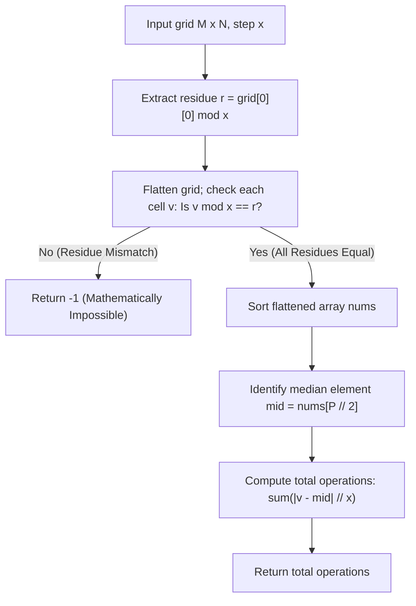

# Guided Example: Minimum Operations to Make a Uni-Value Grid

## 1. Concrete Problem Restatement & Input Data

We are given a 2D rectangular grid of integers with dimensions $M \times N$ containing $P = M \cdot N$ elements, along with a positive step size $x$. In a single operation, we may select any individual cell and either add $x$ to its value or subtract $x$ from its value. Operations can be repeated on any cell any number of times.

Our goal is to make every cell in the grid contain the exact same integer value using the minimum total number of operations. If it is impossible for all cells to ever attain an identical value, we must return $-1$.

### Sample Input Dataset

Consider the representative configuration:
$$\text{grid} = \begin{bmatrix} 2 & 4 \\ 6 & 8 \end{bmatrix}, \quad x = 2$$

We also examine unit step increments:
$$\text{grid}_{\text{unit}} = \begin{bmatrix} 1 & 5 \\ 2 & 3 \end{bmatrix}, \quad x = 1$$
and an incompatible parity grid:
$$\text{grid}_{\text{incompat}} = \begin{bmatrix} 1 & 2 \\ 3 & 4 \end{bmatrix}, \quad x = 2$$

---

## 2. Conceptual Walkthrough & Visual Intuition

The problem decomposes into two independent mathematical stages: **modular feasibility** and **$L_1$-norm median minimization**.

### Stage 1: Modular Invariant Feasibility
Adding or subtracting multiples of $x$ preserves the residue of a number modulo $x$:
$$v \pm k \cdot x \equiv v \pmod x \quad \text{for all } k \in \mathbb{Z}$$
Therefore, two numbers $a$ and $b$ can be transformed into the same common integer if and only if they share the exact same remainder modulo $x$:
$$a \equiv b \pmod x \iff a \bmod x = b \bmod x$$
If any two cells in the grid have different remainders modulo $x$, they belong to disjoint arithmetic progression equivalence classes and can never meet. In this scenario, we immediately return $-1$.

### Stage 2: Optimal Target Selection via Median
Once all elements share the common remainder $r = v \bmod x$, every element can be mapped to an integer coordinate $u_i = (v_i - r) / x$. Choosing a target value $T$ means choosing an integer coordinate $t = (T - r) / x$. The cost of converting cell $i$ to target $T$ is:
$$\text{cost}_i = \frac{|v_i - T|}{x} = |u_i - t|$$

The total operations required across the entire grid is:
$$\mathcal{C}(t) = \sum_{i=1}^P |u_i - t|$$

In convex analysis, the sum of absolute deviations $\sum |u_i - t|$ is a convex function whose global minimum is attained when $t$ is chosen as the **median** of the multiset $\{u_1, \dots, u_P\}$.
Sorting the flattened array of values and selecting the middle element:
$$v_{\text{mid}} = \text{sorted}[ \lfloor P / 2 \rfloor ]$$
guarantees the absolute minimum total number of operations.

---

## 3. Step-by-Step State Progression Table

Let us trace $\text{grid} = \begin{bmatrix} 2 & 4 \\ 6 & 8 \end{bmatrix}$ with $x = 2$.
Number of cells: $P = 2 \times 2 = 4$.

### Stage 1: Modular Invariant Verification
Anchor residue: $r = \text{grid}[0][0] \bmod x = 2 \bmod 2 = 0$.

| Cell $(r, c)$ | Value $v$ | Modulo Check $v \bmod 2$ | Equals Anchor $r = 0$? | Compatibility Verdict |
|---|---|---|---|---|
| $(0, 0)$ | $2$ | $2 \bmod 2 = 0$ | $0 == 0$ | Valid |
| $(0, 1)$ | $4$ | $4 \bmod 2 = 0$ | $0 == 0$ | Valid |
| $(1, 0)$ | $6$ | $6 \bmod 2 = 0$ | $0 == 0$ | Valid |
| $(1, 1)$ | $8$ | $8 \bmod 2 = 0$ | $0 == 0$ | Valid |

All cells share residue $0$. Feasibility is confirmed.

### Stage 2: Sorting and Median Evaluation
Flattened and sorted array:
$$\text{nums} = [2, 4, 6, 8]$$
Median index: $\lfloor 4 / 2 \rfloor = 2$.
Median target value: $v_{\text{mid}} = \text{nums}[2] = 6$.

| Cell Value $v$ | Absolute Difference $|v - v_{\text{mid}}|$ | Step Calculation $\frac{|v - 6|}{2}$ | Operations Contributed | Transformation Path |
|---|---|---|---|---|
| $2$ | $|2 - 6| = 4$ | $4 / 2 = 2$ | $2$ | $2 \xrightarrow{+2} 4 \xrightarrow{+2} 6$ |
| $4$ | $|4 - 6| = 2$ | $2 / 2 = 1$ | $1$ | $4 \xrightarrow{+2} 6$ |
| $6$ | $|6 - 6| = 0$ | $0 / 2 = 0$ | $0$ | Already at target |
| $8$ | $|8 - 6| = 2$ | $2 / 2 = 1$ | $1$ | $8 \xrightarrow{-2} 6$ |

Total minimum operations required:
$$2 + 1 + 0 + 1 = 4$$

*(Note: Selecting lower median $4$ yields $|2-4|/2 + |4-4|/2 + |6-4|/2 + |8-4|/2 = 1 + 0 + 1 + 2 = 4$, confirming any value in the median interval $[4, 6]$ produces the same minimal cost).*

---

## 4. Key Transition Dynamics & Boundary Handling

Analyzing boundary conditions and alternative target choices highlights the uniqueness of the median:

1. **Suboptimality of the Mean**:
   - For $[2, 4, 6, 8]$, the arithmetic mean is $(2+4+6+8)/4 = 5$.
   - The value $5$ does not even share residue $0$ modulo $2$ ($5 \bmod 2 = 1 \neq 0$), making it impossible to reach.
   - The mean minimizes squared Euclidean distance ($\sum (u_i - T)^2$), whereas minimum operations is governed by the absolute $L_1$ metric ($\sum |u_i - T|$), which is minimized exclusively by the median.
2. **Incompatible Parity ($\text{grid}_{\text{incompat}}$)**:
   - In $\text{grid}_{\text{incompat}} = \begin{bmatrix} 1 & 2 \\ 3 & 4 \end{bmatrix}$ with $x = 2$:
     $1 \bmod 2 = 1$, but $2 \bmod 2 = 0$.
     No matter how many additions or subtractions of $2$ are made, an odd number remains odd and an even number remains even. They can never converge to a single integer. Output: $-1$.

| Grid Data | Step $x$ | Sorted Values | Feasibility Check | Median Choice | Calculated Minimum Moves |
|---|---|---|---|---|---|
| `[[2, 4], [6, 8]]` | $2$ | $[2, 4, 6, 8]$ | All even (mod $2 = 0$) | $6$ | $4$ moves |
| `[[1, 5], [2, 3]]` | $1$ | $[1, 2, 3, 5]$ | All mod $1 = 0$ | $3$ | $|1-3| + |2-3| + |3-3| + |5-3| = 5$ moves |
| `[[1, 2], [3, 4]]` | $2$ | $[1, 2, 3, 4]$ | $1 \bmod 2 \neq 2 \bmod 2$ | N/A | Return $-1$ (Impossible) |
| `[[9]]` | $5$ | $[9]$ | Single element | $9$ | $0$ moves |

---

## 5. Algorithmic Correctness & Soundness

### Feasibility Invariant
Let $\sim$ be the equivalence relation on $\mathbb{Z}$ defined by $a \sim b \iff a \equiv b \pmod x$.
Because the allowed operations are $v \mapsto v + x$ and $v \mapsto v - x$, each operation preserves the equivalence class:
$$[v + x] = [v - x] = [v]$$
Thus, an element can only reach integers within its initial equivalence class. A common target $T$ can exist if and only if all grid elements belong to the identical equivalence class $[r]$.

### Optimality of the Median
Consider $f(t) = \sum_{i=1}^P |u_i - t|$ where $u_1 \le u_2 \le \dots \le u_P$.
The derivative (subgradient) with respect to $t$ is:
$$\frac{d}{dt} f(t) = \sum_{i=1}^P \text{sgn}(t - u_i) = |\{i \mid u_i < t\}| - |\{i \mid u_i > t\}|$$
- When $t < u_{\lfloor P/2 \rfloor}$, there are strictly more points to the right than to the left, so increasing $t$ strictly decreases $f(t)$.
- When $t > u_{\lfloor P/2 \rfloor}$, there are strictly more points to the left than to the right, so decreasing $t$ strictly decreases $f(t)$.
- At $t = u_{\lfloor P/2 \rfloor}$, the left and right counts balance, achieving the global minimum of the convex function $f(t)$.
Because $u_i \in \mathbb{Z}$ and the median is an actual element from the dataset, $t$ is an integer, and the reconstructed target $T = v_{\text{mid}}$ is guaranteed to be achievable.

---

## 6. Edge Cases & Common Pitfalls

1. **Attempting to Use Arithmetic Average / Mean**: Using the average and rounding to the nearest integer leads to suboptimal moves, and often selects numbers with the wrong residue modulo $x$.
2. **Floating-Point Imprecision**: All calculations should be carried out using exact integer floor division `//`, since all step differences $|v_i - v_{\text{mid}}|$ are guaranteed to be exact integer multiples of $x$.
3. **Single-Element Grid ($P = 1$)**: When $M = 1, N = 1$, all cells are already equal. The algorithm correctly identifies $0$ operations.
4. **Residue Modulo Sign**: In languages where modulo on negative numbers can produce negative remainders, ensuring non-negative residue representations avoids false mismatch flags (noting problem inputs specify positive cell values $\ge 1$).

---

## 7. Complexity Analysis

### Time Complexity
- **Residue Check & Flattening**: Scanning the $M \times N$ grid with $P$ elements and checking $v \bmod x$ takes $\mathcal{O}(P)$ operations.
- **Sorting**: Sorting the $P$ integers takes $\mathcal{O}(P \log P)$ time.
- **Cost Summation**: Iterating through the sorted array to compute $\sum \frac{|v_i - v_{\text{mid}}|}{x}$ takes $\mathcal{O}(P)$ operations.
- **Total Time Complexity**: $\mathcal{O}(P \log P)$, which easily runs within $25$ milliseconds for $P \le 10^5$.

### Space Complexity
- **Flattened Array**: The 1D array storing all $P$ integers occupies $\mathcal{O}(P)$ auxiliary memory.
- **Total Auxiliary Space**: $\mathcal{O}(P)$, scaling linearly with the number of cells in the grid.
