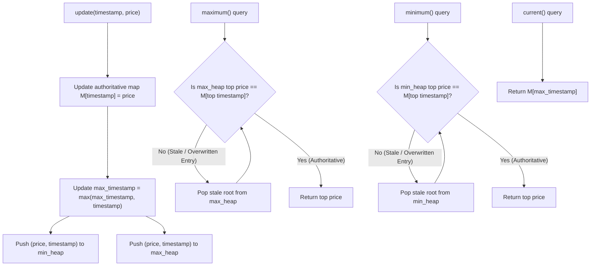

# Guided Example: Stock Price Fluctuation

## 1. Concrete Problem Restatement & Input Data

We are tasked with designing a real-time financial data structure, `StockPrice`, that processes a continuous stream of stock price records. The data stream arrives with two distinct characteristics:
1. **Out-of-Order Delivery**: Records may arrive out of chronological order (a quote for timestamp $2$ may arrive after a quote for timestamp $5$).
2. **Corrections / Updates**: A later update may reuse an already-recorded timestamp to overwrite and correct the stock price previously recorded at that moment. Only the latest reported price for any given timestamp remains valid.

The object must efficiently support four operational queries:
- `update(timestamp, price)`: Ingests a price record for `timestamp`. If the timestamp already exists, it updates the record with the new price.
- `current()`: Returns the price associated with the **greatest recorded timestamp** observed to date.
- `maximum()`: Returns the **maximum currently valid price** across all timestamps.
- `minimum()`: Returns the **minimum currently valid price** across all timestamps.

### Sample Input Dataset

Consider the operational trace:
$$\text{Operations} = [\text{update}(1, 10), \text{update}(2, 5), \text{current}(), \text{maximum}(), \text{update}(1, 3), \text{maximum}(), \text{update}(4, 2), \text{minimum}()]$$

We also contrast this with an out-of-order arrival:
$$\text{Operations}_{\text{order}} = [\text{update}(5, 100), \text{update}(2, 200), \text{current}()]$$

---

## 2. Conceptual Walkthrough & Visual Intuition

To satisfy the contract with logarithmic time bounds, we must synchronize three decoupled requirements:
1. **Timestamp-to-Price Mapping**: A primary hash table $\mathcal{M}: \text{timestamp} \to \text{price}$ tracks the definitive, authoritative price for every timestamp.
2. **Latest Timestamp Tracking**: A scalar variable $\tau_{\max}$ maintains the largest timestamp observed so far:
   $$\tau_{\max} \leftarrow \max(\tau_{\max}, \text{timestamp})$$
   Querying `current()` simply returns $\mathcal{M}[\tau_{\max}]$ in $\mathcal{O}(1)$ time.
3. **Dynamic Extremum Tracking (Max / Min Prices)**:
   Because prices can be updated and invalidated out-of-order, direct removal from standard binary heaps is expensive ($\mathcal{O}(N)$). We utilize **Dual Priority Queues with Lazy Deletion**:
   - $\mathcal{H}_{\max}$: A max-heap storing tuples $(\text{price}, \text{timestamp})$.
   - $\mathcal{H}_{\min}$: A min-heap storing tuples $(\text{price}, \text{timestamp})$.
   - When a timestamp is updated with a new price, we insert the new tuple into both heaps without removing the old tuple.
   - When `maximum()` or `minimum()` is queried, we inspect the root of the respective heap. If the price at the root does not match the authoritative price currently in $\mathcal{M}[\text{timestamp}]$, the root is **stale** and is popped immediately. We repeat this lazy eviction until a valid root is exposed.

---

## 3. Step-by-Step State Progression Table

Let us trace the primary sequence through each operation:

| Step | Operation | Authoritative Map $\mathcal{M}$ | Latest Timestamp $\tau_{\max}$ | Max-Heap State (Price, Time) | Min-Heap State (Price, Time) | Stale Evictions Performed | Returned Output | Rationale / Dynamic Behavior |
|---|---|---|---|---|---|---|---|---|
| $1$ | `update(1, 10)` | $\{1: 10\}$ | $1$ | $[(10, 1)]$ | $[(10, 1)]$ | None | None | Seed initial timestamp $1$ |
| $2$ | `update(2, 5)` | $\{1: 10, 2: 5\}$ | $2$ | $[(10, 1), (5, 2)]$ | $[(5, 2), (10, 1)]$ | None | None | Latest timestamp advances to $2$ |
| $3$ | `current()` | $\{1: 10, 2: 5\}$ | $2$ | Same | Same | None | **$5$** | Queries $\mathcal{M}[2] = 5$ |
| $4$ | `maximum()` | $\{1: 10, 2: 5\}$ | $2$ | Top: $(10, 1)$ | Same | None: $\mathcal{M}[1] == 10$ (Valid) | **$10$** | Root matches authoritative record |
| $5$ | `update(1, 3)` | $\{1: 3, 2: 5\}$ | $2$ | $[(10, 1)^*, (5, 2), (3, 1)]$ | $[(3, 1), (10, 1)^*, (5, 2)]$ | None (Lazy retention) | None | Overwrites $1 \to 3$; prior $(10, 1)$ is now stale |
| $6$ | `maximum()` | $\{1: 3, 2: 5\}$ | $2$ | Top: $(10, 1)^*$ | Same | Evict $(10, 1)^*$ because $\mathcal{M}[1] = 3 \neq 10$; new top is $(5, 2)$ | **$5$** | Stale price $10$ purged; next highest valid price is $5$ |
| $7$ | `update(4, 2)` | $\{1: 3, 2: 5, 4: 2\}$ | $4$ | $[(5, 2), (3, 1), (2, 4)]$ | $[(2, 4), (3, 1), \dots]$ | None | None | Latest timestamp advances to $4$ |
| $8$ | `minimum()` | $\{1: 3, 2: 5, 4: 2\}$ | $4$ | Same | Top: $(2, 4)$ | None: $\mathcal{M}[4] == 2$ (Valid) | **$2$** | Smallest valid price across all records |

Final query outputs: `[5, 10, 5, 2]`.

---

## 4. Key Transition Dynamics & Boundary Handling

The transition behavior at Step 5 and Step 6 illustrates the power of lazy eviction:

1. **Lazy Purging Mechanism**:
   - At Step 5, timestamp $1$ was corrected from price $10$ down to $3$.
   - Rather than searching through $\mathcal{H}_{\max}$ to delete $(10, 1)$—which would require an expensive linear search—we push $(3, 1)$ and leave $(10, 1)$ in place.
   - At Step 6, `maximum()` peeks at the top of $\mathcal{H}_{\max}$ and finds $(10, 1)$. It compares the price $10$ with $\mathcal{M}[1] = 3$. Because $10 \neq 3$, it identifies that the record has been superseded and pops it. The next root $(5, 2)$ is checked against $\mathcal{M}[2] = 5$, matches, and is returned.
2. **Out-of-Order Timestamp Arrivals**:
   - In $\text{Operations}_{\text{order}}$, `update(5, 100)` arrives first ($\tau_{\max} = 5$).
   - Later, `update(2, 200)` arrives. Because $2 < \tau_{\max}$, the latest timestamp remains $5$.
   - `current()` returns $\mathcal{M}[5] = 100$, completely unaffected by the chronological arrival order.

| Operation Sequence | Update Target | Authoritative State | Stale Elements in Heaps | Current Extremum Exposed |
|---|---|---|---|---|
| Initial Insert | $(1, 50)$ | $\{1: 50\}$ | None | $\min = 50, \max = 50, \text{curr} = 50$ |
| Price Revision | $(1, 80)$ | $\{1: 80\}$ | $(50, 1)$ in min-heap | $\min = 80$ (after popping $50$), $\max = 80$ |
| Out-of-Order Arrival | $(3, 60)$ then $(2, 70)$ | $\{1: 80, 2: 70, 3: 60\}$ | None | $\text{curr} = \mathcal{M}[3] = 60, \max = 80, \min = 60$ |
| Downward Revision | $(1, 10)$ | $\{1: 10, 2: 70, 3: 60\}$ | $(80, 1)$ in max-heap | $\max = 70$ (after popping $80$), $\min = 10$ |

---

## 5. Algorithmic Correctness & Soundness

### Invariant 1: Authoritative Truth
The hash table $\mathcal{M}$ maintains the invariant that for every unique timestamp $\tau$ reported so far, $\mathcal{M}[\tau]$ stores the price from the most recent update. Because dictionary writes overwrite prior values at the same key, $\mathcal{M}$ contains exactly the currently valid state of the market.

### Invariant 2: Soundness of Lazy Heap Deletion
Let $H$ be a priority queue containing tuples $(p, \tau)$. A tuple is defined as **valid** if and only if $\mathcal{M}[\tau] = p$.
- Any tuple $(p, \tau)$ with $p \neq \mathcal{M}[\tau]$ corresponds to a superseded historical quote.
- Because a superseded quote cannot represent a valid price, it must never be returned.
- While the root of $H$ is invalid ($p \neq \mathcal{M}[\tau]$), the algorithm discards it.
- When the while-loop terminates, the root $(p^*, \tau^*)$ satisfies $p^* = \mathcal{M}[\tau^*]$. Since $H$ orders elements by price, $p^*$ is guaranteed to be the extreme value among all valid records currently present in $H$.
- Because every valid record was inserted upon its update and no valid record is ever evicted, the valid root is the true global maximum (or minimum).

---

## 6. Edge Cases & Common Pitfalls

1. **Attempting In-Place Heap Deletion**: Searching and removing arbitrary elements from an array-based heap takes $\mathcal{O}(N)$ time. With $Q = 10^5$ operations, repeated linear deletions would lead to quadratic $\mathcal{O}(Q^2)$ performance. Lazy deletion amortizes this cost to $\mathcal{O}(\log Q)$.
2. **Current Query Misinterpretation**: Assuming that `current()` returns the price from the *most recently called update*. The contract explicitly states it must return the price at the **greatest timestamp**. Tracking $\tau_{\max} = \max(\tau_{\max}, \text{timestamp})$ correctly decouples wall-clock arrival order from data timestamps.
3. **Repeated Updates to the Same Timestamp**: A timestamp may be updated dozens of times. Each update pushes a new tuple to the heaps. The lazy eviction loop will seamlessly pop all older superseded prices until the active quote is reached.

---

## 7. Complexity Analysis

### Time Complexity
- **`update(timestamp, price)`**: Hash map assignment and updating $\tau_{\max}$ take $\mathcal{O}(1)$ time. Pushing into $\mathcal{H}_{\max}$ and $\mathcal{H}_{\min}$ takes $\mathcal{O}(\log K)$ time, where $K$ is the number of heap elements ($K \le Q$). Total time per update is $\mathcal{O}(\log Q)$.
- **`current()`**: Direct hash table lookup $\mathcal{M}[\tau_{\max}]$ takes $\mathcal{O}(1)$ time.
- **`maximum()` and `minimum()`**: Peeking takes $\mathcal{O}(1)$. Each stale record is popped at most once across the entire program lifetime. Across $Q$ operations, at most $Q$ stale records are ever inserted, meaning the total amortized cost of all heap evictions is $\mathcal{O}(Q \log Q)$, or $\mathcal{O}(\log Q)$ amortized per query.
- **Total Time Complexity**: $\mathcal{O}(Q \log Q)$ for any sequence of $Q$ operations.

### Space Complexity
- **Authoritative Map**: Stores at most $U$ unique timestamps ($U \le Q$), consuming $\mathcal{O}(U)$ space.
- **Heaps Storage**: Each update pushes at most one entry per heap, bounded by $Q$ entries.
- **Total Auxiliary Space**: $\mathcal{O}(Q)$, scaling linearly with the total number of update operations.
