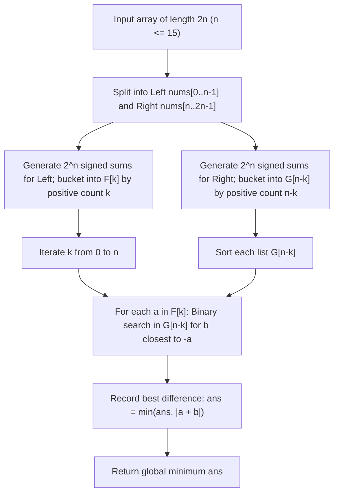

# Guided Example: Partition Array Into Two Arrays to Minimize Sum Difference

## 1. Concrete Problem Restatement & Input Data

We are given an integer array $\text{nums}$ containing exactly $2n$ elements, where $n \in [1, 15]$ (so the array length is at most $30$). Elements can be positive, negative, or zero, with values ranging between $-10^7$ and $10^7$.

Our objective is to partition the $2n$ elements into two disjoint arrays, $\mathcal{A}$ and $\mathcal{B}$, subject to two strict constraints:
1. **Equal Cardinality**: Both arrays must contain exactly $n$ elements ($|\mathcal{A}| = |\mathcal{B}| = n$).
2. **Sum Difference Minimization**: The absolute difference between their total sums must be minimized:
   $$\min_{\substack{\mathcal{A} \cup \mathcal{B} = \text{nums} \\ |\mathcal{A}| = |\mathcal{B}| = n}} |\text{sum}(\mathcal{A}) - \text{sum}(\mathcal{B})|$$

Because $n$ can be up to $15$, the total number of partitions is $\binom{30}{15} = 155{,}117{,}520$, which is far too large for brute-force combinatorial search.

### Sample Input Dataset

Consider the representative configuration:
$$\text{nums} = [3, 9, 7, 3], \quad n = 2$$

We contrast this with negative values:
$$\text{nums}_{\text{sign}} = [-36, 36], \quad n = 1$$
and a six-element zero-sum sequence:
$$\text{nums}_{\text{zero}} = [2, -1, 0, 4, -2, -9], \quad n = 3$$

---

## 2. Conceptual Walkthrough & Visual Intuition

Partitioning into two sets $\mathcal{A}$ and $\mathcal{B}$ of size $n$ is mathematically equivalent to assigning a sign $s_i \in \{+1, -1\}$ to each element $\text{nums}[i]$ such that:
$$\sum_{i=0}^{2n-1} s_i = 0 \quad (\text{exactly } n \text{ positive and } n \text{ negative signs})$$
Our goal is to minimize $|\sum_{i=0}^{2n-1} s_i \cdot \text{nums}[i]|$.

### Meet-in-the-Middle Strategy
We bisect the $2n$ elements into two equal halves of size $n$:
- **Left Half**: $\text{nums}[0 \dots n - 1]$
- **Right Half**: $\text{nums}[n \dots 2n - 1]$

For each half, there are $2^n \le 2^{15} = 32{,}768$ possible sign assignments.
1. **Left Half Generation**:
   Enumerate all $2^n$ bitmasks. For each mask, count how many elements are chosen as $+1$ (say $k \in [0, n]$) and compute the resulting signed sum $S_L$. Group these sums by cardinality: $\mathcal{F}[k] = \{S_L\}$.
2. **Right Half Generation**:
   Similarly, enumerate all $2^n$ bitmasks for the right half. If $n - k$ elements are chosen as $+1$, compute the signed sum $S_R$ and store in $\mathcal{G}[n - k] = \{S_R\}$.
3. **Bisection Matching**:
   A valid full partition requires choosing $k$ positive signs from the left half and $n - k$ positive signs from the right half, ensuring the total positive count is $k + (n - k) = n$.
   We want $S_L + S_R \approx 0 \iff S_R \approx -S_L$.
   By sorting the list of values in $\mathcal{G}[n - k]$, for each $a \in \mathcal{F}[k]$, we use binary search (`bisect`) to find the element $b \in \mathcal{G}[n - k]$ closest to $-a$.

---

## 3. Step-by-Step State Progression Table

Let us trace $\text{nums} = [3, 9, 7, 3]$ with $n = 2$.
Total elements: $2n = 4$.
Left half: $\text{nums}[0 \dots 1] = [3, 9]$.
Right half: $\text{nums}[2 \dots 3] = [7, 3]$.

### Step A: Generating Left Half Signed Sums $\mathcal{F}[k]$
- $k = 0$ (two $-1$ signs): $-3 - 9 = -12 \implies \mathcal{F}[0] = \{-12\}$
- $k = 1$ (one $+1$, one $-1$ sign):
  $+3 - 9 = -6$
  $-3 + 9 = +6 \implies \mathcal{F}[1] = \{-6, 6\}$
- $k = 2$ (two $+1$ signs): $+3 + 9 = +12 \implies \mathcal{F}[2] = \{+12\}$

### Step B: Generating Right Half Signed Sums $\mathcal{G}[m]$
- $m = 0$: $-7 - 3 = -10 \implies \mathcal{G}[0] = \{-10\}$
- $m = 1$:
  $+7 - 3 = +4$
  $-7 + 3 = -4 \implies \mathcal{G}[1] = \{-4, 4\}$
- $m = 2$: $+7 + 3 = +10 \implies \mathcal{G}[2] = \{+10\}$

### Step C: Matching Complements with $k + m = 2$

| Bucket $k$ | Complement $m = 2 - k$ | Left Sum $a \in \mathcal{F}[k]$ | Target $-a$ | Sorted Right Bucket $\mathcal{G}[m]$ | Closest Match $b \in \mathcal{G}[m]$ | Combined Sum $a + b$ | Absolute Difference $\lvert a + b \rvert$ | Running Minimum |
|---|---|---|---|---|---|---|---|---|
| $k = 0$ | $m = 2$ | $-12$ | $+12$ | $[10]$ | $10$ | $-12 + 10 = -2$ | $\lvert -2 \rvert = 2$ | $2$ |
| $k = 1$ | $m = 1$ | $-6$ | $+6$ | $[-4, 4]$ | $4$ | $-6 + 4 = -2$ | $\lvert -2 \rvert = 2$ | $2$ |
| $k = 1$ | $m = 1$ | $+6$ | $-6$ | $[-4, 4]$ | $-4$ | $6 + (-4) = +2$ | $\lvert +2 \rvert = 2$ | $2$ |
| $k = 2$ | $m = 0$ | $+12$ | $-12$ | $[-10]$ | $-10$ | $12 + (-10) = +2$ | $\lvert +2 \rvert = 2$ | $2$ |

The minimum possible absolute difference is $2$.
(Achieved by partition $\mathcal{A} = [3, 9]$ with sum $12$, and $\mathcal{B} = [7, 3]$ with sum $10$, difference $|12 - 10| = 2$).

---

## 4. Key Transition Dynamics & Boundary Handling

The bisection matching exhibits several structural properties:

1. **Cardinality Bucketing is Mandatory**:
   - A naive meet-in-the-middle without cardinality bucketing could match a left subset with $3$ elements to a right subset with $3$ elements when $n = 4$, resulting in $6$ elements in $\mathcal{A}$ and $2$ in $\mathcal{B}$, violating $|\mathcal{A}| = |\mathcal{B}| = n$.
   - By partitioning into $F[k]$ and $G[n - k]$, every evaluated candidate combination is guaranteed to contain exactly $k + (n - k) = n$ positive elements.
2. **Binary Search Neighbor Checking**:
   - When binary searching for target $T = -a$ in a sorted array, the exact value $T$ may not exist. The closest value is either the insertion index $\text{idx}$ (the smallest element $\ge T$) or $\text{idx} - 1$ (the largest element $< T$). Checking both neighbors guarantees finding the true minimum $|a + b|$.
3. **Exact Zero Difference Termination**:
   - If at any point $|a + b| = 0$ is encountered, no difference can be smaller. The algorithm can optionally terminate early with $0$.

| Array Instance | $n$ | Total Permutations $\binom{2n}{n}$ | Meet-in-the-Middle States $2 \times 2^n$ | Optimal Partition | Minimum Absolute Difference |
|---|---|---|---|---|---|
| `[3, 9, 7, 3]` | $2$ | $\binom{4}{2} = 6$ | $2 \times 4 = 8$ | `[3, 9]` ($12$) vs `[7, 3]` ($10$) | $2$ |
| `[-36, 36]` | $1$ | $\binom{2}{1} = 2$ | $2 \times 2 = 4$ | `[-36]` vs `[36]` | $\lvert (-36) - 36 \rvert = 72$ |
| `[2, -1, 0, 4, -2, -9]` | $3$ | $\binom{6}{3} = 20$ | $2 \times 8 = 16$ | `[2, 4, -9]` ($-3$) vs `[-1, 0, -2]` ($-3$) | $\lvert (-3) - (-3) \rvert = 0$ |

---

## 5. Algorithmic Correctness & Soundness

### Mathematical Completeness of the Search Space
Let $(\mathcal{A}, \mathcal{B})$ be any valid partition of $\text{nums}$ with $|\mathcal{A}| = |\mathcal{B}| = n$.
- Let $k = |\mathcal{A} \cap \text{nums}[0 \dots n-1]|$ be the number of elements of $\mathcal{A}$ drawn from the left half.
- Because $|\mathcal{A}| = n$, the remaining $n - k$ elements of $\mathcal{A}$ must be drawn from the right half: $|\mathcal{A} \cap \text{nums}[n \dots 2n-1]| = n - k$.
- The left half elements contribute $S_L = \sum_{i \in \mathcal{A}_{\text{left}}} \text{nums}[i] - \sum_{i \in \mathcal{B}_{\text{left}}} \text{nums}[i] \in \mathcal{F}[k]$.
- The right half elements contribute $S_R = \sum_{i \in \mathcal{A}_{\text{right}}} \text{nums}[i] - \sum_{i \in \mathcal{B}_{\text{right}}} \text{nums}[i] \in \mathcal{G}[n - k]$.

Since our algorithm enumerates all $2^n$ subsets for the left half, all $2^n$ subsets for the right half, and pairs every $k \in [0, n]$ with $n - k$, the exact state $(S_L, S_R)$ representing $(\mathcal{A}, \mathcal{B})$ is present in $\mathcal{F}[k] \times \mathcal{G}[n - k]$.

### Optimality of Binary Search
For any fixed $a \in \mathcal{F}[k]$, the objective is to minimize $|a + b|$ over $b \in \mathcal{G}[n - k]$.
Because $\mathcal{G}[n - k]$ is sorted, the function $g(b) = |a + b| = |b - (-a)|$ is a V-shaped function of $b$ centered at $-a$. The minimum over the discrete set must occur at the predecessor or successor of $-a$ in the sorted array. Testing both neighboring points identifies the true global minimum.

---

## 6. Edge Cases & Common Pitfalls

1. **Negative Numbers**: Elements can be negative. Subsets cannot be assumed to have monotonic positive sums. Generating signed sums via explicit bitmasks handles negative numbers naturally.
2. **Binary Search Out-of-Bounds**: If all elements in $\mathcal{G}[n - k]$ are smaller than $-a$, the binary search returns the end of the array; checking $\text{idx} - 1$ is crucial. Conversely, if all elements are larger, $\text{idx} = 0$, so $\text{idx} - 1$ does not exist. Boundary index checks prevent index errors.
3. **Combinatorial Explosion Without Splitting**: Attempting to generate combinations of size $n$ directly from $2n$ elements requires $\binom{30}{15} \approx 1.55 \times 10^8$ operations, causing time limit exceeded. Splitting into $2 \times 2^{15}$ reduces the state space by four orders of magnitude.

---

## 7. Complexity Analysis

### Time Complexity
- **Subset Generation**: Generating all $2^n$ subsets for the left half and right half takes $\mathcal{O}(n \cdot 2^n)$ operations. For $n = 15$, $15 \times 32{,}768 \approx 4.9 \times 10^5$ operations.
- **Sorting Buckets**: Each bucket $\mathcal{G}[m]$ contains at most $\binom{n}{m}$ elements. Sorting all buckets $\mathcal{G}[0 \dots n]$ takes $\sum_{m=0}^n \mathcal{O}(\binom{n}{m} \log \binom{n}{m}) \le \mathcal{O}(n \cdot 2^n)$ time.
- **Binary Search Matching**: For each of the $2^n$ elements in the left buckets, binary searching in the corresponding sorted right bucket takes $\mathcal{O}(\log \binom{n}{m}) \le \mathcal{O}(n)$ time. The matching phase takes $\mathcal{O}(n \cdot 2^n)$ time.
- **Total Time Complexity**: $\mathcal{O}(n \cdot 2^n)$, which requires roughly $10^6$ operations and executes in less than $0.1$ seconds.

### Space Complexity
- **Bucket Storage**: The buckets $\mathcal{F}$ and $\mathcal{G}$ store at most $2^n$ integers each.
- **Total Auxiliary Space**: $\mathcal{O}(2^n)$, consuming roughly $2 \times 32{,}768 \times 4 \text{ bytes} \approx 256\text{ KB}$ of memory, well within limits.
