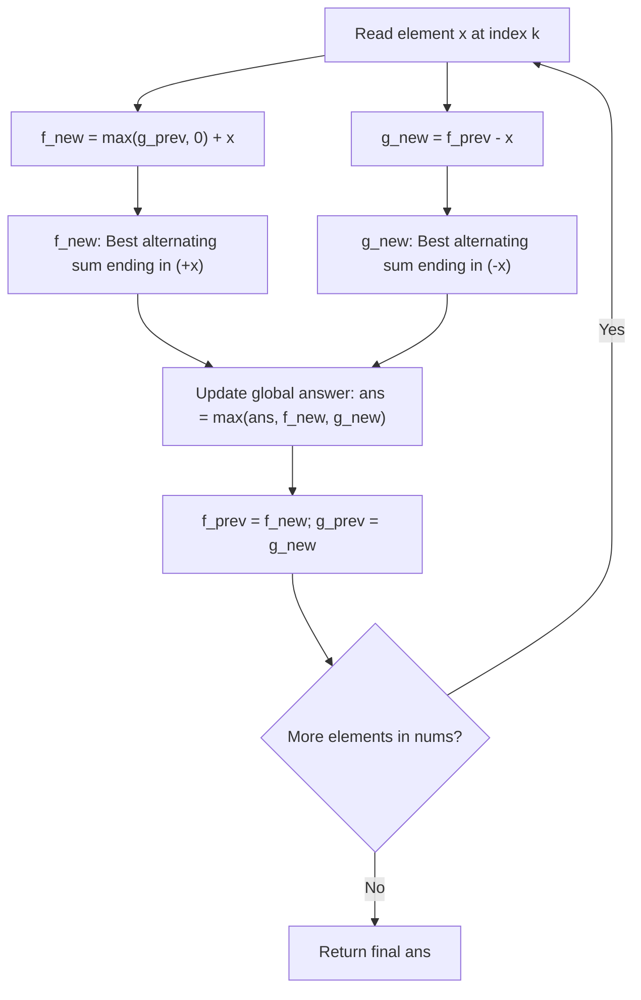

# Guided Example: Maximum Alternating Subarray Sum

## 1. Concrete Problem Restatement & Input Data

We are given an integer array $\text{nums}$ of length $N$. A subarray is defined as a non-empty contiguous slice $\text{nums}[i \dots j]$ with $0 \le i \le j < N$.

For any such slice starting at index $i$, its **alternating sum** is computed by adding the first element, subtracting the second, adding the third, and continuing with strictly alternating signs throughout the subarray:
$$\text{AltSum}(\text{nums}[i \dots j]) = \sum_{k=i}^j (-1)^{k - i} \cdot \text{nums}[k] = \text{nums}[i] - \text{nums}[i+1] + \text{nums}[i+2] - \dots$$

Crucially:
1. The sign pattern **always restarts with addition** ($+$) at the chosen left boundary $i$.
2. The subarray may be of odd or even length.
3. Elements cannot be skipped or reordered.

Our task is to find the maximum possible alternating sum across all non-empty contiguous subarrays of $\text{nums}$.

### Sample Input Dataset

Consider the representative configuration:
$$\text{nums} = [3, -1, 1, 2]$$

We contrast this with a constant sequence:
$$\text{nums}_{\text{const}} = [2, 2, 2, 2, 2]$$
and a single negative element:
$$\text{nums}_{\text{neg}} = [-5]$$

---

## 2. Conceptual Walkthrough & Visual Intuition

This problem represents an alternating-sign variant of the classic maximum subarray problem (Kadane's algorithm).

At each index $k$ with element $x = \text{nums}[k]$, any subarray ending at $k$ must end with either:
- A **Positive Sign ($+x$)**: This occurs if the subarray has an odd number of elements ($1, 3, 5, \dots$).
- A **Negative Sign ($-x$)**: This occurs if the subarray has an even number of elements ($2, 4, 6, \dots$).

Let us define two dynamic programming states for the current index:
- $f$: the maximum alternating sum of a contiguous subarray ending at $x$ where $x$ carries a **positive sign** ($+x$).
- $g$: the maximum alternating sum of a contiguous subarray ending at $x$ where $x$ carries a **negative sign** ($-x$).

### Recurrence Relations
1. **Transitions for State $f$ ($+x$)**:
   An odd-length subarray ending with $+x$ can arise from two choices:
   - Start a fresh subarray of length $1$ consisting solely of $x$ (value: $x$).
   - Extend an existing even-length subarray that ended at the previous element with a negative sign (value: $g_{\text{prev}} + x$).
   Therefore:
   $$f_{\text{curr}} = \max(g_{\text{prev}}, 0) + x$$

2. **Transitions for State $g$ ($-x$)**:
   An even-length subarray ending with $-x$ **must** extend an existing odd-length subarray that ended at the previous element with a positive sign (a subarray cannot start with a negative sign).
   Therefore:
   $$g_{\text{curr}} = f_{\text{prev}} - x$$

At each step, both $f_{\text{curr}}$ and $g_{\text{curr}}$ represent valid completed subarrays, so we update the global maximum:
$$\text{ans} \leftarrow \max(\text{ans}, f_{\text{curr}}, g_{\text{curr}})$$

---

## 3. Step-by-Step State Progression Table

Let us trace $\text{nums} = [3, -1, 1, 2]$ of length $N = 4$.
Initial state: $f = -\infty, g = -\infty, \text{ans} = -\infty$.

| Step $k$ | Element $x$ | Positive State Recurrence $f = \max(g, 0) + x$ | Odd-Length Subarray Formed | Negative State Recurrence $g = f_{\text{prev}} - x$ | Even-Length Subarray Formed | Local Peak $\max(f, g)$ | Global Best $\text{ans}$ |
|---|---|---|---|---|---|---|---|
| $0$ | $3$ | $\max(-\infty, 0) + 3 = 3$ | `[3]` (Sum: $3$) | $-\infty - 3 = -\infty$ | None | $3$ | **$3$** |
| $1$ | $-1$ | $\max(-\infty, 0) + (-1) = -1$ | `[-1]` (Sum: $-1$) | $3 - (-1) = 4$ | `[3, -1]` (Sum: $3 - (-1) = 4$) | $4$ | **$4$** |
| $2$ | $1$ | $\max(4, 0) + 1 = 5$ | `[3, -1, 1]` (Sum: $4 + 1 = 5$) | $-1 - 1 = -2$ | `[-1, 1]` (Sum: $-1 - 1 = -2$) | $5$ | **$5$** |
| $3$ | $2$ | $\max(-2, 0) + 2 = 2$ | `[2]` (Sum: $2$) | $5 - 2 = 3$ | `[3, -1, 1, 2]` (Sum: $5 - 2 = 3$) | $3$ | **$5$** |

The global maximum alternating subarray sum is $5$, achieved by the contiguous slice $\text{nums}[0 \dots 2] = [3, -1, 1]$ with sum $3 - (-1) + 1 = 5$.

---

## 4. Key Transition Dynamics & Boundary Handling

The execution highlights key structural nuances of the two-state recurrence:

1. **Step 2 Ingestion ($x = 1$)**:
   - The prior even-length state was $g = 4$ (representing `[3, -1]`).
   - Adding $x = 1$ continues this chain into an odd-length subarray: $4 + 1 = 5$ (representing `[3, -1, 1]`).
   - Meanwhile, the prior odd-length state was $f = -1$ (representing `[-1]`). Extending it with $-x = -1$ yields $-1 - 1 = -2$ (representing `[-1, 1]`).
   - The state machine automatically tracks both parity branches simultaneously without combinatorial backtracking.
2. **Fresh Start Invariant**:
   - In $f = \max(g, 0) + x$, if $g < 0$, taking $\max(g, 0) = 0$ corresponds to discarding all prior elements and initiating a fresh subarray at index $k$ with value $+x$.
3. **Negative Elements and Double Negatives**:
   - Subtracting a negative number (e.g. $3 - (-1) = 4$) increases the running sum. The state machine seamlessly leverages negative values at odd positions to maximize the total.

| Array Example | Values | Positive Branch Evolution | Negative Branch Evolution | Maximum Subarray Found | Best Alternating Sum |
|---|---|---|---|---|---|
| `[3, -1, 1, 2]` | Mixed | $3 \to -1 \to 5 \to 2$ | $-\infty \to 4 \to -2 \to 3$ | `[3, -1, 1]` | $5$ |
| `[2, 2, 2, 2]` | Equal | $2 \to 2 \to 2 \to 2$ | $-\infty \to 0 \to 0 \to 0$ | `[2]` or `[2, 2, 2]` | $2$ |
| `[-5]` | Single Neg | $-5$ | $-\infty$ | `[-5]` | $-5$ |
| `[1, 4, 2, 5]` | Ascending | $1 \to -1 \to 2 \to -1$ | $-\infty \to -3 \to -3 \to -3$ | `[2]` or `[1]` | $2$ |

---

## 5. Algorithmic Correctness & Soundness

### Invariant: Parity and Length Completeness
For any index $k \in [0, N - 1]$:
- $f$ computes $\max_{0 \le i \le k, (k - i) \text{ even}} \text{AltSum}(\text{nums}[i \dots k])$.
- $g$ computes $\max_{0 \le i \le k, (k - i) \text{ odd}} \text{AltSum}(\text{nums}[i \dots k])$.

### Inductive Proof of the Recurrences
1. **Base Case ($k = 0$)**:
   $f = x_0$ represents the single-element subarray $\text{nums}[0 \dots 0]$. State $g = -\infty$ correctly reflects that no even-length subarray can end at index $0$.
2. **Inductive Step**:
   Assume the invariants hold at step $k - 1$.
   - Any odd-length subarray ending at $k$ either has length $1$ (sum $= x_k$) or length $\ge 3$. If length $\ge 3$, removing $x_k$ leaves an even-length subarray ending at $k - 1$ whose maximum sum is $g_{\text{prev}}$ by the inductive hypothesis. Thus, the maximum odd-length sum is $\max(0, g_{\text{prev}}) + x_k = f_{\text{curr}}$.
   - Any even-length subarray ending at $k$ must have length $\ge 2$. Removing $x_k$ leaves an odd-length subarray ending at $k - 1$ whose maximum sum is $f_{\text{prev}}$ by the inductive hypothesis. Thus, the maximum even-length sum is $f_{\text{prev}} - x_k = g_{\text{curr}}$.

Because every non-empty subarray has some ending index $k \in [0, N - 1]$ and either odd or even length, tracking $\max(\text{ans}, f_{\text{curr}}, g_{\text{curr}})$ at every step guarantees finding the global maximum.

---

## 6. Edge Cases & Common Pitfalls

1. **Subarrays Cannot Start with Subtraction**: A subarray must always begin with addition ($+nums[i]$). Setting $g_{\text{curr}} = \max(f_{\text{prev}}, 0) - x$ would falsely allow a subarray to begin with $-x$, which is explicitly forbidden.
2. **All Negative Elements**: If $\text{nums} = [-10, -5, -20]$, the optimal subarray is the single least-negative element `[-5]`, giving $-5$. Initializing $\text{ans} = -\infty$ guarantees that a negative maximum is correctly retained rather than overwritten by $0$.
3. **Single Element Arrays ($N = 1$)**: When $N = 1$, $f = \text{nums}[0]$ and $g = -\infty$. The returned value is cleanly $\text{nums}[0]$.

---

## 7. Complexity Analysis

### Time Complexity
- **Single Forward Pass**: The algorithm iterates through the $N$ elements of $\text{nums}$ exactly once.
- **Constant Time Transitions**: At each step, updating $f, g$, and $\text{ans}$ requires only basic additions, subtractions, and $\mathcal{O}(1)$ maximum comparisons.
- **Total Time Complexity**: $\mathcal{O}(N)$, which is strictly optimal as every element must be inspected.

### Space Complexity
- **Scalar Memory**: Only three scalar variables are maintained: $f, g$, and $\text{ans}$.
- **No Auxiliary Arrays**: No DP arrays, stacks, or memoization tables are allocated.
- **Total Auxiliary Space**: $\mathcal{O}(1)$, achieving true constant auxiliary memory.
