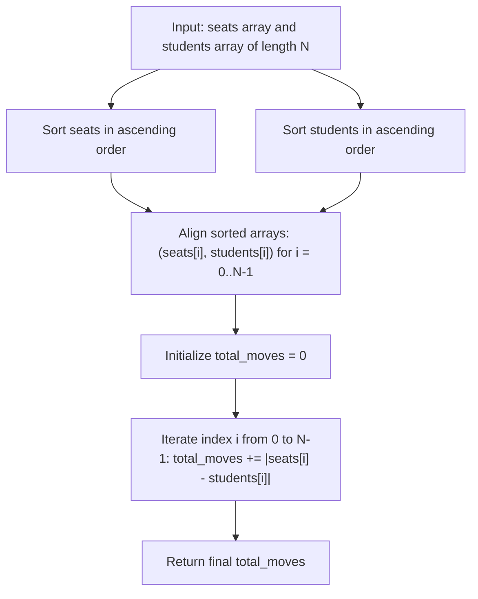

# Guided Example: Minimum Number of Moves to Seat Everyone

## 1. Concrete Problem Restatement & Input Data

There are $N$ students and $N$ available seats distributed along a one-dimensional coordinate line. The positions of the seats are given in an integer array $\text{seats}$, and the starting positions of the students are given in an integer array $\text{students}$.

Multiple students may initially occupy the same coordinate, and multiple distinct seats may also be located at the same coordinate. In a single unit move, a student can shift their position left by $1$ unit or right by $1$ unit (changing position $p \to p - 1$ or $p \to p + 1$).

We must determine a one-to-one matching between the $N$ students and the $N$ seats such that:
1. Every student is assigned to exactly one distinct seat occurrence.
2. The total sum of individual student moves is strictly minimized:
   $$\min_{\pi \in S_N} \sum_{i=1}^N |\text{seats}[\pi(i)] - \text{students}[i]|$$
   where $\pi$ is a bijection (permutation) from students to seats.

### Sample Input Dataset

Consider the representative configuration:
$$\text{seats} = [3, 1, 5], \quad \text{students} = [2, 7, 4]$$

We contrast this with an asymmetric multi-element sequence:
$$\text{seats}_{\text{multi}} = [4, 1, 5, 9], \quad \text{students}_{\text{multi}} = [1, 3, 2, 6]$$
and a sequence with duplicate co-located seats:
$$\text{seats}_{\text{dup}} = [2, 2, 6, 6], \quad \text{students}_{\text{dup}} = [1, 3, 2, 6]$$

---

## 2. Conceptual Walkthrough & Visual Intuition

This problem represents a classic one-dimensional optimal transport / assignment problem under the $L_1$ metric.

### The Uncrossing Principle (Rearrangement Inequality)
Consider any two students at coordinates $x_1 \le x_2$ and two seats at coordinates $y_1 \le y_2$. There are exactly two possible one-to-one pairings:
1. **Parallel / Monotonic Pairing**: Pair $x_1 \leftrightarrow y_1$ and $x_2 \leftrightarrow y_2$. The combined cost is:
   $$\mathcal{C}_{\text{parallel}} = |x_1 - y_1| + |x_2 - y_2|$$
2. **Crossed Pairing**: Pair $x_1 \leftrightarrow y_2$ and $x_2 \leftrightarrow y_1$. The combined cost is:
   $$\mathcal{C}_{\text{crossed}} = |x_1 - y_2| + |x_2 - y_1|$$

By the triangle inequality and interval overlap properties on $\mathbb{R}$:
$$|x_1 - y_1| + |x_2 - y_2| \le |x_1 - y_2| + |x_2 - y_1|$$
In every possible spatial ordering of $\{x_1, x_2, y_1, y_2\}$, uncrossing any two crossing paths strictly decreases or leaves unchanged the total distance traveled.

### Global Monotonic Matching
Because any arbitrary matching can be transformed into a sorted matching through a finite sequence of uncrossing operations without ever increasing total cost:
1. Sort $\text{seats}$ in ascending numerical order.
2. Sort $\text{students}$ in ascending numerical order.
3. Greedily pair the $i$-th student with the $i$-th seat: $\text{moves} = \sum_{i=0}^{N-1} |\text{seats}[i] - \text{students}[i]|$.

---

## 3. Step-by-Step State Progression Table

Let us trace $\text{seats} = [3, 1, 5]$ and $\text{students} = [2, 7, 4]$ ($N = 3$).

First, sort both collections in ascending order:
- Sorted seats: $\text{seats}_{\text{sort}} = [1, 3, 5]$
- Sorted students: $\text{students}_{\text{sort}} = [2, 4, 7]$

| Matched Rank $i$ | Sorted Seat Position | Sorted Student Position | Coordinate Displacement $(\text{seat} - \text{student})$ | Individual Absolute Moves $\lvert \text{seat} - \text{student} \rvert$ | Student Movement Direction | Cumulative Moves Sum |
|---|---|---|---|---|---|---|
| $0$ | $1$ | $2$ | $1 - 2 = -1$ | $\lvert -1 \rvert = 1$ | Left by $1$ unit | $0 + 1 = 1$ |
| $1$ | $3$ | $4$ | $3 - 4 = -1$ | $\lvert -1 \rvert = 1$ | Left by $1$ unit | $1 + 1 = 2$ |
| $2$ | $5$ | $7$ | $5 - 7 = -2$ | $\lvert -2 \rvert = 2$ | Left by $2$ units | $2 + 2 = 4$ |

Total minimum moves: $4$.

Now, let us contrast this with a suboptimal crossed assignment to observe the penalty of crossing paths:

| Assignment Strategy | Student 2 Paired With | Student 4 Paired With | Student 7 Paired With | Calculation | Total Moves | Penalty vs Optimal |
|---|---|---|---|---|---|---|
| **Optimal (Sorted)** | Seat $1$ (dist $1$) | Seat $3$ (dist $1$) | Seat $5$ (dist $2$) | $1 + 1 + 2$ | **$4$** | **Optimal ($+0$)** |
| Crossed Pair A | Seat $3$ (dist $1$) | Seat $1$ (dist $3$) | Seat $5$ (dist $2$) | $1 + 3 + 2$ | $6$ | $+2$ excess |
| Crossed Pair B | Seat $5$ (dist $3$) | Seat $3$ (dist $1$) | Seat $1$ (dist $6$) | $3 + 1 + 6$ | $10$ | $+6$ excess |

---

## 4. Key Transition Dynamics & Boundary Handling

The transition behavior across various spatial distributions illustrates why sorting handles all topologies:

1. **Handling Duplicate Coordinates**:
   - In $\text{seats}_{\text{dup}} = [2, 2, 6, 6]$ and $\text{students}_{\text{dup}} = [1, 3, 2, 6]$:
     - Sorted seats: $[2, 2, 6, 6]$
     - Sorted students: $[1, 2, 3, 6]$
     - Pairs: $(2, 1) \to 1$, $(2, 2) \to 0$, $(6, 3) \to 3$, $(6, 6) \to 0$.
     - Total: $1 + 0 + 3 + 0 = 4$.
     - Identical seat coordinates are treated as separate assignable resources seamlessly.
2. **Zero-Move Colocation**:
   - When a student already occupies a seat's position (e.g. seat $2$ and student $2$), $|2 - 2| = 0$, adding zero cost.
3. **Bounded Position Universe**:
   - Positions are bounded by $[1, 100]$. Because values are small, one can also use Counting Sort to sort in linear $\mathcal{O}(N + U)$ time where $U = 100$.

| Scenario | Raw Seats | Raw Students | Sorted Seats | Sorted Students | Absolute Differences | Total Moves |
|---|---|---|---|---|---|---|
| Interleaved | `[3, 1, 5]` | `[2, 7, 4]` | `[1, 3, 5]` | `[2, 4, 7]` | `[1, 1, 2]` | $4$ |
| Multi-Spread | `[4, 1, 5, 9]` | `[1, 3, 2, 6]` | `[1, 4, 5, 9]` | `[1, 2, 3, 6]` | `[0, 2, 2, 3]` | $7$ |
| Co-located | `[2, 2, 6, 6]` | `[1, 3, 2, 6]` | `[2, 2, 6, 6]` | `[1, 2, 3, 6]` | `[1, 0, 3, 0]` | $4$ |
| Pre-sorted | `[1, 2, 3]` | `[1, 2, 3]` | `[1, 2, 3]` | `[1, 2, 3]` | `[0, 0, 0]` | $0$ |

---

## 5. Algorithmic Correctness & Soundness

### Formal Proof of the Uncrossing Lemma
Let $x_1 \le x_2$ and $y_1 \le y_2$ be four real numbers.
We wish to prove:
$$|x_1 - y_1| + |x_2 - y_2| \le |x_1 - y_2| + |x_2 - y_1|$$

We examine the relative order of the intervals $[x_1, x_2]$ and $[y_1, y_2]$:
- **Case 1: Disjoint ($x_1 \le x_2 \le y_1 \le y_2$)**:
  $|x_1 - y_1| + |x_2 - y_2| = (y_1 - x_1) + (y_2 - x_2) = (y_2 - x_1) + (y_1 - x_2) = |x_1 - y_2| + |x_2 - y_1|$. (Equality holds).
- **Case 2: Interleaved ($x_1 \le y_1 \le x_2 \le y_2$)**:
  $|x_1 - y_1| + |x_2 - y_2| = (y_1 - x_1) + (y_2 - x_2)$.
  $|x_1 - y_2| + |x_2 - y_1| = (y_2 - x_1) + (x_2 - y_1)$.
  Difference: $\mathcal{C}_{\text{crossed}} - \mathcal{C}_{\text{parallel}} = 2(x_2 - y_1) \ge 0$.
- **Case 3: Nested ($x_1 \le y_1 \le y_2 \le x_2$)**:
  $|x_1 - y_1| + |x_2 - y_2| = (y_1 - x_1) + (x_2 - y_2) = x_2 - x_1 - (y_2 - y_1)$.
  $|x_1 - y_2| + |x_2 - y_1| = (y_2 - x_1) + (x_2 - y_1) = x_2 - x_1 + (y_2 - y_1)$.
  Difference: $2(y_2 - y_1) \ge 0$.

In all configurations, $\mathcal{C}_{\text{parallel}} \le \mathcal{C}_{\text{crossed}}$.

### Global Convergence to Sorted Pairing
Any permutation $\pi$ that is not monotonic contains at least one inversion $(i, j)$ with $i < j$ such that $\pi(i) > \pi(j)$. Swapping $\pi(i)$ and $\pi(j)$ uncrosses their paths, strictly reducing or preserving the total sum. Since the number of inversions is finite and decreases with each uncrossing, the process terminates at the unique sorted monotonic permutation, which must achieve the global minimum cost.

---

## 6. Edge Cases & Common Pitfalls

1. **Greedy Nearest-Neighbor Fallacy**: Attempting to greedily match each student to their closest available seat one-by-one. A local greedy choice can steal an optimal seat from another student and cause a massive detour, resulting in suboptimal total cost. Global sorted alignment is required.
2. **Duplicate Handling**: Assuming equal positions must be merged. Each seat entry in $\text{seats}$ is an independent physical seat. Sorting naturally preserves duplicate entries.
3. **Negative Differences**: Forgetting to apply absolute values ($|a - b|$) would allow positive and negative displacements to cancel, producing an erroneous net displacement rather than total movement.

---

## 7. Complexity Analysis

### Time Complexity
- **Sorting Seats**: Sorting the $N$ integers in $\text{seats}$ takes $\mathcal{O}(N \log N)$ time. Using counting sort on the bounded universe $[1, 100]$ takes $\mathcal{O}(N + U)$ where $U = 100$.
- **Sorting Students**: Sorting $\text{students}$ takes $\mathcal{O}(N \log N)$ time (or $\mathcal{O}(N + U)$).
- **Linear Accumulation**: Summing $|seats[i] - students[i]|$ across $N$ elements takes $\mathcal{O}(N)$ time.
- **Total Time Complexity**: $\mathcal{O}(N \log N)$ with comparison sort, or $\mathcal{O}(N + U)$ with counting sort. For $N \le 100$, this executes in $< 1$ millisecond.

### Space Complexity
- **In-Place Sorting**: In-place sort uses $\mathcal{O}(1)$ or $\mathcal{O}(\log N)$ stack frames.
- **Counting Sort Alternative**: Requires an auxiliary frequency array of size $101$, taking $\mathcal{O}(U)$ space.
- **Total Auxiliary Space**: $\mathcal{O}(1)$ beyond input storage.
