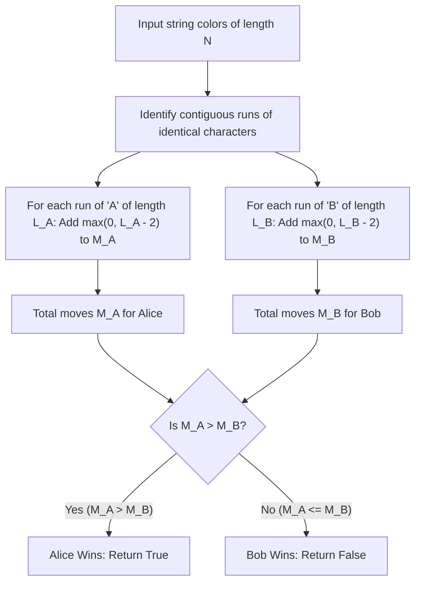

# Guided Example: Remove Colored Pieces if Both Neighbors are the Same Color

## 1. Concrete Problem Restatement & Input Data

We are given a string $\text{colors}$ of length $N$ where each character represents a piece colored either `'A'` (Alice's color) or `'B'` (Bob's color), arranged in a linear sequence.

Alice and Bob play a sequential turn-based game according to the following rules:
1. **Turn Order**: Alice always moves first, followed by Bob, alternating turns.
2. **Alice's Move Condition**: Alice may remove any piece `'A'` if and only if both its immediate left neighbor and immediate right neighbor are also `'A'` (meaning the piece is part of an unbroken `"AAA"` sequence).
3. **Bob's Move Condition**: Bob may remove any piece `'B'` if and only if both its immediate left neighbor and immediate right neighbor are also `'B'` (meaning the piece is part of an unbroken `"BBB"` sequence).
4. **Boundary Restrictions**: Neither player may remove an edge piece (at index $0$ or index $N - 1$).
5. **Loss Condition**: A player who cannot make a legal removal on their turn immediately loses the game.

Assuming both players play with optimal strategy, determine whether Alice is guaranteed to win.

### Sample Input Dataset

Consider the representative configuration:
$$\text{colors} = \text{"AAABABB"}$$

We contrast this with a short string:
$$\text{colors}_{\text{short}} = \text{"AA"}$$
and an asymmetric long-run instance:
$$\text{colors}_{\text{skew}} = \text{"ABBBBBBBAAA"}$$

---

## 2. Conceptual Walkthrough & Visual Intuition

In many combinatorial games, a move by one player directly alters the set of moves available to the opponent. However, this game exhibits a profound decoupling principle: **the game states for Alice and Bob are completely orthogonal and mutually independent**.

### The Orthogonality Invariant
Suppose Alice removes an `'A'`:
- The removed piece was flanked on the left by `'A'` and on the right by `'A'`.
- Deleting this piece concatenates an `'A'` with another `'A'`.
- This removal can never bring two `'B'` pieces closer together, nor can it split or modify any contiguous sequence of `'B'` pieces.
- Symmetrically, when Bob removes a `'B'`, the removed piece was flanked by two `'B'`s, which can never alter any sequence of `'A'` pieces.

Therefore:
1. No move by Alice can ever increase or decrease the number of legal moves available to Bob.
2. No move by Bob can ever increase or decrease the number of legal moves available to Alice.
3. Every contiguous run of identical characters of length $L$ yields exactly $\max(0, L - 2)$ independent moves, regardless of the order in which pieces are removed.

### Tallying Independent Move Pools
Let $M_A$ be the total number of legal moves available to Alice:
$$M_A = \sum_{\text{runs of 'A'}} \max(0, \text{length} - 2)$$
Let $M_B$ be the total number of legal moves available to Bob:
$$M_B = \sum_{\text{runs of 'B'}} \max(0, \text{length} - 2)$$

Because the game is finite, impartial within each player's separate move pool, and has no interference between players:
- Alice plays on turn $1, 3, 5, \dots$
- Bob plays on turn $2, 4, 6, \dots$

Alice wins if and only if she has strictly more moves available than Bob:
$$M_A > M_B$$
If $M_A \le M_B$, Alice will run out of moves either strictly before Bob or on the same turn, resulting in an immediate loss because Alice must move first.

---

## 3. Step-by-Step State Progression Table

Let us trace the primary sample $\text{colors} = \text{"AAABABB"}$ ($N = 7$).

We decompose the string into maximal contiguous uniform runs:

| Run Index | Substring Run | Character | Run Length $L$ | Moves Contributed $\max(0, L - 2)$ | Beneficiary | Cumulative $(M_A, M_B)$ |
|---|---|---|---|---|---|---|
| $1$ | `"AAA"` | `'A'` | $3$ | $\max(0, 3 - 2) = 1$ | Alice | $(1, 0)$ |
| $2$ | `"B"` | `'B'` | $1$ | $\max(0, 1 - 2) = 0$ | Bob | $(1, 0)$ |
| $3$ | `"A"` | `'A'` | $1$ | $\max(0, 1 - 2) = 0$ | Alice | $(1, 0)$ |
| $4$ | `"BB"` | `'B'` | $2$ | $\max(0, 2 - 2) = 0$ | Bob | $(1, 0)$ |

Total move capacities:
- Alice's total moves: $M_A = 1$
- Bob's total moves: $M_B = 0$

Now, let us trace the turn-by-turn game execution:

| Turn | Active Player | Available Moves Before Turn | Move Executed | Board State After Move | Available Moves Remaining | Outcome |
|---|---|---|---|---|---|---|
| $1$ | Alice | $M_A = 1, M_B = 0$ | Removes middle `'A'` from `"AAA"` (index $1$) | `"AABABB"` | $M_A = 0, M_B = 0$ | Valid move completed |
| $2$ | Bob | $M_A = 0, M_B = 0$ | No legal moves available | `"AABABB"` | N/A | **Bob has no move and loses!** |

Alice wins. Final verdict: `true`.

---

## 4. Key Transition Dynamics & Boundary Handling

The transition behavior across various run distributions demonstrates why simple counting solves the game:

1. **Length Thresholding**:
   - A run of length $1$ (e.g. `"A"`) or length $2$ (e.g. `"AA"`) provides $0$ moves, because neither element has two identical neighbors within the run.
   - A run of length $3$ provides $3 - 2 = 1$ move (the middle element).
   - A run of length $4$ (e.g. `"AAAA"`) provides $4 - 2 = 2$ moves (either interior element can be removed first; after removal, a 3-run remains, yielding a second move).
2. **Equality Tie-Breaking ($M_A = M_B$)**:
   - If $M_A = M_B$, Bob wins. For example, if $M_A = 1$ and $M_B = 1$:
     - Turn 1: Alice uses her $1$ move.
     - Turn 2: Bob uses his $1$ move.
     - Turn 3: Alice has $0$ moves remaining and loses.
   - Alice requires a **strict majority** ($M_A > M_B$) to win.

| String Configuration | Runs of 'A' | Runs of 'B' | Alice Moves $M_A$ | Bob Moves $M_B$ | Strict Check $M_A > M_B$ | Winner |
|---|---|---|---|---|---|---|
| `"AAABABB"` | `["AAA", "A"]` | `["B", "BB"]` | $1 + 0 = 1$ | $0 + 0 = 0$ | $1 > 0 \implies \text{True}$ | **Alice** |
| `"AA"` | `["AA"]` | `[]` | $0$ | $0$ | $0 > 0 \implies \text{False}$ | **Bob** |
| `"ABBBBBBBAAA"` | `["A", "AAA"]` | `["BBBBBBB"]` | $0 + 1 = 1$ | $7 - 2 = 5$ | $1 > 5 \implies \text{False}$ | **Bob** |
| `"AAAAABBBB"` | `["AAAAA"]` | `["BBBB"]` | $5 - 2 = 3$ | $4 - 2 = 2$ | $3 > 2 \implies \text{True}$ | **Alice** |
| `"AAABBB"` | `["AAA"]` | `["BBB"]` | $1$ | $1$ | $1 > 1 \implies \text{False}$ | **Bob** |

---

## 5. Algorithmic Correctness & Soundness

### Non-Interference Lemma
Let $S$ be the string of pieces. An operation by Alice removes a character $S[i] = \text{'A'}$ where $S[i-1] = S[i+1] = \text{'A'}$.
- The newly adjacent characters after removal are $S[i-1]$ and $S[i+1]$, both of which are `'A'`.
- No character `'B'` was adjacent to $S[i]$.
- The index of every `'B'` piece shifts left by at most $1$, but the contiguous structure, adjacency, and cardinalities of all runs of `'B'` are strictly preserved.
- Symmetrically, removals of `'B'` by Bob preserve all runs of `'A'`.
Hence, the total number of legal removals for Alice is an invariant of the initial string:
$$M_A = \sum_{i=1}^{N-2} \mathbf{1}_{S[i-1] = S[i] = S[i+1] = \text{'A'}}$$
and for Bob:
$$M_B = \sum_{i=1}^{N-2} \mathbf{1}_{S[i-1] = S[i] = S[i+1] = \text{'B'}}$$

### Game Termination and Victory Condition
Because both move pools are finite and mutually decoupled, the game is isomorphic to a game with two independent counters $M_A$ and $M_B$. On their turn, each player decrements their own counter by $1$.
- Alice moves on odd steps $1, 3, \dots, 2M_A - 1$.
- Bob moves on even steps $2, 4, \dots, 2M_B$.
Alice can play on step $2k + 1$ if and only if $M_A \ge k + 1$. Bob can respond on step $2k + 2$ if and only if $M_B \ge k + 1$.
The first player forced to move with an empty counter loses. Alice runs out of moves on or before Bob if and only if $M_A \le M_B$.
Therefore, Alice wins if and only if $M_A > M_B$.

---

## 6. Edge Cases & Common Pitfalls

1. **Equal Moves Trap ($M_A = M_B$)**: Concluding that equal moves means a tie or a win for the first player. A player who has no moves on their turn loses immediately; when $M_A = M_B$, Alice exhausts her moves first, so Bob wins.
2. **Cross-Run Interaction Illusion**: Assuming that removing pieces might fuse two disjoint runs of `'A'` separated by a `'B'`. Since neither player can ever eliminate the boundary `'B'` of another run (the boundary `'B'` is adjacent to an `'A'`, so it can never be removed), runs never coalesce.
3. **Strings of Length $< 3$**: Strings of length $1$ or $2$ cannot contain any triplet. Both $M_A = 0$ and $M_B = 0$, correctly returning `false` as Alice cannot make the first move.

---

## 7. Complexity Analysis

### Time Complexity
- **Single Linear Scan**: We iterate through the string of length $N$ once, checking if $S[i-1] = S[i] = S[i+1]$ for each index $i \in [1, N-2]$.
- **Constant Time Evaluation**: Each character comparison and counter increment takes $\mathcal{O}(1)$ time.
- **Total Time Complexity**: $\mathcal{O}(N)$, which is optimal since every character must be inspected.

### Space Complexity
- **Scalar Counters**: Only two integer counters are maintained: $M_A$ and $M_B$.
- **No Auxiliary Data Structures**: Operates directly in-place without memory allocation.
- **Total Auxiliary Space**: $\mathcal{O}(1)$, requiring strictly constant additional memory.
