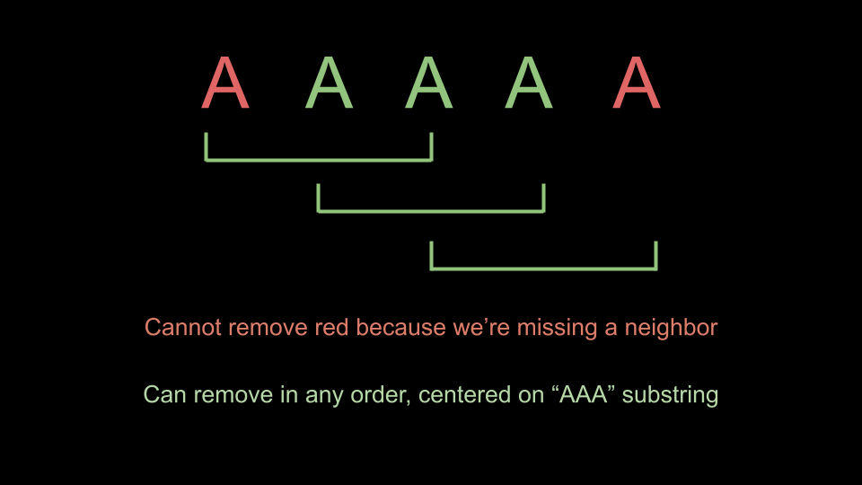

## Solution

---

### Approach: Count

**Intuition**

There are two very important things to notice about this game that will allow us to easily solve the problem:

1. When one player removes a letter, it will **never** create a new removal opportunity for the other player. For example, let's say you had `"ABAA"`. If the `"B"` wasn't there, then Alice would have a new removal opportunity. However, the `"B"` can never be removed because of the rules of the game. This observation implies that at the start of the game, all moves are already available to both players.
2. The order in which the removals happen is irrelevant. This is a side effect of the previous observation. Let's say there was a section in the middle of the string `"BAAAAAB"`. Alice has three removal choices here, $"\text{BA}[A]AAAB"$, $"\text{BAA}[A]AAB"$, and $"\text{BAAA}[A]AB"$. However, her choice is irrelevant, because all three choices will result in `"BAAAAB"`.

We can think of splitting the string into groups. A group consists of three or more of the same character. From observation 2, removals within a group can happen in any order. From observation 1, no two groups can ever "merge".

**Thus, the only thing that matters is the number of moves available to both players at the start of the game**.

The number of moves available to Alice is the number of times the substring `"AAA"` appears. Similarly, the number of moves available to Bob is the number of times the substring `"BBB"` appears.

As shown below, in the string `"AAAAA"`, substring `"AAA"` appears 3 times, indicating 3 moves available for Alice.


<br>

We can simply iterate over the string and for each index `i`, check if $colors[i - 1] = \text{colors}[i] = colors[i + 1]$. If so, then we can increment either Alice or Bob's available moves.

Because Alice moves first, she must make at least one move more than Bob to win. That is, Alice wins if $alice - bob \ge 1$. For example, let's say Alice has 3 moves and Bob has 2 moves.

- Turn 1: Alice
- Turn 2: Bob
- Turn 3: Alice
- Turn 4: Bob
- Turn 5: Alice
- Turn 6: Bob has no moves left but it's his turn, Bob loses

**Algorithm**

1. Initialize $alice = bob = 0$.
2. Iterate `i` from `1` to $\text{colors.length} - 1$.
- If $colors[i - 1] = \text{colors}[i] = colors[i + 1]$, increment `Alice` or `Bob` depending on what $\text{colors}[i]$ is. If $\text{colors}[i]$ is equal to `"A"`, increment `Alice`, otherwise, increment `Bob`.
3. Return $alice - bob \ge 1$

**Implementation**

```python
class Solution:
    def winnerOfGame(self, colors: str) -> bool:
        alice = 0
        bob = 0

        for i in range(1, len(colors) - 1):
            if colors[i - 1] == colors[i] == colors[i + 1]:
                if colors[i] == "A":
                    alice += 1
                else:
                    bob += 1

        return alice - bob >= 1
```

**Complexity Analysis**

Given $n$ as the length of `colors`,

* Time complexity: $O(n)$

    We iterate over the input once, performing $O(1)$ work at each iteration step.

* Space complexity: $O(1)$

    We don't use any extra space except for a few integers.

<br/>

---