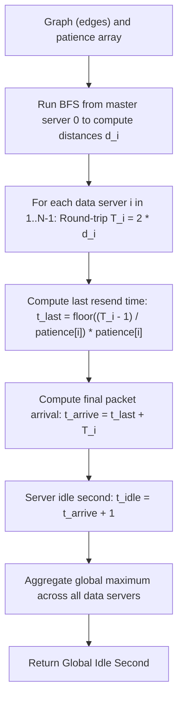

# Guided Example: The Time When the Network Becomes Idle

## 1. Concrete Problem Restatement & Input Data

We are given an undirected connected computer network consisting of $N$ servers labeled from $0$ to $N - 1$, connected by $E$ communication channels given in `edges`. Each channel takes exactly $1$ second for a packet to traverse in either direction, and channels have infinite bandwidth (any number of messages may traverse simultaneously without collision or queuing delays).

Server $0$ is designated as the **master server**, and all other servers ($1$ to $N - 1$) are **data servers**.
The protocol operates under the following rules:
1. **Initial Send**: At time $t = 0$, every data server sends an initial request message to server $0$ along a shortest path.
2. **Master Reply**: Server $0$ receives messages and immediately emits an acknowledgement reply along the reverse shortest path.
3. **Patience & Resend**: Each data server $i$ has an integer parameter $\text{patience}[i]$. If server $i$ has not yet received a reply to its initial request, it resends a new copy of the request every $\text{patience}[i]$ seconds (at times $\text{patience}[i], 2 \cdot \text{patience}[i], \dots$).
4. **Receipt Precedence**: If a reply arrives at the start of second $t$, it is processed before the resend decision for second $t$. Once a server observes the first reply, it halts all further retransmissions.
5. **Network Idle Condition**: A second is defined as completely idle if, at its beginning, **no message or reply is in transit anywhere in the network, and no message arrives**.

Our goal is to determine the earliest integer second at which the entire network becomes idle.

### Sample Input Dataset

Consider the three-server chain:
$$\text{edges} = [[0, 1], [1, 2]], \quad \text{patience} = [0, 2, 1]$$

We contrast this with a redundant network with large patience:
$$\text{edges}_{\text{tri}} = [[0, 1], [0, 2], [1, 2]], \quad \text{patience} = [0, 10, 10]$$
and a minimal two-server link:
$$\text{edges}_{\text{min}} = [[0, 1]], \quad \text{patience} = [0, 1]$$

---

## 2. Conceptual Walkthrough & Visual Intuition

The total time until network quiescence is dictated by the server whose final in-flight packet returns latest.

### Shortest Path & Round-Trip Latency
Using Breadth-First Search (BFS) rooted at master server $0$, we compute the shortest path distance $d_i$ (in edge hops) from server $0$ to each data server $i$.
Because each edge takes $1$ second, the one-way transit time is $d_i$ seconds, and the round-trip latency is:
$$T_i = 2 \cdot d_i$$

### Timing of the Final Retransmission
Server $i$ transmits its first packet at $t = 0$. The reply to this packet returns to server $i$ at time $t = T_i$.
Because arrivals at $t$ take precedence over sending at $t$, server $i$ will never send a packet at or after $t = T_i$.
Therefore, retransmissions occur at multiples $k \cdot \text{patience}[i]$ strictly prior to $T_i$:
$$k \cdot \text{patience}[i] < T_i \iff k \cdot \text{patience}[i] \le T_i - 1$$

The timestamp of the **final retransmission** from server $i$ is:
$$t_{\text{last}}(i) = \left\lfloor \frac{T_i - 1}{\text{patience}[i]} \right\rfloor \cdot \text{patience}[i]$$

### Last Packet Absorption and Quiescence
This final packet requires a full round-trip duration $T_i$ to reach server $0$ and return to server $i$. The packet finally arrives back at server $i$ at:
$$t_{\text{arrive}}(i) = t_{\text{last}}(i) + T_i$$

During the beginning of second $t_{\text{arrive}}(i)$, the packet arrives. The network becomes idle starting at the very next integer second:
$$t_{\text{idle}}(i) = t_{\text{arrive}}(i) + 1 = \left\lfloor \frac{2d_i - 1}{\text{patience}[i]} \right\rfloor \cdot \text{patience}[i] + 2d_i + 1$$

The global network idle time is the maximum over all data servers $i \in [1, N - 1]$:
$$\text{Global Idle Time} = \max_{1 \le i < N} t_{\text{idle}}(i)$$

---

## 3. Step-by-Step State Progression Table

Let us trace $\text{edges} = [[0, 1], [1, 2]]$ with $\text{patience} = [0, 2, 1]$.
Network structure: $0 \longleftrightarrow 1 \longleftrightarrow 2$.

### Stage 1: BFS Distance Calculation
- Server $0$: Distance $d_0 = 0$ (Master)
- Server $1$: Shortest path $0 \to 1 \implies d_1 = 1$
- Server $2$: Shortest path $0 \to 1 \to 2 \implies d_2 = 2$

### Stage 2: Per-Server Packet Lifecycle Evaluation

| Data Server $i$ | Distance $d_i$ | Round-Trip $T_i = 2d_i$ | Patience $P_i$ | Maximum Safe Bound $T_i - 1$ | Last Resend Time $t_{\text{last}}$ | Final Packet Arrival $t_{\text{arrive}}$ | Earliest Idle Second $t_{\text{arrive}} + 1$ | Packet Lifecycle Narrative |
|---|---|---|---|---|---|---|---|---|
| $1$ | $1$ | $2 \cdot 1 = 2$ | $2$ | $2 - 1 = 1$ | $\lfloor 1/2 \rfloor \cdot 2 = 0$ | $0 + 2 = 2$ | $2 + 1 = 3$ | Sends only at $t=0$. Reply arrives at $t=2$. Idle at $3$. |
| $2$ | $2$ | $2 \cdot 2 = 4$ | $1$ | $4 - 1 = 3$ | $\lfloor 3/1 \rfloor \cdot 1 = 3$ | $3 + 4 = 7$ | $7 + 1 = 8$ | Sends at $t=0, 1, 2, 3$. Reply to first arrives at $t=4$ (halting sends). Last packet returns at $t=7$. Idle at $8$. |

Taking the maximum across all data servers:
$$\text{Global Idle Time} = \max(3, 8) = 8$$

Now, let us examine the detailed chronology of Server $2$:

| Timestamp $t$ | Outgoing Packet Action | In-Flight Packets on Network | Incoming Reply Observed | State Notes |
|---|---|---|---|---|
| $t = 0$ | Emits Packet 0 towards Master | Packet 0 moving $2 \to 1$ | None | Initial broadcast |
| $t = 1$ | Emits Packet 1 (Patience = 1) | Packet 0 at $1 \to 0$; Packet 1 at $2 \to 1$ | None | First timeout resend |
| $t = 2$ | Emits Packet 2 | Packet 0 at Master; Packet 1 at $1 \to 0$; Packet 2 at $2 \to 1$ | None | Master replies to Packet 0 |
| $t = 3$ | Emits Packet 3 (Final send!) | Packet 0 returning $0 \to 1$; others in transit | None | Last moment before reply arrival |
| $t = 4$ | **No send** (Reply 0 arrives!) | Packet 1 returning; Packets 2, 3 in transit | **Reply 0 received** | Halts future resends |
| $t = 5$ | Idle | Packet 2 returning; Packet 3 in transit | Reply 1 received | Draining pipeline |
| $t = 6$ | Idle | Packet 3 returning $1 \to 2$ | Reply 2 received | Draining pipeline |
| $t = 7$ | Idle | None after this second | **Reply 3 received** | Final message absorbed |
| $t = 8$ | Idle | **Network Completely Clear** | None | **First Idle Second** |

---

## 4. Key Transition Dynamics & Boundary Handling

The transition behavior clarifies the critical role of arrival precedence:

1. **The $T_i - 1$ Strict Inequality**:
   - For Server $1$, $T_1 = 2$ and $P_1 = 2$.
   - A naive modulo without subtraction might ask: "Does $t = 2$ trigger a send since $2 \bmod 2 = 0$?"
   - The problem specifies that an arrival at $t = 2$ is processed **before** the resend decision. Because the reply returns at $t = 2$, Server $1$ sees the reply first and never resends at $t = 2$. The numerator must strictly be $T_i - 1$.
2. **Patience Exceeding Round-Trip ($P_i \ge T_i$)**:
   - In $\text{edges}_{\text{tri}}$ with $P = 10$ and $T_i = 2$:
     $t_{\text{last}} = \lfloor (2 - 1) / 10 \rfloor \cdot 10 = 0$.
     The server receives its reply long before its patience runs out; only the single opening packet is ever sent.
3. **Patience Equal to One ($P_i = 1$)**:
   - Every second without a reply fires a new packet. The server emits $T_i$ total packets, finishing at $2T_i - 1$.

| Network Scenario | Distance $d_i$ | Round-Trip $T_i$ | Patience $P_i$ | Resend Multiples Fired | Final Arrival $t_{\text{arrive}}$ | Idle Second |
|---|---|---|---|---|---|---|
| Large Patience ($P \ge T$) | $1$ | $2$ | $10$ | $[0]$ | $0 + 2 = 2$ | $3$ |
| Exact Divisor ($P = T$) | $2$ | $4$ | $4$ | $[0]$ | $0 + 4 = 4$ | $5$ |
| Frequent Resend ($P = 1$) | $2$ | $4$ | $1$ | $[0, 1, 2, 3]$ | $3 + 4 = 7$ | $8$ |
| Fractional Interval | $3$ | $6$ | $4$ | $[0, 4]$ | $4 + 6 = 10$ | $11$ |

---

## 5. Algorithmic Correctness & Soundness

### Soundness of the BFS Metric
Because all communication channels possess uniform unit weight ($1$ second), Breadth-First Search from source vertex $0$ computes the exact unweighted shortest path distance $d_i$ for every vertex $i$. Since requests and replies strictly follow shortest paths, the round-trip latency $T_i = 2d_i$ is uniquely determined.

### Exactness of the Final Transmission Timestamp
A transmission occurs at time $t$ if and only if:
$$t = k \cdot P_i \quad \text{for integer } k \ge 0 \quad \text{and} \quad t < T_i$$
The maximum integer $k$ satisfying $k \cdot P_i \le T_i - 1$ is uniquely $k^* = \lfloor (T_i - 1) / P_i \rfloor$.
Hence, $t_{\text{last}}(i) = k^* \cdot P_i$ is the exact moment the final packet departs.
Since every packet takes exactly $T_i$ seconds to return, the final reply arrives at $t_{\text{last}}(i) + T_i$. No packets exist in transit after this second, proving $t_{\text{last}}(i) + T_i + 1$ is the exact first moment of complete quiescence for server $i$. Taking the maximum over all servers yields the globally exact network idle time.

---

## 6. Edge Cases & Common Pitfalls

1. **Off-by-One in Packet Arrival Precedence**: Using $\lfloor T_i / P_i \rfloor$ rather than $\lfloor (T_i - 1) / P_i \rfloor$. When $T_i$ is an exact multiple of $P_i$, this mistake generates an extra, nonexistent packet at $t = T_i$, inflating the answer by $P_i + 1$.
2. **Ignoring the Master Server**: Including server $0$ in the maximization loop. Server $0$ never sends requests to itself; only data servers $i \in [1, N - 1]$ generate network traffic.
3. **Graph Disconnectedness**: The problem contract guarantees the network is connected, ensuring BFS visits all $N$ servers.

---

## 7. Complexity Analysis

### Time Complexity
- **Graph Construction**: Building the adjacency list from $E$ edges takes $\mathcal{O}(N + E)$ time.
- **BFS Traversal**: Standard BFS queues and visits each vertex once and traverses each edge twice, taking $\mathcal{O}(N + E)$ time.
- **Arithmetic Quiescence Calculation**: For each of the $N - 1$ data servers, evaluating $t_{\text{idle}}(i)$ requires $\mathcal{O}(1)$ basic arithmetic operations.
- **Total Time Complexity**: $\mathcal{O}(N + E)$, which scales linearly with the network topology and runs in $< 20$ milliseconds for $N, E \le 10^5$.

### Space Complexity
- **Adjacency Representation**: The graph adjacency list stores $2E$ directed edge entries, requiring $\mathcal{O}(N + E)$ memory.
- **BFS Queue & Visited Set**: The queue and visited set store at most $N$ vertex identifiers, consuming $\mathcal{O}(N)$ memory.
- **Total Auxiliary Space**: $\mathcal{O}(N + E)$ space.
