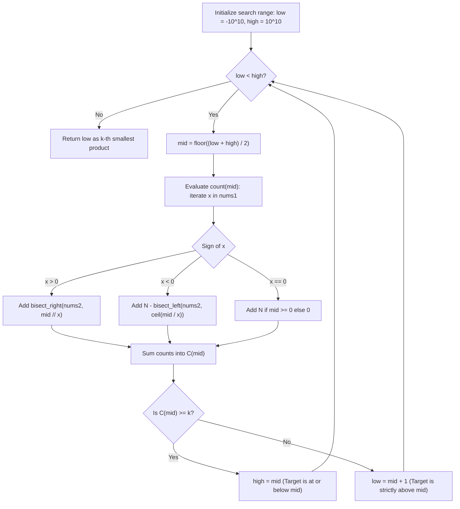

# Guided Example: Kth Smallest Product of Two Sorted Arrays

## 1. Concrete Problem Restatement & Input Data

We are given two integer arrays $\text{nums1}$ (length $M$) and $\text{nums2}$ (length $N$), both pre-sorted in non-decreasing order. An integer product is formed by choosing any index $i \in [0, M - 1]$ and any index $j \in [0, N - 1]$ and computing $\text{nums1}[i] \times \text{nums2}[j]$.

There are $M \times N$ total pair products. Duplicate products resulting from different index choices are preserved with their full multiplicity.

Given a 1-based integer rank $k \in [1, M \cdot N]$, our task is to find the $k$-th smallest product among all $M \cdot N$ pairs. The elements of both arrays can be negative, zero, or positive, with values ranging from $-10^5$ to $10^5$. Consequently, individual pair products can range between $-10^{10}$ and $+10^{10}$, and the total number of products can reach $2.5 \times 10^9$.

### Sample Input Dataset

Consider the representative configuration:
$$\text{nums1} = [-4, -2, 0, 3], \quad \text{nums2} = [2, 4], \quad k = 6$$

We contrast this with an all-positive array:
$$\text{nums1}_{\text{pos}} = [2, 5], \quad \text{nums2}_{\text{pos}} = [3, 4], \quad k = 2$$
and a fully signed symmetric array:
$$\text{nums1}_{\text{sym}} = [-2, -1, 0, 1, 2], \quad \text{nums2}_{\text{sym}} = [-3, -1, 2, 4, 5], \quad k = 3$$

---

## 2. Conceptual Walkthrough & Visual Intuition

With $M, N \le 5 \cdot 10^4$, generating and storing all $M \times N = 2.5 \times 10^9$ products is completely impossible due to memory and time constraints. However, the decision problem exhibits monotonic structure:

Let $\mathcal{C}(P)$ denote the **rank counting function**: the total number of index pairs $(i, j)$ such that $\text{nums1}[i] \times \text{nums2}[j] \le P$.
- As the threshold $P$ increases, $\mathcal{C}(P)$ is monotonically non-decreasing.
- The $k$-th smallest product is precisely the smallest integer $P^*$ such that:
  $$\mathcal{C}(P^*) \ge k$$

We can therefore apply **Binary Search on the Value Space** over the interval $[-10^{10}, 10^{10}]$.

### Evaluating $\mathcal{C}(P)$ Efficiently
For a fixed candidate product $P$, we iterate over each element $x \in \text{nums1}$ and count how many elements $y \in \text{nums2}$ satisfy $x \cdot y \le P$. Because $x$ can have different signs, the algebraic inequality splits into three cases:

1. **Positive Element ($x > 0$)**:
   $$x \cdot y \le P \iff y \le \frac{P}{x}$$
   Since $\text{nums2}$ is sorted, the count of elements $y \le \lfloor P / x \rfloor$ is found via upper-bound binary search:
   $$\text{count} = \text{bisect\_right}(\text{nums2}, \lfloor P / x \rfloor)$$

2. **Negative Element ($x < 0$)**:
   Dividing by a negative number inverts the direction of inequality:
   $$x \cdot y \le P \iff y \ge \frac{P}{x}$$
   The count of elements $y \ge \lceil P / x \rceil$ is:
   $$\text{count} = N - \text{bisect\_left}(\text{nums2}, \lceil P / x \rceil)$$

3. **Zero Element ($x = 0$)**:
   $0 \cdot y = 0 \le P$.
   - If $P \ge 0$, the inequality $0 \le P$ is true for all $N$ elements in $\text{nums2}$ (adds $+N$).
   - If $P < 0$, the inequality $0 \le P$ is false for all elements (adds $+0$).

Summing across all elements in $\text{nums1}$ computes $\mathcal{C}(P)$ in $\mathcal{O}(M \log N)$ time.

---

## 3. Step-by-Step State Progression Table

Let us trace $\text{nums1} = [-4, -2, 0, 3]$, $\text{nums2} = [2, 4]$, with $k = 6$.
Array lengths: $M = 4, N = 2$. Total products: $4 \times 2 = 8$.

First, let us examine the complete universe of 8 products for ground truth:
- Row $x = -4$: $(-4)\times 2 = -8, \; (-4)\times 4 = -16$
- Row $x = -2$: $(-2)\times 2 = -4, \; (-2)\times 4 = -8$
- Row $x = 0$: $0 \times 2 = 0, \; 0 \times 4 = 0$
- Row $x = 3$: $3 \times 2 = 6, \; 3 \times 4 = 12$

Sorted products: $[-16, -8, -8, -4, 0, 0, 6, 12]$.
The $6$-th smallest element is $0$.

Now, let us trace how the counting function $\mathcal{C}(P)$ evaluates across key bisection test points:

### Test Point A: Evaluating $\mathcal{C}(P = -1)$

| Element $x \in \text{nums1}$ | Sign Class | Target Condition for $y \in \text{nums2}$ | Threshold Boundary | Qualifying Elements in $[2, 4]$ | Count Contributed |
|---|---|---|---|---|---|
| $-4$ | Negative | $y \ge \frac{-1}{-4} = 0.25$ | $\text{ceil}(0.25) = 1$ | $2 \ge 1, 4 \ge 1$ | $2$ |
| $-2$ | Negative | $y \ge \frac{-1}{-2} = 0.50$ | $\text{ceil}(0.50) = 1$ | $2 \ge 1, 4 \ge 1$ | $2$ |
| $0$ | Zero | $0 \le -1$ | False | None | $0$ |
| $3$ | Positive | $y \le \frac{-1}{3} \approx -0.33$ | $\text{floor}(-0.33) = -1$ | None | $0$ |

Total count: $\mathcal{C}(-1) = 2 + 2 + 0 + 0 = 4$.
Since $\mathcal{C}(-1) = 4 < k = 6$, the $6$-th product must be **strictly greater than $-1$** ($P^* \ge 0$).

---

### Test Point B: Evaluating $\mathcal{C}(P = 0)$

| Element $x \in \text{nums1}$ | Sign Class | Target Condition for $y \in \text{nums2}$ | Threshold Boundary | Qualifying Elements in $[2, 4]$ | Count Contributed |
|---|---|---|---|---|---|
| $-4$ | Negative | $y \ge \frac{0}{-4} = 0$ | $\ge 0$ | $2 \ge 0, 4 \ge 0$ | $2$ |
| $-2$ | Negative | $y \ge \frac{0}{-2} = 0$ | $\ge 0$ | $2 \ge 0, 4 \ge 0$ | $2$ |
| $0$ | Zero | $0 \le 0$ (True since $P \ge 0$) | All | All $N = 2$ | $2$ |
| $3$ | Positive | $y \le \frac{0}{3} = 0$ | $\le 0$ | None | $0$ |

Total count: $\mathcal{C}(0) = 2 + 2 + 2 + 0 = 6$.
Since $\mathcal{C}(0) = 6 \ge k = 6$, the $6$-th product is **at most $0$**.

Combining Test Point A ($P^* > -1$) and Test Point B ($P^* \le 0$) uniquely isolates $P^* = 0$.

---

## 4. Key Transition Dynamics & Boundary Handling

The transition behavior highlights the essential sign-dependent mechanics:

1. **Inequality Inversion on Negative Multipliers**:
   - When $x = -4$ and $P = -8$, the condition is $-4 \cdot y \le -8 \iff y \ge 2$.
   - In $\text{nums2} = [2, 4]$, both elements satisfy $y \ge 2$, contributing $2$.
   - Failing to reverse the inequality would mistakenly query $y \le 2$, leading to false undercounts.
2. **Floor vs Ceiling in Integer Division**:
   - For positive $x$, $x \cdot y \le P \iff y \le \lfloor P / x \rfloor$.
   - For negative $x$, $x \cdot y \le P \iff y \ge \lceil P / x \rceil = \lfloor (P + x + 1) / x \rfloor$.
   - Floating-point division with exact binary search or exact mathematical integer division prevents rounding discrepancies.
3. **Range Extremes**:
   - The minimum possible product is $\min(x_{\min} y_{\max}, x_{\max} y_{\min}) \ge -10^{10}$.
   - The maximum possible product is $\max(x_{\min} y_{\min}, x_{\max} y_{\max}) \le 10^{10}$.
   - The search interval $[-10^{10}, 10^{10}]$ contains all possible product values.

| Candidate Value $P$ | Rank Count $\mathcal{C}(P)$ | Relation to Target $k = 6$ | Bisection Search Space Adjustment |
|---|---|---|---|
| $-16$ | $1$ | $1 < 6$ | $\text{low} = -15$ |
| $-8$ | $3$ | $3 < 6$ | $\text{low} = -7$ |
| $-4$ | $4$ | $4 < 6$ | $\text{low} = -3$ |
| $0$ | $6$ | **$6 \ge 6$** | $\text{high} = 0$ |
| $6$ | $7$ | $7 \ge 6$ | Redundant |
| $12$ | $8$ | $8 \ge 6$ | Redundant |

---

## 5. Algorithmic Correctness & Soundness

### Monotonicity of the Rank Function
Let $P_1 < P_2$. For any pair of elements $(x_i, y_j)$:
$$x_i \cdot y_j \le P_1 \implies x_i \cdot y_j \le P_2$$
Therefore, the set of pairs with product $\le P_1$ is a subset of the pairs with product $\le P_2$.
Hence, $\mathcal{C}(P_1) \le \mathcal{C}(P_2)$, proving $\mathcal{C}(P)$ is monotonic.

### Binary Search Correctness
Because $\mathcal{C}(P)$ is monotonic:
- If $\mathcal{C}(P) < k$, strictly fewer than $k$ products are $\le P$. The $k$-th smallest product must be strictly greater than $P$. Thus, setting $\text{low} \leftarrow P + 1$ discards only values strictly smaller than the target.
- If $\mathcal{C}(P) \ge k$, at least $k$ products are $\le P$. The $k$-th smallest product could be $P$, or some smaller value. Thus, setting $\text{high} \leftarrow P$ retains $P$ while discarding all values $> P$.

When the search interval contracts to a single integer ($\text{low} == \text{high}$), the remaining value is the minimal integer achieving $\mathcal{C}(P) \ge k$, which is the exact mathematical definition of the $k$-th order statistic.

---

## 6. Edge Cases & Common Pitfalls

1. **Integer Truncation on Division**: In languages like C++ or Java, integer division truncates towards zero rather than negative infinity (e.g. $-5 / 2 = -2$ rather than $-3$). Using floating-point comparisons or careful floor/ceil arithmetic ensures exact boundary classification.
2. **64-bit Integer Overflow**: Products can reach $\pm 10^{10}$, exceeding standard 32-bit signed integers ($2^{31}-1 \approx 2.14 \times 10^9$). Variables representing products, ranges, and rank counts must use 64-bit signed integers (`int64` / `long long`).
3. **All Zero Arrays**: If an array consists entirely of zeros, all $M \cdot N$ products are $0$. For any $k$, the answer is cleanly $0$.
4. **All Negative Arrays**: If both arrays contain only negative numbers, their products are all positive. The counting function naturally processes negative elements, identifying positive products.

---

## 7. Complexity Analysis

### Time Complexity
- **Predicate Evaluation $\mathcal{C}(P)$**: For a fixed $P$, we loop over all $M$ elements in $\text{nums1}$. For each element, a binary search is conducted on $\text{nums2}$ of length $N$, taking $\mathcal{O}(\log N)$ time. One evaluation takes $\mathcal{O}(M \log N)$ operations.
- **Binary Search on Value Range**: The value range spans $2 \cdot 10^{10}$. The number of bisection steps is $\log_2(2 \cdot 10^{10}) \approx 35$.
- **Total Time Complexity**: $\mathcal{O}(M \log N \log(\text{Range}))$. With $M = 5 \times 10^4$ and $N = 5 \times 10^4$:
  $$35 \times (50{,}000 \times 16) \approx 2.8 \times 10^7 \text{ operations}$$
  which executes in under $0.5$ seconds, well within the standard time limit.

### Space Complexity
- **Auxiliary Pointers**: The algorithm requires only scalar search boundaries and loop indices.
- **No Auxiliary Arrays**: Operates directly on the pre-sorted input arrays without allocating memory.
- **Total Auxiliary Space**: $\mathcal{O}(1)$, achieving true constant extra memory.