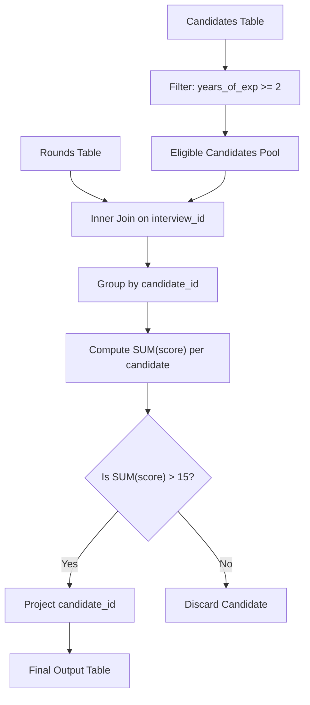

# Guided Example: Accepted Candidates From the Interviews

## 1. Concrete Problem Restatement & Input Data

We are given two relational database tables that track a company's recruitment and technical interview outcomes:

1. **`Candidates` Table**:
   - `candidate_id` (Integer, Primary Key): Unique identifier for the applicant.
   - `name` (Varchar): Full name of the candidate.
   - `years_of_exp` (Integer): Total years of professional industry experience.
   - `interview_id` (Integer): Unique identifier for the candidate's interview session.

2. **`Rounds` Table**:
   - `interview_id` (Integer): The interview session identifier (foreign key to `Candidates`).
   - `round_id` (Integer): The round number within that interview.
   - `score` (Integer): The score awarded in that individual round.
   - Composite Primary Key: `(interview_id, round_id)`.

Our goal is to identify and report the `candidate_id` of every applicant who simultaneously satisfies two strict criteria:
1. **Experience Threshold**: The candidate has **at least $2$ years** of professional experience ($\text{years\_of\_exp} \ge 2$).
2. **Interview Score Threshold**: The sum of scores across all rounds for their interview session is **strictly greater than $15$** ($\sum \text{score} > 15$).

The returned relation must project only the single column `candidate_id`. Any ordering of qualifying rows is acceptable.

### Sample Input Dataset

Consider the following candidate records:

**`Candidates` Table**:
| `candidate_id` | `name` | `years_of_exp` | `interview_id` |
|---|---|---|---|
| $11$ | Atticus | $1$ | $101$ |
| $9$ | Ruben | $6$ | $104$ |
| $6$ | Aliza | $10$ | $109$ |
| $8$ | Alfredo | $0$ | $107$ |

**`Rounds` Table**:
| `interview_id` | `round_id` | `score` |
|---|---|---|
| $109$ | $3$ | $4$ |
| $101$ | $2$ | $8$ |
| $109$ | $4$ | $1$ |
| $107$ | $1$ | $3$ |
| $104$ | $3$ | $6$ |
| $109$ | $1$ | $4$ |
| $104$ | $4$ | $7$ |
| $104$ | $1$ | $2$ |
| $109$ | $2$ | $1$ |
| $104$ | $2$ | $7$ |
| $107$ | $2$ | $3$ |
| $101$ | $1$ | $8$ |

---

## 2. Conceptual Walkthrough & Visual Intuition

The computation requires linking applicant profiles with their granular round scores through an inner equijoin, applying row-level predicate filtering, grouping by applicant, and filtering group aggregations.

### Relational Pipeline Stages
1. **Selection on Candidates ($\sigma_{\text{years\_of\_exp} \ge 2}$)**:
   Filter applicants prior to joining. Applicants with $< 2$ years of experience are immediately disqualified, avoiding unnecessary aggregation of their interview rounds.
2. **Equijoin on `interview_id` ($\bowtie_{\text{interview\_id}}$)**:
   Join the eligible candidate subset with `Rounds` using the shared key `interview_id`.
3. **Grouping and Aggregation ($\gamma$)**:
   Group the joined records by `candidate_id` and compute the total round score:
   $$\text{Total Score} = \sum \text{score}$$
4. **Group Filter ($\text{HAVING } \text{Total Score} > 15$)**:
   Keep only those candidates whose aggregated score strictly exceeds $15$. An aggregate sum of exactly $15$ is strictly disqualified.
5. **Projection ($\pi_{\text{candidate\_id}}$)**:
   Project exclusively the `candidate_id` attribute.

---

## 3. Step-by-Step State Progression Table

Let us trace each candidate from the sample dataset through the relational filtering stages:

### Stage 1: Candidate Experience Filter
Threshold: $\text{years\_of\_exp} \ge 2$.

| `candidate_id` | Name | Experience | $\text{years\_of\_exp} \ge 2$? | Stage 1 Status | Explanation |
|---|---|---|---|---|---|
| $11$ | Atticus | $1$ | $1 \ge 2 \implies \text{False}$ | **Disqualified** | Fails minimum experience requirement |
| $9$ | Ruben | $6$ | $6 \ge 2 \implies \text{True}$ | **Qualified** | Advances to interview evaluation |
| $6$ | Aliza | $10$ | $10 \ge 2 \implies \text{True}$ | **Qualified** | Advances to interview evaluation |
| $8$ | Alfredo | $0$ | $0 \ge 2 \implies \text{False}$ | **Disqualified** | Fails minimum experience requirement |

Candidates advancing to Stage 2: Ruben (ID $9$, interview $104$) and Aliza (ID $6$, interview $109$).

### Stage 2: Interview Round Score Aggregation & Qualification

| Candidate ID | Name | Interview ID | Round Scores Retrieved | Total Interview Score $\sum \text{score}$ | Strictly $> 15$? | Final Qualification Verdict |
|---|---|---|---|---|---|---|
| $9$ | Ruben | $104$ | Round 1: $2$ Round 2: $7$ Round 3: $6$ Round 4: $7$ | $2 + 7 + 6 + 7 = 22$ | **Yes ($22 > 15$)** | **Accepted** |
| $6$ | Aliza | $109$ | Round 1: $4$ Round 2: $1$ Round 3: $4$ Round 4: $1$ | $4 + 1 + 4 + 1 = 10$ | No ($10 \le 15$) | Rejected |

*(Note: Candidate 11 had total score $8 + 8 = 16 > 15$, but was already disqualified by experience in Stage 1).*

Final projected output:

| `candidate_id` |
|---|
| $9$ |

---

## 4. Key Transition Dynamics & Boundary Handling

The transition behavior clarifies how boundary conditions and conjunctions are evaluated:

1. **Exact Boundary at 15 Points**:
   - A candidate whose round scores sum to exactly $15$ fails the condition $\sum \text{score} > 15$.
   - The inequality is strict; scoring $15$ points is insufficient for acceptance.
2. **Exact Boundary at 2 Years**:
   - A candidate with exactly $2$ years of experience qualifies under $\text{years\_of\_exp} \ge 2$.
   - The inequality is inclusive; $2.0$ years satisfies the rule.
3. **Short-Circuit Optimization**:
   - Applying `WHERE years_of_exp >= 2` before or during the join minimizes the number of rows grouped in memory, which is significantly faster than grouping all candidates and filtering experience afterward.

| Scenario | Years of Exp | Round Scores | Total Score | Exp Check ($\ge 2$) | Score Check ($> 15$) | Verdict |
|---|---|---|---|---|---|---|
| High Score, Low Exp | $1$ | $[10, 10]$ | $20$ | False | True | Disqualified |
| Exact Threshold Exp & High Score | $2$ | $[8, 8]$ | $16$ | True | True | **Accepted** |
| High Exp, Exact Threshold Score | $5$ | $[7, 8]$ | $15$ | True | False ($15 \ngtr 15$) | Disqualified |
| Borderline Pass | $2$ | $[8, 8]$ | $16$ | True | True | **Accepted** |

---

## 5. Algorithmic Correctness & Soundness

### Relational Algebra Equivalence
Let $\mathcal{C}$ denote the `Candidates` relation and $\mathcal{R}$ denote the `Rounds` relation.
The formal query plan is:
$$\pi_{\text{candidate\_id}} \left( \sigma_{\text{total\_score} > 15} \left( \gamma_{\text{candidate\_id}, \text{SUM}(\text{score}) \to \text{total\_score}} \left( \sigma_{\text{years\_of\_exp} \ge 2}(\mathcal{C}) \bowtie_{\text{interview\_id}} \mathcal{R} \right) \right) \right)$$

1. **Safety and Precision**: Filtering $\sigma_{\text{years\_of\_exp} \ge 2}(\mathcal{C})$ discards every applicant who does not meet the legal experience floor.
2. **Completeness of Score Summation**: The inner equijoin on `interview_id` groups all rounds belonging to each candidate's interview session. Because `(interview_id, round_id)` is a composite primary key, each round score is summed exactly once without duplication.
3. **Exact Predicate Enforcement**: The selection $\sigma_{\text{total\_score} > 15}$ guarantees that only candidates exceeding the score threshold are emitted.

Because the conditions form a logical conjunction $(\text{experience} \ge 2) \land (\text{score} > 15)$, evaluating both predicates guarantees zero false positives and zero false negatives.

---

## 6. Edge Cases & Common Pitfalls

1. **Inclusive vs Strict Inequality Confusion**: Using $\ge 15$ instead of $> 15$ would improperly admit candidates scoring exactly $15$. Similarly, using $> 2$ instead of $\ge 2$ would exclude candidates with exactly $2$ years of experience.
2. **Candidates With Zero Rounds**: If an applicant has an `interview_id` that does not appear in `Rounds`, an inner join naturally excludes them, which is correct since their score is $0 \le 15$.
3. **Empty Output Set**: If no candidate satisfies both criteria simultaneously, the query must return an empty table with header `candidate_id` without error.

---

## 7. Complexity Analysis

### Time Complexity
- **Candidate Filter & Hash Join**: Scanning `Candidates` with $C$ rows and filtering takes $\mathcal{O}(C)$ time. Joining with `Rounds` containing $R$ rows using hash join takes $\mathcal{O}(C + R)$ time.
- **Aggregation**: Grouping joined tuples by `candidate_id` and accumulating scores takes $\mathcal{O}(R)$ time.
- **Filtering Groups**: Evaluating $\text{SUM}(\text{score}) > 15$ across at most $C$ candidate groups takes $\mathcal{O}(C)$ time.
- **Total Time Complexity**: $\mathcal{O}(C + R)$, which is strictly linear with respect to the total number of records across both database tables.

### Space Complexity
- **Hash Table Buffers**: Storing candidate records and group accumulators requires $\mathcal{O}(C)$ memory.
- **Output Container**: Stores at most $C$ qualifying `candidate_id` values.
- **Total Auxiliary Space**: $\mathcal{O}(C)$ working memory.
