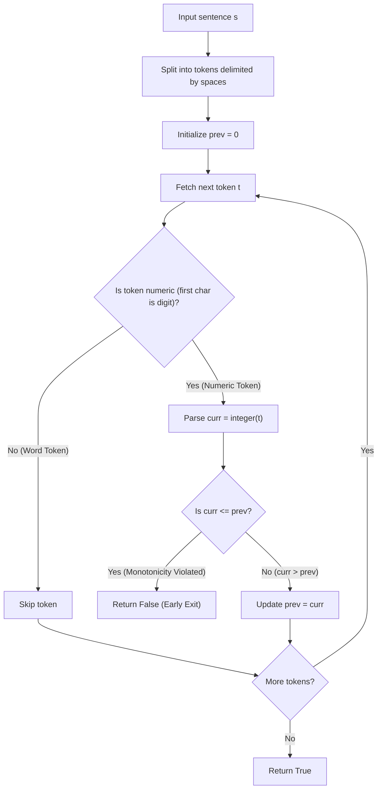

# Guided Example: Check if Numbers Are Ascending in a Sentence

## 1. Concrete Problem Restatement & Input Data

We are given a string sentence $s$ containing words and numbers separated by single spaces. There are no leading or trailing spaces, and each token is separated from adjacent tokens by exactly one space character. Every token is either:
- A lowercase English word (consisting entirely of letters `'a'` through `'z'`).
- A positive decimal integer without leading zeros (e.g. `"1"`, `"12"`, `"99"`).

We are instructed to extract all numeric tokens in the order they appear from left to right, ignoring all words. We must determine whether the resulting sequence of numbers is **strictly increasing**:
$$n_1 < n_2 < n_3 < \dots < n_k$$

If every numerical token is strictly greater than its immediate numerical predecessor, the function reports `true`. If any number is less than or equal to the preceding number ($n_i \le n_{i-1}$), the function reports `false`.

### Sample Input Dataset

Consider the representative sentence:
$$s = \text{"1 box has 3 blue 4 red 6 green and 12 yellow marbles"}$$

We contrast this with an equal-element violation:
$$s_{\text{eq}} = \text{"hello world 5 x 5"}$$
and an inversion sequence:
$$s_{\text{inv}} = \text{"sunset is at 7 51 pm overnight lows will be in the low 50 and 60 s"}$$

---

## 2. Conceptual Walkthrough & Visual Intuition

The task combines single-pass tokenization with running monotonic threshold verification.

### Token Classification
As we traverse the string, whitespace acts as the natural delimiter, splitting $s$ into a discrete sequence of tokens $[t_1, t_2, \dots, t_m]$.
Because each token is either a pure English word or a pure integer, checking whether the first character of a token is a digit ($t[0] \in \{'0', \dots, '9'\}$) uniquely identifies whether the token is a number.

### Monotonic Verification
We maintain a running scalar $\text{prev}$ initialized to $0$ (since all numbers in the sentence are positive integers $\ge 1$).
Whenever a numeric token $t$ is encountered:
1. Parse its decimal integer value: $\text{curr} = \text{integer}(t)$.
2. Verify strict monotonicity:
   - If $\text{curr} \le \text{prev}$, the sequence fails the strictly increasing contract. We terminate immediately and return `false`.
   - If $\text{curr} > \text{prev}$, the order is valid. We advance the anchor: $\text{prev} \leftarrow \text{curr}$.

If the entire sentence is processed without triggering an inequality violation, the numeric tokens are guaranteed to be strictly ascending, and we return `true`.

---

## 3. Step-by-Step State Progression Table

Let us trace $s = \text{"1 box has 3 blue 4 red 6 green and 12 yellow marbles"}$.
Initial state: $\text{prev} = 0$.

| Step | Token $t$ | Token Type | Parsed Value $\text{curr}$ | Check $\text{curr} > \text{prev}$ | Status | Updated $\text{prev}$ | Action Taken |
|---|---|---|---|---|---|---|---|
| $1$ | `"1"` | Numeric | $1$ | $1 > 0$ (True) | Valid | $1$ | First numeric anchor established |
| $2$ | `"box"` | Word | N/A | Skipped | Valid | $1$ | Ignored non-numeric word |
| $3$ | `"has"` | Word | N/A | Skipped | Valid | $1$ | Ignored non-numeric word |
| $4$ | `"3"` | Numeric | $3$ | $3 > 1$ (True) | Valid | $3$ | Strictly greater; anchor updated |
| $5$ | `"blue"` | Word | N/A | Skipped | Valid | $3$ | Ignored non-numeric word |
| $6$ | `"4"` | Numeric | $4$ | $4 > 3$ (True) | Valid | $4$ | Strictly greater; anchor updated |
| $7$ | `"red"` | Word | N/A | Skipped | Valid | $4$ | Ignored non-numeric word |
| $8$ | `"6"` | Numeric | $6$ | $6 > 4$ (True) | Valid | $6$ | Strictly greater; anchor updated |
| $9$ | `"green"`| Word | N/A | Skipped | Valid | $6$ | Ignored non-numeric word |
| $10$| `"and"` | Word | N/A | Skipped | Valid | $6$ | Ignored non-numeric word |
| $11$| `"12"` | Numeric | $12$ | $12 > 6$ (True) | Valid | $12$| Strictly greater; anchor updated |
| $12$| `"yellow"`| Word | N/A | Skipped | Valid | $12$| Ignored non-numeric word |
| $13$| `"marbles"`| Word| N/A | Skipped | Valid | $12$| End of tokens |

All numeric tokens $[1, 3, 4, 6, 12]$ are strictly increasing. Final result: `true`.

---

## 4. Key Transition Dynamics & Boundary Handling

The transition dynamics reveal how violations are instantly caught:

1. **Equality Violation ($s_{\text{eq}}$)**:
   - In `"hello world 5 x 5"`, the numeric sequence is $[5, 5]$.
   - First number: $\text{curr} = 5 > 0 \implies \text{prev} = 5$.
   - Second number: $\text{curr} = 5$. Condition check $5 \le 5$ evaluates to true!
   - Equality violates the strict inequality condition. The algorithm returns `false` immediately on step 5.
2. **Downward Inversion ($s_{\text{inv}}$)**:
   - In `"sunset is at 7 51 pm overnight lows will be in the low 50 and 60 s"`:
   - Extracted numbers: $7 \to 51 \to 50$.
   - At $50$, $\text{prev} = 51$. Since $50 \le 51$, the descent is detected, halting execution and returning `false`.

| Sample Sentence | Extracted Numbers | Pairwise Monotonicity Checks | Failure Point | Result |
|---|---|---|---|---|
| `"1 box has 3 blue 4 red 6 green and 12 yellow marbles"` | $[1, 3, 4, 6, 12]$ | $1 < 3 < 4 < 6 < 12$ | None | `true` |
| `"hello world 5 x 5"` | $[5, 5]$ | $5 \le 5$ | At second $5$ | `false` |
| `"sunset is at 7 51 pm ... 50 and 60 s"` | $[7, 51, 50, 60]$ | $7 < 51$, but $51 \ge 50$ | At $50$ | `false` |
| `"4 5 11 26"` | $[4, 5, 11, 26]$ | $4 < 5 < 11 < 26$ | None | `true` |

---

## 5. Algorithmic Correctness & Soundness

### Invariant: Prefix Ascending Property
At any token index $m$, let $[n_1, n_2, \dots, n_k]$ be the sequence of numeric tokens encountered so far.
- If the loop has not exited, then $n_1 < n_2 < \dots < n_k$, and the variable $\text{prev} = n_k$.
- When the next numeric token $n_{k+1}$ arrives:
  - If $n_{k+1} \le \text{prev}$, then $n_k \ge n_{k+1}$, which contradicts strict monotonicity. Returning `false` is both necessary and sound.
  - If $n_{k+1} > \text{prev}$, then $n_k < n_{k+1}$. By the transitivity of strict inequality, $n_1 < n_2 < \dots < n_k < n_{k+1}$ holds, preserving the invariant.

### Completeness
If all tokens in the string are processed without returning `false`, every adjacent pair of numeric tokens has been tested and verified to satisfy $n_i < n_{i+1}$. Hence, the global sequence is strictly increasing, and returning `true` is mathematically sound.

---

## 6. Edge Cases & Common Pitfalls

1. **Non-Strict Increasing Fallacy**: Treating $\le$ as valid. The problem statement explicitly specifies that "equality does not count as increasing."
2. **Numeric Multi-Digit Parsing**: A number like `"51"` must be parsed as the decimal value $51$, not compared character-by-character as `'5'` then `'1'`.
3. **Leading Zero Assumptions**: The problem contract guarantees numbers have no leading zeros, eliminating octal misinterpretation or format ambiguity.

---

## 7. Complexity Analysis

### Time Complexity
- **Tokenization**: Scanning the string $s$ of length $L \le 200$ to split into tokens takes $\mathcal{O}(L)$ time.
- **Classification and Parsing**: There are at most $100$ tokens. Inspecting the first character and parsing integers takes $\mathcal{O}(L)$ time total.
- **Total Time Complexity**: $\mathcal{O}(L)$, which executes in $< 1$ millisecond.

### Space Complexity
- **Token Buffers**: Splitting into words uses $\mathcal{O}(L)$ space to store token strings. Alternatively, scanning directly with indices uses $\mathcal{O}(1)$ space.
- **Scalar State**: Tracking $\text{prev}$ and $\text{curr}$ takes $\mathcal{O}(1)$ space.
- **Total Auxiliary Space**: $\mathcal{O}(L)$ with standard split, or $\mathcal{O}(1)$ with pointer traversal.
