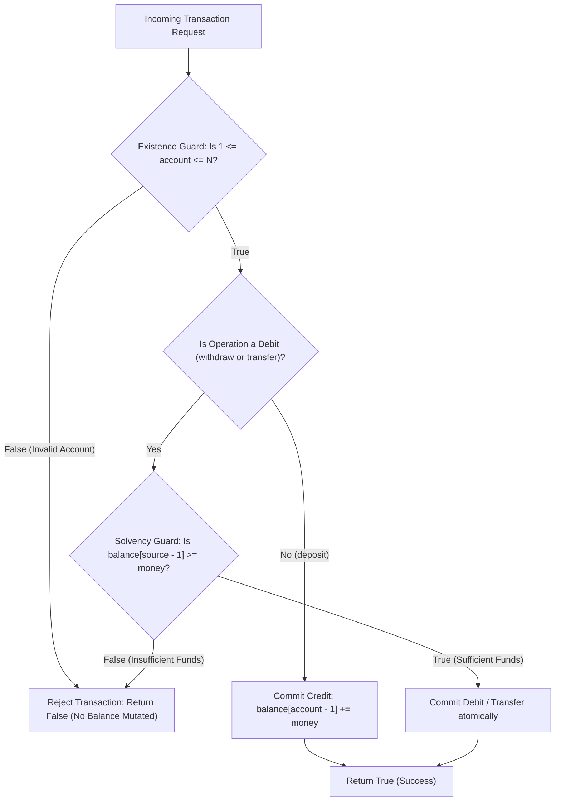

# Guided Example: Simple Bank System

## 1. Concrete Problem Restatement & Input Data

We are tasked with implementing an in-memory transactional banking system, `Bank`, managing $N$ customer accounts labeled with 1-based indices from $1$ to $N$. The system is initialized with an array $\text{balance}$ of length $N$, where account $i \in [1, N]$ starts with initial funds $\text{balance}[i - 1]$.

The banking interface supports three atomic transactional methods:
1. `transfer(account1, account2, money)`: Deducts `money` from `account1` and credits `money` to `account2`.
2. `deposit(account, money)`: Credits `money` to `account`.
3. `withdraw(account, money)`: Deducts `money` from `account`.

Every transaction must satisfy strict transactional consistency guards:
- **Existence Guard**: Every referenced account index must be valid ($1 \le \text{account} \le N$).
- **Solvency Guard**: For any debit operation (`withdraw` or the debit half of `transfer`), the source account must hold at least `money` ($\text{balance} \ge \text{money}$).

If all guards are satisfied, the transaction executes atomically, modifying the account balances, and returns `true`. If any guard fails, the transaction is immediately rejected without modifying any account balance, and returns `false`.

### Sample Input Dataset

Consider the five-account initial configuration:
$$\text{balance} = [10, 100, 20, 50, 30], \quad N = 5$$

followed by the sequence of operations:
$$\text{Operations} = [\text{withdraw}(3, 10), \text{transfer}(5, 1, 20), \text{deposit}(5, 20), \text{transfer}(3, 4, 15), \text{withdraw}(10, 50)]$$

We also examine a single-account boundary sequence:
$$\text{balance}_{\text{single}} = [5], \quad [\text{deposit}(1, 4), \text{withdraw}(1, 10)]$$

---

## 2. Conceptual Walkthrough & Visual Intuition

The system maintains a direct-addressable memory buffer representing account balances. Because accounts are $1$-indexed, referencing account $a$ accesses array index $a - 1$.

### Atomic Guard Verification
Every transaction must validate its precondition checks before committing any mutations:

### Invariant Preservation
1. **Conservation of Money**: For any successful transfer, the net change across the bank is $(-\text{money}) + (+\text{money}) = 0$. The total sum of deposits across all accounts remains strictly invariant during transfers.
2. **Non-Negativity Invariant**: Because withdrawals and transfers only execute when $\text{balance} \ge \text{money}$, an account balance can never drop below zero.

---

## 3. Step-by-Step State Progression Table

Let us trace the operations on initial balances $[10, 100, 20, 50, 30]$ ($N = 5$):

Initial Account State:
- Account 1: $10$
- Account 2: $100$
- Account 3: $20$
- Account 4: $50$
- Account 5: $30$

| Step | Operation Called | Arguments | Target Accounts Validation | Balance Solvency Check | Transaction Status | Account Balances After Step | Return Value | Rationale |
|---|---|---|---|---|---|---|---|---|
| $1$ | `withdraw` | Account $3$, Money $10$ | $1 \le 3 \le 5$ (Valid) | $20 \ge 10$ (Sufficient) | **Committed** | $[10, 100, \mathbf{10}, 50, 30]$ | `true` | Account 3 debited: $20 - 10 = 10$ |
| $2$ | `transfer` | Acct $5 \to 1$, Money $20$ | $1 \le 5, 1 \le 5$ (Valid) | Acct 5 has $30 \ge 20$ (Sufficient) | **Committed** | $[\mathbf{30}, 100, 10, 50, \mathbf{10}]$ | `true` | Acct 5: $30 - 20 = 10$; Acct 1: $10 + 20 = 30$ |
| $3$ | `deposit` | Account $5$, Money $20$ | $1 \le 5 \le 5$ (Valid) | N/A (Credit only) | **Committed** | $[30, 100, 10, 50, \mathbf{30}]$ | `true` | Account 5 credited: $10 + 20 = 30$ |
| $4$ | `transfer` | Acct $3 \to 4$, Money $15$ | $1 \le 3, 4 \le 5$ (Valid) | Acct 3 has $10 < 15$ (Deficit!) | **Rejected** | $[30, 100, 10, 50, 30]$ | `false` | Insufficient funds in Acct 3 ($10 < 15$); balances untouched |
| $5$ | `withdraw` | Account $10$, Money $50$ | $10 > 5$ (Nonexistent!) | N/A | **Rejected** | $[30, 100, 10, 50, 30]$ | `false` | Account 10 does not exist; rejected |

Final query results: `[true, true, true, false, false]`.

---

## 4. Key Transition Dynamics & Boundary Handling

The transition behavior clarifies edge cases:

1. **Existence Failures**:
   - In Step 5, `withdraw(10, 50)` targets account $10$. Because $10 > N = 5$, accessing index $9$ would cause an out-of-bounds error. The existence guard intercepts the call and aborts before memory access.
2. **Self-Transfer ($account1 = account2$)**:
   - If an account transfers money to itself (e.g. `transfer(2, 2, 50)`), the checks $1 \le 2 \le 5$ and $\text{balance}[1] \ge 50$ succeed. Deducting $50$ and adding $50$ leaves the balance unchanged, correctly returning `true`.
3. **Exact Balance Withdrawal ($\text{balance} == \text{money}$)**:
   - A withdrawal of the entire balance leaves exactly $0$. Because $0 \ge 0$, this is fully legal and returns `true`.

| Test Scenario | Initial Balance | Operation | Account Validation | Solvency Validation | Result | Final State |
|---|---|---|---|---|---|---|
| Complete Drain | Acct 1: $50$ | `withdraw(1, 50)` | Valid ($1 \le 1 \le N$) | $50 \ge 50$ (True) | `true` | Acct 1: $0$ |
| Single Penny Short | Acct 1: $49$ | `withdraw(1, 50)` | Valid ($1 \le 1 \le N$) | $49 \ge 50$ (False) | `false` | Acct 1: $49$ |
| Target Invalid in Transfer | Acct 1: $100$ | `transfer(1, 99, 10)` | Acct 99 invalid ($99 > N$) | Skipped | `false` | Acct 1: $100$ |
| Source Invalid in Transfer | Acct 0: N/A | `transfer(0, 1, 10)` | Acct 0 invalid ($0 < 1$) | Skipped | `false` | Acct 1: $100$ |

---

## 5. Algorithmic Correctness & Soundness

### Atomicity and Precondition Invariance
A transaction $T$ transitions the system state $\mathcal{S} \to \mathcal{S}'$.
- If any guard fails, the transition function is the identity $\mathcal{S}' = \mathcal{S}$.
- If all guards pass:
  - For `deposit`: $\text{balance}[a - 1] \leftarrow \text{balance}[a - 1] + m$.
  - For `withdraw`: $\text{balance}[a - 1] \leftarrow \text{balance}[a - 1] - m$.
  - For `transfer`: $\text{balance}[a_1 - 1] \leftarrow \text{balance}[a_1 - 1] - m$, $\text{balance}[a_2 - 1] \leftarrow \text{balance}[a_2 - 1] + m$.

Because all guards are evaluated before mutating any array cell, partial writes are impossible. If a transfer fails solvency on the source, the destination is never credited. This satisfies the strict ACID requirements of software transactions.

---

## 6. Edge Cases & Common Pitfalls

1. **1-Based vs 0-Based Indexing**: Account identifiers are $1$-indexed ($1$ to $N$). Failing to subtract $1$ when indexing into the internal array will trigger off-by-one errors or miss account $N$.
2. **Transfer Precondition Ordering**: If account 1 has sufficient funds but account 2 does not exist, the transfer must fail completely. Deducting from account 1 before verifying account 2 would corrupt account 1's balance. All accounts must be validated simultaneously before modifying balances.
3. **64-Bit Integer Magnitudes**: Account balances and transaction amounts can reach $10^{12}$, which exceeds the standard 32-bit signed integer limit ($2 \times 10^9$). Storing balances in 64-bit integers (`int64` / `long long`) prevents arithmetic overflow.

---

## 7. Complexity Analysis

### Time Complexity
- **Constructor `Bank(balance)`**: Storing or referencing the initial list of $N$ balances takes $\mathcal{O}(N)$ time (or $\mathcal{O}(1)$ if aliasing the reference).
- **`transfer`**: Performing at most three integer comparisons and two arithmetic updates takes $\mathcal{O}(1)$ time.
- **`deposit`**: One bounds check and one addition takes $\mathcal{O}(1)$ time.
- **`withdraw`**: One bounds check, one solvency check, and one subtraction takes $\mathcal{O}(1)$ time.
- **Total Time Complexity**: $\mathcal{O}(1)$ per operational method call, which is strictly optimal.

### Space Complexity
- **Balance Array**: The internal array stores $N$ integers of 64-bit width, requiring $\mathcal{O}(N)$ space.
- **Auxiliary Overhead**: No dynamic tables or auxiliary structures are created.
- **Total Auxiliary Space**: $\mathcal{O}(N)$ memory to maintain account balances.
