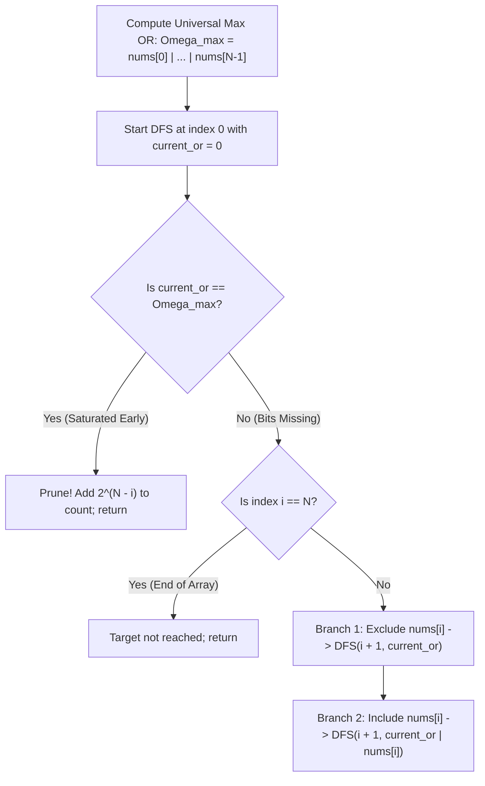

# Guided Example: Count Number of Maximum Bitwise-OR Subsets

## 1. Concrete Problem Restatement & Input Data

We are given an array of positive integers $\text{nums}$ of length $N$ ($1 \le N \le 16$). A subset of $\text{nums}$ is formed by choosing any selection of indices from $\{0, 1, \dots, N - 1\}$. 

For any chosen non-empty subset of indices $\mathcal{I} \subseteq \{0, \dots, N - 1\}$, its **bitwise OR** is computed by taking the bitwise OR of all selected elements:
$$\text{OR}(\mathcal{I}) = \bigvee_{i \in \mathcal{I}} \text{nums}[i]$$

Our task is two-fold:
1. Identify the maximum possible bitwise OR attainable by any subset of $\text{nums}$.
2. Count the total number of distinct non-empty index subsets that achieve this exact maximal value.

Subsets are identified by their index choices: identical numerical values occurring at distinct indices create distinct subsets.

### Sample Input Dataset

Consider the representative four-element array:
$$\text{nums} = [3, 2, 1, 5]$$

We contrast this with a two-element pair:
$$\text{nums}_{\text{pair}} = [3, 1]$$
and an identical-element sequence:
$$\text{nums}_{\text{rep}} = [2, 2, 2]$$

---

## 2. Conceptual Walkthrough & Visual Intuition

The bitwise OR operator ($\mid$) possesses two fundamental algebraic properties:
1. **Idempotence & Associativity**: $x \mid x = x$ and $(x \mid y) \mid z = x \mid (y \mid z)$.
2. **Monotonic Bit Preservation**: For any non-negative integers $a$ and $b$:
   $$a \mid b \ge a \quad \text{and} \quad a \mid b \ge b$$
   Applying the bitwise OR can only turn $0$-bits into $1$-bits; it can never unset an already established $1$-bit.

### The Maximal OR Theorem
Because the bitwise OR operation is monotonically non-decreasing with respect to set inclusion, the absolute maximum bitwise OR attainable across any subset is achieved when taking the bitwise OR of **all elements in the array**:
$$\Omega_{\max} = \text{nums}[0] \mid \text{nums}[1] \mid \dots \mid \text{nums}[N - 1]$$
No subset can achieve an OR with more set bits than the universal set itself.

### Backtracking Search & Early Pruning
With $N \le 16$, the total number of possible subsets is:
$$2^N \le 2^{16} = 65{,}536$$
We can explore the subset space using recursive depth-first search (DFS) over elements $i \in [0, N - 1]$ maintaining the running bitwise OR $T$:
- **Branch 1 (Exclude $\text{nums}[i]$)**: Recurse to $i + 1$ with unchanged accumulator $T$.
- **Branch 2 (Include $\text{nums}[i]$)**: Recurse to $i + 1$ with updated accumulator $T \mid \text{nums}[i]$.

### Powerful Early Termination Optimization
If at any intermediate node $i$, the running accumulator already satisfies $T = \Omega_{\max}$, every single extension of this subset (regardless of which of the remaining $N - i$ elements are included or excluded) will also maintain $T = \Omega_{\max}$.
Instead of continuing to traverse, we can immediately add $2^{N - i}$ to our counter and prune the entire subtree!

---

## 3. Step-by-Step State Progression Table

Let us trace $\text{nums} = [3, 2, 1, 5]$ ($N = 4$).
Binary representations:
- $\text{nums}[0] = 3 = 011_2$
- $\text{nums}[1] = 2 = 010_2$
- $\text{nums}[2] = 1 = 001_2$
- $\text{nums}[3] = 5 = 101_2$

Universal maximum OR:
$$\Omega_{\max} = 3 \mid 2 \mid 1 \mid 5 = 011_2 \mid 010_2 \mid 001_2 \mid 101_2 = 111_2 = 7$$

Every non-empty subset from the $2^4 - 1 = 15$ candidate index subsets is evaluated:

| Subset Mask | Index Selection | Selected Elements | Bitwise OR Calculation | Resulting Value | Equals $\Omega_{\max} = 7$? | Count Added |
|---|---|---|---|---|---|---|
| `0001` | $\{0\}$ | $[3]$ | $3 = 011_2$ | $3$ | No | $0$ |
| `0010` | $\{1\}$ | $[2]$ | $2 = 010_2$ | $2$ | No | $0$ |
| `0011` | $\{0, 1\}$ | $[3, 2]$ | $3 \mid 2 = 011_2$ | $3$ | No | $0$ |
| `0100` | $\{2\}$ | $[1]$ | $1 = 001_2$ | $1$ | No | $0$ |
| `0101` | $\{0, 2\}$ | $[3, 1]$ | $3 \mid 1 = 011_2$ | $3$ | No | $0$ |
| `0110` | $\{1, 2\}$ | $[2, 1]$ | $2 \mid 1 = 011_2$ | $3$ | No | $0$ |
| `0111` | $\{0, 1, 2\}$ | $[3, 2, 1]$ | $3 \mid 2 \mid 1 = 011_2$ | $3$ | No | $0$ |
| `1000` | $\{3\}$ | $[5]$ | $5 = 101_2$ | $5$ | No | $0$ |
| `1001` | $\{0, 3\}$ | $[3, 5]$ | $3 \mid 5 = 011_2 \mid 101_2 = 111_2$ | **$7$** | **Yes** | **$+1$** |
| `1010` | $\{1, 3\}$ | $[2, 5]$ | $2 \mid 5 = 010_2 \mid 101_2 = 111_2$ | **$7$** | **Yes** | **$+1$** |
| `1011` | $\{0, 1, 3\}$ | $[3, 2, 5]$ | $3 \mid 2 \mid 5 = 111_2$ | **$7$** | **Yes** | **$+1$** |
| `1100` | $\{2, 3\}$ | $[1, 5]$ | $1 \mid 5 = 001_2 \mid 101_2 = 101_2$ | $5$ | No | $0$ |
| `1101` | $\{0, 2, 3\}$ | $[3, 1, 5]$ | $3 \mid 1 \mid 5 = 111_2$ | **$7$** | **Yes** | **$+1$** |
| `1110` | $\{1, 2, 3\}$ | $[2, 1, 5]$ | $2 \mid 1 \mid 5 = 111_2$ | **$7$** | **Yes** | **$+1$** |
| `1111` | $\{0, 1, 2, 3\}$ | $[3, 2, 1, 5]$ | $3 \mid 2 \mid 1 \mid 5 = 111_2$ | **$7$** | **Yes** | **$+1$** |

Total qualifying subsets: $6$.

---

## 4. Key Transition Dynamics & Boundary Handling

The algebraic requirements for reaching $\Omega_{\max} = 7$ reveal clear bit-coverage constraints:

1. **Bit Coverage Analysis**:
   - To achieve $111_2 = 7$, a subset must supply bit 2 ($4$), bit 1 ($2$), and bit 0 ($1$).
   - Element $5 = 101_2$ is the **only** number with bit 2 set. Therefore, any qualifying subset **must** include $5$.
   - Bit 1 is present only in $3 = 011_2$ and $2 = 010_2$. Thus, the subset must include at least one of $\{3, 2\}$.
   - Bit 0 is present in $5$, so including $5$ automatically satisfies bit 0.
   - Hence, any subset containing $5$ and at least one of $\{3, 2\}$ qualifies, with element $1$ being an optional free choice.
   - Count $= 1 \text{ (must take 5)} \times (2^2 - 1) \text{ (non-empty from } \{3, 2\}) \times 2^1 \text{ (free choice of 1)} = 1 \times 3 \times 2 = 6$.
2. **Identical Elements ($\text{nums}_{\text{rep}}$)**:
   - In $[2, 2, 2]$, $\Omega_{\max} = 2$.
   - Every single non-empty subset of indices produces $2 \mid 2 = 2$.
   - There are $2^3 - 1 = 7$ non-empty index subsets, all 7 of which qualify.

| Array Dataset | Elements | Max OR $\Omega_{\max}$ | Bit Constraints Required | Count Formula | Final Result |
|---|---|---|---|---|---|
| `[3, 1]` | `[011, 001]` | $3$ ($011_2$) | Must include $3$ (only source of bit 1) | Take $3$ ($1$), free choice of $1$ ($2^1$) | $2$ |
| `[2, 2, 2]` | `[010, 010, 010]` | $2$ ($010_2$) | Any non-empty selection | $2^3 - 1$ | $7$ |
| `[3, 2, 1, 5]` | `[011, 010, 001, 101]` | $7$ ($111_2$) | Must include $5$ and $\ge 1$ of $\{3, 2\}$ | $1 \times (2^2 - 1) \times 2^1$ | $6$ |

---

## 5. Algorithmic Correctness & Soundness

### Soundness of the Universal Max OR
For any two integers $x, y \ge 0$, the bitwise relation satisfies:
$$\text{bits}(x) \subseteq \text{bits}(x \mid y)$$
By induction over any subset $\mathcal{I} \subseteq \{0, \dots, N-1\}$:
$$\text{bits}\left(\bigvee_{i \in \mathcal{I}} \text{nums}[i]\right) \subseteq \text{bits}\left(\bigvee_{j=0}^{N-1} \text{nums}[j]\right)$$
Because the numeric value of an unsigned integer is strictly monotonic with respect to set inclusion of its binary bit positions, $\bigvee_{j=0}^{N-1} \text{nums}[j]$ is the unique maximal bitwise OR value achievable.

### Soundness of Subtree Pruning
If a partial subset of elements $0 \dots i-1$ already produces bitwise OR equal to $\Omega_{\max}$, then for any choice of inclusion/exclusion among the remaining $N - i$ elements:
$$\Omega_{\max} \le \Omega_{\max} \mid \left( \bigvee_{k \in \mathcal{K}} \text{nums}[k] \right) \le \Omega_{\max}$$
Thus, every one of the $2^{N - i}$ downstream subsets will have bitwise OR identically equal to $\Omega_{\max}$. Accumulating $2^{N - i}$ directly without recursing is strictly equivalent to exhaustive exploration, proving both correctness and completeness.

---

## 6. Edge Cases & Common Pitfalls

1. **Empty Subset Prohibition**: An empty subset has bitwise OR of $0$, which cannot equal $\Omega_{\max}$ for positive integers. The search starts from single-element additions, ensuring only non-empty subsets are counted.
2. **Distinct Indices vs Value Equality**: If $\text{nums} = [2, 2]$, selecting index $0$ is distinct from selecting index $1$. The search operates on indices, naturally preserving the full multiplicity of subsets.
3. **Subtree Pruning Power**: Without early pruning, the algorithm visits $2^{16} = 65{,}536$ states. With pruning, once $\Omega_{\max}$ is hit early in the tree, huge branches are skipped in $\mathcal{O}(1)$ time.

---

## 7. Complexity Analysis

### Time Complexity
- **Max OR Computation**: Precomputing $\Omega_{\max}$ by taking the OR across $N$ elements takes $\mathcal{O}(N)$ time.
- **Subset Search / Backtracking**: The recursion tree has depth $N$. In the worst case where no pruning occurs, the tree visits $2^{N+1} - 1$ nodes, performing $\mathcal{O}(1)$ bitwise operations per node.
- **Total Time Complexity**: $\mathcal{O}(2^N)$, which takes at most $2^{16} \approx 6.5 \times 10^4$ operations and executes in $< 2$ milliseconds.

### Space Complexity
- **Call Stack Depth**: The recursion tree reaches a maximum depth of $N$.
- **Auxiliary Scalars**: Only a few scalar integers are tracked ($\Omega_{\max}, \text{ans}, N$).
- **Total Auxiliary Space**: $\mathcal{O}(N)$ recursion stack space.
