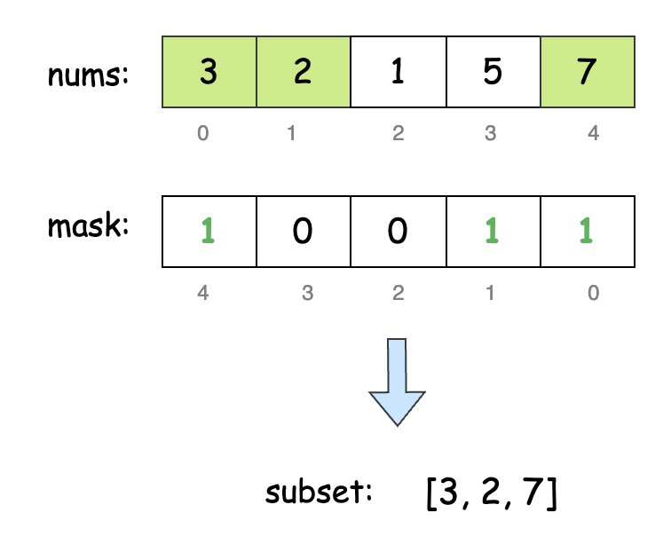

[TOC]

## Solution

---

### Overview

The key insight here is that the maximum OR value will always be the result of OR-ing all the numbers in the array. Why? Because OR is an operation that only adds bits, it never removes them. So including more numbers can only increase (or keep the same) the OR value, never decrease it.

For example, consider 3 numbers: 1 (001), 4 (100), and 2 (010).

ORing the three numbers means we look at the bits in each position and combine them using the OR operation to get the resultant bit. Notice that the resultant bit will be 0 only when all the bits at that position are 0, otherwise, it will always be 1. This means that the worst-case scenario is that the bit remains the same, and in all other cases, the bit increases in value.

---

### Approach 1: Recursion

#### Intuition

To count all subsets of `nums` that yield the maximum OR value, we can generate all possible subsets recursively. For each number, we choose either to include it in the subset or exclude it.

In the recursion, we first check if we've reached the end of the array. If so, we compare the accumulated OR value with the precomputed maximum OR value. If they match, we have a valid subset and return 1.

If we haven't reached the end, we proceed by making two recursive calls: one excluding the current number and another including it. The total count of valid subsets is the sum of these two results.

The main function initiates this recursive process from the start of the array, and the final result gives the total count of subsets with the maximum OR value.

#### Algorithm

- Initialize a variable `maxOrValue` to 0.
- Iterate through each number `num` in the input array `nums`.
  - Update `maxOrValue` by performing a bitwise OR operation with `num`.
- Call the recursive function `countSubsets` with initial parameters: `nums`, index 0, current OR value 0, and the target OR value `maxOrValue`. Return its result as the answer.

- Define a function `countSubsets` with parameters: the `nums` array, `index`, `currentOr`, and `targetOr`.
  - Check if `index` has reached the end of the array.
- If so, return 1 if `currentOr` equals `targetOr`, otherwise return 0.
  - Recursively call `countSubsets` without including the current number, incrementing the index. Store the result in a variable `countWithout`.
  - Recursively call `countSubsets` including the current number, incrementing the index, and updating the current OR value. Store the result in a variable `countWith`.
  - Return the sum of `countWithout` and `countWith`.

#### Implementation

```python
class Solution:
    def countMaxOrSubsets(self, nums: List[int]) -> int:
        max_or_value = 0
        for num in nums:
            max_or_value |= num
        return self._count_subsets(nums, 0, 0, max_or_value)

    def _count_subsets(
        self, nums: List[int], index: int, current_or: int, target_or: int
    ) -> int:
        # Base case: reached the end of the array
        if index == len(nums):
            return 1 if current_or == target_or else 0

        # Don't include the current number
        count_without = self._count_subsets(
            nums, index + 1, current_or, target_or
        )

        # Include the current number
        count_with = self._count_subsets(
            nums, index + 1, current_or | nums[index], target_or
        )

        # Return the sum of both cases
        return count_without + count_with
```

#### Complexity Analysis

Let $n$ be the length of the input array `nums`.

- Time complexity: $O(2^n)$

    The initial loop to find `maxOrValue` takes $O(n)$ time.

    The main complexity comes from the recursive `countSubsets` function, which generates all possible subsets of the input array. For each element, the algorithm makes two choices, leading to a total of $2^n$ subsets. Each recursive call does $O(1)$ work (bitwise OR operation and comparisons).

    Thus, the overall time complexity is $O(2^n)$.

- Space complexity: $O(n)$

    In the worst case, the recursive call stack goes $n$ levels deep. Thus, the space complexity is $O(n)$.

---

### Approach 2: Memoization

#### Intuition

Consider this example with `nums = [3, 1, 2, 4]`. During recursion, we might encounter two similar states:
1. Subset 1: `[3, 1]` with $index = 2$
2. Subset 2: `[3]` with $index = 2$

In both cases, the accumulated OR value and the current index are the same, which is known as an overlapping sub-problem.

Memoization helps eliminate repeated calculations by storing the results of sub-problems the first time they're encountered. Each recursive state can be uniquely identified by the OR value up to that point and the current array index. To store these results, we use a 2D `memo` array.

At each recursion step, we first check if the current state exists in `memo`. If it does, we return the stored value. Otherwise, we calculate the result and store it in `memo` for future reference.

#### Algorithm

- Initialize a variable:
  - `n` to the length of `nums`.
  - `maxOrValue` to 0.
- Iterate through each number in the input array `nums`:
  - Update `maxOrValue` by performing a bitwise OR operation with the current number.
- Create a 2D array `memo` of size $n * (maxOrValue + 1)$ to store intermediate results.
- Call the recursive function `countSubsetsRecursive` with initial parameters: `nums`, `index` 0, `currentOr` value 0, the `targetOr` value `maxOrValue`, and the memoization array `memo`. Return the result as our answer.

- Define a function `countSubsetsRecursive` with parameters: the `nums` array, `index`, `currentOr`, `targetOr`, and the dp array `memo`.
  - Check if the current `index` has reached the end of the array:
- If so, return 1 if the current OR value equals the target OR value, otherwise, return 0.
  - If the result for the current state (`index`, `currentOr`) is already memoized, return it.
  - Recursively call `countSubsetsRecursive` without including the current number, incrementing the index. Store the result in a variable `countWithout`.
  - Recursively call `countSubsetsRecursive` including the current number, incrementing the index, and updating the current OR value. Store the result in a variable `countWith`.
  - The sum of `countWithout` and `countWith` is our result. Store it in the `memo` and return it.

#### Implementation

```python
class Solution:
    def countMaxOrSubsets(self, nums: List[int]) -> int:
        max_or_value = 0
        n = len(nums)

        # Calculate the maximum OR value
        for num in nums:
            max_or_value |= num

        # Initialize memo with -1
        memo = [[-1] * (max_or_value + 1) for _ in range(n)]

        return self._count_subsets_recursive(nums, 0, 0, max_or_value, memo)

    def _count_subsets_recursive(
        self,
        nums: List[int],
        index: int,
        current_or: int,
        target_or: int,
        memo: List[List[int]],
    ) -> int:
        # Base case: reached the end of the array
        if index == len(nums):
            return 1 if current_or == target_or else 0

        # Check if the result for this state is already memoized
        if memo[index][current_or] != -1:
            return memo[index][current_or]

        # Don't include the current number
        count_without = self._count_subsets_recursive(
            nums, index + 1, current_or, target_or, memo
        )

        # Include the current number
        count_with = self._count_subsets_recursive(
            nums, index + 1, current_or | nums[index], target_or, memo
        )

        # Memoize and return the result
        memo[index][current_or] = count_without + count_with
        return memo[index][current_or]
```

#### Complexity Analysis

Let $n$ be the length of the input array `nums` and $\text{maxOrValue}$ be the maximum possible OR value.

* Time complexity: $O(n \cdot \text{maxOrValue})$

    Like the previous approach, the initial loop to find `maxOrValue` takes $O(n)$ time.

    Each state of the `countSubsetsRecursive` function is defined by two parameters: the current index ($0$ to $n-1$) and the current OR value ($0$ to $\text{maxOrValue}$). So, there are $n \cdot (\text{maxOrValue} + 1)$ possible states. Since each state is computed at most once, the time complexity of the function is $O(n \cdot \text{maxOrValue})$.

    Thus, the overall time complexity is $O(n) +$\mathcal{O}(n \cdot \text{maxOrValue})$= O(n \cdot \text{maxOrValue})$.

* Space complexity: $O(n \cdot \text{maxOrValue})$

    The memoization array has a space complexity of $O(n \cdot \text{maxOrValue})$. The recursive call stack can go up to depth $n$ in the worst case.

    Thus, the space complexity of the algorithm is $O(n \cdot \text{maxOrValue}) +$\mathcal{O}(n)$= O(n \cdot \text{maxOrValue})$.

---

### Approach 3: Bit Manipulation

#### Intuition

A subset of the array `nums` can be represented by a boolean array, where each value indicates whether the corresponding element in `nums` is included. For instance, if the 3rd index is `true`, it means the 3rd element is part of the subset.

With a maximum length of `nums` capped at 16, we can simplify this by using the binary representation of an integer, where a set `i`th bit indicates the inclusion of the `i`th element of `nums` in the subset. To understand this better, have a look at the below illustration:



> Note that the indexing direction in the mask is reversed to represent how we count positions: in an array, we count from left to right, but in a number, we count from right to left.

We'll then iterate over all possible subsets of `nums` by considering integers from $0$ to $2^n - 1$, each representing a unique subset. For each subset, we calculate the OR value by performing a bitwise OR on elements corresponding to set bits in the integer. If this OR value matches the maximum OR value (calculated beforehand), we increment a counter. By the end, this counter gives the number of subsets that reach the maximum bitwise OR value.

#### Algorithm

- Initialize a variable `maxOrValue` to 0.
- Iterate through each number in the input array `nums`:
  - Find `maxOrValue` by performing a bitwise OR operation with each number.
- Calculate the total number of possible subsets by left-shifting 1 by the length of `nums`, and store it in `totalSubsets`.
- Initialize a variable `subsetsWithMaxOr` to 0 to count subsets with maximum OR value.
- Iterate through all possible subset combinations, from 0 to $totalSubsets - 1$:
  - Initialize `currentOrValue` to 0 for each subset.
  - Iterate through each index `i` of the input array `nums`:
- If the `i`-th bit of the current subset mask is set:
      - Perform a bitwise OR of `currentOrValue` with the `i`-th element of `nums`.
  - If `currentOrValue` is equal to `maxOrValue`.
- Increment `subsetsWithMaxOr`.
- Return the final count stored in `subsetsWithMaxOr`.

#### Implementation

```python
class Solution:
    def countMaxOrSubsets(self, nums: List[int]) -> int:
        # Calculate the maximum possible OR value
        max_or_value = 0
        for num in nums:
            max_or_value |= num

        total_subsets = 1 << len(nums)  # 2^n subsets
        subsets_with_max_or = 0

        # Iterate through all possible subsets
        for subset_mask in range(total_subsets):
            current_or_value = 0

            # Calculate OR value for the current subset
            for i in range(len(nums)):
                if (subset_mask >> i) & 1:
                    current_or_value |= nums[i]

            # If current subset's OR equals max_or_value, increment count
            if current_or_value == max_or_value:
                subsets_with_max_or += 1

        return subsets_with_max_or
```

#### Complexity Analysis

Let $n$ be the length of the input array `nums`.

* Time complexity: $O(n \cdot 2^n)$

    The initial calculation of `maxOrValue` takes linear time.

    The main loop iterates over all $2^n$ subsets. For each subset, the inner loop iterates through all $n$ elements. So, the loops take $O(n \cdot 2^n)$ time, in total.

    Thus, the overall time complexity of the algorithm is $O(n) +$\mathcal{O}(n \cdot 2^n)$= O(n \cdot 2^n)$.

* Space complexity: $O(1)$

    Except for a few variables, the algorithm does not use any additional space. Thus, the space complexity is constant.

---

### Approach 4: Bit Manipulation + Dynamic Programming

#### Intuition

If we replace the OR operation with addition, this problem resembles the classic [Knapsack Problem](https://leetcode.com/discuss/study-guide/1152328/01-Knapsack-Problem-and-Dynamic-Programming), a well-known dynamic programming challenge.

We create a `dp` array of size $2^{17}$, where $\text{dp}[i]$ represents the number of subsets with a cumulative OR value of `i`. The base case is $\text{dp}[0] = 1$, since the only subset with an OR value of 0 is the empty subset. We also track the maximum cumulative OR found during the process with a variable `max`, initially set to 0.

<details>
<summary>Why use such a large size?</summary>

The largest possible element in `nums` is $10^5$, which requires 17 bits. Thus, the maximum OR value would set all 17 bits, making the maximum possible OR value $2^{17} - 1$. To accommodate every possible OR result, we need an array of size $2^{17}$ (or `1<<17`).

</details>

<br>

To fill `dp`, we iterate over `nums`. For each value in `nums`, we OR it with all the possible subset OR values we might have achieved till now. This is basically all the values between 0 and `max`. So, we iterate a variable `i` from `max` to `0` backward, and add the count of subsets in $\text{dp}[i]$ to `dp[i | num]`. The backward iteration prevents double counting. If we went forward, we might update a value and then use that updated value in the same iteration, leading to incorrect counts.

By the end, `max` holds the maximum OR value, and $\text{dp}[max]$ gives the number of subsets achieving this maximum OR.

#### Algorithm

- Initialize a variable `max` to 0 to track the current maximum OR value.
- Create an array `dp` of size $2^{17}$ to store counts of subsets for each possible OR value.
- Set $\text{dp}[0]$ to 1, representing the empty subset.
- Iterate through each number `num` in the input array `nums`:
  - Iterate `i` backward from `max` to 0:
- Calculate a new OR value by performing a bitwise OR of the current value `i` with `num`.
- Add the count of subsets for the current OR value ($\text{dp}[i]$) to the count for the new OR value (`dp[i | num]`).
  - Update `max` by performing a bitwise OR with the current `num`.
- Return the value stored in $\text{dp}[max]$, representing the count of subsets with the maximum OR value.

#### Implementation

```python
class Solution:
    def countMaxOrSubsets(self, nums: List[int]) -> int:
        max_or_value = 0
        dp = [0] * (1 << 17)

        # Initialize the empty subset
        dp[0] = 1

        # Iterate through each number in the input array
        for num in nums:
            for i in range(max_or_value, -1, -1):
                # For each existing subset, create a new subset by including the current number
                dp[i | num] += dp[i]

            # Update the maximum OR value
            max_or_value |= num

        return dp[max_or_value]
```

#### Complexity Analysis

Let $n$ be the length of the input array `nums`, and $\text{max}$ be the maximum possible OR value.

* Time complexity: $O(n \cdot \text{max})$

    The outer loop iterates through each entry in the `nums` array, taking linear time. The inner loop iterates from $\text{max}$ to $0$. Thus, the time complexity of the algorithm is $O(n \cdot \text{max})$.

* Space complexity: $O(2^{17})$

    The `dp` array is set up with a constant size of $2^{17}$. While this implies that the complexity is constant, we are including it in the space complexity due to its significant size.

    The algorithm uses no other data structures which scale with input size. Thus, the space complexity is $O(2^{17})$.

---