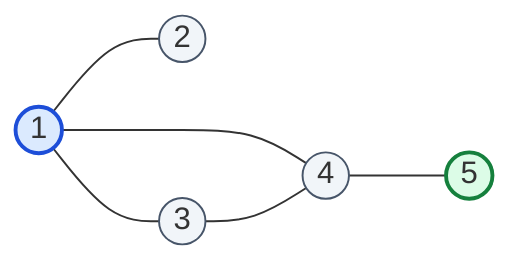

# Guided Example: Second Minimum Time to Reach Destination

We trace the step-by-step execution of the dual-distance breadth-first search and synchronized traffic signal simulation on a representative problem instance:

- **Input:** $n = 5$, $\text{edges} = [[1, 2], [1, 3], [1, 4], [3, 4], [4, 5]]$, $\text{time} = 3$, $\text{change} = 5$
- **Expected Output:** $13$

---

## 1. Problem Overview & Representative Instance

A city is modeled as a connected, bidirectional graph with $n$ vertices labeled $1$ through $n$. Each edge requires exactly $\text{time}$ minutes to cross. Every vertex contains a synchronized traffic signal that toggles between green and red every $\text{change}$ minutes:
- It is green for $[0, \text{change})$, red for $[\text{change}, 2 \cdot \text{change})$, green for $[2 \cdot \text{change}, 3 \cdot \text{change})$, and so on.
- A traveler arriving at an intermediate vertex when the signal is green may depart immediately. If the signal is red, departure is delayed until the exact start of the next green window.
- Upon reaching destination vertex $n$, the journey terminates immediately without waiting for any light.

The goal is to determine the **strictly second minimum time** required to travel from vertex $1$ to vertex $n$. Revisiting vertices and edges is permitted.

In this instance:
- Vertex $1$ has neighbors $\{2, 3, 4\}$.
- Vertex $3$ has neighbors $\{1, 4\}$.
- Vertex $4$ has neighbors $\{1, 3, 5\}$.
- Vertex $5$ has neighbor $\{4\}$.
- The direct shortest path is $1 \to 4 \to 5$ ($2$ edges).
- The strictly second shortest walk is $1 \to 3 \to 4 \to 5$ ($3$ edges).

---

## 2. Theoretical Invariants & Traversal Dynamics

Because all edges possess identical traversal time $\text{time}$ and all signals switch simultaneously every $\text{change}$ minutes, the elapsed journey duration is a strictly monotonic function of the number of edge traversals $k$:
$$T(k) = \text{simulate}(k, \text{time}, \text{change})$$

If walk length $k_1 < k_2$, then $T(k_1) < T(k_2)$. Therefore:
1. The minimum arrival time corresponds to the shortest walk length $d_1(n)$.
2. The strictly second minimum arrival time corresponds to the strictly second shortest walk length $d_2(n)$, which is the smallest integer $d > d_1(n)$ achievable by a walk from $1$ to $n$.

We track two distinct minimum step counts for each vertex $v \in \{1, \dots, n\}$:
- $\text{dist}[v][0]$: Shortest walk length from $1$ to $v$.
- $\text{dist}[v][1]$: Strictly second shortest walk length from $1$ to $v$.

### Monotonic Distance Propagation Invariant
When expanding frontier vertex $u$ with distance $d$:
1. If $d + 1 < \text{dist}[v][0]$, then $\text{dist}[v][0] \leftarrow d + 1$ and $(v, d + 1)$ enters the queue.
2. If $\text{dist}[v][0] < d + 1 < \text{dist}[v][1]$, then $\text{dist}[v][1] \leftarrow d + 1$ and $(v, d + 1)$ enters the queue.
3. If $d + 1 = \text{dist}[v][0]$ or $d + 1 \ge \text{dist}[v][1]$, the transition is discarded because it cannot improve either tracked distance.

---

## 3. Step-by-Step State Execution Trace

We initialize the distance table with $\infty$ for all vertices, setting the base entry for vertex $1$ and enqueuing $(1, 0)$.

| Step | Dequeued State $(u, d)$ | Target Neighbor $v$ | Proposed Distance $d + 1$ | Current Tracked $[\text{dist}_0, \text{dist}_1]$ | Action & Updated State |
|---|---|---|---|---|---|
| Init | — | — | — | $1: [0, \infty]$, others $[\infty, \infty]$ | Queue: $[(1, 0)]$ |
| 1 | $(1, 0)$ | $2$ | $1$ | $2: [\infty, \infty]$ | $\text{dist}[2][0] \leftarrow 1$, Enqueue $(2, 1)$ |
| 2 | $(1, 0)$ | $3$ | $1$ | $3: [\infty, \infty]$ | $\text{dist}[3][0] \leftarrow 1$, Enqueue $(3, 1)$ |
| 3 | $(1, 0)$ | $4$ | $1$ | $4: [\infty, \infty]$ | $\text{dist}[4][0] \leftarrow 1$, Enqueue $(4, 1)$ |
| 4 | $(2, 1)$ | $1$ | $2$ | $1: [0, \infty]$ | $\text{dist}[1][1] \leftarrow 2$, Enqueue $(1, 2)$ |
| 5 | $(3, 1)$ | $1$ | $2$ | $1: [0, 2]$ | Already recorded ($2 = \text{dist}[1][1]$), prune |
| 6 | $(3, 1)$ | $4$ | $2$ | $4: [1, \infty]$ | $\text{dist}[4][1] \leftarrow 2$, Enqueue $(4, 2)$ |
| 7 | $(4, 1)$ | $1$ | $2$ | $1: [0, 2]$ | Already recorded, prune |
| 8 | $(4, 1)$ | $3$ | $2$ | $3: [1, \infty]$ | $\text{dist}[3][1] \leftarrow 2$, Enqueue $(3, 2)$ |
| 9 | $(4, 1)$ | $5$ | $2$ | $5: [\infty, \infty]$ | $\text{dist}[5][0] \leftarrow 2$, Enqueue $(5, 2)$ |
| 10 | $(1, 2)$ | $2, 3, 4$ | $3$ | $2, 3, 4: [\text{dist}_0=1]$ | Prune or update second distance |
| 11 | $(4, 2)$ | $5$ | $3$ | $5: [2, \infty]$ | $\text{dist}[5][1] \leftarrow 3$, Target reached! |

The breadth-first exploration establishes:
- Minimum step count to destination $5$: $\text{dist}[5][0] = 2$ (via $1 \to 4 \to 5$).
- Strictly second minimum step count to destination $5$: $\text{dist}[5][1] = 3$ (via $1 \to 3 \to 4 \to 5$).

---

## 4. Signal Timing Simulation & Departure Schedule

With the second shortest walk length confirmed as $k = 3$ edges, we simulate the time elapsed over each segment using $\text{time} = 3$ and $\text{change} = 5$:

At any intermediate arrival time $t$:
- Signal period count: $p = \lfloor t / \text{change} \rfloor$.
- Signal color: If $p \pmod 2 = 0$, the signal is green. If $p \pmod 2 = 1$, the signal is red.
- If green, departure occurs at $t$.
- If red, departure must wait until the signal turns green at time $(p + 1) \cdot \text{change}$.

| Segment Hop $i$ | Departure Node | Traversal Cost | Arrival Time $t$ | Arrival Signal Period $p = \lfloor t / 5 \rfloor$ | Light Status & Wait Added | Departure Time |
|---|---|---|---|---|---|---|
| Start | Vertex $1$ | — | $0$ | $0$ | Green (at source) | $0$ |
| Hop 1 ($1 \to 3$) | Vertex $3$ | $+3$ | $3$ | $\lfloor 3 / 5 \rfloor = 0$ (Even) | Green $\implies$ Wait $0$ min | $3$ |
| Hop 2 ($3 \to 4$) | Vertex $4$ | $+3$ | $6$ | $\lfloor 6 / 5 \rfloor = 1$ (Odd) | Red $\implies$ Wait until $2 \cdot 5 = 10$ ($+4$ min) | $10$ |
| Hop 3 ($4 \to 5$) | Destination $5$ | $+3$ | $13$ | Arrival at destination | Journey complete, no wait | **$13$** |

Thus, the journey arrives at destination vertex $5$ after precisely $13$ minutes.

---

## 5. Algorithmic Correctness & Soundness

1. **Monotonicity of Walk Duration:**
   Because all edges share identical duration $\text{time}$ and all signals cycle synchronously regardless of vertex location, the total time required to traverse $k$ edges is strictly identical across all walks of length $k$. Moreover, each additional edge strictly increases total time by at least $\text{time}$. Hence, finding the strictly second smallest travel time is mathematically equivalent to finding the strictly second smallest walk length $k$.

2. **Parity and Revisit Completeness:**
   Unlike simple paths, general walks allow traversing edges in reverse (such as $u \to v \to u$). Any such detour adds exactly $2$ steps. If an odd cycle exists, a walk with length $d_1 + 1$ may exist; otherwise, the second shortest walk will have length $d_1 + 2$. By maintaining two distinct shortest distances per vertex, the BFS is guaranteed to discover both $d_1$ and $d_2$ without infinite loops.

3. **Termination Guarantee:**
   Each vertex can be enqueued at most twice (once for its primary minimum distance and once for its strictly greater second minimum distance). Since the number of states is bounded by $2n$, the search terminates in finite steps.

---

## 6. Edge Cases, Pitfalls & Structural Traps

- **Disallowing Vertex Revisitation:** Restricting the search to simple paths fails when the only alternative route requires an edge detour (e.g. $1 \to 2 \to 1 \to 2$). General walks must be permitted.
- **Identical Distances:** Storing the same distance twice violates the strict inequality requirement. A path of length $2$ discovered through a different route cannot serve as the second minimum if $2$ is already the minimum.
- **Waiting at Destination:** No signal delay applies once vertex $n$ is reached. Applying a red-light wait after the final hop corrupts the answer.
- **Signal Transition Exact Boundary:** When arrival time $t$ is an exact multiple of $\text{change}$ (e.g. $t = 10$), $\lfloor 10 / 5 \rfloor = 2$ (even, Green), meaning departure can occur immediately without waiting.

---

## 7. Complexity Analysis

- **Time Complexity:** $\mathcal{O}(V + E)$.
  Each vertex is enqueued at most twice, leading to at most $2V$ dequeues. For each dequeue, all incident edges are explored at most twice, bounding edge relaxations to $\mathcal{O}(E)$. The post-processing simulation runs in $\mathcal{O}(k)$ where $k \le V + 2$. Total time is strictly linear in graph size.
- **Space Complexity:** $\mathcal{O}(V + E)$.
  The adjacency list consumes $\mathcal{O}(V + E)$ space. The distance array stores $2$ integers per vertex ($\mathcal{O}(V)$), and the queue contains at most $2V$ elements simultaneously.
