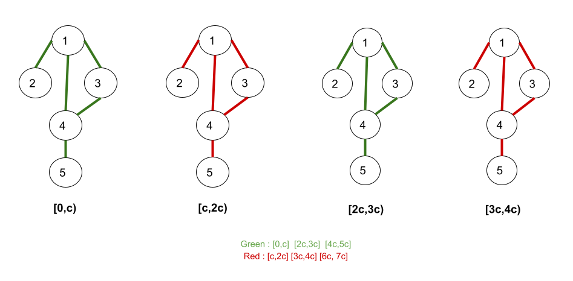

## Solution

### Overview

The problem is to find the second minimum distance ("strictly larger value" than minimum value) in a weighted graph where the traversal over any edge is only possible at certain intervals. The second minimum distance can either come by iterating over some nodes in the path multiple times (as shown in second example of the description) or there could be a longer path than the shortest path with all the nodes occurring just once (as shown in first example of the description).

### Approach 1: Dijkstra

#### Intuition

The shortest distance problem in a weighted graph directly leads to thinking about the Dijkstra algorithm. However, the standard Dijkstra does not work here, since we want to find the second minimum distance to reach node `n`. We may need to modify it a bit to make it work.

Let’s try to recap quickly how the standard Dijkstra looks and the corresponding changes we would need to solve this problem.

##### Standard Dijkstra

- We use an array `distance` to maintain the shortest distance to each node so far. For any node `X` except the source node, $\text{distance}[X]$ is initialized with infinity. We also maintain a priority queue storing the node and its shortest distance. Whenever any of `X`'s neighbors is popped out of the priority queue, if the total distance to `X` via the neighbors is lesser than the $\text{distance}[X]$, $\text{distance}[X]$ is updated to the new shortest distance and get pushed into the priority queue.
- Whenever a node `Y` is popped out of the queue, we have the minimum distance for the node `Y` which cannot be reduced further. If there was a shorter path for `Y`, it would have been covered before since we use a priority queue in the implementation. We iterate over the neighbors of `Y` to check if any child could be updated.

##### Modified Dijkstra

Since we need to find the second minimal distance, an idea is to maintain both the minimal and the second minimal distance.

- We would use two distance arrays, `dist1` and `dist2` to maintain the shortest and second shortest distance ("strictly larger value" than the minimum value) to each node so far. For any node `X` except the source node, $\text{dist1}[X]$ and $\text{dist2}[X]$ are initialized with infinity. We would maintain a priority queue storing the node, its shortest distance, and also its second shortest distance. Whenever any of `X`'s neighbors is popped out of the priority queue, if the total distance to `X` via the neighbors is less than $\text{dist1}[X]$, $\text{dist1}[X]$ is updated and pushed to the queue. Else, we try to update $\text{dist2}[X]$ if possible and push it to the priority queue.
- Whenever a node `Y` is popped out of the queue for the first time, we have the minimum distance for the node `Y` which cannot be reduced further. In this case, we would use $\text{dist1}[Y]$ as the distance to reach node `Y` to compute the total distance of its neighbours. If it pops out a second time, we have the second minimum distance for the node `Y`. Now, we would use $\text{dist2}[Y]$ as the distance to reach node `Y` to compute the total distance of its neighbours.

#### Green and Red Light Constraint

In the previous analysis, we discussed how to solve the second minimal distance problem generally with modified Dijkstra. Still, the problem has another part: the constraint on the green and red lights. Let's think about how to handle it.

Under the green and red traffic light constraint, the time it takes to pass the edge is no longer the weight of the edge. We need to be careful when updating the distance in the Dijkstra algorithm.

Please take a look at the image which helps to handle this constraint (`c` in the figure means the value `change`):



There are some observations from the figure. If the current time falls between $2 * m * c$ and $2 * m * c + c$, where `m` is any integer, we have a green signal for the node, otherwise, we have a red signal. We can pass the green signal straight way but would have to wait at the red signal till it turns green.

The time taken to go through an edge could be presented as the following code:

```
// `timeTaken` represent the total time taken to reach the current node,
// and we want to move to its neighbors.
if ((timeTaken / change) % 2) {
    // red light, we need to wait for the next green light
    timeTakenToReachNeighbor = change * (timeTaken / change + 1) + time;
} else {
    // green light, just pass
    timeTakenToReachNeighbor = timeTaken + time;
}
```

#### Algorithm

1. Create an adjacency list where $\text{adj}[X]$ contains all the neighbors of node `X`.
2. Initialize two distance arrays `dist1` and `dist2` storing the minimum and the second minimum distance from node `1` for all the nodes. We would initialize these arrays with large integer values.
3. Initialize a frequency array `freq` to store the number of times when a node is popped out of the queue. Since we need the second minimal distance, each node can be poped out at most twice.
4. Initialize a priority queue storing a ${distance, \text{node}_{id}}$ pair, ordered by the distance. Insert node `1` with distance `0` into the queue as `{0, 1}`.
5. Perform the Dijkstra until the priority queue is empty.
- Pop out the top pair of integers, and fetch the node (let's say it is `Y`) and distance to reach node `Y`.
- Increase $\text{freq}[Y]$ by 1.
- If $Y = n$ and $\text{freq}[n] = 2$, it means we’ve encountered this node via the second minimum distance. In this case, we return $\text{dist2}[n]$.
- Else, iterate over all the neighbors of `Y`.
- For each `neighbor`, check if $\text{dist1}[neighbor]$ could be updated using $\text{distance}[Y]$. If not, check if $\text{dist2}[neighbor]$ could be updated.
- Push pair ${\text{distance}_{neighbor}, neighbor}$ into the queue whenever $\text{dist1}[neighbor]$ or $\text{dist2}[neighbor]$ is updated.
6. If we do not return the answer after the queue is empty, we know that the graph only has one node. Therefore, we just return `0`.

#### Implementation

```python
import heapq

class Solution:
    def secondMinimum(
        self, n: int, edges: List[List[int]], time: int, change: int
    ) -> int:
        # prepare the graph adjacency list
        adj = [[] for _ in range(n + 1)]
        for u, v in edges:
            adj[u].append(v)
            adj[v].append(u)

        dist1 = [float("inf")] * (n + 1)
        dist2 = [float("inf")] * (n + 1)
        freq = [0] * (n + 1)
        queue = [(0, 1)]
        dist1[1] = 0

        while queue:
            timeTaken, node = heapq.heappop(queue)
            freq[node] += 1

            # If the node is being visited for the second time and is 'n', return the
            # answer.
            if freq[node] == 2 and node == n:
                return timeTaken
            # If the current light is red, wait till the path turns green.
            if (timeTaken // change) % 2:
                timeTaken = change * (timeTaken // change + 1) + time
            else:
                timeTaken = timeTaken + time

            for neighbor in adj[node]:
                # Ignore nodes that have already popped out twice, we are not interested in
                # visiting them again.
                if freq[neighbor] == 2:
                    continue

                # Update dist1 if it's more than the current timeTaken and store its value in
                # dist2 since that becomes the second minimum value now.
                if dist1[neighbor] > timeTaken:
                    dist2[neighbor] = dist1[neighbor]
                    dist1[neighbor] = timeTaken
                    heapq.heappush(queue, (timeTaken, neighbor))
                elif (
                    dist2[neighbor] > timeTaken and dist1[neighbor] != timeTaken
                ):
                    dist2[neighbor] = timeTaken
                    heapq.heappush(queue, (timeTaken, neighbor))
        return 0
```

#### Complexity Analysis

Let $N$ be the number of cities and $E$ be the total edges in the graph.

* Time complexity: $O(N + E \cdot \log N)$.

- Our algorithm has twice the complexity as the Dijkstra algorithm. We pop twice and use the node to calculate the minimum and second miimum distance. Since 2 is a constant factor, it actually has the same time complexity as the standard Dijkstra algorithm.
- For standard Dijkstra, the maximum number of vertices that could be added to the priority queue is $E$ and each operation takes $O(log E)$ time. Thus, push and pop operations on the priority queue take $O(E \cdot log E)$ time. The value of $E$ can be at most $N \cdot (N−1)$, so  $O(E \cdot log E) =$\mathcal{O}(E \cdot \log(N^2)$) = O(E \cdot log N)$. It also takes $O(N + E)$ for adjacency list and dist array initializations. Therefore, the total complexity is $O(N+E \cdot log N)$.

* Space complexity: $O(N + E)$.
- Building the adjacency list takes $O(N + E)$ space. For the Dijkstra algorithm, each vertex is added to the queue at most $N−1$ times, so the space it takes is $N \cdot (N−1) =$\mathcal{O}(N^2)$= O(E)$. For the distance and frequency arrays, they take $O(N)$ space.

---

### Approach 2: Breadth First Search

#### Intuition

If you are not much familiar with BFS traversal, we suggest you read our [Leetcode Explore Card](https://leetcode.com/explore/learn/card/queue-stack/231/practical-application-queue/1376/) and have some knowledge of it beforehand.

The given problem involves a city, which is represented as a bi-directionally connected graph with `n` vertices and some edges. The cost of passing through each edge takes an equal amount of `time`. We also have some red-to-green signal transitions that happen at the same time, i.e., all signals switch from red to green (and vice-versa) at the same time after every `change` interval.

Since each edge takes an equal amount of time to cross and the red-signal transitions happen at the same time, we can observe that the time taken for any equal-length path in terms of steps taken would be similar. This is because we would be taking `time` to cross each edge and would also be waiting at the red signals at the same time.

Let's use an example to understand this more. If we start at the time $T = 0$ from node `1`, we can reach any node one edge away at $T = time$. Let's assume we've got a green signal now. We would cross another edge to reach any node two edges away at $T = 2 * time$. Suppose, we have a red signal now and it takes `c` time to switch back to green. We would start moving from the current node at $T = 2 * time + c$ and reach any node three edges away at $T = 3 * time + c$. We cannot reach nodes at level three earlier than $3 * time + c$. If we take the longer route, it will undoubtedly take more time.

This shows that the shortest length path in terms of steps would be the ideal path to compute the minimum time to reach node `n` and the second shortest length path would be the ideal path to compute the second minimum time. In this case, all the weight is `1` so the graph is unweighted. Therefore, we only need to focus on the number of steps to reach the target node instead of time. Hence, Dijkstra was overkill.

As we know, the path used in BFS traversal always has the least number of edges. The BFS algorithm does a level-wise iteration of the graph. As a result, it first finds all paths that are one edge away from the source node, followed by all paths that are two edges away from the source node, and so on. This allows BFS to find the shortest path in terms of steps from the source node to any other node. The time spent at red light crossings will be calculated in the same way as in the first approach. We will use this concept to solve the problem.

#### Algorithm

1. Create an adjacency list where $\text{adj}[X]$ contains all the neighbors of node `X`.
2. Initialise two distance arrays `dist1` and `dist2` storing the minimum and second minimum distance from node 1 for all the nodes. We would initialize these arrays with `-1`.
3. Initialize a queue with a pair of integers `(node, freq)` and insert  `{1, 1}` where the first integer denotes the node and the second denotes the frequency of the visit.
4. Pop out the front pair from the queue and iterate over the neighbors of the node updating the `dist1` and `dist2` accordingly (as we did above).
5. If $\text{dist1}[child] = -1$, it means this is the first time we are visiting this node, so update the $\text{dist1}[child]$. This is the minimum distance of the node `child`. Else, check similarly for $\text{dist2}[child]$ to compute the second minimum distance and ensure it is not equal to $\text{dist1}[child]$.

> The important point to learn here is that this approach works only because the graph is equally weighted for all edges.

#### Implementation

```python
class Solution:
    def secondMinimum(self, n, edges, time, change):
        from collections import defaultdict
        from collections import deque

        adj = defaultdict(list)
        for edge in edges:
            a, b = edge
            adj[a].append(b)
            adj[b].append(a)

        dist1, dist2 = [-1] * (n + 1), [-1] * (n + 1)
        queue = deque([(1, 1)])
        dist1[1] = 0

        while queue:
            node, freq = queue.popleft()
            timeTaken = dist1[node] if freq == 1 else dist2[node]

            if (timeTaken // change) % 2 == 1:
                timeTaken = change * (timeTaken // change + 1) + time
            else:
                timeTaken = timeTaken + time

            for neighbor in adj[node]:
                if dist1[neighbor] == -1:
                    dist1[neighbor] = timeTaken
                    queue.append((neighbor, 1))
                elif dist2[neighbor] == -1 and dist1[neighbor] != timeTaken:
                    if neighbor == n:
                        return timeTaken
                    dist2[neighbor] = timeTaken
                    queue.append((neighbor, 2))
        return 0
```

#### Complexity Analysis

Let $N$ be the number of cities and $E$ be the total edges in the graph.

* Time complexity: $O(N + E)$.

- The complexity would be similar to the standard BFS algorithm since we’re iterating at most twice over a node.
- For the BFS algorithm, each single queue operation takes $O(1)$, and a single node could be pushed at most once leading $O(N)$ operations. For each node popped out of the queue we iterate over all its neighbors, so for an undirected edge, a given edge could be iterated at most twice (by nodes at the end) which leads to $O(E)$ operations in total for all the nodes and a total $O(N + E)$ time complexity.

* Space complexity: $O(N + E)$.
- Building the adjacency list takes $O(E)$ space. The BFS queue takes $O(N)$ because each vertex is added at most once. The other distance arrays take $O(N)$ space.