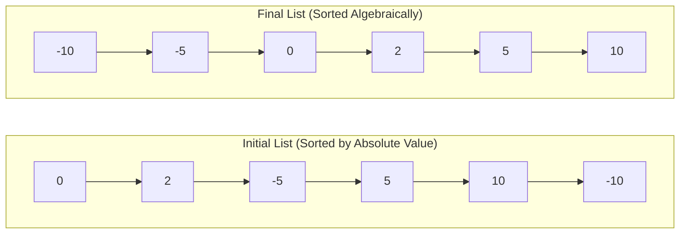

# Guided Example: Sort Linked List Already Sorted Using Absolute Values

We trace the step-by-step execution of the in-place single-pass head-prepending technique on a representative singly-linked list:

- **Input:** $\text{head} = [0, 2, -5, 5, 10, -10]$
- **Expected Output:** $[-10, -5, 0, 2, 5, 10]$

---

## 1. Problem Overview & Representative Instance

We are given the head of a singly-linked list sorted in non-decreasing order of **absolute values**:
$$|v_1| \le |v_2| \le \dots \le |v_n|$$

The task is to reorder the nodes in place so that the list is sorted in non-decreasing order of their **actual algebraic values**:
$$v'_1 \le v'_2 \le \dots \le v'_n$$

In the sample input:
- Non-negative elements appear as $[0, 2, 5, 10]$. Since $|x| = x$ for $x \ge 0$, their existing relative order is already non-decreasing.
- Negative elements appear in sequence as $[-5, -10]$. Because $|-5| = 5 \le |-10| = 10$, a larger absolute value corresponds to a smaller (more negative) algebraic value: $-5 > -10$.
- Prepending each negative node to the head of the list as it is encountered reverses the sequence of negative values from descending order $[-5, -10]$ to ascending order $[-10, -5]$ while placing all negative numbers strictly before all non-negative numbers.

---

## 2. Theoretical Invariants & Traversal Dynamics

Let the original list be partitioned into two subsequences:
1. $P = (p_1, p_2, \dots, p_k)$ consisting of non-negative nodes ($p_i \ge 0$).
2. $N = (n_1, n_2, \dots, n_m)$ consisting of negative nodes ($n_j < 0$).

Because the original sequence is sorted by absolute value:
- For any $i < j$, $|p_i| \le |p_j| \implies p_i \le p_j$. Thus $P$ is already sorted in ascending order.
- For any $i < j$, $|n_i| \le |n_j| \implies -n_i \le -n_j \implies n_i \ge n_j$. Thus $N$ is sorted in descending order.

### Head-Prepending Reversal Invariant
A standard singly-linked list push-to-head operation reverses order (LIFO stack property).
- When a node $n_j < 0$ is detached from its position and linked to the head, it precedes all previously prepended negative nodes.
- Since $n_j \le n_{j-1} \le \dots \le n_1 < 0 \le p_1$, prepending each subsequent negative node ensures that smaller values always arrive at the front of the list.
- Non-negative nodes remain undisturbed in their original positions, preserving the sorted order of $P$.

---

## 3. Step-by-Step State Execution Trace

We initialize pointers:
- $\text{prev} = \text{head}$ (initially node $0$)
- $\text{curr} = \text{head.next}$ (initially node $2$)

At each iteration, we evaluate the sign of $\text{curr.val}$:
- If $\text{curr.val} \ge 0$: The node is already correctly placed. Advance $\text{prev} \leftarrow \text{curr}$ and $\text{curr} \leftarrow \text{curr.next}$.
- If $\text{curr.val} < 0$: Detach $\text{curr}$ from behind $\text{prev}$, insert it before $\text{head}$, update $\text{head} \leftarrow \text{curr}$, and resume scanning with $\text{curr} \leftarrow \text{prev.next}$.

| Step | Current Pointer State | Node Inspected | Condition & Action | Pointer Updates | List State After Iteration |
|---|---|---|---|---|---|
| Init | $\text{head} = 0, \text{prev} = 0, \text{curr} = 2$ | — | Boundary initialization | Base anchors | $0 \to 2 \to -5 \to 5 \to 10 \to -10$ |
| 1 | $\text{prev} = 0, \text{curr} = 2$ | $2 \ge 0$ | Non-negative: keep in place | $\text{prev} \leftarrow 2, \text{curr} \leftarrow -5$ | $0 \to 2 \to -5 \to 5 \to 10 \to -10$ |
| 2 | $\text{prev} = 2, \text{curr} = -5$ | $-5 < 0$ | Negative: detach and prepend to $\text{head}$ | $\text{prev.next} \leftarrow 5, \text{head} \leftarrow -5, \text{curr} \leftarrow 5$ | $-5 \to 0 \to 2 \to 5 \to 10 \to -10$ |
| 3 | $\text{prev} = 2, \text{curr} = 5$ | $5 \ge 0$ | Non-negative: keep in place | $\text{prev} \leftarrow 5, \text{curr} \leftarrow 10$ | $-5 \to 0 \to 2 \to 5 \to 10 \to -10$ |
| 4 | $\text{prev} = 5, \text{curr} = 10$ | $10 \ge 0$ | Non-negative: keep in place | $\text{prev} \leftarrow 10, \text{curr} \leftarrow -10$ | $-5 \to 0 \to 2 \to 5 \to 10 \to -10$ |
| 5 | $\text{prev} = 10, \text{curr} = -10$ | $-10 < 0$ | Negative: detach and prepend to $\text{head}$ | $\text{prev.next} \leftarrow \text{null}, \text{head} \leftarrow -10, \text{curr} \leftarrow \text{null}$ | $-10 \to -5 \to 0 \to 2 \to 5 \to 10$ |
| Done | $\text{curr} = \text{null}$ | — | Scan complete | Return $\text{head}$ | Final sorted list confirmed |

---

## 4. Pointer Rewiring Mechanics

To detach a negative node $\text{curr}$ and splice it to the front without losing references:
1. Preserve successor: $\text{t} = \text{curr.next}$.
2. Bypass $\text{curr}$: $\text{prev.next} = \text{t}$.
3. Prepend to list: $\text{curr.next} = \text{head}$.
4. Reassign head: $\text{head} = \text{curr}$.
5. Advance cursor: $\text{curr} = \text{t}$.

| Rewiring Phase | Link Affected | Before Assignment | After Assignment | Pointer Safety Property |
|---|---|---|---|---|
| Step 2 Splicing | $\text{prev.next}$ | $2 \to -5$ | $2 \to 5$ | Preserves remaining list traversal |
| Step 2 Splicing | $\text{curr.next}$ | $-5 \to 5$ | $-5 \to 0$ | Links detached node to previous head |
| Step 5 Splicing | $\text{prev.next}$ | $10 \to -10$ | $10 \to \text{null}$ | Properly terminates list tail |
| Step 5 Splicing | $\text{curr.next}$ | $-10 \to \text{null}$ | $-10 \to -5$ | Sets smallest element as new global head |

Notice that during negative node relocations, pointer $\text{prev}$ does not advance. It continues pointing to the tail of the processed non-negative prefix, ready to rewire the next link.

---

## 5. Algorithmic Correctness & Soundness

1. **Ordering of Negative Nodes:**
   By problem definition, $|n_1| \le |n_2| \le \dots \le |n_m|$. Since all $n_i$ are negative, multiplying by $-1$ reverses the inequalities: $n_1 \ge n_2 \ge \dots \ge n_m$.
   Iterative head prepending reverses arrival order: the first negative node prepended is $n_1$. The next is $n_2$, placed ahead of $n_1$, and so on. After all negative nodes are processed, their order is $n_m \to n_{m-1} \to \dots \to n_1$, which is sorted ascendingly.

2. **Ordering of Non-Negative Nodes:**
   For all non-negative nodes, absolute value equals algebraic value ($|p_i| = p_i$). Their initial order is already sorted ascendingly. Because $\text{prev}$ simply skips non-negative nodes without altering their relative links, their ordering is strictly preserved.

3. **Global Sorted Guarantee:**
   All negative nodes are moved strictly before the original head (which is either non-negative or the least negative initial node). Since every negative value is strictly less than every non-negative value, the concatenated sequence $\text{negatives} \to \text{non-negatives}$ is globally sorted in non-decreasing order.

---

## 6. Edge Cases, Pitfalls & Structural Traps

- **Negative Initial Head:**
  If the very first node has a negative value (e.g. `head.val = -3`), it is already at the head. Since $|head.val|$ is the minimum absolute value in the entire list, $-3$ is the largest (least negative) of all negative numbers. It will correctly remain at the tail of the negative partition as smaller negative numbers are prepended ahead of it.
- **All Positive or All Negative Lists:**
  - If all values are non-negative, the condition $\text{curr.val} < 0$ never triggers; the loop simply advances $\text{prev}$ and leaves the list untouched in $\mathcal{O}(n)$ time.
  - If all values are negative, every node after the head is prepended, effectively reversing the entire list into ascending order.
- **Dangling Pointer at Tail:**
  When the final node of the list is negative, detaching it must set $\text{prev.next} = \text{null}$. Failing to update $\text{prev.next}$ creates a cycle in the linked list.

---

## 7. Complexity Analysis

- **Time Complexity:** $\mathcal{O}(n)$.
  The algorithm performs a single pass over the linked list. Each node is inspected exactly once. Splicing a node to the head takes $\mathcal{O}(1)$ pointer operations. Total running time is strictly linear in the number of nodes $n$.
- **Space Complexity:** $\mathcal{O}(1)$.
  All operations are performed strictly in place by mutating pointer links. Only a fixed number of auxiliary pointer references ($\text{prev}$, $\text{curr}$, $\text{t}$, $\text{head}$) are maintained, requiring constant auxiliary memory.