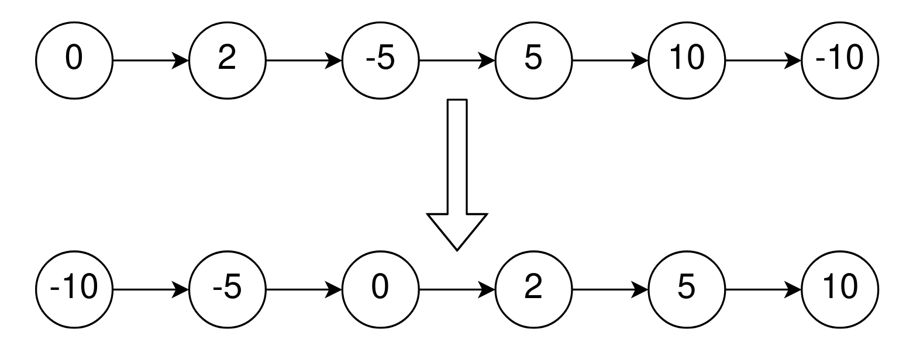
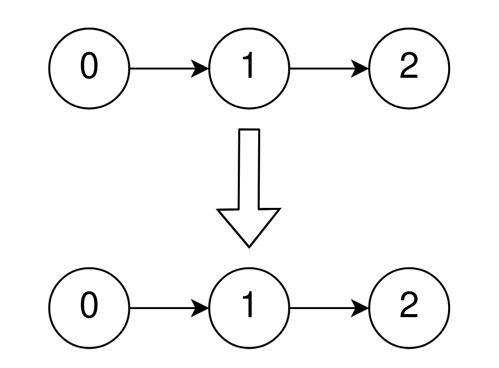

### 1. Description

Given the `head` of a singly linked list that is sorted in **non-decreasing** order using the **absolute values** of its nodes, return *the list sorted in **non-decreasing** order using the **actual values** of its nodes*.

### 2. Function Contract

**Inputs**

- `head`: The head `ListNode` of a singly linked list containing $1 \le N \le 10^5$ nodes, sorted in non-decreasing order by absolute values.

```python
class ListNode:

    def __init__(self, val: int = 0, next: ListNode | None = None):
        self.val = val
        self.next = next
```

**Return value**

Return the `ListNode` head of the relinked list sorted in non-decreasing order by signed values.

### 3. Examples

#### Example 1



- **Input:** $head = [0,2,-5,5,10,-10]$
- **Output:** `[-10,-5,0,2,5,10]`
- **Explanation:** The list sorted in non-descending order using the absolute values of the nodes is [0,2,-5,5,10,-10].
The list sorted in non-descending order using the actual values is [-10,-5,0,2,5,10].

#### Example 2



- **Input:** $head = [0,1,2]$
- **Output:** `[0,1,2]`
- **Explanation:** The linked list is already sorted in non-decreasing order.

#### Example 3

- **Input:** $head = [1]$
- **Output:** `[1]`
- **Explanation:** The linked list is already sorted in non-decreasing order.

### 4. Constraints

- The number of nodes in the list is the range $[1, 10^{5}]$.

- $-5000 \le \text{Node.val} \le 5000$

- `head` is sorted in non-decreasing order using the absolute value of its nodes.

**Follow up:**

- Can you think of a solution with `O(n)` time complexity?
