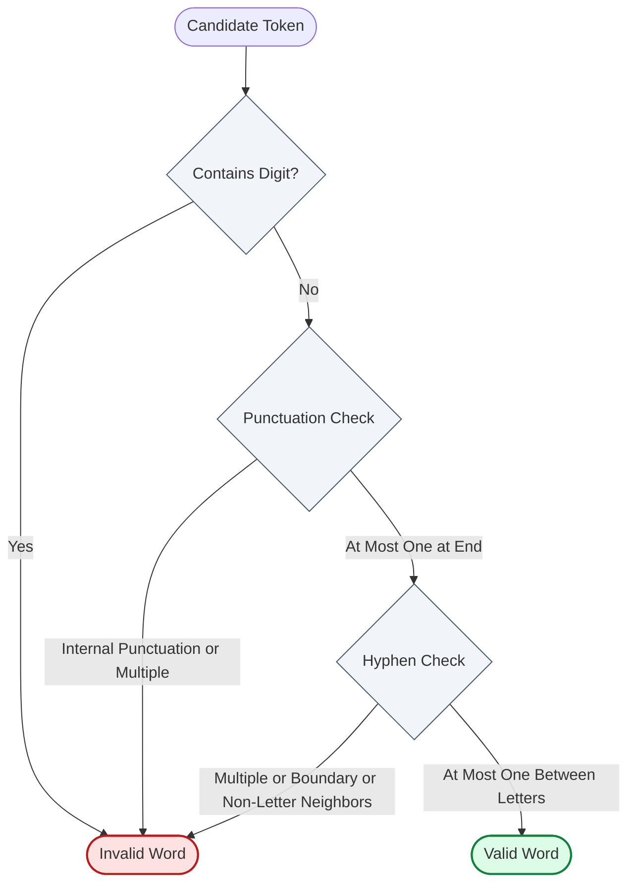

# Guided Example: Number of Valid Words in a Sentence

We trace the step-by-step tokenization and deterministic lexical validation of words in a sentence on a representative instance:

- **Input:** `sentence = "he bought 2 pencils, 3 erasers, and 1  pencil-sharpener."`
- **Expected Output:** $6$

---

## 1. Problem Overview & Representative Instance

A sentence is composed of tokens separated by one or more whitespace characters. A token constitutes a **valid word** if and only if all of the following three lexical grammar rules are satisfied:
1. **No Digits:** The token must consist strictly of lowercase English letters, hyphens, and/or punctuation marks. It cannot contain any digit character ($0$–$9$).
2. **At Most One Hyphen:** The hyphen `'-'` can appear at most once within the token. If present, it must be surrounded on both sides by lowercase letters (i.e. neither at the start nor at the end, and not adjacent to a punctuation mark).
3. **At Most One Punctuation Mark:** Punctuation marks (`'!'`, `'.'`, or `','`) can appear at most once, and must occur strictly at the final character position of the token.

In the target sentence:
`"he bought 2 pencils, 3 erasers, and 1  pencil-sharpener."`
- The string splits across consecutive spaces into $9$ candidate tokens:
  `["he", "bought", "2", "pencils,", "3", "erasers,", "and", "1", "pencil-sharpener."]`
- We validate each token against the three lexical rules and count the valid words.

---

## 2. Theoretical Invariants & Grammar Rules

For any candidate token $S = c_0 c_1 \dots c_{m-1}$ of length $m \ge 1$:

1. **Character Type Partition:**
   Each character $c_i$ belongs to one of three classes:
   - $\text{Letter}: c_i \in ['\text{a}', '\text{z}']$
   - $\text{Punctuation}: c_i \in \{'!', '.', ','\}$
   - $\text{Hyphen}: c_i = '-'$
   - $\text{Digit}: c_i \in ['0', '9'] \implies$ immediate rejection.

2. **Positional Punctuation Constraint:**
   If $c_i \in \{'!', '.', ','\}$, then validity requires $i = m - 1$.
   Any punctuation mark appearing at index $i < m - 1$ invalidates the token.

3. **Contextual Hyphen Invariant:**
   A boolean flag tracks whether a hyphen has already been encountered.
   If $c_i = '-'$, validity requires:
   - No previous hyphen has occurred ($\text{hyphen\_seen} = \text{false}$).
   - $0 < i < m - 1$ (the hyphen is strictly internal).
   - $c_{i-1} \in ['\text{a}', '\text{z}']$ and $c_{i+1} \in ['\text{a}', '\text{z}']$ (both adjacent neighbors are lowercase letters).
   Upon valid inspection, set $\text{hyphen\_seen} = \text{true}$.

---

## 3. Step-by-Step Token Evaluation Trace

We process the sentence from left to right, parsing non-whitespace tokens and applying the grammar validator:

| Token Index | Extracted Token | Rule 1: Digits Checked | Rule 2: Hyphen Verification | Rule 3: Punctuation Position | Decision | Running Valid Count |
|---|---|---|---|---|---|---|
| $1$ | `"he"` | None (Passed) | None present (Passed) | None present (Passed) | **Valid** | $1$ |
| $2$ | `"bought"` | None (Passed) | None present (Passed) | None present (Passed) | **Valid** | $2$ |
| $3$ | `"2"` | Contains `'2'` | Skipped | Skipped | **Invalid** | $2$ |
| $4$ | `"pencils,"` | None (Passed) | None present (Passed) | `','` at index $7 = m - 1$ (Passed) | **Valid** | $3$ |
| $5$ | `"3"` | Contains `'3'` | Skipped | Skipped | **Invalid** | $3$ |
| $6$ | `"erasers,"` | None (Passed) | None present (Passed) | `','` at index $7 = m - 1$ (Passed) | **Valid** | $4$ |
| $7$ | `"and"` | None (Passed) | None present (Passed) | None present (Passed) | **Valid** | $5$ |
| $8$ | `"1"` | Contains `'1'` | Skipped | Skipped | **Invalid** | $5$ |
| $9$ | `"pencil-sharpener."` | None (Passed) | `'-'` at index $6$; surrounded by `'l'` and `'s'` (Passed) | `'.'` at index $16 = m - 1$ (Passed) | **Valid** | **$6$** |

---

## 4. Deep-Dive: Character-by-Character Inspection of Complex Tokens

To illustrate internal state validation, we trace the internal character scan for `"pencil-sharpener."` ($m = 17$):

| Index $i$ | Character $c_i$ | Type Class | Checks Performed | Flag State |
|---|---|---|---|---|
| $0 \dots 5$ | `'p', 'e', 'n', 'c', 'i', 'l'` | Letter | Valid lowercase letter | $\text{hyphen} = \text{false}$ |
| $6$ | `'-'` | Hyphen | $i \in [1, 15]$; $c_5 = '\text{l}'$ is letter; $c_7 = '\text{s}'$ is letter | $\text{hyphen} \leftarrow \text{true}$ |
| $7 \dots 15$ | `'s', 'h', 'a', 'r', 'p', 'e', 'n', 'e', 'r'` | Letter | Valid lowercase letters; no second hyphen | $\text{hyphen} = \text{true}$ |
| $16$ | `'.'` | Punctuation | $i = 16 = m - 1$; at final index | Valid termination |

Contrast this with common invalid structures:
- `"!this"`: Character `'!'` occurs at index $0 < m - 1$, failing Rule 3 immediately.
- `"a-b-c"`: Second hyphen at index $3$ sees $\text{hyphen} = \text{true}$, failing Rule 2.
- `"-start"`: Hyphen at index $0$ violates $0 < i < m - 1$, failing Rule 2.
- `"end-"`: Hyphen at index $m - 1$ violates $0 < i < m - 1$, failing Rule 2.
- `"a-,b"`: Hyphen neighbor $c_{i+1} = ','$ is not a letter, failing Rule 2.

---

## 5. Algorithmic Correctness & Soundness

1. **Partition Exhaustiveness:**
   Every non-empty sequence of non-whitespace characters is isolated by whitespace tokenization. The validation predicate independently tests each token against mutual-exclusion criteria without cross-token side effects.
2. **Necessity & Sufficiency of Rules:**
   - Any character outside the allowed alphabet (letters, hyphen, punctuation) is rejected (digits fail Rule 1).
   - Any internal punctuation mark is caught by testing $i < m - 1$.
   - Any hyphen not strictly connecting two letters is rejected by examining $i - 1$ and $i + 1$.
   - A token passing all character inspections guarantees strict adherence to the problem definition.

---

## 6. Edge Cases, Pitfalls & Structural Traps

- **Consecutive Spaces:** Multiple adjacent spaces must not produce empty strings that corrupt the count. Splitting by whitespace handles arbitrary consecutive delimiters.
- **Single Punctuation Mark:** A standalone punctuation token (e.g. `"."` or `"!"`) has length $m = 1$. The punctuation is at index $0 = m - 1$. There are no hyphens and no digits, so standalone punctuation marks are **valid words**.
- **Hyphen Adjacent to Punctuation:** In `"sub-."`, the hyphen is followed by `'.'`. Because `'.'` is not a letter, the hyphen is invalid even though `'.'` is at the end.
- **Punctuation Followed by Hyphen:** In `",-a"`, the punctuation is at index $0 < m - 1$, immediately invalidating the token.

---

## 7. Complexity Analysis

- **Time Complexity:** $\mathcal{O}(N)$ where $N$ is the length of the sentence in characters.
  Splitting the sentence scans $N$ characters. Validating all tokens examines each character exactly once with $\mathcal{O}(1)$ neighbor lookups. Total execution time is strictly linear in string length.
- **Space Complexity:** $\mathcal{O}(N)$ auxiliary memory to store extracted tokens during sentence splitting, or $\mathcal{O}(1)$ auxiliary space if processing tokens via two-pointer streaming.
