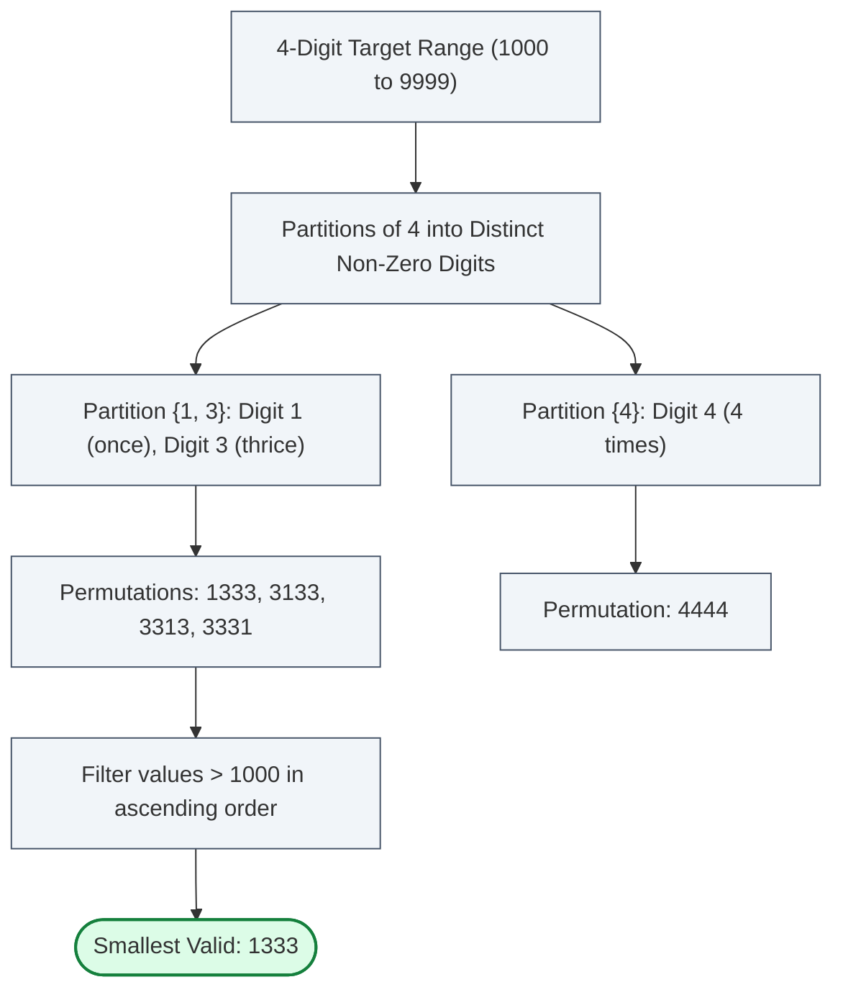

# Guided Example: Next Greater Numerically Balanced Number

We trace the step-by-step digit-frequency validation and combinatorial search for the next numerically balanced integer on a representative instance:

- **Input:** $n = 1000$
- **Expected Output:** $1333$

---

## 1. Problem Overview & Representative Instance

An integer $x$ is defined as **numerically balanced** (or beautiful) if and only if for every distinct decimal digit $d$ that appears in $x$, the count of its occurrences in $x$ is **exactly** $d$.
- Digits not present in $x$ must have an occurrence count of $0$.
- The digit $0$ can **never** appear in any balanced number, because if $0$ were present, its occurrence count would have to be $0$, a direct contradiction.

Given an integer $n \in [0, 10^6]$, the objective is to find the **smallest** numerically balanced integer strictly greater than $n$.

For $n = 1000$:
- Any balanced number with $4$ digits must have total length $L = 4$.
- Since each distinct digit $d$ occurs exactly $d$ times, the sum of distinct digits used must equal the total number of digits: $\sum d = 4$.
- The only partitions of $4$ into distinct positive integers are $\{4\}$ and $\{1, 3\}$.
- Sorting all resulting candidates reveals $1333$ as the minimal balanced number strictly greater than $1000$.

---

## 2. Theoretical Invariants & Combinatorial Structure

Let candidate number $x$ have $L$ digits and let $\text{freq}[d]$ denote the number of times digit $d \in \{0, \dots, 9\}$ appears in the decimal representation of $x$.

### Digit Frequency Invariant
A number $x$ is numerically balanced if and only if:
$$\forall d \in \{0, 1, \dots, 9\}, \quad \text{freq}[d] = 0 \quad \text{or} \quad \text{freq}[d] = d$$

Because each digit $d$ with $\text{freq}[d] > 0$ contributes $d$ digits to the length $L$, the sum of digits present must satisfy:
$$\sum_{d: \text{freq}[d] > 0} d = L$$

Below is the complete catalogue of all possible balanced multiset structures for lengths $L \in [1, 7]$:

| Length $L$ | Allowed Digit Partitions | Multiset of Digits | Representative Balanced Numbers |
|---|---|---|---|
| $1$ | $\{1\}$ | $\{1\}$ | $1$ |
| $2$ | $\{2\}$ | $\{2, 2\}$ | $22$ |
| $3$ | $\{1, 2\}$, $\{3\}$ | $\{1, 2, 2\}$, $\{3, 3, 3\}$ | $122, 212, 221, 333$ |
| $4$ | $\{1, 3\}$, $\{4\}$ | $\{1, 3, 3, 3\}$, $\{4, 4, 4, 4\}$ | $1333, 3133, 3313, 3331, 4444$ |
| $5$ | $\{1, 4\}$, $\{2, 3\}$, $\{5\}$ | $\{1, 4, 4, 4, 4\}$, $\{2, 2, 3, 3, 3\}$, $\{5, 5, 5, 5, 5\}$ | $14444, 22333, 55555$ |
| $6$ | $\{1, 2, 3\}$, $\{1, 5\}$, $\{2, 4\}$, $\{6\}$ | $\{1, 2, 2, 3, 3, 3\}$, $\{1, 5, 5, 5, 5, 5\}$, $\{2, 2, 4, 4, 4, 4\}$, $\{6, 6, 6, 6, 6, 6\}$ | $122333, 155555, 224444, 666666$ |
| $7$ | $\{1, 2, 4\}$, $\{1, 6\}$, $\{2, 5\}$, $\{3, 4\}$, $\{7\}$ | $\{1, 2, 2, 4, 4, 4, 4\}$, $\{1, 6^6\}$, $\{2^2, 5^5\}$, $\{3^3, 4^4\}$, $\{7^7\}$ | $1224444, 1666666, 2255555, 3334444, 7777777$ |

Notice that the entire search space across all integers up to $10^6$ contains only a few thousand total balanced numbers! The smallest balanced number $> 10^6$ is $1224444$.

---

## 3. Step-by-Step State Execution Trace

We trace the candidate verification sequence starting from $n + 1 = 1001$. For each candidate $x$, we extract its decimal digits, populate the frequency array $\text{freq}[0 \dots 9]$, and evaluate the balance condition.

| Candidate $x$ | Digit Extraction | Digit Frequencies $\text{freq}[0 \dots 9]$ | Frequency Test $\forall d: \text{freq}[d] \in \{0, d\}$ | Outcome |
|---|---|---|---|---|
| $1001$ | Digits: $\{1, 0, 0, 1\}$ | $\text{freq}[0]=2, \text{freq}[1]=2$ | $\text{freq}[0]=2 \ne 0$; $\text{freq}[1]=2 \ne 1$ | Rejected |
| $1002$ | Digits: $\{1, 0, 0, 2\}$ | $\text{freq}[0]=2, \text{freq}[1]=1, \text{freq}[2]=1$ | $\text{freq}[0] \ne 0$; $\text{freq}[2] = 1 \ne 2$ | Rejected |
| $\dots$ | Contains $0$ or non-matching counts | — | Violated | Rejected |
| $1220$ | Digits: $\{1, 2, 2, 0\}$ | $\text{freq}[0]=1, \text{freq}[1]=1, \text{freq}[2]=2$ | $\text{freq}[0]=1 \ne 0$ | Rejected |
| $1222$ | Digits: $\{1, 2, 2, 2\}$ | $\text{freq}[1]=1, \text{freq}[2]=3$ | $\text{freq}[2]=3 \ne 2$ | Rejected |
| $\dots$ | Incremental search advances | — | Violated | Rejected |
| $1333$ | Digits: $\{1, 3, 3, 3\}$ | $\text{freq}[1]=1, \text{freq}[3]=3$, all others $0$ | $\text{freq}[1]=1$ and $\text{freq}[3]=3$ (All match!) | **Accepted (Terminates)** |

The first number encountered that satisfies all digit criteria is $1333$. Since candidates are evaluated in strictly increasing sequential order, $1333$ is provably minimal.

---

## 4. Arithmetic Digit Extraction & Verification

For candidate $x = 1333$, we extract digits using integer arithmetic without string conversions:

| Step | Current Value $y$ | Division $(y \div 10)$ | Remainder $v = y \pmod{10}$ | Updated Array Entry |
|---|---|---|---|---|
| 1 | $1333$ | $133$ | $3$ | $\text{freq}[3] \leftarrow 1$ |
| 2 | $133$ | $13$ | $3$ | $\text{freq}[3] \leftarrow 2$ |
| 3 | $13$ | $1$ | $3$ | $\text{freq}[3] \leftarrow 3$ |
| 4 | $1$ | $0$ | $1$ | $\text{freq}[1] \leftarrow 1$ |
| Done | $0$ | — | — | Verification: $\text{freq}[1]=1, \text{freq}[3]=3$ |

Because the condition $\text{freq}[d] = 0 \lor \text{freq}[d] = d$ holds for every $d \in \{0, \dots, 9\}$, the candidate passes instantly.

---

## 5. Algorithmic Correctness & Soundness

1. **Minimality Guarantee:**
   Examining candidate values $x = n + 1, n + 2, n + 3, \dots$ in strictly increasing order guarantees that the first integer satisfying the balance condition is the smallest valid integer strictly greater than $n$. No smaller candidate can exist because all smaller values have already been tested and rejected.
2. **Termination Guarantee:**
   For any $n \le 10^6$, the finite upper bound $1224444$ is balanced ($1$ appears once, $2$ appears twice, $4$ appears four times). Since $1224444 > 10^6 \ge n$, the search loop is guaranteed to terminate in at most $1224444 - n$ steps.
3. **Soundness of Digit Multiplicities:**
   By computing digit frequencies via arithmetic extraction and testing exact equality against digit identities, false positives (such as numbers containing zero or incorrect counts) are strictly eliminated.

---

## 6. Edge Cases, Pitfalls & Structural Traps

- **Presence of Digit 0:**
  Any number with a $0$ digit (such as $1000$ or $202$) is invalid. An explicit check or frequency comparison $\text{freq}[0] = 0$ must hold.
- **Duplicate Digits in Partitions:**
  Partitions of $L$ must comprise distinct digits. For example, $2 + 2 = 4$ is not a valid partition of $4$, because digit $2$ cannot appear $4$ times (it would violate $\text{freq}[2] = 2$).
- **Strictly Greater Requirement:**
  If the input $n$ is itself already balanced (e.g. $n = 22$), the output must be strictly greater (the next balanced number is $122$, not $22$). Starting the search at $n + 1$ satisfies this rule.
- **Upper Bound Overflow:**
  When $n = 10^6$, no 6-digit number exceeds $n$. The algorithm naturally advances to the 7-digit domain and discovers $1224444$.

---

## 7. Complexity Analysis

- **Time Complexity:** $\mathcal{O}(M \cdot \log_{10} M)$ where $M$ is the return value ($M \le 1224444$).
  In the worst case, the gap between $n$ and the next balanced number is at most a few thousand iterations. Each test extracts at most $7$ digits, requiring $\mathcal{O}(1)$ time per candidate. Total execution time is bounded and runs in milliseconds.
- **Space Complexity:** $\mathcal{O}(1)$.
  The digit frequency array contains exactly $10$ entries. No dynamic memory or string allocation is required.
