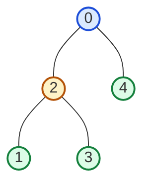

# Guided Example: Count Nodes With the Highest Score

We trace the step-by-step subtree size aggregation and component product evaluation on a representative tree instance:

- **Input:** $\text{parents} = [-1, 2, 0, 2, 0]$
- **Expected Output:** $3$

---

## 1. Problem Overview & Representative Instance

We are given an integer array $\text{parents}$ representing a rooted 0-indexed tree with $n$ nodes ($0$ to $n - 1$). The root is node $0$ with $\text{parents}[0] = -1$. Each node has at most two children.
When node $i$ is removed from the tree along with all its incident edges, the tree fragments into one or more non-empty connected components. The **score** of node $i$ is defined as the product of the sizes (node counts) of each remaining connected component.

Our goal is to find the **number of nodes** that achieve the maximum possible score.

In this representative instance with $n = 5$:
- Node $0$ is the root with children $\{2, 4\}$.
- Node $2$ has children $\{1, 3\}$.
- Nodes $1, 3, 4$ are leaves with no children.

---

## 2. Theoretical Invariants & Component Decomposition

When any node $u$ is removed from a tree of $n$ vertices:
1. **Child Subtree Components:**
   Each child $v \in \text{children}(u)$ becomes the root of an independent connected component containing exactly $S_v$ nodes, where $S_v$ is the subtree size of node $v$.
2. **Parent Component:**
   All remaining nodes in the tree outside the subtree rooted at $u$ remain connected via $u$'s parent. The size of this parent component is:
   $$\text{parent\_size}(u) = n - S_u$$
   If $u$ is the root ($u = 0$), $S_0 = n$, so $\text{parent\_size}(0) = 0$ (no parent component exists).

### Component Score Formula
The score of node $u$ is the product of all non-empty component sizes:
$$\text{score}(u) = \left( \prod_{v \in \text{children}(u)} S_v \right) \times \left( n - S_u > 0 \ ? \ (n - S_u) : 1 \right)$$

### Post-Order Subtree Size Invariant
Subtree sizes are computed via a single post-order traversal:
$$S_u = 1 + \sum_{v \in \text{children}(u)} S_v$$
By visiting all descendants before evaluating $u$, each $S_v$ is fully known when computing $S_u$ and $\text{score}(u)$.

---

## 3. Step-by-Step Subtree Size Evaluation Trace

We perform a post-order depth-first search starting from root $0$, recursing down to leaves and aggregating subtree sizes bottom-up:

| Visit Step | Node $u$ | Child Nodes Examined | Returned Child Subtree Sizes | Formula $S_u = 1 + \sum S_v$ | Subtree Size $S_u$ |
|---|---|---|---|---|---|
| 1 | $1$ | None (Leaf) | None | $1 + 0$ | $S_1 = 1$ |
| 2 | $3$ | None (Leaf) | None | $1 + 0$ | $S_3 = 1$ |
| 3 | $2$ | $\{1, 3\}$ | $S_1 = 1, S_3 = 1$ | $1 + 1 + 1$ | $S_2 = 3$ |
| 4 | $4$ | None (Leaf) | None | $1 + 0$ | $S_4 = 1$ |
| 5 | $0$ | $\{2, 4\}$ | $S_2 = 3, S_4 = 1$ | $1 + 3 + 1$ | $S_0 = 5 = n$ |

---

## 4. Score Computation & Running Maximum Tracking

With all subtree sizes established, we calculate the fragmentation score for every node $u \in \{0, 1, 2, 3, 4\}$:

| Node $u$ | Child Components ($S_v$) | Parent Component ($n - S_u$) | Multiplication Breakdown | Final Score $\text{score}(u)$ | Maximum Score $\text{max\_score}$ | Max Count $\text{ans}$ |
|---|---|---|---|---|---|---|
| $0$ | $S_2 = 3, S_4 = 1$ | None ($5 - 5 = 0$) | $3 \times 1$ | $3$ | $3$ | $1$ |
| $1$ | None (factor $1$) | $5 - S_1 = 5 - 1 = 4$ | $1 \times 4$ | $4$ | $4$ (new max) | $1$ |
| $2$ | $S_1 = 1, S_3 = 1$ | $5 - S_2 = 5 - 3 = 2$ | $1 \times 1 \times 2$ | $2$ | $4$ | $1$ |
| $3$ | None (factor $1$) | $5 - S_3 = 5 - 1 = 4$ | $1 \times 4$ | $4$ | $4$ (tie) | $2$ |
| $4$ | None (factor $1$) | $5 - S_4 = 5 - 1 = 4$ | $1 \times 4$ | $4$ | $4$ (tie) | **$3$** |

### Outcome
- The highest score achieved by any node in the tree is $4$.
- Exactly three nodes ($1, 3$, and $4$) achieve this maximum score.
- The return value is $3$.

---

## 5. Algorithmic Correctness & Soundness

1. **Topological Tree Connectivity:**
   In any tree, removing a single vertex $u$ partitions the remaining $n - 1$ vertices into connected components corresponding exactly to the connected components of the forest formed by deleting $u$.
   - Each subtree rooted at an immediate child of $u$ forms an isolated connected component.
   - The remainder of the tree connects through $u$'s parent.
   No other components exist because a tree contains no cycles.
2. **Completeness of Score Calculation:**
   Since every node $u$ participates in the DFS exactly once, all $n$ scores are evaluated. The running maximum accumulator $(\text{max\_score}, \text{count})$ strictly tracks the maximum and its frequency, guaranteeing zero omissions.

---

## 6. Edge Cases, Pitfalls & Structural Traps

- **Root Has No Parent Component:**
  When evaluating node $0$, $n - S_0 = n - n = 0$. Multiplying the score by $0$ would produce an incorrect score of $0$. The parent factor must be included only if $n - S_u > 0$.
- **Integer Overflow with Large Trees:**
  For $n \le 10^5$, the product of component sizes can reach $(10^5 / 3)^3 \approx 3.7 \times 10^{13}$, which exceeds the 32-bit signed integer limit ($2 \times 10^9$). The calculation requires 64-bit integer arithmetic.
- **Star Graph (Root Connected to All Leaves):**
  When node $0$ has $n - 1$ children, removing node $0$ creates $n - 1$ components of size $1$ (score $1$). Removing any leaf creates one component of size $n - 1$ (score $n - 1$). The leaves win with max score $n - 1$.
- **Linear Path / Skewed Tree:**
  In a line graph $0 - 1 - 2 - \dots - (n - 1)$, removing an interior node $u$ splits the tree into two components of sizes $u$ and $n - 1 - u$. The maximum occurs near the median $\lfloor (n - 1) / 2 \rfloor$.

---

## 7. Complexity Analysis

- **Time Complexity:** $\mathcal{O}(n)$.
  Building the adjacency list from the $\text{parents}$ array visits each node once ($\mathcal{O}(n)$). The post-order DFS visits each node and traverses each of the $n - 1$ tree edges exactly once, computing the score in $\mathcal{O}(1)$ time per node. Total time is strictly linear in $n$.
- **Space Complexity:** $\mathcal{O}(n)$.
  The tree representation consumes $\mathcal{O}(n)$ memory for parent-child adjacency lists. The recursion call stack uses $\mathcal{O}(h)$ space, where $h \le n$ is the maximum tree depth.