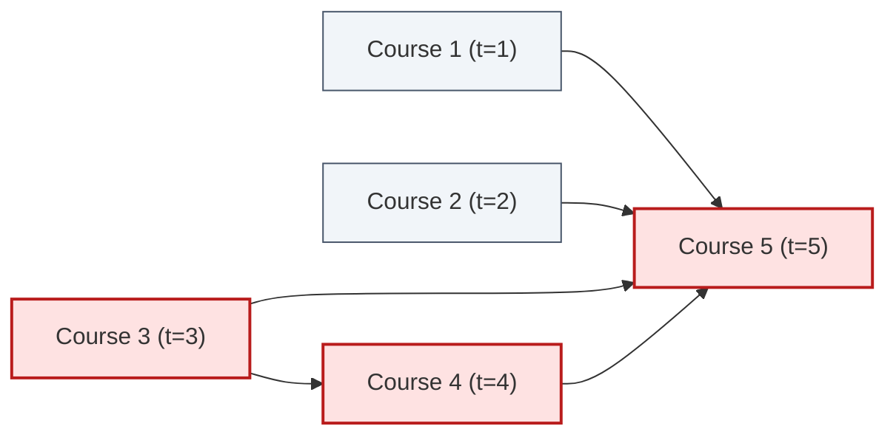

# Guided Example: Parallel Courses III

We trace the step-by-step topological dynamic programming (Critical Path Method) on a representative prerequisite graph:

- **Input:** $n = 5$, $\text{relations} = [[1, 5], [2, 5], [3, 5], [3, 4], [4, 5]]$, $\text{time} = [1, 2, 3, 4, 5]$
- **Expected Output:** $12$

---

## 1. Problem Overview & Representative Instance

We are given $n$ courses labeled $1$ to $n$ and a set of directed dependencies where pair $[a, b]$ indicates that course $a$ must be completed before course $b$ can begin. Each course $i$ requires $\text{time}[i - 1]$ months to complete. Any number of courses can be taken concurrently, provided all prerequisites for each course have finished.

The goal is to determine the **minimum total time** required to complete all $n$ courses.

In this representative instance:
- Courses $1, 2$, and $3$ have no prerequisites and start at month $0$ in parallel.
- Course $4$ depends solely on Course $3$.
- Course $5$ depends on Courses $1, 2, 3$, and $4$.
- The total project duration is governed by the longest chain of sequential dependencies (the **critical path**): $3 \to 4 \to 5$, requiring $3 + 4 + 5 = 12$ months.

---

## 2. Theoretical Invariants & Critical Path Method

Because dependencies form a Directed Acyclic Graph (DAG) and unlimited courses can run in parallel:
1. **Earliest Start Time:**
   Course $j$ cannot start until all its prerequisite courses have completed:
   $$\text{start}[j] = \max_{i \in \text{prereq}(j)} \text{finish}[i]$$
   If a course has no prerequisites, $\text{start}[j] = 0$.

2. **Earliest Completion Time:**
   Course $j$ completes at:
   $$\text{finish}[j] = \text{start}[j] + \text{time}[j]$$

3. **Global Project Duration:**
   All courses are complete once every individual course has finished:
   $$\text{Total Duration} = \max_{1 \le j \le n} \text{finish}[j]$$

### Topological Ordering Invariant
By processing vertices according to a topological sort (via Kahn's in-degree reduction algorithm):
- When vertex $j$'s in-degree reaches $0$, every predecessor $i \in \text{prereq}(j)$ has already been fully processed.
- Therefore, $\text{finish}[j]$ is complete, finalized, and will never increase again.

---

## 3. Step-by-Step State Execution Trace

We index courses $0$ through $4$ (corresponding to courses $1$ through $5$).
- Initial in-degrees: $\text{indeg} = [0, 0, 0, 1, 4]$.
- Initial completion times: for in-degree $0$ nodes, $f[i] = \text{time}[i]$; for others, $f[i] = 0$.
- Initial queue: $[0, 1, 2]$ (courses $1, 2, 3$).

| Step | Dequeued Course $i$ | Traversed Edge $i \to j$ | Completion Update $f[j] = \max(f[j], f[i] + \text{time}[j])$ | In-Degree Decrement $\text{indeg}[j]$ | Enqueued Node | Queue State |
|---|---|---|---|---|---|---|
| Init | — | — | $f[0]=1, f[1]=2, f[2]=3$ | — | — | $[0, 1, 2]$ |
| 1 | $0$ (Course 1) | $0 \to 4$ | $f[4] = \max(0, 1 + 5) = 6$ | $\text{indeg}[4] = 4 - 1 = 3$ | None | $[1, 2]$ |
| 2 | $1$ (Course 2) | $1 \to 4$ | $f[4] = \max(6, 2 + 5) = 7$ | $\text{indeg}[4] = 3 - 1 = 2$ | None | $[2]$ |
| 3 | $2$ (Course 3) | $2 \to 3$ | $f[3] = \max(0, 3 + 4) = 7$ | $\text{indeg}[3] = 1 - 1 = 0$ | Enqueue $3$ | $[3]$ |
| 4 | $2$ (Course 3) | $2 \to 4$ | $f[4] = \max(7, 3 + 5) = 8$ | $\text{indeg}[4] = 2 - 1 = 1$ | None | $[3]$ |
| 5 | $3$ (Course 4) | $3 \to 4$ | $f[4] = \max(8, 7 + 5) = 12$ | $\text{indeg}[4] = 1 - 1 = 0$ | Enqueue $4$ | $[4]$ |
| 6 | $4$ (Course 5) | None (Sink) | None | — | None | $[\,]$ (Empty) |

---

## 4. Course Schedule & Timeline Summary

Below is the consolidated schedule detailing the earliest start and completion months for each course:

| Course ID | Duration ($\text{time}$) | Prerequisites | Earliest Start Time $\max f[\text{prereq}]$ | Earliest Completion Time $f[i]$ | Active Time Window |
|---|---|---|---|---|---|
| Course 1 | $1$ | None | $0$ | $1$ | Month $[0, 1]$ |
| Course 2 | $2$ | None | $0$ | $2$ | Month $[0, 2]$ |
| Course 3 | $3$ | None | $0$ | $3$ | Month $[0, 3]$ |
| Course 4 | $4$ | Course 3 | $3$ | $7$ | Month $[3, 7]$ |
| Course 5 | $5$ | Courses 1, 2, 3, 4 | $\max(1, 2, 3, 7) = 7$ | **$12$** | Month $[7, 12]$ |

The overall minimum time required to complete all courses is $\max(1, 2, 3, 7, 12) = 12$.

---

## 5. Algorithmic Correctness & Soundness

1. **DAG Property & Deadlock Freedom:**
   The problem statement guarantees that prerequisite relations contain no directed cycles. Hence, at least one vertex has in-degree $0$ at all times until all vertices have been processed. The topological sort explores every course without getting stuck.
2. **Optimal Substructure of Longest Path:**
   Let $\text{dist}(u)$ be the longest path from any source to $u$. For any edge $u \to v$, $\text{dist}(v) \ge \text{dist}(u) + \text{weight}(v)$. Because relaxation is performed in topological order, by the time $v$ is dequeued, all incoming edges to $v$ have been relaxed. Thus $\text{finish}[v]$ is guaranteed to be optimal before $v$ relaxes its own outgoing edges.
3. **Soundness of Unlimited Parallelism:**
   Because there is no constraint on the number of courses that can be taken simultaneously, each course begins at the earliest possible instant when all its direct prerequisites have concluded.

---

## 6. Edge Cases, Pitfalls & Structural Traps

- **Isolated Courses:** Courses with no prerequisites and no dependents must not be forgotten. Initializing the answer as the maximum of all independent course times ensures that a disconnected single course with long duration (e.g. duration $100$) correctly dictates the project length.
- **Multiple Incoming Paths with Different Lengths:** Downstream nodes must wait for the slowest prerequisite, requiring $\max$, not sum. In the example, Course 5 has prerequisites finishing at months $1, 2, 3,$ and $7$; it must wait until month $7$.
- **1-Indexed to 0-Indexed Offset:** Prerequisite relations are given with 1-based indexing, while array buffers are 0-based. Consistently mapping $a - 1$ and $b - 1$ prevents off-by-one out-of-bounds indexing.

---

## 7. Complexity Analysis

- **Time Complexity:** $\mathcal{O}(V + E)$ where $V = n$ is the number of courses and $E$ is the number of prerequisite relations.
  Building the adjacency list and in-degree array inspects $E$ edges. Each vertex is enqueued and dequeued exactly once ($\mathcal{O}(V)$). Each directed edge is traversed exactly once during relaxation ($\mathcal{O}(E)$). Overall time is strictly linear in the size of the graph.
- **Space Complexity:** $\mathcal{O}(V + E)$.
  The adjacency list stores $E$ directed edges. The in-degree and completion time arrays store $V$ integers. The BFS queue holds at most $V$ vertices simultaneously.
