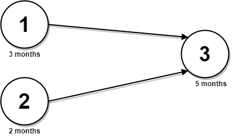
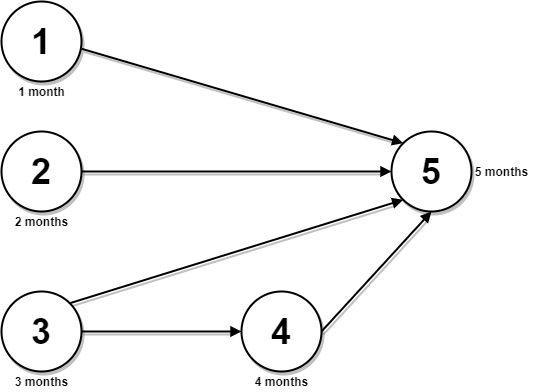

### 1. Description

You are given an integer `n`, which indicates that there are `n` courses labeled from `1` to `n`. You are also given a 2D integer array `relations` where $\text{relations}[j] = [\text{prevCourse}_{j}, \text{nextCourse}_{j}]$ denotes that course $\text{prevCourse}_{j}$ has to be completed **before** course $\text{nextCourse}_{j}$ (prerequisite relationship). Furthermore, you are given a **0-indexed** integer array `time` where $\text{time}[i]$ denotes how many **months** it takes to complete the $(i+1)^th$ course.

You must find the **minimum** number of months needed to complete all the courses following these rules:

- You may start taking a course at **any time** if the prerequisites are met.

- **Any number of courses** can be taken at the **same time**.

Return *the **minimum** number of months needed to complete all the courses*.

### 2. Function Contract

**Inputs**

- `n`: Input parameter (`int`).
- `relations`: Input parameter (`List[List[int]]`).
- `time`: Input parameter (`List[int]`).

**Return value**

- Returns `int`.

### 3. Note

The test cases are generated such that it is possible to complete every course (i.e., the graph is a directed acyclic graph).

### 4. Examples

#### Example 1

**

**

- **Input:** $n = 3, relations = [[1,3],[2,3]], time = [3,2,5]$
- **Output:** `8`
- **Explanation:** The figure above represents the given graph and the time required to complete each course.
We start course 1 and course 2 simultaneously at month 0.
Course 1 takes 3 months and course 2 takes 2 months to complete respectively.
Thus, the earliest time we can start course 3 is at month 3, and the total time required is 3 + 5 = 8 months.

#### Example 2

**

**

- **Input:** $n = 5, relations = [[1,5],[2,5],[3,5],[3,4],[4,5]], time = [1,2,3,4,5]$
- **Output:** `12`
- **Explanation:** The figure above represents the given graph and the time required to complete each course.
You can start courses 1, 2, and 3 at month 0.
You can complete them after 1, 2, and 3 months respectively.
Course 4 can be taken only after course 3 is completed, i.e., after 3 months. It is completed after 3 + 4 = 7 months.
Course 5 can be taken only after courses 1, 2, 3, and 4 have been completed, i.e., after max(1,2,3,7) = 7 months.
Thus, the minimum time needed to complete all the courses is 7 + 5 = 12 months.

### 5. Constraints

- $1 \le n \le 5 * 10^{4}$

- $0 \le \text{relations.length} \le min(n * (n - 1) / 2, 5 * 10^{4})$

- $\text{relations}[j].length = 2$

- $1 \le \text{prevCourse}_{j}, \text{nextCourse}_{j} \le n$

- $\text{prevCourse}_{j} \neq \text{nextCourse}_{j}$

- All the pairs $[\text{prevCourse}_{j}, \text{nextCourse}_{j}]$ are **unique**.

- $\text{time.length} = n$

- $1 \le \text{time}[i] \le 10^{4}$

- The given graph is a directed acyclic graph.
