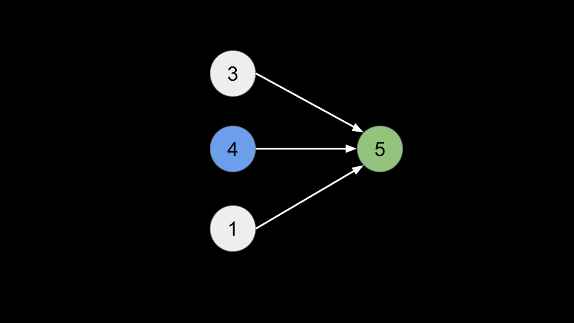
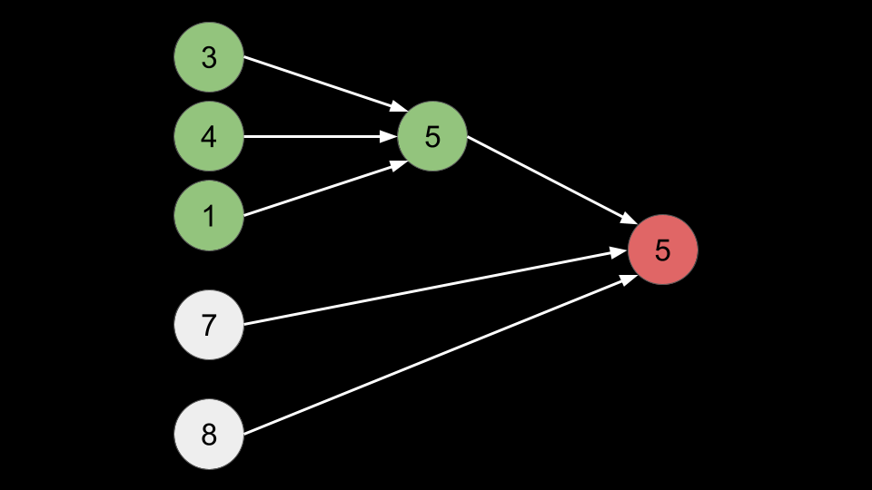
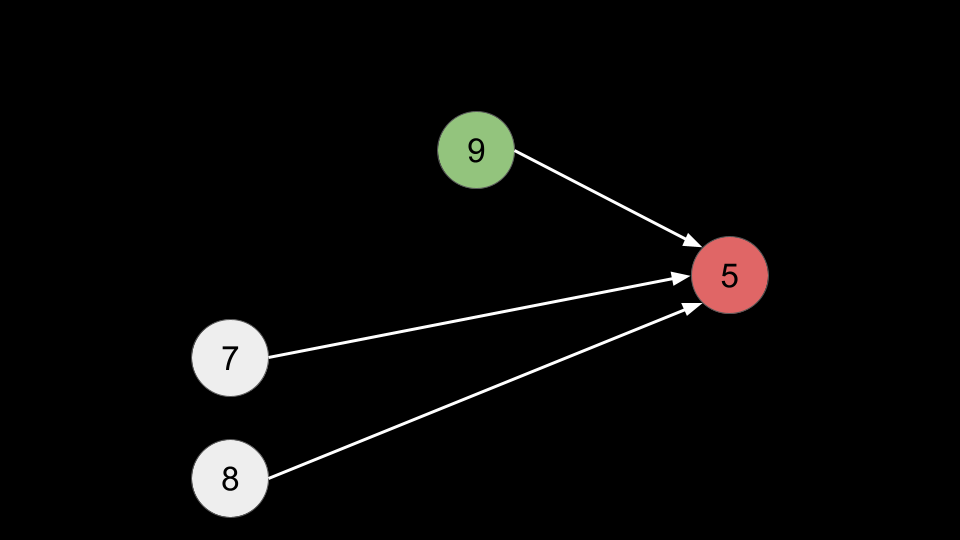
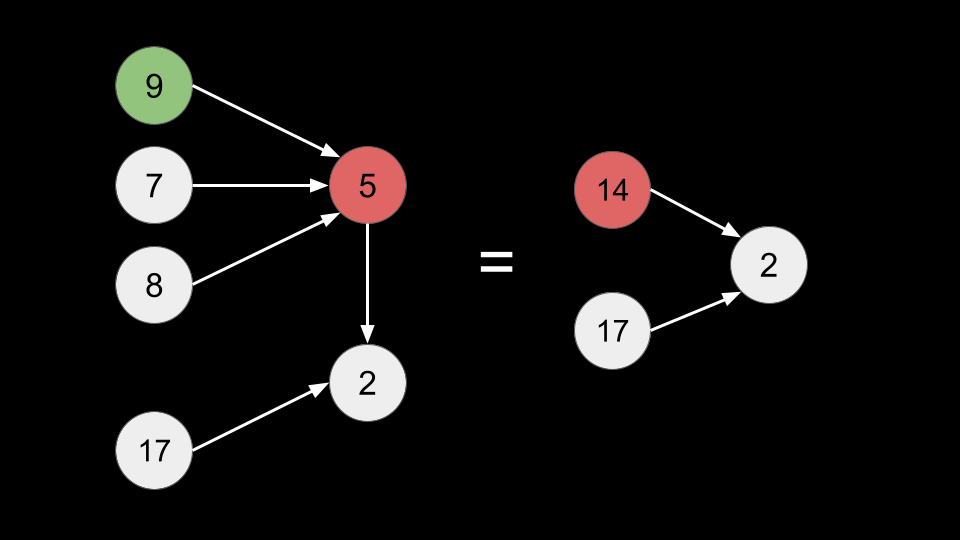
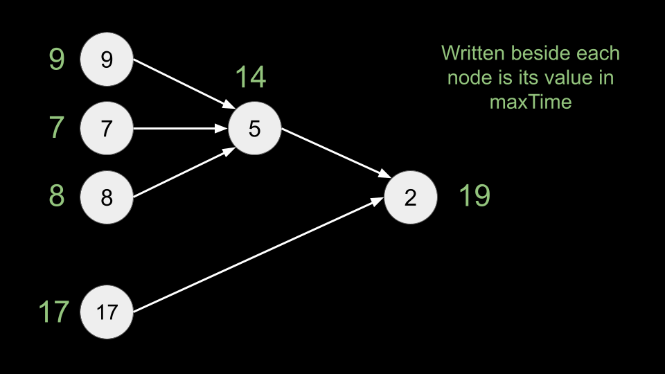

## Solution

---

### Approach 1: Topological Sort, Kahn's Algorithm

**Intuition**

> If you are not familiar with topological sorting, please refer to our explore cards [Topological Sorting Explore Card](https://leetcode.com/explore/learn/card/graph/623/kahns-algorithm-for-topological-sorting/). We will focus on the usage in this article and not the underlying principles or implementation details.

We can think of each course as a node in a graph, with the prerequisites being directed edges. Each node has a value, given in `time`. The problem tells us two things:

1. We can start taking a course as soon as the prerequisites are met
2. We can take any number of courses simultaneously

Take a look at the following graph.


<br>

Before we can start the course in green, we must finish the three other prerequisite courses first. However, only the completion time of the course in blue matters. Because of the 2nd rule, we can take all of them simultaneously. The course in blue requires the longest completion time, so by the time we take 4 months to finish it, the other two courses will have already been completed. Thus, we can complete the course in green after 4 + 5 = 9 months.

Let's extend the graph.


<br>

The nodes in green are the same ones from the first image. We already established that it takes 9 months to complete those courses. Thus, to start the red course, the other two nodes with values 7 and 8 are irrelevant because, by the time we take 9 months to finish the green nodes, they will already have been completed. To finish the red course, we need 9 + 5 = 14 months.


<br>

Without loss of generality, we can consider all the green nodes as a single node with value 9. If we were to extend the graph further, then we could consider the entire previous graph as a single node with value 14.


<br>

The takeaway from these examples is that we don't need to worry about the order in which the courses are taken. The only thing that matters for the completion time of each course is the latest prerequisite to be completed.

This simplifies the problem: let's define the **value** of a path as the sum of values for each node on the path. Consider all paths starting from nodes without any prerequisites. The answer to the problem is the maximum value of all such paths.

We can topologically sort the courses using Kahn's algorithm to solve this problem by simulating the process we talked about in the above example.

Consider an array `maxTime`. Let $\text{maxTime}[node]$ represent the maximum value of all paths **ending** at `node`. Essentially, this array represents the simplifications from the above examples.


<br>

We initially consider all nodes with an indegree of 0 (no prerequisites). For each node, we iterate over each `neighbor` and try to update $\text{maxTime}[neighbor]$ with a larger value. We also decrease the indegree of `neighbor`, and if it becomes 0, we push `neighbor` to our queue. In the end, the answer is the maximum value in `maxTime`.

**Algorithm**

1. Initialize the following data structures:
- A `graph` from `relations`. For convenience, we will change the nodes to be 0-indexed.
- An array `indegree` of length `n`, representing the indegree of each node.
- A `queue` to perform Kahn's algorithm.
- An array `maxTime` of length `n`, representing the maximum value of all paths ending at certain nodes.
2. For all nodes with $\text{indegree}[node] = 0$, push them to the queue and initialize $\text{maxTime}[node] = \text{time}[node]$.
3. While `queue` is not empty:
- Pop a `node`.
- Iterate over $\text{graph}[node]$. For each `neighbor`:
- Update $\text{maxTime}[neighbor]$ with $\text{maxTime}[node] + \text{time}[neighbor]$ if it is larger.
- Decrement $\text{indegree}[neighbor]$.
- If $\text{indegree}[neighbor] = 0$, push `neighbor` to `queue`.
4. Return `max(maxTime)`.

**Implementation**

```python
class Solution:
    def minimumTime(self, n: int, relations: List[List[int]], time: List[int]) -> int:
        graph = defaultdict(list)
        indegree = [0] * n

        for (x, y) in relations:
            graph[x - 1].append(y - 1)
            indegree[y - 1] += 1

        queue = deque()
        max_time = [0] * n
        for node in range(n):
            if indegree[node] == 0:
                queue.append(node)
                max_time[node] = time[node]

        while queue:
            node = queue.popleft()
            for neighbor in graph[node]:
                max_time[neighbor] = max(max_time[neighbor], max_time[node] + time[neighbor])
                indegree[neighbor] -= 1
                if indegree[neighbor] == 0:
                    queue.append(neighbor)

        return max(max_time)
```

**Complexity Analysis**

Given $e$ as the length of `relations`,

* Time complexity: $O(n + e)$

    It costs $O(e)$ to build `graph` and $O(n)$ to initialize `maxTime`, `queue`, and `indegree`.

    During Kahn's algorithm, each node is pushed and popped to `queue` once, costing $O(n)$. We have a for loop inside the while loop, but this for loop is iterating over edges. Because we only visit each node once, each edge in the input can only be iterated over once as well. This means all for loop iterations across the algorithm will cost $O(e)$.

* Space complexity: $O(n + e)$

    `graph` takes $O(n + e)$ space, the `queue` can take up to $O(n)$ space, `maxTime` and `indegree` both take $O(n)$ space.

<br/>

---

### Approach 2: DFS + Memoization (Top-Down DP)

**Intuition**

We can also use DFS to solve this problem in the other direction. Let's define `dfs(node)` as the maximum value of all paths starting with `node`. If `node` is not a prerequisite to any courses, then we can simply return the value of `node` since the only path starting at `node` is `node` itself.

Otherwise, we iterate over each `neighbor` of `node` and call `dfs(neighbor)`. We take the maximum value of all these calls, add the value of `node` to it, and return that as `dfs(node)`. The answer to the original problem is the maximum value of `dfs` across all nodes. Because `dfs(node)` may be called many times, we will memoize our function to improve performance.

> This approach is very similar to the first one. In the first approach, for each `node`, we consider all paths ending at `node`, and we update $\text{maxTime}[node]$ using the prerequisites of `node`.
>
> In this approach, for each `node`, we consider all paths starting at `node`, and we update `dfs(node)` using the courses that `node` is a prerequisite of.
>
> Due to the nature of recursion, we do not need to worry about the order in which we visit nodes, and thus a simple DFS works - we don't need to topologically sort.

**Algorithm**

1. Create a `graph` from `relations`. For convenience, we will change the nodes to be 0-indexed.
2. Define a memoized function `dfs(node)`:
- If `node` has no outgoing edges, return $\text{time}[node]$.
- Initialize $ans = 0$.
- Iterate over $\text{graph}[node]$. For each `neighbor`, set $ans = max(ans, dfs(neighbor))$.
- Return $\text{time}[node] + ans$.
3. Call `dfs(node)` for all nodes and return the maximum value.

**Implementation**

```python
class Solution:
    def minimumTime(self, n: int, relations: List[List[int]], time: List[int]) -> int:
        @cache
        def dfs(node):
            if not graph[node]:
                return time[node]

            ans = 0
            for neighbor in graph[node]:
                ans = max(ans, dfs(neighbor))

            return time[node] + ans

        graph = defaultdict(list)
        for (x, y) in relations:
            graph[x - 1].append(y - 1)

        ans = 0
        for node in range(n):
            ans = max(ans, dfs(node))

        return ans
```

**Complexity Analysis**

Given $e$ as the length of `relations`,

* Time complexity: $O(n + e)$

    It costs $O(e)$ to build `graph`.

    Because we memoized `dfs`, we never calculate `dfs` for a given `node` more than once. In `dfs`, we have a for loop. This for loop will iterate $O(e)$ times across all iterations, since we can never iterate over an edge more than once. Thus, the total time for all `dfs` calls is $O(n + e)$.

* Space complexity: $O(n + e)$

    `graph` takes $O(n + e)$ space, `memo` takes $O(n)$ space, and the recursion call stack can take up to $O(n)$ space in the worst-case scenario (when this directed graph degenerates into a linked list.)

<br/>

---