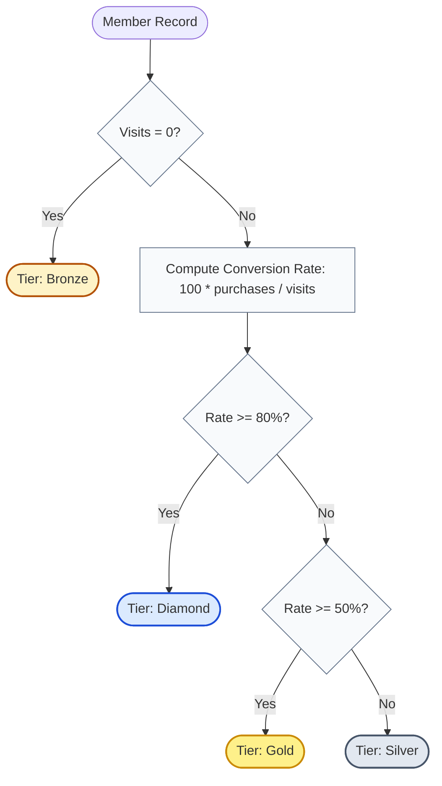

# Guided Example: The Category of Each Member in the Store

We trace the step-by-step relational left joins, aggregation counting, and conversion rate classification on a representative store membership dataset:

- **Input:** Relational tables `Members`, `Visits`, and `Purchases`
- **Expected Output:** Table of members with their corresponding tier (`'Diamond'`, `'Gold'`, `'Silver'`, or `'Bronze'`)

---

## 1. Problem Overview & Representative Instance

A retail store manages three tables:
- `Members(member_id, name)`: Contains unique store member profiles.
- `Visits(visit_id, member_id, visit_date)`: Logs every customer visit to the store.
- `Purchases(visit_id, charged_amount)`: Records transactions associated with visits (at most one purchase per visit).

The **conversion rate** of a member is defined as:
$$\text{conversion rate} = 100 \times \frac{\text{number of purchases}}{\text{number of visits}}$$

Members are categorized into loyalty tiers according to their visit and conversion statistics:
1. **Bronze:** Members who have **zero visits** ($\text{visits} = 0$).
2. **Diamond:** Members with $\text{visits} \ge 1$ and a conversion rate $\ge 80\%$.
3. **Gold:** Members with $\text{visits} \ge 1$ and a conversion rate $\ge 50\%$ but $< 80\%$.
4. **Silver:** Members with $\text{visits} \ge 1$ and a conversion rate $< 50\%$.

### Representative Dataset
**Table: `Members`**
| `member_id` | `name` |
|---|---|
| $9$ | Alice |
| $11$ | Bob |
| $3$ | Winston |
| $8$ | Hercy |
| $1$ | Narihan |

**Table: `Visits`**
| `visit_id` | `member_id` | `visit_date` |
|---|---|---|
| $22$ | $11$ | 2021-10-28 |
| $16$ | $11$ | 2021-01-12 |
| $18$ | $9$ | 2021-12-10 |
| $19$ | $3$ | 2021-10-19 |
| $12$ | $11$ | 2021-03-01 |
| $17$ | $8$ | 2021-05-07 |
| $21$ | $9$ | 2021-05-12 |

**Table: `Purchases`**
| `visit_id` | `charged_amount` |
|---|---|
| $12$ | $400$ |
| $17$ | $35$ |
| $18$ | $650$ |

---

## 2. Theoretical Invariants & Relational Join Logic

1. **Member Preservation via Outer Join:**
   Not every member has visited the store (e.g. Narihan). An inner join would drop members with zero visits, violating the requirement to classify all members. A `LEFT JOIN` from `Members` to `Visits` ensures every member appears in the result set with `NULL` visit attributes when visits are absent.
2. **Visit Preservation via Outer Join:**
   Not every visit culminates in a purchase (e.g. browsing visits). A second `LEFT JOIN` from `Visits` to `Purchases` preserves non-purchasing visits with `NULL` purchase attributes.
3. **Null-Tolerant Aggregate Invariant:**
   - $\text{COUNT}(v.\text{visit\_id})$ increments only for non-null visit IDs, returning $0$ for members who never visited.
   - $\text{COUNT}(p.\text{charged\_amount})$ increments only when a purchase record exists, returning the exact number of purchased visits.
   - Using $\text{COUNT}(*)$ would mistakenly count the `NULL` placeholder row as $1$ visit!
4. **Division-by-Zero Guard Invariant:**
   Evaluating $100 \cdot \text{purchases} / \text{visits}$ when $\text{visits} = 0$ causes a division-by-zero error. The first branch of the conditional logic must isolate $\text{COUNT}(v.\text{visit\_id}) = 0 \implies \text{'Bronze'}$. Subsequent branches are guaranteed to have $\text{visits} \ge 1$.

---

## 3. Step-by-Step Relational Execution Trace

### Phase 1: Multi-Table Left Join Pipeline
We join `Members` with `Visits` on `member_id`, then join with `Purchases` on `visit_id`:

| Member Record | Matched `visit_id` | Matched `charged_amount` | Join Notes |
|---|---|---|---|
| `(9, Alice)` | $18$ | $650$ | Visit with purchase |
| `(9, Alice)` | $21$ | $\text{NULL}$ | Visit without purchase |
| `(11, Bob)` | $22$ | $\text{NULL}$ | Visit without purchase |
| `(11, Bob)` | $16$ | $\text{NULL}$ | Visit without purchase |
| `(11, Bob)` | $12$ | $400$ | Visit with purchase |
| `(3, Winston)` | $19$ | $\text{NULL}$ | Visit without purchase |
| `(8, Hercy)` | $17$ | $35$ | Visit with purchase |
| `(1, Narihan)` | $\text{NULL}$ | $\text{NULL}$ | No visits logged (all null) |

---

## 4. Group Aggregation & Tier Classification Trace

We group the joined rows by `(member_id, name)` and evaluate the conversion rate formulas:

| `member_id` | `name` | Visit Count $\text{COUNT}(v)$ | Purchase Count $\text{COUNT}(p)$ | Conversion Rate Calculation | Branch Matched | Final `category` |
|---|---|---|---|---|---|---|
| $1$ | Narihan | $0$ | $0$ | Undefined ($\text{visits} = 0$) | $\text{COUNT}(v) = 0$ | **Bronze** |
| $3$ | Winston | $1$ | $0$ | $100 \times 0 / 1 = 0.0\%$ | Rate $< 50\%$ | **Silver** |
| $8$ | Hercy | $1$ | $1$ | $100 \times 1 / 1 = 100.0\%$ | Rate $\ge 80\%$ | **Diamond** |
| $9$ | Alice | $2$ | $1$ | $100 \times 1 / 2 = 50.0\%$ | Rate $\in [50\%, 80\%)$ | **Gold** |
| $11$ | Bob | $3$ | $1$ | $100 \times 1 / 3 \approx 33.3\%$ | Rate $< 50\%$ | **Silver** |

### Output Relation
The resulting table matches the required schema and classifications:

| `member_id` | `name` | `category` |
|---|---|---|
| $1$ | Narihan | Bronze |
| $3$ | Winston | Silver |
| $8$ | Hercy | Diamond |
| $9$ | Alice | Gold |
| $11$ | Bob | Silver |

---

## 5. Algorithmic Correctness & Soundness

1. **Preservation of Non-Visiting Members:**
   By anchoring the query on `Members` as the left relation in the join chain, members without visits receive a single joined row with `NULL` visit attributes. The aggregation $\text{COUNT}(v.\text{visit\_id})$ yields $0$, ensuring that members like Narihan are correctly assigned to `Bronze`.
2. **Order of Evaluation in Conditional Logic:**
   SQL `CASE` statements evaluate conditions sequentially from top to bottom and return on the first match:
   - Condition 1 ($\text{visits} = 0$): Catches zero-visit members and prevents division by zero.
   - Condition 2 ($\text{rate} \ge 80$): Catches Diamond tier.
   - Condition 3 ($\text{rate} \ge 50$): Catches Gold tier (rate is guaranteed $< 80$ by preceding branch).
   - `ELSE`: Catches remaining members with rate $< 50$, assigning Silver.
   This mutually exclusive partitioning guarantees mathematical soundness.

---

## 6. Edge Cases, Pitfalls & Structural Traps

- **Counting Rows with `COUNT(*)`:**
  Using $\text{COUNT}(*)$ counts the single `NULL`-extended row generated by the left join for a member with 0 visits, giving a visit count of $1$ instead of $0$! Specifying column `COUNT(v.visit_id)` is required to ignore `NULL` values.
- **Integer Division Truncation:**
  In engines with strict integer division, evaluating $\text{purchases} / \text{visits} \cdot 100$ would evaluate $1 / 2 = 0$, producing $0 \cdot 100 = 0\%$ instead of $50\%$. Multiplying by $100$ first ($100 \cdot \text{purchases} / \text{visits}$) avoids integer truncation.
- **Duplicate Purchases:**
  The schema states `visit_id` is unique in `Purchases` (at most one purchase per visit). If multiple purchases were possible per visit, `COUNT(DISTINCT p.visit_id)` would be needed.

---

## 7. Complexity Analysis

- **Time Complexity:** $\mathcal{O}(M + V + P)$ where $M$ is the number of members, $V$ the number of visits, and $P$ the number of purchases.
  Hash-based or index-based relational joins process each relation in linear time. Grouping and aggregating by member ID operates in $\mathcal{O}(M + V + P)$ time.
- **Space Complexity:** $\mathcal{O}(M + V)$ auxiliary storage to buffer intermediate joined rows and hash grouping tables.
