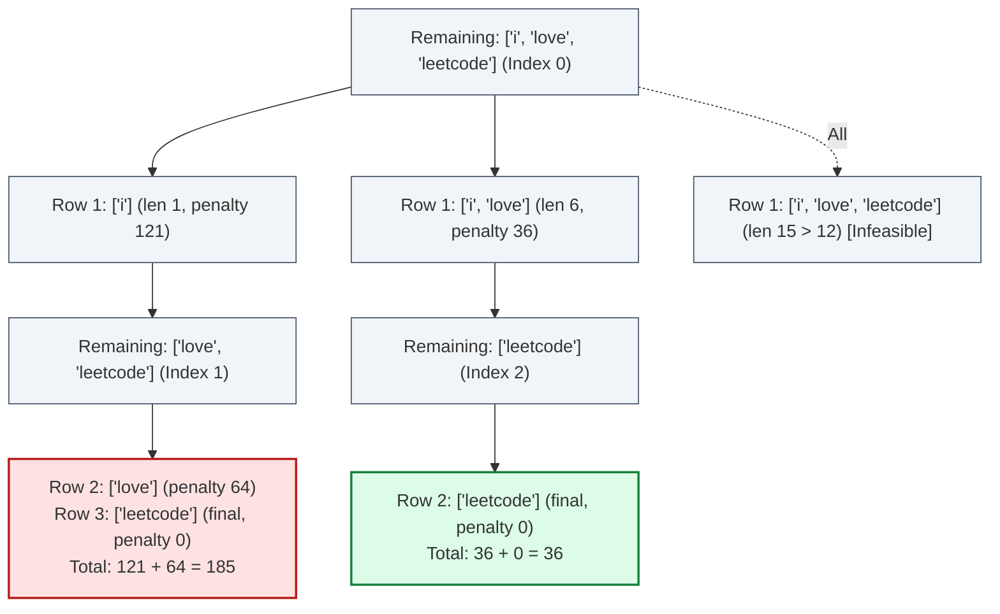

# Guided Example: Minimum Cost to Separate Sentence Into Rows

We trace the step-by-step dynamic programming evaluation and optimal line-breaking partition on a representative sentence:

- **Input:** `sentence = "i love leetcode"`, $k = 12$
- **Expected Output:** $36$

---

## 1. Problem Overview & Representative Instance

We are given a sentence of words separated by spaces, along with an integer $k$ representing the maximum allowable width of any row. We must partition the sequence of words into one or more rows such that:
1. Every word remains intact and words appear in their original relative order.
2. Consecutive words on the same row are separated by exactly one space.
3. No row exceeds total character length $k$.
4. Each non-final row of width $r \le k$ incurs a quadratic penalty $(k - r)^2$.
5. The **final row** incurs **zero penalty** ($0$), regardless of its remaining unused capacity.

The objective is to find the minimum possible total penalty across all valid line-breaking partitions.

In the sample sentence:
- Words: $w_0 = \text{"i"}$, $w_1 = \text{"love"}$, $w_2 = \text{"leetcode"}$.
- Word lengths: $L = [1, 4, 8]$, with total words $n = 3$.
- Row width limit: $k = 12$.
- Attempting to place all three words on one row requires $1 + 1 + 4 + 1 + 8 = 15 > 12$ characters (infeasible).
- Placing $w_0$ and $w_1$ on Row 1 uses $1 + 1 + 4 = 6$ characters, incurring penalty $(12 - 6)^2 = 36$.
- Row 2 takes $w_2 = \text{"leetcode"}$ ($8 \le 12$ characters). As the terminal row, its cost is $0$.
- Total penalty: $36 + 0 = 36$.

---

## 2. Theoretical Invariants & Suffix DP Formulation

Let $w_0, w_1, \dots, w_{n-1}$ be the sequence of words with lengths $L_0, L_1, \dots, L_{n-1}$.
For any subsegment of words spanning indices $i$ through $j - 1$ ($i < j$), the total character width when placed on a single row is:
$$\text{width}(i, j) = \sum_{p=i}^{j-1} L_p + (j - i - 1)$$

A row segment is valid if and only if $\text{width}(i, j) \le k$.

### Recurrence on Suffixes
Let $\text{dp}[i]$ represent the minimum cost to format the suffix of words from index $i$ to $n - 1$:
1. **Terminal Base Case:**
   If all remaining words from $i$ to $n - 1$ fit on a single row ($\text{width}(i, n) \le k$), they can be formatted as the final row. Because the final row incurs zero cost:
   $$\text{dp}[i] = 0 \quad \text{if } \text{width}(i, n) \le k$$
2. **Intermediate Recurrence:**
   If remaining words cannot all fit into the final row (or if an earlier split yields a smaller cost), we select a break point $j \in [i + 1, n)$ such that $\text{width}(i, j) \le k$:
   $$\text{dp}[i] = \min_{\substack{i < j < n \\ \text{width}(i, j) \le k}} \left\{ (k - \text{width}(i, j))^2 + \text{dp}[j] \right\}$$

---

## 3. Step-by-Step State Execution Trace

We evaluate suffixes in backward topological order, from $i = 2$ down to $i = 0$:

| Suffix Index $i$ | Remaining Words Substring | Total Suffix Width $\text{width}(i, n)$ | Fits in Final Row? ($\le 12$) | Intermediate Split Options Evaluated | Optimal Cost $\text{dp}[i]$ |
|---|---|---|---|---|---|
| $i = 2$ | `["leetcode"]` | $8$ | $8 \le 12$ (Yes) | Base case: can serve as final row | $\text{dp}[2] = 0$ |
| $i = 1$ | `["love", "leetcode"]` | $4 + 1 + 8 = 13$ | $13 > 12$ (No) | $j = 2$: Row 1 has `["love"]` ($\text{width} = 4$). Cost: $(12 - 4)^2 + \text{dp}[2] = 64 + 0 = 64$. | $\text{dp}[1] = 64$ |
| $i = 0$ | `["i", "love", "leetcode"]` | $1 + 1 + 4 + 1 + 8 = 15$ | $15 > 12$ (No) | Option 1 ($j=1$): Row 1 `["i"]` ($\text{width}=1$). Cost: $(12-1)^2 + \text{dp}[1] = 121 + 64 = 185$. Option 2 ($j=2$): Row 1 `["i", "love"]` ($\text{width}=6$). Cost: $(12-6)^2 + \text{dp}[2] = 36 + 0 = 36$. | $\text{dp}[0] = \min(185, 36) = 36$ |

---

## 4. Line Partition Comparison & Cost Breakdown

We contrast all complete valid partition configurations for the sentence:

| Partition Plan | Row Layout | Row Lengths | Non-Final Row Costs | Final Row Cost | Total Cost |
|---|---|---|---|---|---|
| Plan A | Row 1: `"i"` Row 2: `"love"` Row 3: `"leetcode"` | $r_1 = 1$ $r_2 = 4$ $r_3 = 8$ | $(12 - 1)^2 = 121$ $(12 - 4)^2 = 64$ | $0$ (Row 3) | $121 + 64 + 0 = 185$ |
| Plan B (Optimal) | Row 1: `"i love"` Row 2: `"leetcode"` | $r_1 = 6$ $r_2 = 8$ | $(12 - 6)^2 = 36$ | $0$ (Row 2) | **$36 + 0 = 36$** |
| Plan C (Invalid) | Row 1: `"i love leetcode"` | $r_1 = 15$ | Exceeds $k = 12$ | — | Infeasible |

Plan B achieves the global minimum penalty of $36$.

---

## 5. Algorithmic Correctness & Soundness

1. **Optimal Substructure:**
   The cost incurred by placing words $w_i \dots w_{j-1}$ on a non-final row depends strictly on the characters within that row and $k$. The remaining formatting of suffix $w_j \dots w_{n-1}$ is completely independent of earlier rows. Thus, the minimum cost for suffix $i$ can be constructed directly from the minimum costs of subsequent suffixes.
2. **Exhaustive Decision Coverage:**
   For any suffix $i$, every possible valid first row ending at index $j - 1$ is tested. Since all valid choices for the next line break are examined and the minimum is chosen, no valid partition strategy is omitted.
3. **Zero Cost Terminal Anchor:**
   Checking whether suffix $w_i \dots w_{n-1}$ fits entirely in one row ensures that if all remaining words fit into width $k$, the optimal completion assigns them to the final row with $0$ cost.

---

## 6. Edge Cases, Pitfalls & Structural Traps

- **Penalizing the Final Row:**
  A common bug is adding $(k - \text{width})^2$ to the final row. The problem explicitly specifies that the last row has zero cost, regardless of how short it is.
- **Single-Word Sentence:**
  If the input consists of a single word (e.g. `sentence = "a", k = 5`), the word forms the final row immediately. The minimum cost is $0$.
- **Word Length Exactly Equal to $k$:**
  If an individual word has length exactly $k$, it must occupy an entire row alone. Its non-final cost is $(k - k)^2 = 0$.
- **Greedy Word Packing Trap:**
  Greedy strategies (packing as many words as possible onto the first row) are suboptimal for quadratic penalties. For instance, putting fewer words on early rows can balance line widths across intermediate rows and yield a substantially smaller sum of squared differences.

---

## 7. Complexity Analysis

- **Time Complexity:** $\mathcal{O}(n \cdot \min(n, k))$.
  There are $n$ distinct suffix subproblems $\text{dp}[i]$. From each index $i$, the inner loop expands $j$ until $\text{width}(i, j) > k$. Because each word has length at least $1$, at most $\min(n - i, k)$ words can fit on a row. Prefix sums allow $\text{width}(i, j)$ to be computed in $\mathcal{O}(1)$ time. Total time is at most $\mathcal{O}(n \cdot k)$, which is well within execution limits for $n, k \le 5000$.
- **Space Complexity:** $\mathcal{O}(n)$ auxiliary space to store the prefix sum array and memoization table.
