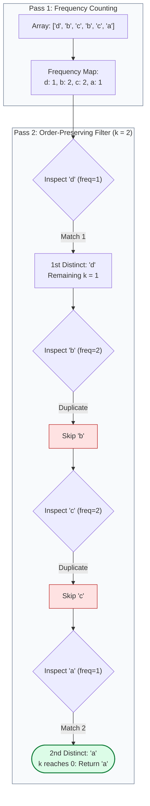

# Guided Example: Kth Distinct String in an Array

We trace the step-by-step two-pass frequency aggregation and order-preserving selection on a representative string array:

- **Input:** $\text{arr} = [\text{"d"}, \text{"b"}, \text{"c"}, \text{"b"}, \text{"c"}, \text{"a"}]$, $k = 2$
- **Expected Output:** $\text{"a"}$

---

## 1. Problem Overview & Representative Instance

A string is defined as **distinct** within an array if and only if it appears **exactly once** in the entire array. Given an array of strings $\text{arr}$ and a positive integer $k$, we must determine the $k$-th distinct string according to its original order of appearance in $\text{arr}$. If the total count of distinct strings in $\text{arr}$ is strictly less than $k$, we return an empty string $\text{""}$.

In this representative instance:
- The input array contains $6$ tokens: $[\text{"d"}, \text{"b"}, \text{"c"}, \text{"b"}, \text{"c"}, \text{"a"}]$.
- String occurrences: $\text{"d"}$ appears $1$ time, $\text{"b"}$ appears $2$ times, $\text{"c"}$ appears $2$ times, $\text{"a"}$ appears $1$ time.
- The distinct strings in sequential appearance order are $\text{"d"}$ (1st) and $\text{"a"}$ (2nd).
- For $k = 2$, the second distinct string is $\text{"a"}$.

---

## 2. Theoretical Invariants & Order-Preserving Selection

Let $\text{arr} = (s_0, s_1, \dots, s_{n-1})$. The global multiplicity of string $s$ is defined by:
$$\text{freq}(s) = \sum_{i=0}^{n-1} \mathbf{1}_{s_i = s}$$

### Distinct Classification Invariant
A string $s$ qualifies as distinct if and only if $\text{freq}(s) = 1$.
- Any string with $\text{freq}(s) > 1$ is disqualified from every candidate position, including its very first occurrence.
- Because a single pass cannot know whether a string will appear again later in the array, global frequency must be computed before final qualification can be established.

### Sequential Order Invariant
A standard hash table stores keys without preserving their first-occurrence order across all platforms and languages. By performing a second pass directly over the original array $\text{arr}$, strings are evaluated in their exact initial appearance order. A countdown variable initialized to $k$ decrements by $1$ for each element satisfying $\text{freq}(s) = 1$. The element that triggers $k = 0$ is guaranteed to be the $k$-th distinct string.

---

## 3. Step-by-Step State Execution Trace

### Phase 1: Global Frequency Construction
We iterate across $\text{arr}$ and construct the occurrence table:

| Step | Index $i$ | Inspected Token $s_i$ | Operation | Updated Frequency Table |
|---|---|---|---|---|
| 1 | $0$ | $\text{"d"}$ | First seen | $\{\text{"d"}: 1\}$ |
| 2 | $1$ | $\text{"b"}$ | First seen | $\{\text{"d"}: 1, \text{"b"}: 1\}$ |
| 3 | $2$ | $\text{"c"}$ | First seen | $\{\text{"d"}: 1, \text{"b"}: 1, \text{"c"}: 1\}$ |
| 4 | $3$ | $\text{"b"}$ | Increment duplicate | $\{\text{"d"}: 1, \text{"b"}: 2, \text{"c"}: 1\}$ |
| 5 | $4$ | $\text{"c"}$ | Increment duplicate | $\{\text{"d"}: 1, \text{"b"}: 2, \text{"c"}: 2\}$ |
| 6 | $5$ | $\text{"a"}$ | First seen | $\{\text{"d"}: 1, \text{"b"}: 2, \text{"c"}: 2, \text{"a"}: 1\}$ |

---

## 4. Phase 2: Sequential Rank Filtering Trace

We rescan $\text{arr}$ from index $0$ to $5$ with target countdown $k = 2$:

| Scan Step | Index $i$ | Token $s_i$ | Global Frequency $\text{freq}(s_i)$ | Qualification ($\text{freq}=1$) | Countdown Adjustment | Action / Status |
|---|---|---|---|---|---|---|
| 1 | $0$ | $\text{"d"}$ | $1$ | Distinct (1st) | $k \leftarrow 2 - 1 = 1$ | Target not met ($k > 0$), continue |
| 2 | $1$ | $\text{"b"}$ | $2$ | Disqualified (duplicate) | $k$ unchanged ($1$) | Skip |
| 3 | $2$ | $\text{"c"}$ | $2$ | Disqualified (duplicate) | $k$ unchanged ($1$) | Skip |
| 4 | $3$ | $\text{"b"}$ | $2$ | Disqualified (duplicate) | $k$ unchanged ($1$) | Skip |
| 5 | $4$ | $\text{"c"}$ | $2$ | Disqualified (duplicate) | $k$ unchanged ($1$) | Skip |
| 6 | $5$ | $\text{"a"}$ | $1$ | Distinct (2nd) | $k \leftarrow 1 - 1 = 0$ | **Target met ($k = 0$) $\implies$ Return $\text{"a"}$** |

The search immediately terminates and outputs $\text{"a"}$.

---

## 5. Algorithmic Correctness & Soundness

1. **Exact Frequency Truth:**
   Phase 1 evaluates every string in $\text{arr}$, meaning the recorded frequency $\text{freq}(s)$ for every unique token is exact and final before Phase 2 begins. No false positives (treating an early occurrence of a duplicate as distinct) or false negatives can occur.
2. **Order Preservation:**
   Because Phase 2 iterates over the original input array indices $0, 1, \dots, n - 1$, distinct strings are visited in the precise order of their first appearance. Since any distinct string occurs exactly once, it is encountered exactly once during Phase 2.
3. **Exhaustion Fallback:**
   If the loop finishes scanning all elements and $k > 0$, the total number of distinct strings in $\text{arr}$ is strictly less than $k$. The algorithm correctly returns the empty string $\text{""}$.

---

## 6. Edge Cases, Pitfalls & Structural Traps

- **Insufficient Distinct Strings:**
  If $\text{arr} = [\text{"a"}, \text{"b"}, \text{"a"}]$ and $k = 3$, the only distinct string is $\text{"b"}$ (count 1). The loop ends with $k = 2 > 0$, returning $\text{""}$.
- **No Distinct Strings:**
  If all strings appear at least twice (e.g. $[\text{"x"}, \text{"x"}, \text{"y"}, \text{"y"}]$), $\text{freq}(s) > 1$ for all tokens. No decrement occurs, correctly returning $\text{""}$.
- **Hash Table Ordering Trap:**
  Iterating over keys of a generic hash map instead of rescanning $\text{arr}$ relies on hash bucket iteration order, which is arbitrary and fails to preserve the input appearance sequence in languages without insertion-ordered maps.
- **$k = 1$ First Match:**
  When $k = 1$, the very first distinct string encountered terminates the search immediately on the first pass through Phase 2.

---

## 7. Complexity Analysis

- **Time Complexity:** $\mathcal{O}(n \cdot L)$ where $n$ is the number of strings in $\text{arr}$ and $L$ is the maximum length of an individual string.
  - Phase 1 computes hashes and inserts $n$ strings into the frequency map, taking $\mathcal{O}(n \cdot L)$ time.
  - Phase 2 looks up each string in the hash map in $\mathcal{O}(L)$ expected time, requiring $\mathcal{O}(n \cdot L)$ time total.
  - Overall time is strictly linear in the total number of characters.
- **Space Complexity:** $\mathcal{O}(u \cdot L) \le \mathcal{O}(n \cdot L)$ where $u$ is the number of unique strings in $\text{arr}$.
  The hash map stores at most $u$ distinct keys and their integer frequencies.
