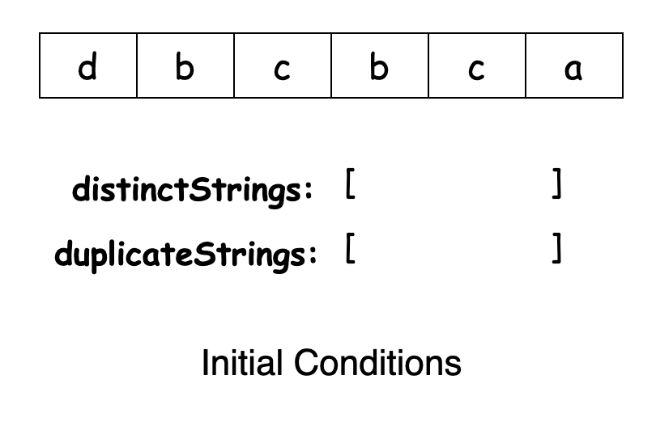
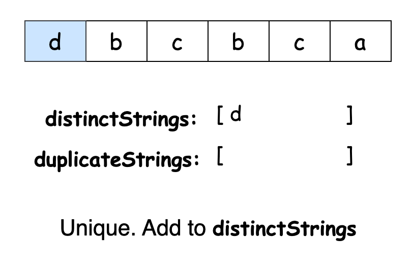
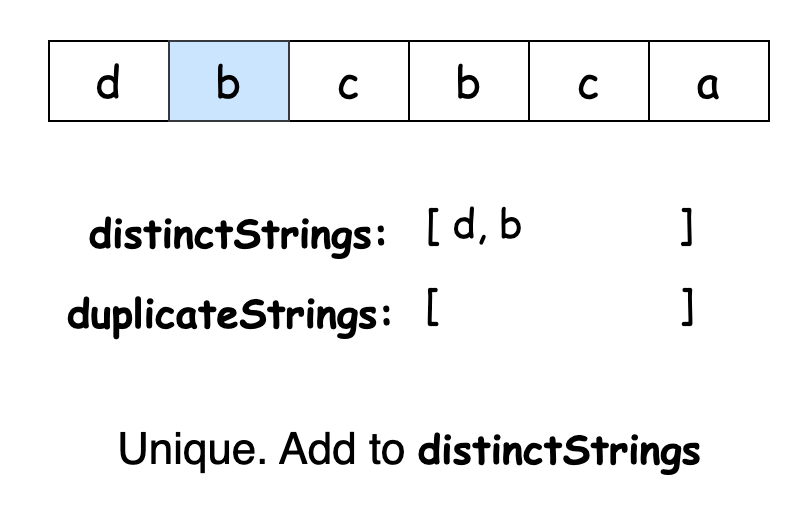
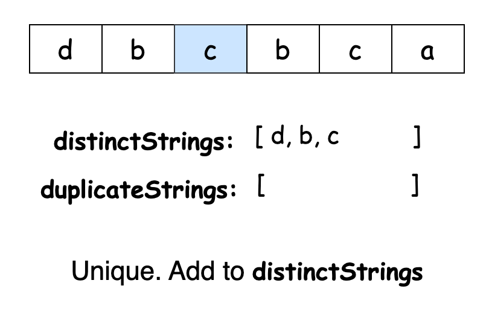
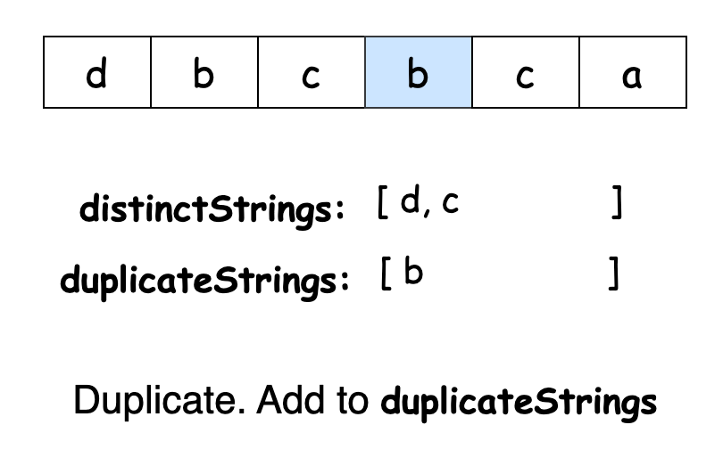
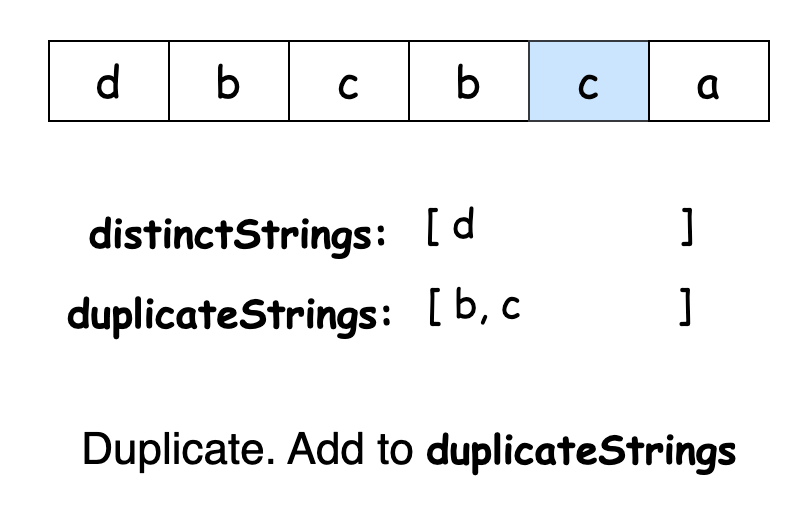
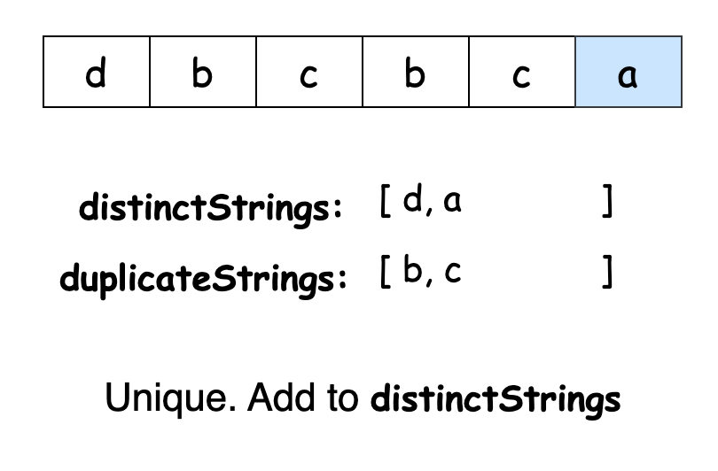
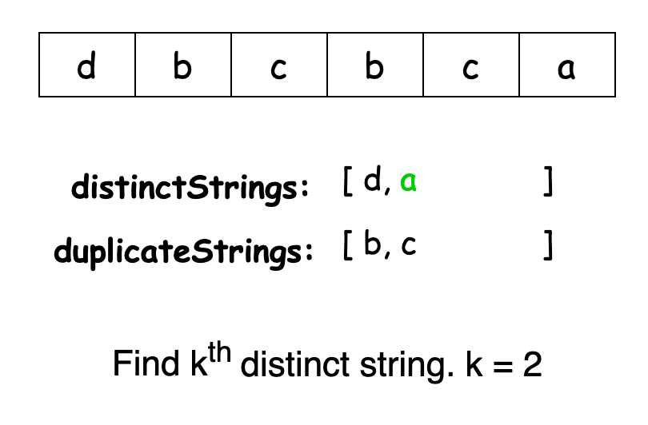

## Solution

---

### Approach 1: Brute Force

#### Intuition

To solve this problem, we first need to identify which strings in `arr` are distinct and which occur multiple times.

A brute force approach involves iterating through each string in the array and comparing it with every other string. Strings that do not match any others are considered distinct and are stored in a separate list. After building this list of distinct strings, we can then return the `k`th element from this list, provided it contains at least `k` elements.

#### Algorithm

- Initialize
  - `n` as the length of the input array `arr`.
  - a list `distinctStrings` to store distinct strings.
- Iterate through each string in `arr`:
  - For each string, set a flag `isDistinct` to `true`.
  - Compare the current string with every other string in the array:
- Skip the comparison if comparing the string with itself.
- If the string matches another string, set `isDistinct` to `false` and break the loop.
  - If `isDistinct` remains `true`, add the current string to `distinctStrings`.
- After collecting distinct strings, check if the size of `distinctStrings` is less than `k`:
  - If true, return an empty string, indicating there are not enough distinct strings.
- Otherwise, return the `k`-th element in `distinctStrings`.

#### Implementation

```python
class Solution:
    def kthDistinct(self, arr: List[str], k: int) -> str:
        n = len(arr)
        distinct_strings = []

        # Iterate through each string in the array
        for i in range(n):
            current_string = arr[i]
            is_distinct = True

            # Check if the current string is distinct
            for j in range(n):
                if j == i:
                    continue  # Skip comparing with itself
                if arr[j] == current_string:
                    is_distinct = False
                    break

            # If the string is distinct, add it to the list
            if is_distinct:
                distinct_strings.append(current_string)

        # Check if there are enough distinct strings
        if len(distinct_strings) < k:
            return ""

        return distinct_strings[k - 1]
```

#### Complexity Analysis

Let $n$ be the length of `arr`.

- Time complexity: $O(n^2)$

    The outer loop runs $n$ times, and for each iteration of the outer loop, there's an inner loop that also runs $n$ times, where string comparisons are performed. Although string comparisons typically take linear time relative to the string length, in this case, the length of each string is capped at $5$ characters, allowing us to consider these comparisons as running in constant time.

    Thus, the overall time complexity of the algorithm is $O(n^2)$.

- Space complexity: $O(n)$

    The only additional space used is the `distinctStrings` list, which can store up to $n$ strings in the worst case. Thus, the algorithm takes linear space.

---

### Approach 2: Hash Set

#### Intuition

Our previous approach involved iterating through the array to check for duplicates, which adds a linear element to the time complexity. Let's explore a more efficient method.

In this improved approach, we'll utilize a hash set to track all encountered strings during iteration. Hash sets are ideal for this task because they offer constant-time add, remove, and lookup operations. For those unfamiliar with hash sets, the LeetCode [Explore Card](https://leetcode.com/explore/learn/card/hash-table/183/combination-with-other-algorithms/) on hash tables provides a comprehensive overview.

We'll maintain two sets: `distinctStrings` and `duplicateStrings`. As we traverse the input array, we'll check if the current string exists in either set. If it does, we'll categorize it as a duplicate and add it to `duplicateStrings`. If not, we'll consider it distinct and add it to `distinctStrings`.

After completing the initial loop, `distinctStrings` will contain all unique strings. We'll then iterate through `arr` once more, and each time we encounter a string present in `distinctStrings`, we'll decrement `k`. When `k` reaches zero after a decrement, we can return that string as the `k`th distinct string in the array.

To illustrate the process, consider the example where `arr = ["d", "b", "c", "b", "c", "a"]` and $k = 2$. The following slideshow will demonstrate how the algorithm arrives at the solution:

















#### Algorithm

- Initialize two sets: `distinctStrings` to track strings that appear only once, and `duplicateStrings` to track strings that appear more than once.
- Iterate through the array `arr` to populate `distinctStrings` and `duplicateStrings`:
  - If a string is already in `duplicateStrings`, skip it.
  - If a string is in `distinctStrings`, move it to `duplicateStrings` (indicating it is now a duplicate) and remove it from `distinctStrings`.
  - If a string is not in either set, add it to `distinctStrings`.
- Iterate through the array `arr` again to find the k-th distinct string:
  - For each string, check if it is in `duplicateStrings`. If not, decrement `k` (indicating this string is one of the distinct strings).
  - When `k` reaches 0, return the current string as the `k`-th distinct string.
- If no `k`-th distinct string is found (i.e., `k` does not reach 0), return an empty string.

#### Implementation

```python
class Solution:
    def kthDistinct(self, arr, k):
        distinct_strings = set()
        duplicate_strings = set()

        # First pass: Identify distinct and duplicate strings
        for s in arr:
            # If the string is already in duplicate_strings, skip further processing
            if s in duplicate_strings:
                continue
            # If the string is in distinct_strings, it means we have seen it before,
            # so move it to duplicate_strings
            if s in distinct_strings:
                distinct_strings.remove(s)
                duplicate_strings.add(s)
            else:
                distinct_strings.add(s)

        # Second pass: Find the k-th distinct string
        for s in arr:
            if s not in duplicate_strings:
                # Decrement k for each distinct string encountered
                k -= 1
            # When k reaches 0, we have found the k-th distinct string
            if k == 0:
                return s

        return ""
```

#### Complexity Analysis

Let $n$ be the length of `arr`.

- Time complexity: $O(n)$

    The algorithm makes two passes through the input array `arr`. In each pass, all set operations are $O(1)$ on average. Thus, the overall time complexity is $O(2 \cdot n) = O(n)$.

- Space complexity: $O(n)$

    In the worst case, one of the sets could store all $n$ strings in `arr` (for example, when all the strings are distinct). Thus, the space complexity of the algorithm is $O(n)$.

---

### Approach 3: Hash Map

#### Intuition

Maintaining two sets and managing elements between them can be cumbersome. Let's simplify the process.

An alternative method to determine if a string is unique is by examining its frequency of occurrence. A string is considered distinct if its frequency is exactly one.

To implement this approach, we first create a frequency table for all strings in the array. Hash maps are well-suited for this task because they store key-value pairs and provide constant-time operations for adding, removing, and looking up entries. For more details on hash maps and their features, refer to the LeetCode [Explore Card](https://leetcode.com/explore/learn/card/hash-table/184/comparison-with-other-data-structures/).

With the frequency of each string determined, we can easily identify which strings are distinct. We then iterate over `arr` again and decrement `k` each time we encounter a unique string. When `k` reaches zero, we return the current string as our desired answer.

#### Algorithm

- Create a frequency map `frequencyMap` to count the occurrences of each string in the array `arr`.
- Iterate through `arr` and for each string, update its frequency in `frequencyMap`.
- Iterate through `arr` a second time to find the `k`-th distinct string:
  - For each string, check if its frequency in `frequencyMap` is 1 (indicating it is distinct).
  - Decrement `k` by 1 each time a distinct string is found.
  - When `k` reaches 0, return the current string as it is the `k`-th distinct string.
- If no `k`-th distinct string is found by the end of the array, return an empty string.

#### Implementation

```python
class Solution:
    def kthDistinct(self, arr: List[str], k: int) -> str:
        frequency_map = {}

        # First pass: Populate the frequency map
        for s in arr:
            frequency_map[s] = frequency_map.get(s, 0) + 1

        # Second pass: Find the k-th distinct string
        for s in arr:
            # Check if the current string is distinct
            if frequency_map[s] == 1:
                k -= 1
            # When k reaches 0, we have found the k-th distinct string
            if k == 0:
                return s

        return ""
```

#### Complexity Analysis

Let $n$ be the length of `arr`.

* Time complexity: $O(n)$

    The algorithm iterates over `arr` twice. For each element, all map operations take constant time on average. Thus, the overall time complexity remains $O(n)$.

* Space complexity: $O(n)$

    The space used by the algorithm is primarily for `frequencyMap`. In the worst case, where all strings are distinct, the map will store $n$ key-value pairs. Therefore, the space complexity is $O(n)$.

---