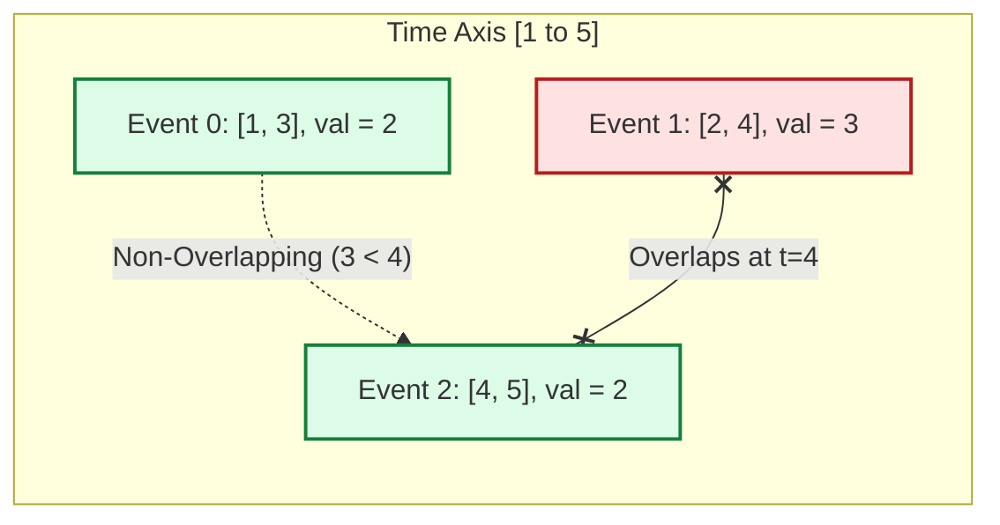

# Guided Example: Two Best Non-Overlapping Events

We trace the step-by-step start-time sorting, suffix-maximum precomputation, and binary-search companion pairing on a representative event scheduling instance:

- **Input:** $\text{events} = [[1, 3, 2], [4, 5, 2], [2, 4, 3]]$
- **Expected Output:** $4$

---

## 1. Problem Overview & Representative Instance

We are given a list of events where each event is defined by a triple $[\text{start}, \text{end}, \text{value}]$. An event is active throughout the inclusive interval $[\text{start}, \text{end}]$, and attending it yields $\text{value}$. We may attend **at most two** events such that their time intervals do not overlap.
- Two events $[s_1, e_1]$ and $[s_2, e_2]$ are **non-overlapping** if and only if $e_1 < s_2$ or $e_2 < s_1$.
- Because endpoints are inclusive, an event that begins at the exact second another ends ($s_2 = e_1$) is considered an overlap and cannot be attended together.
- Attending only one single event is valid if its value exceeds all compatible two-event combinations.

The goal is to maximize the sum of values of the chosen events.

In this representative instance:
- Event A: $[1, 3]$, value $2$.
- Event B: $[2, 4]$, value $3$.
- Event C: $[4, 5]$, value $2$.
- Pair (A, C): End time $3 < 4$ (Start time). They do not overlap! Combined value = $2 + 2 = 4$.
- Pair (B, C): End time $4 = 4$ (Start time). They overlap at $t = 4$ (incompatible).
- Pair (A, B): End time $3 > 2$ (Start time). They overlap (incompatible).
- Single events provide values $2, 3, 2$.
- The maximum total value obtainable is $4$.

---

## 2. Theoretical Invariants & Suffix-Maximum Companion Pairing

Any valid selection consists of either:
1. Exactly one event: $\max_i \text{value}(e_i)$.
2. Exactly two non-overlapping events $e_i$ and $e_j$. Without loss of generality, let $e_i$ start no later than $e_j$, so $\text{end}_i < \text{start}_j$.

### Suffix Maximum Invariant
Suppose events are sorted in ascending order of their start times:
$$\text{start}_0 \le \text{start}_1 \le \dots \le \text{start}_{n-1}$$

We define the **suffix maximum value** array $f[0 \dots n-1]$ by:
$$f[k] = \max_{m \ge k} \text{value}(e_m)$$
This allows answering the query *"What is the maximum value of any event starting at or after index $k$?"* in $\mathcal{O}(1)$ time.

### Binary Search Bisection
For any chosen first event $e_i = [s_i, e_i, v_i]$:
- A compatible second event must satisfy $\text{start}_j > e_i$.
- Because the array is sorted by start times, the set of compatible second events forms a contiguous suffix starting at index:
  $$j = \text{bisect\_right}(\text{start\_keys}, e_i)$$
- If $j < n$, the maximum value obtainable from any companion event is precisely $f[j]$.
- The optimal value with $e_i$ as the first event is $v_i + (f[j] \text{ if } j < n \text{ else } 0)$.

---

## 3. Step-by-Step State Execution Trace

### Phase 1: Sorting & Suffix-Maximum Construction
We sort the events by their start times:
- $e_0 = [1, 3, 2]$
- $e_1 = [2, 4, 3]$
- $e_2 = [4, 5, 2]$

We compute the suffix maximum array $f$ by scanning backward from $n - 1 = 2$ down to $0$:

| Suffix Index $k$ | Event Inspected | Event Value | Recurrence $f[k] = \max(v_k, f[k+1])$ | Suffix Maximum $f[k]$ | Meaning |
|---|---|---|---|---|---|
| $2$ | $[4, 5, 2]$ | $2$ | Base: $v_2 = 2$ | $2$ | Max value in suffix $[e_2 \dots e_2]$ |
| $1$ | $[2, 4, 3]$ | $3$ | $\max(3, f[2]) = \max(3, 2)$ | $3$ | Max value in suffix $[e_1 \dots e_2]$ |
| $0$ | $[1, 3, 2]$ | $2$ | $\max(2, f[1]) = \max(2, 3)$ | $3$ | Max value in suffix $[e_0 \dots e_2]$ |

---

## 4. Phase 2: Companion Search & Maximum Evaluation Trace

We evaluate each event $e_i$ as the primary event and locate the optimal compatible successor:

| Index $i$ | Primary Event $e_i$ | End Time $e_i$ | Bisection Query: First $\text{start} > e_i$ | Matched Suffix Index $j$ | Companion Max Value $f[j]$ | Candidate Sum | Running Max $\text{ans}$ |
|---|---|---|---|---|---|---|---|
| $0$ | $[1, 3, 2]$ | $3$ | Smallest start $\ge 4$ | $j = 2$ ($[4, 5, 2]$) | $f[2] = 2$ | $2 + 2 = 4$ | **$4$** |
| $1$ | $[2, 4, 3]$ | $4$ | Smallest start $\ge 5$ | $j = 3$ (Out of bounds) | $0$ (No companion) | $3 + 0 = 3$ | $4$ |
| $2$ | $[4, 5, 2]$ | $5$ | Smallest start $\ge 6$ | $j = 3$ (Out of bounds) | $0$ (No companion) | $2 + 0 = 2$ | $4$ |

### Final Result
The global maximum value achieved is $\max(4, 3, 2) = 4$.

---

## 5. Algorithmic Correctness & Soundness

1. **Ordering Completeness:**
   Any pair of non-overlapping events $\{A, B\}$ has one event ending strictly before the other starts. By designating the earlier event as $e_i$ and the later event as $e_j$, we have $\text{start}_i \le \text{start}_j$. Because we iterate over all possible primary events $e_i$, every valid pair is considered.
2. **Optimality of Suffix Maximum:**
   Given end time $e_i$, every event $e_m$ with $m \ge j$ satisfies $\text{start}_m \ge \text{start}_j > e_i$ and is therefore compatible with $e_i$. Choosing the event that achieves $\max_{m \ge j} \text{value}(e_m) = f[j]$ guarantees that $e_i$ is paired with the best possible future companion.
3. **Inclusion of Single-Event Solutions:**
   When no companion exists ($j = n$), the candidate value evaluated is $v_i + 0 = v_i$. Thus, single-event attendance is automatically compared against all paired solutions.

---

## 6. Edge Cases, Pitfalls & Structural Traps

- **Boundary Touching as Overlap:**
  Intervals are inclusive ($[1, 4]$ and $[4, 5]$ share time $t = 4$). Binary search must strictly enforce $\text{start} > \text{end}$, using `bisect_right` on the end time rather than `bisect_left`.
- **Single Dominant Event:**
  If an event has huge value (e.g. $[1, 5, 5]$) while all compatible pairs yield smaller sums (e.g. $2 + 2 = 4$), the algorithm must allow choosing only the single dominant event. Initializing candidate value with $v_i$ handles this naturally.
- **Identical Start Times:**
  Sorting by start time groups events starting at the same time. The backward suffix sweep correctly accumulates the maximum across all tie-breaking intervals.

---

## 7. Complexity Analysis

- **Time Complexity:** $\mathcal{O}(n \log n)$.
  Sorting the $n$ events by start time requires $\mathcal{O}(n \log n)$ time. The suffix-maximum array is constructed in a single backward pass of $\mathcal{O}(n)$ time. Evaluating each of the $n$ events performs a binary search taking $\mathcal{O}(\log n)$ time, totaling $\mathcal{O}(n \log n)$ time.
- **Space Complexity:** $\mathcal{O}(n)$.
  The suffix-maximum array $f$ stores $n$ integers. Sorting uses $\mathcal{O}(n)$ auxiliary space.
