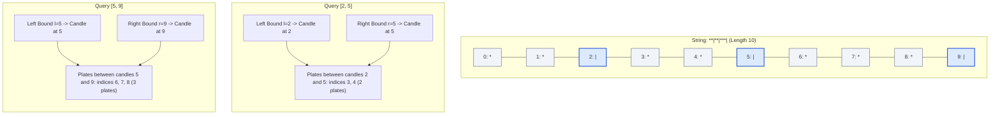

# Guided Example: Plates Between Candles

We trace the step-by-step nearest-candle boundary projection and prefix-sum plate counting on a representative string and query set:

- **Input:** $s = \text{"**|**|***|"}$, $\text{queries} = [[2, 5], [5, 9]]$
- **Expected Output:** $[2, 3]$

---

## 1. Problem Overview & Representative Instance

We are given a string $s$ consisting of characters `'*'` (plates) and `'|'` (candles), along with a 2D array $\text{queries}$ where each $\text{queries}[k] = [l, r]$ specifies an inclusive substring $s[l \dots r]$.

For each query, we must count the number of plates in $s[l \dots r]$ that are **between candles**. A plate is between candles if and only if there is at least one candle to its left and at least one candle to its right **within the selected substring** $s[l \dots r]$. Candles outside the query window $[l, r]$ cannot enclose any plate.

In the string $s = \text{"**|**|***|"}$:
- Candles are located at indices $\{2, 5, 9\}$.
- Plates are located at indices $\{0, 1, 3, 4, 6, 7, 8\}$.
- Query $1$ ($[2, 5]$): The candle segment spans from index $2$ to $5$, enclosing $2$ plates (at indices $3$ and $4$).
- Query $2$ ($[5, 9]$): The candle segment spans from index $5$ to $9$, enclosing $3$ plates (at indices $6, 7$, and $8$).

---

## 2. Theoretical Invariants & Boundary Projection

For any query interval $[l, r]$:
1. **Candle Boundary Invariant:**
   A plate at index $p \in [l, r]$ is enclosed by candles in $[l, r]$ if and only if:
   $$c_{\text{first}} \le p \le c_{\text{last}}$$
   where:
   - $c_{\text{first}}$ is the **first candle** at or after $l$: $c_{\text{first}} = \min \{ c \mid s[c] = '|' \text{ and } c \ge l \}$
   - $c_{\text{last}}$ is the **last candle** at or before $r$: $c_{\text{last}} = \max \{ c \mid s[c] = '|' \text{ and } c \le r \}$

2. **Feasibility Condition:**
   - If no candle exists $\ge l$ or no candle exists $\le r$, or if $c_{\text{first}} \ge c_{\text{last}}$, then the interval $[l, r]$ contains fewer than two distinct candles. In this case, no plates can be enclosed, and the answer is strictly $0$.
   - Otherwise, every plate located between index $c_{\text{first}}$ and $c_{\text{last}}$ is guaranteed to be flanked by candles on both sides.

3. **Prefix Sum Invariant:**
   Let $\text{presum}[k]$ count the total number of plates in prefix $s[0 \dots k-1]$.
   The number of plates strictly between candle $c_{\text{first}}$ and candle $c_{\text{last}}$ is:
   $$\text{plates} = \text{presum}[c_{\text{last}}] - \text{presum}[c_{\text{first}} + 1]$$

---

## 3. Precomputation Arrays Trace

We compute three arrays across string $s$ of length $n = 10$:
- $\text{presum}$: Cumulative count of `'*'` characters.
- $\text{left}[i]$: Index of the most recent candle at or before index $i$ (forward pass).
- $\text{right}[i]$: Index of the next candle at or after index $i$ (backward pass).

| Index $i$ | Character $s[i]$ | Plate Indicator $(s[i] = '*')$ | $\text{presum}[i + 1]$ | $\text{left}[i]$ (Candle $\le i$) | $\text{right}[i]$ (Candle $\ge i$) |
|---|---|---|---|---|---|
| $0$ | `'*'` | $1$ | $1$ | $-1$ | $2$ |
| $1$ | `'*'` | $1$ | $2$ | $-1$ | $2$ |
| $2$ | `'\|'` | $0$ | $2$ | $2$ | $2$ |
| $3$ | `'*'` | $1$ | $3$ | $2$ | $5$ |
| $4$ | `'*'` | $1$ | $4$ | $2$ | $5$ |
| $5$ | `'\|'` | $0$ | $4$ | $5$ | $5$ |
| $6$ | `'*'` | $1$ | $5$ | $5$ | $9$ |
| $7$ | `'*'` | $1$ | $6$ | $5$ | $9$ |
| $8$ | `'*'` | $1$ | $7$ | $5$ | $9$ |
| $9$ | `'\|'` | $0$ | $7$ | $9$ | $9$ |

---

## 4. Query Resolution & Arithmetic Evaluation Trace

With the auxiliary arrays precomputed in $\mathcal{O}(n)$ time, each query $[l, r]$ is answered in $\mathcal{O}(1)$ time:

| Query $k$ | Range $[l, r]$ | First Candle $i = \text{right}[l]$ | Last Candle $j = \text{left}[r]$ | Enclosure Check $(i < j)$ | Prefix Formula $\text{presum}[j] - \text{presum}[i + 1]$ | Plate Count |
|---|---|---|---|---|---|---|
| $1$ | $[2, 5]$ | $\text{right}[2] = 2$ | $\text{left}[5] = 5$ | $2 < 5$ (Valid) | $\text{presum}[5] - \text{presum}[3] = 4 - 2$ | **$2$** |
| $2$ | $[5, 9]$ | $\text{right}[5] = 5$ | $\text{left}[9] = 9$ | $5 < 9$ (Valid) | $\text{presum}[9] - \text{presum}[6] = 7 - 4$ | **$3$** |

### Output
The resulting array of answers is $[2, 3]$.

---

## 5. Algorithmic Correctness & Soundness

1. **Exactness of Boundary Invariant:**
   Any candle at index $c < l$ or $c > r$ lies outside the query window and cannot satisfy the problem condition. Therefore, only candles within $[l, r]$ can enclose plates. The leftmost such candle is $c_{\text{first}} = \text{right}[l]$ and the rightmost is $c_{\text{last}} = \text{left}[r]$. Any plate outside $[c_{\text{first}}, c_{\text{last}}]$ lacks either a left or right candle within the query window. Thus, restricting plate counting strictly to $(c_{\text{first}}, c_{\text{last}})$ is necessary and sufficient.
2. **Exact Range Difference:**
   The prefix sum difference $\text{presum}[j] - \text{presum}[i + 1]$ counts all plates at indices $k$ satisfying $i + 1 \le k \le j - 1$. Because $s[i]$ and $s[j]$ are candles, they contribute $0$ to the plate prefix sum regardless.
3. **$\mathcal{O}(1)$ Query Execution:**
   Because nearest-candle pointers and prefix sums are precomputed, each query requires only three array lookups and one subtraction.

---

## 6. Edge Cases, Pitfalls & Structural Traps

- **Fewer Than Two Candles:**
  If a query interval contains zero candles (e.g. $[0, 1]$ where $\text{right}[0] = 2$ and $\text{left}[1] = -1$) or exactly one candle (e.g. $[1, 3]$ where $i = 2$ and $j = 2$), the condition $i < j$ evaluates to false, correctly yielding $0$.
- **Adjacent Candles:**
  If two candles are consecutive (e.g. $s = \text{"||"}$), $\text{presum}[j] - \text{presum}[i + 1] = \text{presum}[1] - \text{presum}[1] = 0$, correctly returning $0$ plates.
- **Plates Outside Flanking Candles:**
  In $s = \text{"*|*|*"}$ with query $[0, 4]$, the plates at index $0$ and $4$ are outside the candle pair at indices $1$ and $3$. The boundary projection automatically truncates the range to $[1, 3]$, correctly excluding the outer plates.

---

## 7. Complexity Analysis

- **Time Complexity:** $\mathcal{O}(n + q)$ where $n$ is the length of string $s$ and $q$ is the number of queries.
  - Precomputing `presum`, `left`, and `right` arrays takes two linear passes over $s$, consuming $\mathcal{O}(n)$ time.
  - Each of the $q$ queries performs $\mathcal{O}(1)$ array indexing and arithmetic operations, taking $\mathcal{O}(q)$ time total.
  - Overall execution time is strictly linear in $n + q$.
- **Space Complexity:** $\mathcal{O}(n)$ auxiliary memory to store `presum`, `left`, and `right` arrays of length $n$.
