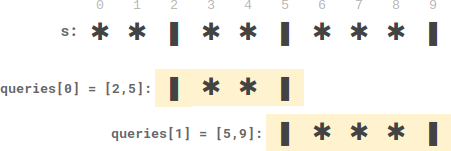
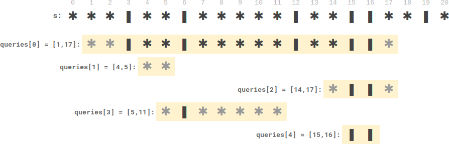

## Description

There is a long table with a line of plates and candles arranged on top of it. You are given a **0-indexed** string `s` consisting of characters `'*'` and `'|'` only, where a `'*'` represents a **plate** and a `'|'` represents a **candle**.

You are also given a **0-indexed** 2D integer array `queries` where $\text{queries}[i] = [\text{left}_{i}, \text{right}_{i}]$ denotes the **substring** $s[\text{left}_{i}...\text{right}_{i}]$ (**inclusive**). For each query, you need to find the **number** of plates **between candles** that are **in the substring**. A plate is considered **between candles** if there is at least one candle to its left **and** at least one candle to its right **in the substring**.

- For example, `s = "||**||**|*"`, and a query `[3, 8]` denotes the substring `"*||**<u>**</u>**|"`. The number of plates between candles in this substring is `2`, as each of the two plates has at least one candle **in the substring** to its left **and** right.

Return *an integer array* `answer` *where* $\text{answer}[i]$ *is the answer to the* $$i^{\text{th}}$$ *query*.
### Function Contract

- `n`: Input parameter.
- Returns expected result.

### Examples
#### Example 1



```
**Input:** s = "**|**|***|", queries = [[2,5],[5,9]]
**Output:** [2,3]
**Explanation:**
- queries[0] has two plates between candles.
- queries[1] has three plates between candles.
```
#### Example 2



```
**Input:** s = "***|**|*****|**||**|*", queries = [[1,17],[4,5],[14,17],[5,11],[15,16]]
**Output:** [9,0,0,0,0]
**Explanation:**
- queries[0] has nine plates between candles.
- The other queries have zero plates between candles.
```
### Constraints

- $3 \le \text{s.length} \le 10^{5}$

- `s` consists of `'*'` and `'|'` characters.

- $1 \le \text{queries.length} \le 10^{5}$

- $\text{queries}[i].length = 2$

- $0 \le \text{left}_{i} \le \text{right}_{i} < \text{s.length}$