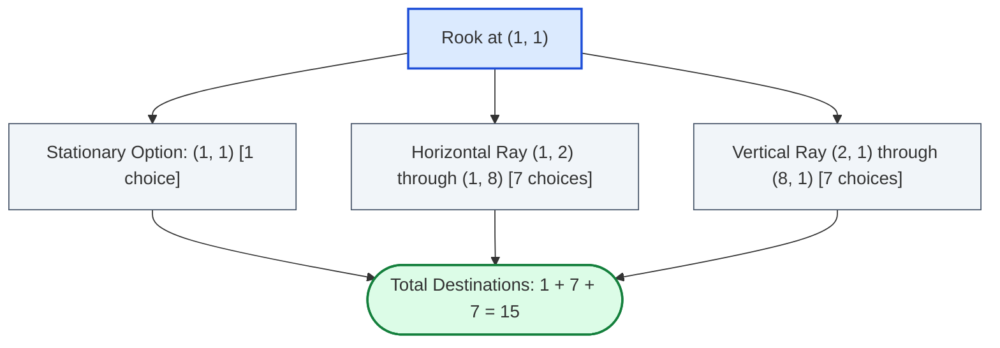

# Guided Example: Number of Valid Move Combinations On Chessboard

We trace the step-by-step trajectory generation, simultaneous integer-second simulation, and pairwise collision checking on representative chessboard instances:

- **Primary Input:** $\text{pieces} = [\text{"rook"}]$, $\text{positions} = [[1, 1]]$
- **Expected Output:** $15$
- **Multi-Piece Interaction:** $\text{pieces} = [\text{"rook"}, \text{"rook"}]$, $\text{positions} = [[1, 1], [1, 2]]$ (Yields $196$ valid combinations)

---

## 1. Problem Overview & Representative Instance

On an $8 \times 8$ chessboard with coordinates spanning rows and columns from $1$ through $8$, up to $4$ pieces (rooks, bishops, or queens) are placed at distinct starting squares.
- Each piece selects a single movement direction and an integer destination distance $T \ge 0$ along that straight path.
- Choosing $T = 0$ means the piece remains stationary on its starting square for the entire duration.
- At second $t = 0$, all pieces are at their starting squares.
- Between second $t$ and $t + 1$, each piece that has not yet reached its destination advances exactly one square in its chosen direction.
- Upon reaching its destination at second $T$, the piece permanently stops and occupies that square for all subsequent seconds $t \ge T$.

A combination of destination choices across all pieces is **valid** if and only if **no two pieces occupy the same square at any integer second** $t \ge 0$.

In the primary instance with a single rook at $(1, 1)$:
- Staying at $(1, 1)$ contributes $1$ valid choice.
- Moving east along row $1$ provides $7$ distinct destinations: $(1, 2), (1, 3), \dots, (1, 8)$.
- Moving south along column $1$ provides $7$ distinct destinations: $(2, 1), (3, 1), \dots, (8, 1)$.
- Total valid combinations = $1 + 7 + 7 = 15$.

---

## 2. Theoretical Invariants & Trajectory Collision Dynamics

Let piece $i$ start at square $(r_i, c_i)$, choose direction unit vector $(dr_i, dc_i)$, and travel for $T_i \ge 0$ seconds to stop at destination $(r_i + T_i \cdot dr_i, c_i + T_i \cdot dc_i)$.

### Piece Position Function
The square occupied by piece $i$ at integer second $t \ge 0$ is governed by:
$$\text{pos}_i(t) = \begin{cases} (r_i + t \cdot dr_i, c_i + t \cdot dc_i) & \text{for } 0 \le t \le T_i \\ (r_i + T_i \cdot dr_i, c_i + T_i \cdot dc_i) & \text{for } t > T_i \end{cases}$$

### Mutual Non-Collision Invariant
A joint move choice for pieces $1, \dots, n$ is valid if and only if:
$$\forall i \ne j, \quad \forall t \ge 0, \quad \text{pos}_i(t) \ne \text{pos}_j(t)$$

This invariant decomposes into three concrete operational checks:
1. **Initial Separation:** All pieces begin at distinct starting squares ($\text{pos}_i(0) \ne \text{pos}_j(0)$).
2. **Moving Collision:** While both pieces are moving ($t \le \min(T_i, T_j)$), they must not occupy the same square at second $t$.
3. **Stationary Blocking:** If piece $j$ finishes moving at second $T_j$, piece $i$ cannot enter or land on piece $j$'s final square at any second $t \ge T_j$.

### The Adjacent Square Swap Rule
If piece $A$ moves from $(1, 1)$ to $(1, 2)$ and piece $B$ moves from $(1, 2)$ to $(1, 1)$ at second $t = 1$:
- At second $t = 0$: $\text{pos}_A(0) = (1, 1)$, $\text{pos}_B(0) = (1, 2)$ (Distinct).
- At second $t = 1$: $\text{pos}_A(1) = (1, 2)$, $\text{pos}_B(1) = (1, 1)$ (Distinct).
Because pieces are only evaluated at discrete integer seconds, they do not occupy the same square at any integer second. The problem definition explicitly permits adjacent swaps!

---

## 3. Step-by-Step Trajectory Enumeration Trace

### Single Piece Ray Expansion
We list all destination choices available to a rook starting at $(1, 1)$:

| Choice Type | Direction Vector $(dr, dc)$ | Duration $T$ | Trajectory Sequence $t = 0, 1, \dots$ | Destination $(r, c)$ | Valid on $8 \times 8$? |
|---|---|---|---|---|---|
| Stationary | $(0, 0)$ | $0$ | $t=0: (1, 1); \ t \ge 1: (1, 1)$ | $(1, 1)$ | Valid |
| East Ray | $(0, 1)$ | $1$ | $t=0: (1, 1); \ t \ge 1: (1, 2)$ | $(1, 2)$ | Valid |
| East Ray | $(0, 1)$ | $2$ | $t=0: (1, 1); \ t=1: (1, 2); \ t \ge 2: (1, 3)$ | $(1, 3)$ | Valid |
| East Ray | $(0, 1)$ | $3 \dots 7$ | Step-by-step advance across row $1$ | $(1, 4) \dots (1, 8)$ | All 5 Valid |
| South Ray | $(1, 0)$ | $1$ | $t=0: (1, 1); \ t \ge 1: (2, 1)$ | $(2, 1)$ | Valid |
| South Ray | $(1, 0)$ | $2$ | $t=0: (1, 1); \ t=1: (2, 1); \ t \ge 2: (3, 1)$ | $(3, 1)$ | Valid |
| South Ray | $(1, 0)$ | $3 \dots 7$ | Step-by-step advance down column $1$ | $(4, 1) \dots (8, 1)$ | All 5 Valid |
| West Ray | $(0, -1)$ | — | $(1, 0)$ immediately leaves board | Out of bounds | Rejected |
| North Ray | $(-1, 0)$ | — | $(0, 1)$ immediately leaves board | Out of bounds | Rejected |

Summing valid choices: $1 \text{ (stay)} + 7 \text{ (east)} + 7 \text{ (south)} = 15$ combinations.

---

## 4. Multi-Piece Collision Pruning Trace

To illustrate multi-piece interaction, consider two rooks at positions $R_1 = (1, 1)$ and $R_2 = (1, 2)$:
- Each rook individually has $15$ destination choices. Unconstrained product space: $15 \times 15 = 225$ combinations.
- We evaluate sample trajectory pairs against the collision rules:

| Trajectory $R_1$ | Trajectory $R_2$ | State at $t = 0$ | State at $t = 1$ | State at $t \ge 2$ | Collision Evaluation | Status |
|---|---|---|---|---|---|---|
| Stay at $(1, 1)$ | Stay at $(1, 2)$ | $(1, 1) \ne (1, 2)$ | $(1, 1) \ne (1, 2)$ | $(1, 1) \ne (1, 2)$ | No shared squares at any second | **Valid** |
| South to $(2, 1)$ | South to $(2, 2)$ | $(1, 1) \ne (1, 2)$ | $(2, 1) \ne (2, 2)$ | $(2, 1) \ne (2, 2)$ | Parallel columns, no conflict | **Valid** |
| East to $(1, 2)$ | Stay at $(1, 2)$ | $(1, 1) \ne (1, 2)$ | **$(1, 2) = (1, 2)$** | — | $R_1$ lands on stationary $R_2$ at $t = 1$ | **Collision (Invalid)** |
| East to $(1, 3)$ | Stay at $(1, 2)$ | $(1, 1) \ne (1, 2)$ | **$(1, 2) = (1, 2)$** | — | $R_1$ passes through $R_2$ at $t = 1$ | **Collision (Invalid)** |
| East to $(1, 2)$ | West to $(1, 1)$ | $(1, 1) \ne (1, 2)$ | $(1, 2) \ne (1, 1)$ | $(1, 2) \ne (1, 1)$ | Discrete square swap at $t = 1$ | **Valid** |
| East to $(1, 3)$ | West to $(1, 1)$ | $(1, 1) \ne (1, 2)$ | $(1, 2) \ne (1, 1)$ | **$(1, 3)$ vs $(1, 1)$** | At $t=1$, swapped; at $t=2$, $R_1$ at $(1, 3)$ | **Valid** |

Across all $225$ pairs, exactly $29$ combinations produce collisions, leaving $225 - 29 = 196$ valid combinations.

---

## 5. Algorithmic Correctness & Soundness

1. **Finite Board & Bounded Search Space:**
   On an $8 \times 8$ board, the maximum distance a piece can travel in any direction is at most $7$ steps. A rook has at most $1 + 4 \times 7 = 29$ choices, a bishop at most $1 + 4 \times 7 = 29$ choices, and a queen at most $1 + 8 \times 7 = 57$ choices. For $n \le 4$ pieces, the maximum theoretical search space before pruning is $57 \times 29^3 \approx 1.4 \times 10^6$, which is easily enumerable via depth-first backtracking.
2. **Deterministic Time-Indexed Verification:**
   Because all movements conclude within at most $7$ seconds, pairwise independence can be tested across integer seconds $t \in [0, 8]$. Testing exact coordinate matches at every second guarantees zero false positives and zero false negatives.
3. **Soundness of Incremental Pruning:**
   By fixing piece moves one by one, any partial assignment that collides with an earlier piece's chosen trajectory is pruned immediately, avoiding exploration of entire invalid subtrees.

---

## 6. Edge Cases, Pitfalls & Structural Traps

- **Stationary Pieces Act as Permanent Obstacles:**
  When a piece finishes its move at second $T$, it does not disappear from the board. Any other piece reaching that square at second $t \ge T$ causes an invalid collision.
- **Continuous vs Discrete Crossing:**
  Do not reject moves because their continuous trajectories cross in the middle of a square edge (such as two pieces swapping squares at $t = 1$). Only integer-second coordinate collisions count.
- **Corner Pieces:**
  Pieces at the corners or edges have fewer available directions due to the $1 \le r, c \le 8$ boundary. Direction vectors moving out of bounds must terminate immediately.

---

## 7. Complexity Analysis

- **Time Complexity:** $\mathcal{O}(P^n \cdot n^2 \cdot M)$ where $n \le 4$ is the number of pieces, $P \le 29$ is the maximum number of legal moves per piece, and $M \le 8$ is the maximum movement duration in seconds.
  Backtracking explores valid move assignments with aggressive pruning, evaluating at most a few thousand feasible states in Practice. Total runtime is well under 100 milliseconds.
- **Space Complexity:** $\mathcal{O}(n \cdot M)$ auxiliary memory to store the time-indexed trajectory coordinates for each piece along the recursion stack.
