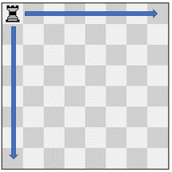
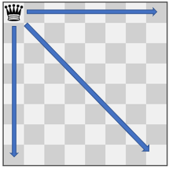
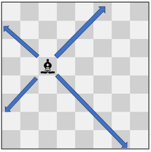

## Description

There is an `8 x 8` chessboard containing `n` pieces (rooks, queens, or bishops). You are given a string array `pieces` of length `n`, where $\text{pieces}[i]$ describes the type (rook, queen, or bishop) of the $$i^{\text{th}}$$ piece. In addition, you are given a 2D integer array `positions` also of length `n`, where $\text{positions}[i] = [r_{i}, c_{i}]$ indicates that the $$i^{\text{th}}$$ piece is currently at the **1-based** coordinate $(r_{i}, c_{i})$ on the chessboard.

When making a **move** for a piece, you choose a **destination** square that the piece will travel toward and stop on.

- A rook can only travel **horizontally or vertically** from `(r, c)` to the direction of `(r+1, c)`, `(r-1, c)`, `(r, c+1)`, or `(r, c-1)`.

- A queen can only travel **horizontally, vertically, or diagonally** from `(r, c)` to the direction of `(r+1, c)`, `(r-1, c)`, `(r, c+1)`, `(r, c-1)`, `(r+1, c+1)`, `(r+1, c-1)`, `(r-1, c+1)`, `(r-1, c-1)`.

- A bishop can only travel **diagonally** from `(r, c)` to the direction of `(r+1, c+1)`, `(r+1, c-1)`, `(r-1, c+1)`, `(r-1, c-1)`.

You must make a **move** for every piece on the board simultaneously. A **move combination** consists of all the **moves** performed on all the given pieces. Every second, each piece will instantaneously travel **one square** towards their destination if they are not already at it. All pieces start traveling at the $0^th$ second. A move combination is **invalid** if, at a given time, **two or more** pieces occupy the same square.

Return *the number of **valid** move combinations*​​​​​.

**Notes:**

- **No two pieces** will start in the** same** square.

- You may choose the square a piece is already on as its **destination**.

- If two pieces are **directly adjacent** to each other, it is valid for them to **move past each other** and swap positions in one second.
### Function Contract

- `n`: Input parameter.
- Returns expected result.

### Examples

#### Example 1

- **Input:** $pieces = ["rook"], positions = [[1,1]]$
- **Output:** `15`
- **Explanation:** The image above shows the possible squares the piece can move to.
#### Example 2

- **Input:** $pieces = ["queen"], positions = [[1,1]]$
- **Output:** `22`
- **Explanation:** The image above shows the possible squares the piece can move to.
#### Example 3

- **Input:** $pieces = ["bishop"], positions = [[4,3]]$
- **Output:** `12`
- **Explanation:** The image above shows the possible squares the piece can move to.
### Constraints

- $n = \text{pieces.length}$

- $n = \text{positions.length}$

- $1 \le n \le 4$

- `pieces` only contains the strings `"rook"`, `"queen"`, and `"bishop"`.

- There will be at most one queen on the chessboard.

- $1 \le r_{i}, c_{i} \le 8$

- Each $\text{positions}[i]$ is distinct.