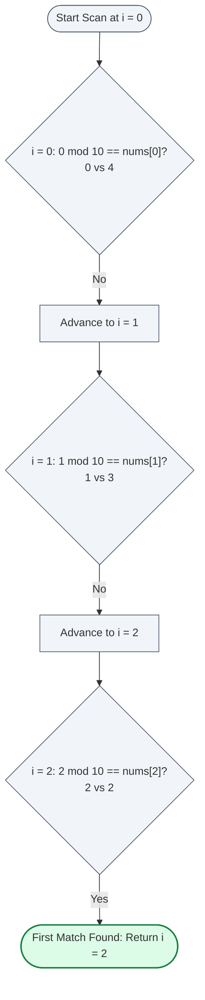

# Guided Example: Smallest Index With Equal Value

We trace the step-by-step sequential modulo-congruence scan and early-exit termination on a representative array instance:

- **Input:** $\text{nums} = [4, 3, 2, 1]$
- **Expected Output:** $2$

---

## 1. Problem Overview & Representative Instance

Given a 0-indexed integer array $\text{nums}$ of length $n$, we are tasked with finding the **smallest index** $i \in \{0, 1, \dots, n - 1\}$ such that:
$$i \pmod{10} = \text{nums}[i]$$

If no index in the array satisfies this congruence condition, we return $-1$.

In the representative instance $\text{nums} = [4, 3, 2, 1]$:
- At index $0$: $0 \pmod{10} = 0 \ne 4$.
- At index $1$: $1 \pmod{10} = 1 \ne 3$.
- At index $2$: $2 \pmod{10} = 2 = 2$ (Equality holds!).
- The smallest qualifying index is $2$.

---

## 2. Theoretical Invariants & Search Mechanics

Let candidate indices be ordered in strictly increasing sequence:
$$0 < 1 < 2 < \dots < n - 1$$

### First-Match Minimality Invariant
We define the characteristic predicate $P(i)$:
$$P(i) \iff (i \pmod{10} = \text{nums}[i])$$

Because the search inspects indices in ascending order $i = 0, 1, 2, \dots$:
- If $P(i)$ is satisfied at step $i$, then every index $j < i$ has already been verified to satisfy $\neg P(j)$.
- Therefore, $i$ is guaranteed to be the global minimum of the set of qualifying indices:
  $$i = \min \{ k \in \{0, \dots, n - 1\} \mid P(k) \}$$
- Early termination at the very first qualifying index is provably sound and eliminates the need to inspect subsequent indices.

### Modulo Periodicity
The operation $i \pmod{10}$ extracts the least significant decimal digit of index $i$, repeating periodically with period $10$:
$$i \pmod{10} = (i + 10) \pmod{10}$$
Because each value $\text{nums}[i] \in [0, 9]$, both sides of the comparison reside in the exact same domain $\{0, 1, \dots, 9\}$.

---

## 3. Step-by-Step State Execution Trace

We scan the array $\text{nums} = [4, 3, 2, 1]$ linearly from index $0$:

| Step | Index $i$ | Value $\text{nums}[i]$ | Remainder $i \pmod{10}$ | Equality Test $i \pmod{10} = \text{nums}[i]$ | Decision & Action |
|---|---|---|---|---|---|
| 1 | $0$ | $4$ | $0 \pmod{10} = 0$ | $0 = 4 \implies \text{False}$ | Mismatch; advance to index $1$ |
| 2 | $1$ | $3$ | $1 \pmod{10} = 1$ | $1 = 3 \implies \text{False}$ | Mismatch; advance to index $2$ |
| 3 | $2$ | $2$ | $2 \pmod{10} = 2$ | $2 = 2 \implies \text{True}$ | **Match found! Return index $2$ immediately** |
| Post | $3$ | $1$ | $3 \pmod{10} = 3$ | Not evaluated (Early exit) | Pruned by early return |

The search concludes at step 3 with output $2$.

---

## 4. Multi-Decade Behavior & Boundary Cases

To illustrate behavior across different array configurations, we contrast three canonical instances:

| Array Configuration | Length $n$ | Qualifying Indices | Minimal Qualifying Index | Return Value | Explanation |
|---|---|---|---|---|---|
| `[4, 3, 2, 1]` | $4$ | $\{2\}$ | $2$ | **$2$** | First and only match at index $2$. |
| `[0, 1, 2]` | $3$ | $\{0, 1, 2\}$ | $0$ | **$0$** | All indices qualify; smallest is index $0$. |
| `[1, 2, 3, 4, 5, 6, 7, 8, 9, 0]` | $10$ | $\emptyset$ | None | **$-1$** | Index $i$ has value $(i + 1) \pmod{10}$, so $i \pmod{10} \ne \text{nums}[i]$ everywhere. |
| Multi-decade: $i \ge 10$ | $25$ | E.g. $i = 12$ with $\text{nums}[12] = 2$ | $12$ | **$12$** | $12 \pmod{10} = 2 = \text{nums}[12]$. |

---

## 5. Algorithmic Correctness & Soundness

1. **Exhaustive Ordering:**
   Every index from $0$ up to $n - 1$ is uniquely defined and ordered. By examining indices from left to right, smaller index candidates always precede larger ones.
2. **Soundness of Early Exit:**
   The goal asks for the *smallest* valid index. If index $i^*$ satisfies the condition, no index $j > i^*$ can possibly be smaller than $i^*$. Halting immediately upon finding $i^*$ guarantees that no smaller candidate was skipped and no unnecessary work is performed.
3. **Soundness of Negative Fallback:**
   If the loop finishes checking all $n$ positions from $0$ to $n - 1$ without returning, the set $\{i \mid i \pmod{10} = \text{nums}[i]\}$ is verified to be completely empty. Returning $-1$ is mathematically exact.

---

## 6. Edge Cases, Pitfalls & Structural Traps

- **Index Zero Qualification:**
  Index $0$ gives $0 \pmod{10} = 0$. If $\text{nums}[0] = 0$, index $0$ is an immediate valid match and must be returned on the very first iteration.
- **Values Beyond Modulo Range:**
  The problem constraints state $0 \le \text{nums}[i] \le 9$. If values could exceed $9$, a number like $\text{nums}[i] = 12$ could never equal $i \pmod{10}$ because $i \pmod{10} \in [0, 9]$.
- **1-Based vs 0-Based Indexing:**
  The array is explicitly 0-indexed. Off-by-one errors from 1-based indexing corrupt the congruence test.

---

## 7. Complexity Analysis

- **Time Complexity:** $\mathcal{O}(n)$ where $n$ is the length of $\text{nums}$.
  In the worst case (when no qualifying index exists or the match is at the very end), the loop performs $n$ modulo and comparison operations, each requiring $\mathcal{O}(1)$ time. In the best case, the algorithm terminates at $i = 0$ in $\mathcal{O}(1)$ time.
- **Space Complexity:** $\mathcal{O}(1)$.
  The algorithm only tracks the current index variable $i$. No heap allocation or additional memory is required.
