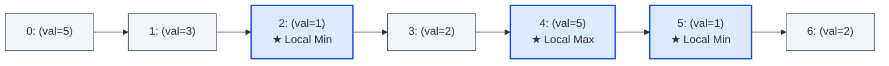

# Guided Example: Find the Minimum and Maximum Number of Nodes Between Critical Points

We trace the step-by-step three-pointer sliding window scan and critical point distance tracking on a representative singly-linked list:

- **Input:** $\text{head} = [5, 3, 1, 2, 5, 1, 2]$
- **Expected Output:** $[1, 3]$

---

## 1. Problem Overview & Representative Instance

A node in a singly-linked list is defined as a **critical point** if it is an internal node that is either:
1. A **local maximum**: its value is strictly greater than both its predecessor's value and its successor's value ($v_{i-1} < v_i > v_{i+1}$).
2. A **local minimum**: its value is strictly smaller than both its predecessor's value and its successor's value ($v_{i-1} > v_i < v_{i+1}$).

The head and tail nodes cannot be critical points because neither possesses both a predecessor and a successor.
Given the linked list, our goal is to return $[ \text{minDistance}, \text{maxDistance} ]$ between any two distinct critical points. If fewer than two critical points exist, we return $[-1, -1]$.

In the sequence $[5, 3, 1, 2, 5, 1, 2]$ with 0-indexed positions $0$ through $6$:
- Position $2$ (val $1$): $3 > 1 < 2 \implies$ **Local Minimum**.
- Position $4$ (val $5$): $2 < 5 > 1 \implies$ **Local Maximum**.
- Position $5$ (val $1$): $5 > 1 < 2 \implies$ **Local Minimum**.
- The critical indices are $\{2, 4, 5\}$.
- Consecutive distances: $4 - 2 = 2$ and $5 - 4 = 1$. Minimum distance is $1$.
- Maximum distance is between the extreme critical points: $5 - 2 = 3$.
- Output: $[1, 3]$.

---

## 2. Theoretical Invariants & Distance Extremization

Let the sequence of critical point indices discovered during a forward scan be:
$$c_1 < c_2 < \dots < c_m$$

### Distance Extremization Properties
1. **Maximum Distance Invariant:**
   For any pair of critical points $(c_a, c_b)$ with $1 \le a < b \le m$:
   $$c_b - c_a \le c_m - c_1$$
   Because the index sequence is strictly sorted ascendingly, the maximum possible distance always occurs between the **first critical point** $c_1$ and the **last critical point** $c_m$:
   $$\text{maxDistance} = c_m - c_1$$

2. **Minimum Distance Invariant:**
   For any non-adjacent pair $(c_a, c_b)$ with $b - a \ge 2$:
   $$c_b - c_a = (c_b - c_{b-1}) + (c_{b-1} - c_a) > c_b - c_{b-1}$$
   Any multi-step interval is strictly larger than its constituent single-step intervals. Therefore, the minimum distance must occur between two **consecutively occurring** critical points:
   $$\text{minDistance} = \min_{1 \le k < m} (c_{k+1} - c_k)$$

### Single-Pass Memory Invariant
To compute both bounds, we do not need to store the entire list of critical points in an array. We only track:
- `first`: The index of the very first critical point ($c_1$).
- `last`: The index of the most recently visited critical point ($c_k$).
- `min_dist`: The minimum gap observed between successive critical points.
When a new critical point at index $i$ is identified:
- If `first` is unassigned: `first` $\leftarrow i$, `last` $\leftarrow i$.
- If `first` is assigned: `min_dist` $\leftarrow \min(\text{min\_dist}, i - \text{last})$, `last` $\leftarrow i$.

---

## 3. Step-by-Step State Execution Trace

We inspect adjacent triplets $(a, b, c) = (\text{node}_{i-1}, \text{node}_i, \text{node}_{i+1})$ for each internal index $i \in [1, 5]$:

| Step | Index $i$ | Triplet Values $(a, b, c)$ | Extremum Condition | Is Critical? | `first` | `last` | Gap ($i - \text{last}$) | Running `min_dist` |
|---|---|---|---|---|---|---|---|---|
| Init | — | — | — | — | $-1$ | $-1$ | — | $\infty$ |
| 1 | $1$ | $(5, 3, 1)$ | $5 > 3 > 1$ (Monotonic) | No | $-1$ | $-1$ | — | $\infty$ |
| 2 | $2$ | $(3, 1, 2)$ | $3 > 1 < 2$ (Local Min) | **Yes** | $2$ | $2$ | First point | $\infty$ |
| 3 | $3$ | $(1, 2, 5)$ | $1 < 2 < 5$ (Monotonic) | No | $2$ | $2$ | — | $\infty$ |
| 4 | $4$ | $(2, 5, 1)$ | $2 < 5 > 1$ (Local Max) | **Yes** | $2$ | $4$ | $4 - 2 = 2$ | $\min(\infty, 2) = 2$ |
| 5 | $5$ | $(5, 1, 2)$ | $5 > 1 < 2$ (Local Min) | **Yes** | $2$ | $5$ | $5 - 4 = 1$ | $\min(2, 1) = 1$ |
| Done | — | — | End of list reached | — | $2$ | $5$ | Max: $5 - 2 = 3$ | **Final: $[1, 3]$** |

---

## 4. Degenerate Boundary Comparison

We contrast standard instances with boundary and degenerate lists:

| List Values | Critical Indices Found | Count $m$ | Condition ($m \ge 2$) | Output | Explanation |
|---|---|---|---|---|---|
| `[5, 3, 1, 2, 5, 1, 2]` | $\{2, 4, 5\}$ | $3$ | Valid | **`[1, 3]`** | Gaps $2$ and $1$; extrema span $5 - 2 = 3$. |
| `[1, 3, 2, 2, 3, 2, 2, 2, 7]` | $\{1, 4\}$ | $2$ | Valid | **`[3, 3]`** | Only two critical points ($4 - 1 = 3$). |
| `[3, 1]` | $\emptyset$ | $0$ | Fewer than 2 | **`[-1, -1]`** | List length $2$; no internal nodes exist. |
| `[2, 2, 2, 2]` | $\emptyset$ | $0$ | Fewer than 2 | **`[-1, -1]`** | Strict inequalities fail; plateau has no extrema. |
| `[1, 2, 3, 2]` | $\{2\}$ | $1$ | Fewer than 2 | **`[-1, -1]`** | Only one critical point (at index $2$). |

---

## 5. Algorithmic Correctness & Soundness

1. **Local Extrema Exclusivity:**
   The definition requires strict inequality ($v_{i-1} < v_i > v_{i+1}$ or $v_{i-1} > v_i < v_{i+1}$). A flat plateau or adjacent duplicates cannot qualify as local extrema, preventing ambiguous oscillation counts.
2. **Sufficiency of Consecutive Differences:**
   Because all indices are non-negative and strictly increasing, any pairwise distance $c_y - c_x$ for $y > x + 1$ is the sum of intermediate consecutive differences. Since all differences are positive integers, the minimum across all pairs is guaranteed to be achieved by at least one consecutive pair $(c_{k+1} - c_k)$.
3. **Soundness of Terminal Calculation:**
   Checking whether $\text{first} = \text{last}$ or $\text{first} = -1$ cleanly detects lists with $0$ or $1$ critical points and returns $[-1, -1]$ without special-casing list length.

---

## 6. Edge Cases, Pitfalls & Structural Traps

- **Equal Adjacent Values (Plateaus):**
  In `[1, 2, 2, 1]`, node at index $1$ has neighbors $1$ and $2$. Because $2$ is not strictly greater than $2$, it is neither a local max nor min.
- **Lists with Length $\le 2$:**
  Lists of length $0, 1,$ or $2$ contain zero internal nodes. The loop condition `head.next.next` cleanly terminates without null pointer dereferences.
- **Memory Overhead Trap:**
  Collecting all critical points in a dynamic list uses $\mathcal{O}(n)$ memory. Tracking only `first`, `last`, and `min_dist` achieves identical results with strictly $\mathcal{O}(1)$ auxiliary space.

---

## 7. Complexity Analysis

- **Time Complexity:** $\mathcal{O}(n)$ where $n$ is the number of nodes in the linked list.
  The algorithm advances a three-node window one step per iteration. Each internal node is compared with its two neighbors in $\mathcal{O}(1)$ time. Total running time is strictly linear in $n$.
- **Space Complexity:** $\mathcal{O}(1)$.
  Only a handful of scalar pointer references and integer variables (`first`, `last`, `min_dist`, `i`) are maintained. No auxiliary memory is allocated.
