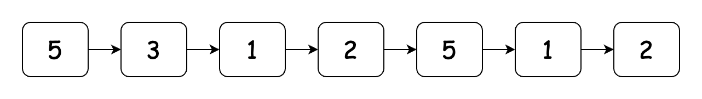
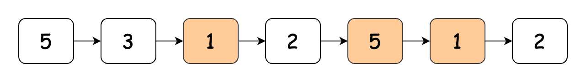
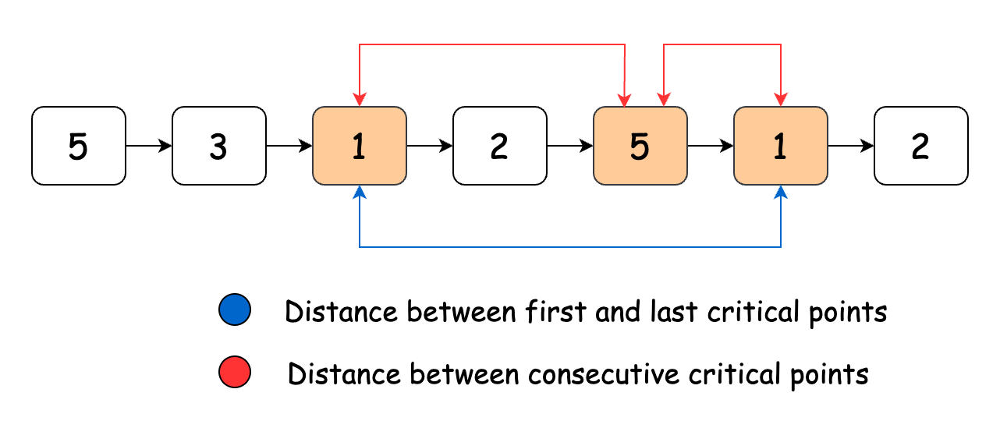

[TOC]

## Solution

---

### Approach: One Pass

#### Intuition

The problem requires finding the minimum and maximum distances between any two distinct critical points (local maxima or minima) in a given linked list. For example, consider the following list:



The critical points for this list are:



Notice that:
1. The two critical points farthest away from each other are the ones at the beginning and the end of the list.
2. The minimum distance would always lie between any two consecutive critical points.



Now, the problem is reduced to identifying all the critical points in the linked list and continuously tracking the minimum distance between any two consecutive critical points. We must also note the first and last critical points encountered to calculate the maximum distance.

Let us traverse the linked list from its head. We will need to keep track of 6 things:
1. **The current node**: to iterate over the list
2. **The previous node**: to compare its value with the current node
3. **Position of the current node**: to calculate the distance in case it's a critical point
4. **Position of the previous critical point**: to calculate the distance from the next critical point
5. **Position of the first critical point**: to calculate the maximum distance
6. **Minimum distance**: to update the minimum distance for each pair of consecutive critical points

As we move through the list, encountering a critical point prompts us to update the minimum distance with the difference between the current node's position and the previous critical point. When we encounter the first critical point, we note its position and later subtract it from the position of the last critical point to find the maximum distance.

> Note: We can start the traversal from the second node and end at the second last node because, according to our problem definition, critical points require both a previous and a next node, which the first and last nodes lack.

#### Algorithm

- Initialize:
  - The `result` array to `[-1, -1]`, in case there is no valid solution.
  - `minDistance` to the maximum permissible integer value.
  - `previousNode` to point at `head`.
  - `currentNode` to point at the next node from `head`.
  - `currentIndex` storing the position of `currentNode`.
  - `previousCriticalIndex` and `firstCriticalIndex` set to 0.
- Loop over the list till the second-last element:
  - If the current node is a critical point:
- If it is the first critical point encountered:
      - Set `previousCriticalIndex` and `firstCriticalIndex` to the position of the current node.
- Else, update `minDistance` as the minimum of the current `minDistance` and difference between `currentIndex` and  `previousCriticalIndex`.
  - Increment `currentIndex`. Move `previousNode` to the current node and `currentNode` to the next node in the list.
- If `minDistance` is not equal to its initial value:
  - Set `maxDistance` to the difference between `previousCriticalIndex` and `firstCriticalIndex`.
  - Update `result` with `minDistance` and `maxDistance`.
- Return `result`.

#### Implementation

```python
class Solution:
    def nodesBetweenCriticalPoints(self, head: Optional[ListNode]) -> List[int]:
        result = [-1, -1]

        # Initialize minimum distance to the maximum possible value
        min_distance = float("inf")

        # Pointers to track the previous node, current node, and indices
        previous_node = head
        current_node = head.next
        current_index = 1
        previous_critical_index = 0
        first_critical_index = 0

        while current_node.next is not None:
            # Check if the current node is a local maxima or minima
            if (
                current_node.val < previous_node.val
                and current_node.val < current_node.next.val
            ) or (
                current_node.val > previous_node.val
                and current_node.val > current_node.next.val
            ):

                # If this is the first critical point found
                if previous_critical_index == 0:
                    previous_critical_index = current_index
                    first_critical_index = current_index
                else:
                    # Calculate the minimum distance between critical points
                    min_distance = min(
                        min_distance, current_index - previous_critical_index
                    )
                    previous_critical_index = current_index

            # Move to the next node and update indices
            current_index += 1
            previous_node = current_node
            current_node = current_node.next

        # If at least two critical points were found
        if min_distance != float("inf"):
            max_distance = previous_critical_index - first_critical_index
            result = [min_distance, max_distance]

        return result
```

#### Complexity Analysis

Let $n$ be the the length of the linked list.

- Time complexity: $O(n)$

    The algorithm traverses the list only once, making the time complexity $O(n)$.

- Space complexity: $O(1)$

    The algorithm has a constant space complexity since it does not utilize any additional data structures.

---